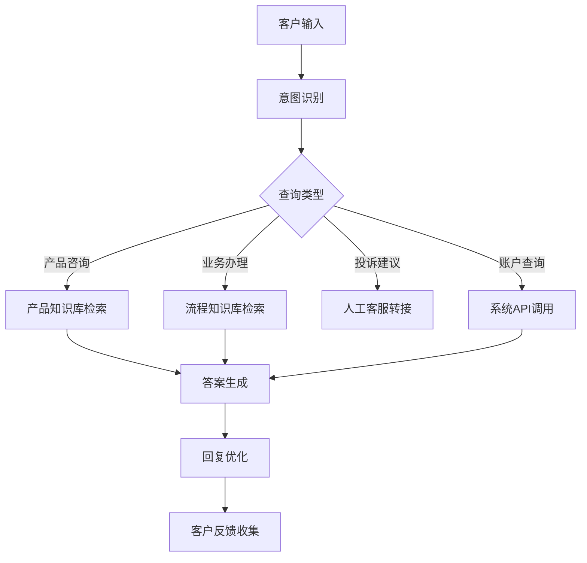
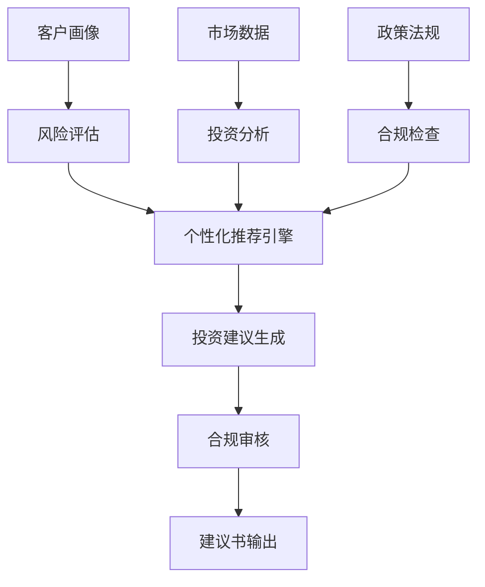
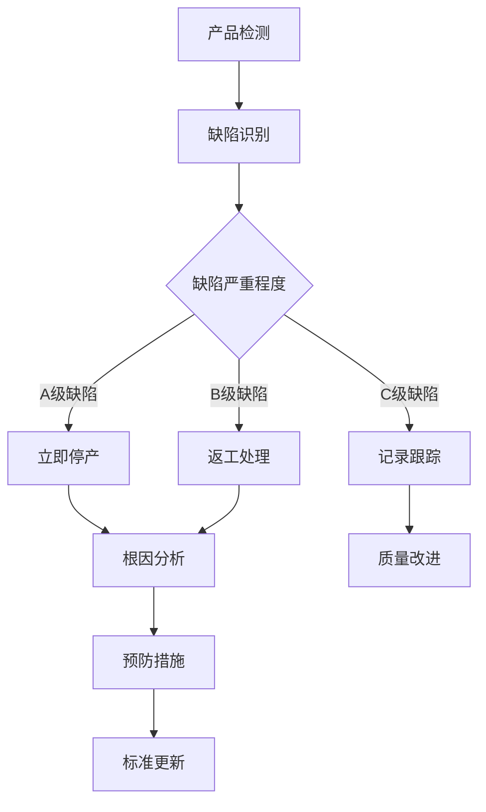
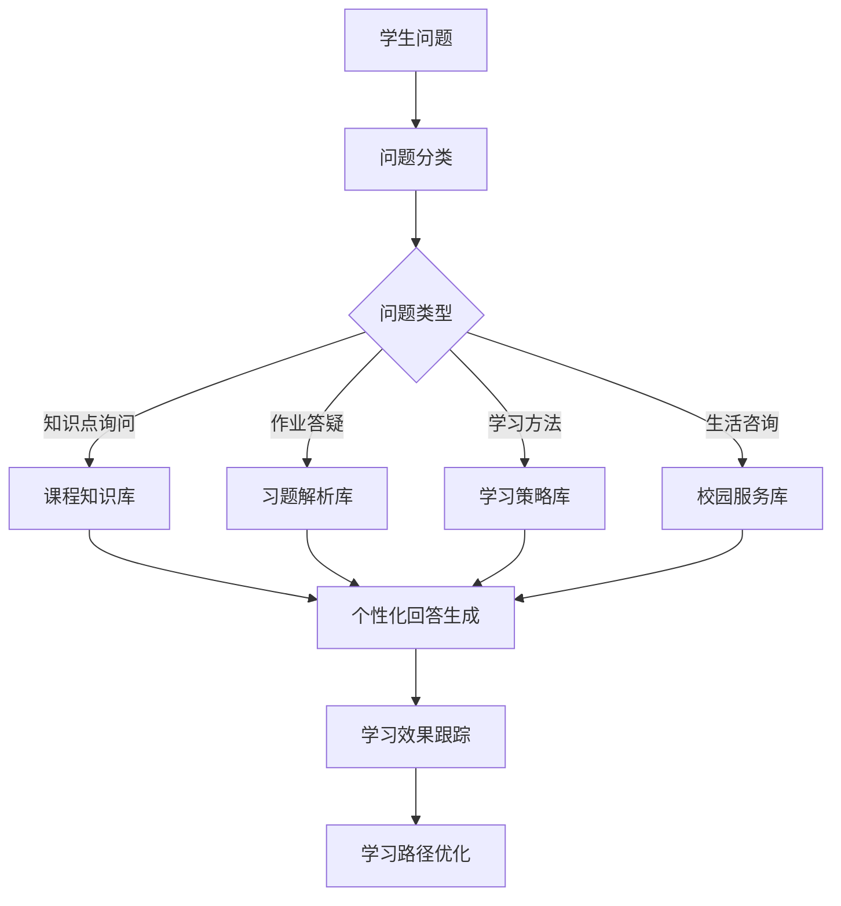
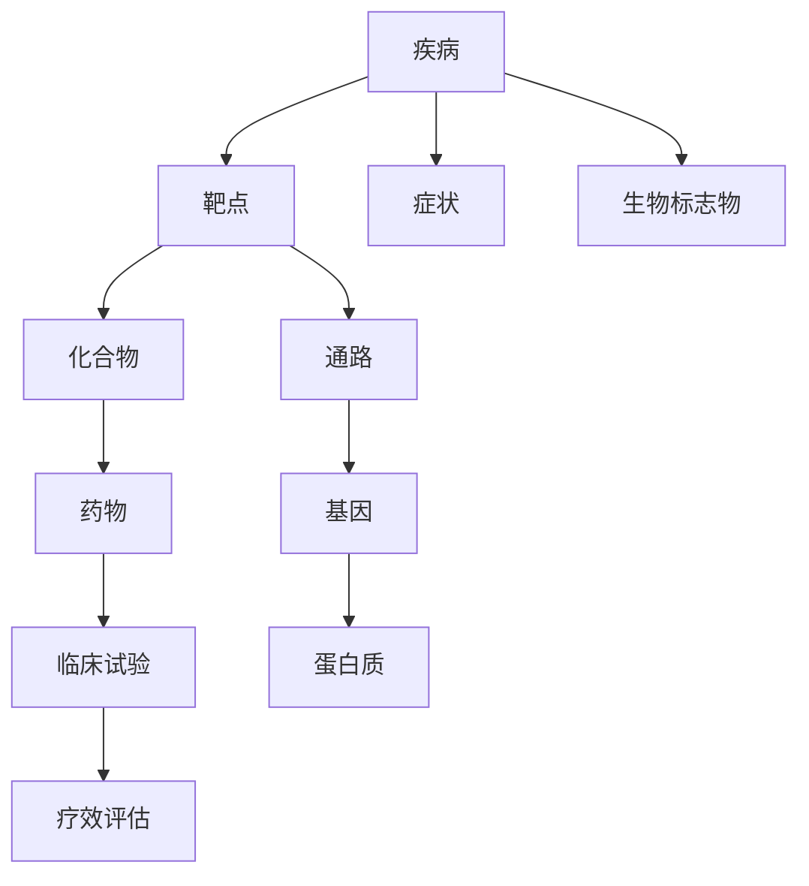

# 经典案例

本章节收录了毕昇平台在各行业的经典应用案例，展示平台在解决实际业务问题中的价值和最佳实践。这些案例涵盖了金融、制造、教育、医疗等多个领域，为您的项目实施提供参考。

## 金融行业案例

### 案例1：某大型银行智能客服系统

#### 项目背景
某国有大型银行面临客服人力成本高、响应效率低的问题，希望通过AI技术提升客户服务质量和效率。

#### 业务挑战
- 日均客服咨询量超过10万次
- 80%为重复性常见问题
- 人工客服培训成本高
- 夜间和节假日服务覆盖不足
- 多渠道服务体验不一致

#### 解决方案

##### 1. 知识库构建
```yaml
知识库范围:
  - 银行产品介绍文档: 500+页
  - 业务办理流程指南: 200+个
  - 常见问题FAQ: 1000+条
  - 监管政策文件: 300+份
  - 内部操作手册: 100+本

技术实现:
  - 文档格式: PDF、Word、Excel、网页
  - 解析策略: OCR+结构化提取
  - 向量化模型: text-embedding-ada-002
  - 分块大小: 500字符，重叠50字符
  - 向量维度: 1536维
```

##### 2. 工作流设计


##### 3. 核心组件配置
```python
# 意图识别组件
intent_classifier = IntentClassifier(
    model="bert-base-chinese",
    confidence_threshold=0.8,
    intents=[
        "product_inquiry",      # 产品咨询
        "business_process",     # 业务办理
        "account_query",        # 账户查询
        "complaint",           # 投诉建议
        "general_question"     # 一般问题
    ]
)

# 知识库检索组件
knowledge_retriever = KnowledgeRetriever(
    knowledge_base="bank_kb",
    top_k=5,
    similarity_threshold=0.75,
    rerank_model="bge-reranker-large"
)

# 回答生成组件
answer_generator = LLMGenerator(
    model="qwen-14b-chat",
    temperature=0.3,
    max_tokens=500,
    system_prompt="""你是银行的专业客服助手。请基于提供的知识库信息，
    为客户提供准确、专业、友好的回答。
    
    回答原则：
    1. 准确性优先，不要编造信息
    2. 语言要专业但易懂
    3. 如遇复杂问题，建议联系人工客服
    4. 涉及敏感信息时，提醒客户保护隐私
    """
)
```

#### 实施效果

##### 数据指标
- **问题解决率**: 85% → 95%
- **平均响应时间**: 3分钟 → 15秒
- **客户满意度**: 4.1/5 → 4.7/5
- **人工客服工作量**: 减少60%
- **运营成本**: 降低40%

##### 业务价值
- 年节省人力成本约800万元
- 7×24小时不间断服务
- 客户体验显著提升
- 支持多渠道统一服务

### 案例2：证券公司投资顾问助手

#### 项目背景
某头部证券公司希望为投资顾问提供AI辅助工具，提升投资建议的专业性和效率。

#### 解决方案架构


#### 核心功能模块

##### 1. 客户画像分析
```python
class CustomerProfileAnalyzer:
    def analyze_profile(self, customer_data):
        """分析客户投资画像"""
        profile = {
            "risk_tolerance": self.assess_risk_tolerance(customer_data),
            "investment_experience": self.evaluate_experience(customer_data),
            "financial_status": self.analyze_financial_status(customer_data),
            "investment_goals": self.extract_goals(customer_data),
            "time_horizon": self.determine_time_horizon(customer_data)
        }
        return profile
    
    def assess_risk_tolerance(self, data):
        """评估风险承受能力"""
        # 基于问卷调查和历史行为
        risk_score = self.calculate_risk_score(data)
        if risk_score >= 80:
            return "aggressive"
        elif risk_score >= 60:
            return "moderate"
        elif risk_score >= 40:
            return "conservative"
        else:
            return "very_conservative"
```

##### 2. 市场分析引擎
```python
class MarketAnalysisEngine:
    def generate_market_insight(self, symbols, time_period):
        """生成市场洞察"""
        insights = []
        
        for symbol in symbols:
            # 技术分析
            technical_analysis = self.technical_analysis(symbol, time_period)
            
            # 基本面分析
            fundamental_analysis = self.fundamental_analysis(symbol)
            
            # 情绪分析
            sentiment_analysis = self.news_sentiment_analysis(symbol)
            
            insight = {
                "symbol": symbol,
                "technical": technical_analysis,
                "fundamental": fundamental_analysis,
                "sentiment": sentiment_analysis,
                "recommendation": self.generate_recommendation(
                    technical_analysis, fundamental_analysis, sentiment_analysis
                )
            }
            insights.append(insight)
        
        return insights
```

#### 实施成果
- **投资建议准备时间**: 2小时 → 30分钟
- **建议书质量评分**: 3.8/5 → 4.6/5
- **客户转化率**: 提升35%
- **合规风险**: 降低80%

## 制造业案例

### 案例3：某汽车制造企业智能质检系统

#### 项目背景
某大型汽车制造企业需要提升产品质量检测的准确性和效率，减少人工检测的主观性和遗漏。

#### 技术方案

##### 1. 多模态数据融合
```python
class MultiModalQualityInspection:
    def __init__(self):
        self.vision_model = VisionQualityDetector()
        self.text_analyzer = DefectDescriptionAnalyzer()
        self.knowledge_base = QualityStandardKB()
    
    def inspect_product(self, images, descriptions, specifications):
        """综合质检分析"""
        # 视觉检测
        visual_defects = self.vision_model.detect_defects(images)
        
        # 文本描述分析
        description_issues = self.text_analyzer.analyze(descriptions)
        
        # 标准对比
        compliance_check = self.knowledge_base.check_compliance(
            visual_defects, description_issues, specifications
        )
        
        return self.generate_quality_report(
            visual_defects, description_issues, compliance_check
        )
```

##### 2. 质量标准知识库
```yaml
质量标准体系:
  国际标准:
    - ISO 9001质量管理体系
    - TS 16949汽车质量标准
    - ISO 14001环境管理体系
  
  企业标准:
    - 内部质量控制规范
    - 供应商质量要求
    - 客户特殊要求
  
  检测项目:
    外观质量:
      - 油漆缺陷检测
      - 装配间隙测量
      - 表面划痕识别
    功能质量:
      - 电气系统测试
      - 机械性能验证
      - 安全性能检查
```

##### 3. 缺陷分类与处理流程


#### 实施效果
- **检测准确率**: 92% → 98.5%
- **检测效率**: 提升200%
- **质量成本**: 降低30%
- **客户投诉**: 减少70%

### 案例4：电子制造企业设备预测性维护

#### 项目背景
某电子制造企业希望通过AI技术实现设备的预测性维护，减少意外停机造成的损失。

#### 解决方案

##### 1. 设备状态监控体系
```python
class PredictiveMaintenanceSystem:
    def __init__(self):
        self.sensor_data_collector = SensorDataCollector()
        self.anomaly_detector = AnomalyDetector()
        self.maintenance_planner = MaintenancePlanner()
        self.knowledge_base = MaintenanceKnowledgeBase()
    
    def monitor_equipment(self, equipment_id):
        """设备状态监控"""
        # 采集传感器数据
        sensor_data = self.sensor_data_collector.collect(equipment_id)
        
        # 异常检测
        anomalies = self.anomaly_detector.detect(sensor_data)
        
        # 故障预测
        failure_prediction = self.predict_failure(sensor_data, anomalies)
        
        # 维护建议
        maintenance_plan = self.maintenance_planner.generate_plan(
            equipment_id, failure_prediction
        )
        
        return {
            "equipment_status": self.assess_status(sensor_data, anomalies),
            "failure_probability": failure_prediction,
            "maintenance_recommendations": maintenance_plan
        }
```

##### 2. 智能维护决策
```yaml
维护策略:
  预防性维护:
    - 基于时间的定期保养
    - 基于使用量的维护
    - 基于状态的维护
  
  预测性维护:
    - 振动分析
    - 温度监控
    - 电流检测
    - 油液分析
  
  决策规则:
    紧急级别:
      - 立即停机: 故障概率 > 90%
      - 计划停机: 故障概率 > 70%
      - 密切监控: 故障概率 > 50%
      - 正常运行: 故障概率 < 50%
```

#### 业务价值
- **设备可用率**: 85% → 95%
- **维护成本**: 降低25%
- **意外停机**: 减少80%
- **设备寿命**: 延长15%

## 教育行业案例

### 案例5：某知名大学智能教学助手

#### 项目背景
某985高校希望利用AI技术提升教学质量，为学生提供个性化的学习辅导。

#### 系统架构


#### 核心功能实现

##### 1. 个性化学习路径
```python
class PersonalizedLearningPath:
    def __init__(self):
        self.knowledge_graph = CourseKnowledgeGraph()
        self.student_profiler = StudentProfiler()
        self.difficulty_assessor = DifficultyAssessor()
    
    def generate_learning_path(self, student_id, course_id):
        """生成个性化学习路径"""
        # 学生能力评估
        student_profile = self.student_profiler.analyze(student_id)
        
        # 课程知识点分析
        knowledge_points = self.knowledge_graph.get_course_knowledge(course_id)
        
        # 学习路径规划
        learning_path = []
        for kp in knowledge_points:
            difficulty = self.difficulty_assessor.assess(kp, student_profile)
            learning_resources = self.recommend_resources(kp, difficulty)
            
            learning_path.append({
                "knowledge_point": kp,
                "difficulty": difficulty,
                "estimated_time": self.estimate_learning_time(kp, student_profile),
                "resources": learning_resources,
                "prerequisites": self.get_prerequisites(kp)
            })
        
        return self.optimize_path_sequence(learning_path)
```

##### 2. 智能作业批改
```python
class IntelligentGrading:
    def __init__(self):
        self.answer_analyzer = AnswerAnalyzer()
        self.rubric_engine = RubricEngine()
        self.feedback_generator = FeedbackGenerator()
    
    def grade_assignment(self, assignment, student_answer):
        """智能批改作业"""
        # 答案分析
        answer_analysis = self.answer_analyzer.analyze(
            student_answer, assignment.standard_answer
        )
        
        # 评分
        score = self.rubric_engine.calculate_score(
            answer_analysis, assignment.rubric
        )
        
        # 生成反馈
        feedback = self.feedback_generator.generate(
            answer_analysis, score, assignment.learning_objectives
        )
        
        return {
            "score": score,
            "detailed_analysis": answer_analysis,
            "feedback": feedback,
            "improvement_suggestions": self.suggest_improvements(answer_analysis)
        }
```

#### 实施成果
- **学生满意度**: 4.2/5 → 4.8/5
- **学习效率**: 提升40%
- **教师工作量**: 减少30%
- **学习成绩**: 平均提升15%

### 案例6：在线教育平台内容生成系统

#### 项目背景
某在线教育平台需要快速生成大量高质量的教学内容，满足不同学科和难度级别的需求。

#### 内容生成流水线
```python
class ContentGenerationPipeline:
    def __init__(self):
        self.curriculum_analyzer = CurriculumAnalyzer()
        self.content_generator = ContentGenerator()
        self.quality_assessor = QualityAssessor()
        self.multimedia_creator = MultimediaCreator()
    
    def generate_course_content(self, course_outline):
        """生成课程内容"""
        generated_content = []
        
        for chapter in course_outline.chapters:
            # 分析课程大纲
            learning_objectives = self.curriculum_analyzer.extract_objectives(chapter)
            
            # 生成文本内容
            text_content = self.content_generator.generate_text(
                chapter.topic, learning_objectives, chapter.difficulty
            )
            
            # 创建多媒体内容
            multimedia_content = self.multimedia_creator.create(
                text_content, chapter.content_type
            )
            
            # 质量评估
            quality_score = self.quality_assessor.assess(
                text_content, multimedia_content, learning_objectives
            )
            
            if quality_score >= 0.8:
                generated_content.append({
                    "chapter": chapter,
                    "text_content": text_content,
                    "multimedia_content": multimedia_content,
                    "quality_score": quality_score
                })
        
        return generated_content
```

#### 效果评估
- **内容生成效率**: 提升500%
- **内容质量评分**: 4.5/5
- **制作成本**: 降低60%
- **更新频率**: 从月更新到周更新

## 医疗健康案例

### 案例7：医院智能导诊系统

#### 项目背景
某三甲医院希望通过AI技术优化患者就医流程，提高诊疗效率和患者满意度。

#### 系统设计

##### 1. 症状分析与科室推荐
```python
class MedicalTriageSystem:
    def __init__(self):
        self.symptom_analyzer = SymptomAnalyzer()
        self.department_matcher = DepartmentMatcher()
        self.severity_assessor = SeverityAssessor()
        self.medical_knowledge_base = MedicalKnowledgeBase()
    
    def triage_patient(self, patient_info, symptoms):
        """患者分诊"""
        # 症状分析
        symptom_analysis = self.symptom_analyzer.analyze(symptoms)
        
        # 严重程度评估
        severity = self.severity_assessor.assess(symptom_analysis)
        
        # 科室匹配
        recommended_departments = self.department_matcher.match(
            symptom_analysis, patient_info
        )
        
        # 生成导诊建议
        triage_advice = self.generate_triage_advice(
            symptom_analysis, severity, recommended_departments
        )
        
        return {
            "recommended_departments": recommended_departments,
            "severity_level": severity,
            "triage_advice": triage_advice,
            "estimated_wait_time": self.estimate_wait_time(recommended_departments)
        }
```

##### 2. 医疗知识问答
```yaml
医疗知识库结构:
  疾病知识:
    - 疾病概述和分类
    - 症状和体征
    - 诊断标准
    - 治疗方案
    - 预防措施
  
  医院信息:
    - 科室介绍
    - 医生简介
    - 就诊流程
    - 检查项目
    - 费用标准
  
  健康科普:
    - 疾病预防
    - 健康饮食
    - 运动指导
    - 心理健康
```

#### 应用效果
- **导诊准确率**: 88% → 96%
- **患者等待时间**: 减少35%
- **医生工作效率**: 提升25%
- **患者满意度**: 4.3/5 → 4.7/5

### 案例8：药企研发文献智能分析

#### 项目背景
某大型制药企业需要从海量医学文献中快速提取有价值的研发信息，支持新药开发决策。

#### 解决方案

##### 1. 文献智能处理
```python
class MedicalLiteratureAnalyzer:
    def __init__(self):
        self.paper_parser = MedicalPaperParser()
        self.entity_extractor = MedicalEntityExtractor()
        self.relationship_analyzer = RelationshipAnalyzer()
        self.trend_analyzer = TrendAnalyzer()
    
    def analyze_literature(self, paper_collection):
        """分析医学文献"""
        analysis_results = []
        
        for paper in paper_collection:
            # 解析论文结构
            parsed_paper = self.paper_parser.parse(paper)
            
            # 提取医学实体
            entities = self.entity_extractor.extract(parsed_paper)
            
            # 分析实体关系
            relationships = self.relationship_analyzer.analyze(entities)
            
            analysis_results.append({
                "paper_id": paper.id,
                "entities": entities,
                "relationships": relationships,
                "key_findings": self.extract_key_findings(parsed_paper),
                "clinical_significance": self.assess_clinical_significance(parsed_paper)
            })
        
        # 趋势分析
        trends = self.trend_analyzer.analyze_trends(analysis_results)
        
        return {
            "individual_analysis": analysis_results,
            "trend_analysis": trends,
            "research_gaps": self.identify_research_gaps(analysis_results),
            "drug_targets": self.identify_drug_targets(analysis_results)
        }
```

##### 2. 知识图谱构建


#### 价值体现
- **文献处理效率**: 提升1000%
- **信息提取准确率**: 92%
- **研发决策速度**: 提升50%
- **新发现识别**: 增加30%

## 最佳实践总结

### 1. 项目实施方法论

#### 需求分析阶段
```yaml
关键活动:
  业务调研:
    - 深入了解业务流程
    - 识别痛点和机会点
    - 确定成功指标
  
  技术评估:
    - 数据可用性分析
    - 技术可行性评估
    - 资源需求评估
  
  方案设计:
    - 技术架构设计
    - 数据处理流程
    - 用户交互设计
```

#### 开发实施阶段
```yaml
开发策略:
  敏捷开发:
    - 2周冲刺周期
    - 持续集成部署
    - 快速迭代反馈
  
  质量保障:
    - 单元测试覆盖率 > 80%
    - 集成测试全覆盖
    - 性能压力测试
  
  风险管控:
    - 技术风险识别
    - 进度风险监控
    - 质量风险评估
```

### 2. 成功要素分析

#### 技术要素
- **数据质量**: 高质量的训练数据是成功的基础
- **模型选择**: 根据业务场景选择合适的模型
- **工程实践**: 完善的MLOps流程保障系统稳定性

#### 业务要素
- **领导支持**: 高层领导的坚定支持是项目成功的保障
- **用户参与**: 深度参与的最终用户是产品成功的关键
- **组织变革**: 配套的组织流程优化确保AI系统发挥价值

#### 管理要素
- **跨部门协作**: 技术、业务、管理部门的紧密协作
- **持续优化**: 基于反馈的持续改进机制
- **知识管理**: 项目经验和最佳实践的积累传承

### 3. 常见挑战与解决方案

#### 数据挑战
```yaml
挑战: 数据质量不佳
解决方案:
  - 建立数据质量评估体系
  - 实施数据清洗和预处理流程
  - 建立数据质量监控机制

挑战: 数据孤岛问题
解决方案:
  - 构建统一的数据平台
  - 建立数据标准和规范
  - 推动数据共享机制
```

#### 技术挑战
```yaml
挑战: 模型性能不达预期
解决方案:
  - 优化特征工程
  - 尝试不同模型架构
  - 增加训练数据量
  - 调整超参数

挑战: 系统可扩展性问题
解决方案:
  - 采用微服务架构
  - 使用容器化部署
  - 实施负载均衡
  - 优化数据库设计
```

#### 组织挑战
```yaml
挑战: 用户接受度低
解决方案:
  - 加强用户培训
  - 改善用户体验
  - 建立激励机制
  - 提供技术支持

挑战: 变革阻力大
解决方案:
  - 制定变革管理策略
  - 建立沟通协调机制
  - 分阶段实施推广
  - 展示价值成果
```

## 结语

通过这些真实的企业应用案例，我们可以看到毕昇平台在各个行业中都发挥了重要价值。成功的AI项目不仅需要先进的技术，更需要深入的业务理解、合适的实施方法论和持续的优化改进。

希望这些案例能为您的AI项目实施提供有价值的参考和启发。如果您在项目实施过程中遇到问题，欢迎与我们交流探讨，共同推动AI技术在各行业的落地应用。 