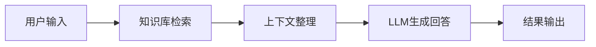
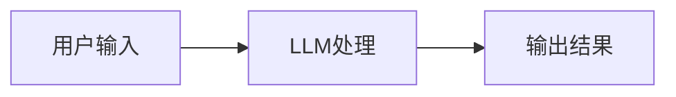
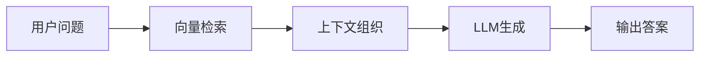
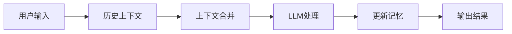
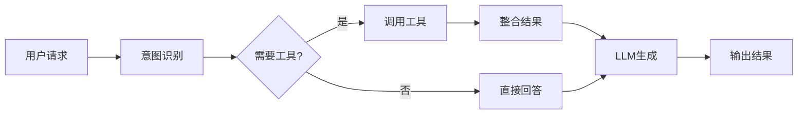

# 基础开发指南

## 环境准备

在开始使用毕昇平台之前，需要先准备好开发环境。本指南将带您从零开始搭建毕昇平台的开发环境。

### 系统要求

#### 最低配置
- **操作系统**: Ubuntu 20.04+ / CentOS 7+ / macOS 10.15+ / Windows 10+
- **内存**: 8GB RAM
- **CPU**: 4核心
- **存储**: 50GB可用空间
- **网络**: 稳定的互联网连接

#### 推荐配置
- **操作系统**: Ubuntu 22.04 LTS
- **内存**: 16GB RAM
- **CPU**: 8核心
- **存储**: 100GB SSD
- **GPU**: NVIDIA RTX 3080以上（可选，用于本地模型推理）

### 依赖软件安装

#### 1. Docker和Docker Compose

毕昇平台支持Docker容器化部署，这是最推荐的安装方式。

```bash
# Ubuntu/Debian系统
curl -fsSL https://get.docker.com -o get-docker.sh
sh get-docker.sh

# 安装Docker Compose
sudo curl -L "https://github.com/docker/compose/releases/download/v2.21.0/docker-compose-$(uname -s)-$(uname -m)" -o /usr/local/bin/docker-compose
sudo chmod +x /usr/local/bin/docker-compose

# 验证安装
docker --version
docker-compose --version
```

#### 2. Git

```bash
# Ubuntu/Debian
sudo apt update
sudo apt install git

# CentOS/RHEL
sudo yum install git

# macOS
brew install git
```

#### 3. Python环境（可选）

如果您需要进行源码开发，建议安装Python 3.9+：

```bash
# 使用pyenv管理Python版本
curl https://pyenv.run | bash

# 安装Python 3.9
pyenv install 3.9.18
pyenv global 3.9.18

# 验证安装
python --version
```

## 快速安装

### 方式一：Docker Compose快速部署

这是最简单的部署方式，适合快速体验和开发测试。

#### 1. 获取源码

```bash
git clone https://github.com/dataelement/bisheng.git
cd bisheng
```

#### 2. 配置环境变量

```bash
# 复制配置文件模板
cp .env.example .env

# 编辑配置文件
vim .env
```

关键配置项说明：

```bash
# 数据库配置
POSTGRES_USER=bisheng
POSTGRES_PASSWORD=bisheng123
POSTGRES_DB=bisheng

# Redis配置
REDIS_PASSWORD=bisheng123

# 默认管理员账号
BISHENG_ADMIN_USER=admin
BISHENG_ADMIN_PASSWORD=admin123

# API密钥
BISHENG_API_KEY=your-secret-api-key

# 文件存储路径
BISHENG_DATA_DIR=./data
```

#### 3. 启动服务

```bash
# 启动所有服务
docker-compose up -d

# 查看服务状态
docker-compose ps

# 查看日志
docker-compose logs -f bisheng-backend
```

#### 4. 访问系统

服务启动完成后，可以通过以下地址访问：

- **Web界面**: http://localhost:3001
- **API文档**: http://localhost:7001/docs
- **管理后台**: http://localhost:3001/admin

默认登录账号：
- 用户名: admin
- 密码: admin123

### 方式二：源码开发部署

如果您需要进行二次开发，建议使用源码部署方式。

#### 1. 准备数据库

```bash
# 启动PostgreSQL和Redis
docker-compose up -d postgres redis milvus

# 等待数据库启动完成
sleep 30
```

#### 2. 后端服务

```bash
cd src/backend

# 创建虚拟环境
python -m venv venv
source venv/bin/activate  # Linux/macOS
# 或者 venv\Scripts\activate  # Windows

# 安装依赖
pip install -r requirements.txt

# 数据库迁移
alembic upgrade head

# 启动后端服务
python bisheng/main.py
```

#### 3. 前端服务

```bash
cd src/frontend

# 安装Node.js依赖
npm install

# 启动开发服务器
npm run dev
```

#### 4. 访问验证

- 前端开发服务器: http://localhost:3000
- 后端API服务: http://localhost:7001

## 基础配置

### 1. 模型配置

毕昇平台支持多种大语言模型，您需要配置至少一个模型才能正常使用。

#### OpenAI模型配置

```bash
# 在.env文件中添加
OPENAI_API_KEY=your-openai-api-key
OPENAI_API_BASE=https://api.openai.com/v1
```

#### 本地模型配置

如果您有GPU资源，可以部署本地模型：

```bash
# 启动模型推理服务
docker-compose up -d bisheng-rt

# 下载模型（以ChatGLM3-6B为例）
docker exec -it bisheng-rt python -c "
from transformers import AutoTokenizer, AutoModel
tokenizer = AutoTokenizer.from_pretrained('THUDM/chatglm3-6b', trust_remote_code=True)
model = AutoModel.from_pretrained('THUDM/chatglm3-6b', trust_remote_code=True)
"
```

#### 国产模型API配置

```bash
# 智谱AI
ZHIPUAI_API_KEY=your-zhipuai-key

# 百度文心一言
ERNIE_API_KEY=your-ernie-key
ERNIE_SECRET_KEY=your-ernie-secret

# 阿里通义千问
DASHSCOPE_API_KEY=your-dashscope-key
```

### 2. 存储配置

#### 本地文件存储

```bash
# 配置本地存储路径
BISHENG_STORAGE_TYPE=local
BISHENG_STORAGE_PATH=/app/data/storage
```

#### 对象存储配置

```bash
# MinIO配置
MINIO_ENDPOINT=localhost:9000
MINIO_ACCESS_KEY=minioadmin
MINIO_SECRET_KEY=minioadmin
MINIO_BUCKET=bisheng

# AWS S3配置
AWS_ACCESS_KEY_ID=your-access-key
AWS_SECRET_ACCESS_KEY=your-secret-key
AWS_DEFAULT_REGION=us-east-1
AWS_S3_BUCKET=your-s3-bucket
```

### 3. 向量数据库配置

毕昇平台支持多种向量数据库：

#### Milvus配置（推荐）

```bash
MILVUS_HOST=localhost
MILVUS_PORT=19530
MILVUS_USER=""
MILVUS_PASSWORD=""
```

#### ChromaDB配置

```bash
CHROMA_HOST=localhost
CHROMA_PORT=8000
```

#### Qdrant配置

```bash
QDRANT_URL=http://localhost:6333
QDRANT_API_KEY=your-qdrant-key
```

## 创建第一个应用

现在让我们创建一个简单的知识库问答应用，体验毕昇平台的基本功能。

### 1. 登录系统

打开浏览器，访问 `http://localhost:3001`，使用默认账号登录：
- 用户名: admin
- 密码: admin123

### 2. 创建知识库

#### 步骤1：新建知识库

1. 点击左侧菜单的"知识库"
2. 点击"创建知识库"按钮
3. 填写基本信息：
   - 知识库名称：企业产品知识库
   - 描述：包含企业产品相关的文档和FAQ
   - 向量模型：选择text-embedding-ada-002或本地embedding模型

#### 步骤2：上传文档

1. 在知识库详情页面，点击"上传文件"
2. 支持的文件格式：
   - PDF文档
   - Word文档(.docx)
   - Excel表格(.xlsx)
   - PowerPoint演示文稿(.pptx)
   - 纯文本文件(.txt, .md)

3. 选择文件并上传，系统会自动进行：
   - 文档解析和文本提取
   - 文本分块处理
   - 向量化embedding
   - 存储到向量数据库

#### 步骤3：文档处理配置

在上传过程中，可以配置以下参数：

```yaml
# 分块配置
chunk_size: 500        # 每个文本块的字符数
chunk_overlap: 50      # 块之间的重叠字符数
separator: "\n\n"      # 分块分隔符

# 处理配置
remove_urls: true      # 移除URL链接
remove_emails: true    # 移除邮箱地址
clean_whitespace: true # 清理多余空格
```

### 3. 创建工作流应用

#### 步骤1：新建工作流

1. 点击左侧菜单的"技能"
2. 点击"创建技能"按钮
3. 选择"从模板创建" -> "知识库问答"
4. 填写应用信息：
   - 应用名称：产品智能客服
   - 描述：基于企业产品知识库的智能问答助手

#### 步骤2：配置工作流

系统会自动创建一个包含以下节点的工作流：



主要节点配置：

1. **知识库检索节点**
   - 选择刚创建的知识库
   - 设置检索topK：5
   - 设置相似度阈值：0.7

2. **LLM节点**
   - 选择配置好的大语言模型
   - 设置系统提示词：
   ```
   你是一个专业的产品客服助手。请基于提供的知识库内容回答用户问题。
   
   回答要求：
   1. 准确、专业、友好
   2. 如果知识库中没有相关信息，请如实告知
   3. 回答要简洁明了，重点突出
   ```

#### 步骤3：测试工作流

1. 点击"调试"按钮
2. 在输入框中输入测试问题，例如：
   - "你们的产品有哪些功能？"
   - "如何进行产品安装？"
   - "产品的价格是多少？"

3. 查看输出结果，检查：
   - 检索到的知识库内容是否相关
   - LLM生成的回答是否准确
   - 整体响应时间是否合理

### 4. 发布和部署

#### 步骤1：保存工作流

确认工作流测试无误后，点击"保存"按钮。

#### 步骤2：生成API

1. 点击"API"标签页
2. 系统自动生成REST API接口
3. 获取API调用信息：
   - API端点：`http://localhost:7001/api/v1/chat/completions`
   - API密钥：在系统设置中生成

#### 步骤3：集成到业务系统

使用生成的API集成到您的业务系统中：

```python
import requests

def chat_with_assistant(question):
    url = "http://localhost:7001/api/v1/chat/completions"
    headers = {
        "Authorization": "Bearer your-api-key",
        "Content-Type": "application/json"
    }
    
    payload = {
        "messages": [
            {"role": "user", "content": question}
        ],
        "stream": False
    }
    
    response = requests.post(url, json=payload, headers=headers)
    result = response.json()
    
    return result["choices"][0]["message"]["content"]

# 使用示例
answer = chat_with_assistant("产品的主要功能有哪些？")
print(answer)
```

```javascript
// JavaScript示例
async function chatWithAssistant(question) {
    const response = await fetch('http://localhost:7001/api/v1/chat/completions', {
        method: 'POST',
        headers: {
            'Authorization': 'Bearer your-api-key',
            'Content-Type': 'application/json'
        },
        body: JSON.stringify({
            messages: [
                { role: 'user', content: question }
            ],
            stream: false
        })
    });
    
    const result = await response.json();
    return result.choices[0].message.content;
}

// 使用示例
chatWithAssistant('产品的主要功能有哪些？').then(answer => {
    console.log(answer);
});
```

## 常用工作流模式

毕昇平台提供了多种预置的工作流模式，适用于不同的业务场景：

### 1. 简单问答模式

最基础的单轮问答模式：



适用场景：
- 通用聊天机器人
- 简单的文本生成任务
- 代码解释和生成

### 2. 知识库检索模式

基于知识库的问答模式：



适用场景：
- 企业内部知识问答
- 产品技术支持
- 政策法规查询

### 3. 多轮对话模式

支持上下文记忆的对话模式：



适用场景：
- 客户服务助手
- 个人AI助理
- 教育培训问答

### 4. 工具调用模式

集成外部工具的增强模式：



适用场景：
- 数据查询分析
- 外部API集成
- 复杂业务流程自动化

## 性能优化建议

### 1. 知识库优化

#### 文档质量
- 确保上传的文档内容准确、完整
- 定期更新过时的文档内容
- 移除重复或冗余的文档

#### 分块策略
- 根据文档类型调整分块大小
- 技术文档：chunk_size=800-1000
- FAQ文档：chunk_size=300-500
- 长篇文章：chunk_size=1000-1500

#### 检索参数
- topK设置：一般设置为3-5
- 相似度阈值：0.6-0.8之间
- 根据实际效果进行调优

### 2. 模型选择

#### 开发阶段
- 使用性能较好的云端模型（如GPT-3.5/4）
- 快速验证业务逻辑和效果

#### 生产阶段
- 考虑成本和延迟要求
- 评估本地部署模型的可行性
- 进行A/B测试对比效果

### 3. 系统监控

#### 关键指标
- 响应时间：平均响应时间应控制在3秒内
- 成功率：系统可用性应保持99%以上
- 用户满意度：通过用户反馈收集

#### 监控工具
- 使用Prometheus+Grafana监控系统指标
- 配置告警规则，及时发现问题
- 定期查看日志，分析异常情况

## 下一步

完成基础开发指南后，您可以继续学习：

1. **[高级开发指南](/docs/bisheng/advanced-development)** - 深入了解高级功能和定制开发
2. **[GitHub项目](/docs/bisheng/github-projects)** - 探索相关的开源项目和资源
3. **[经典案例](/docs/bisheng/classic-cases)** - 学习真实的企业应用案例

如果在使用过程中遇到问题，可以：
- 查看[官方文档](https://docs.bisheng.ai)
- 在[GitHub](https://github.com/dataelement/bisheng)提交Issue
- 加入微信技术交流群获取帮助 