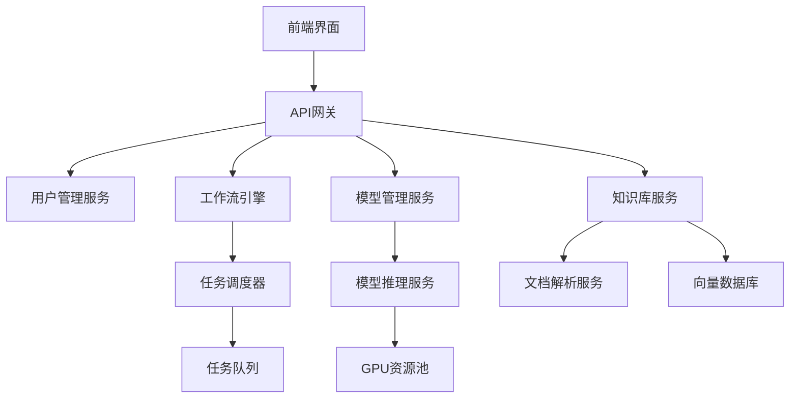

# 入门介绍

## BISHENG毕昇平台简介

BISHENG毕昇是一款开源的LLM应用开发平台，专攻企业场景，已有大量行业头部组织及世界500强企业在使用。毕昇平台基于LangChain和LangFlow构建，提供可视化的工作流编排功能，让用户可以通过拖拽的方式构建复杂的LLM应用。

"毕昇"是活字印刷术的发明人，活字印刷术为人类知识的传递起到了巨大的推动作用。我们希望"BISHENG毕昇"同样能够为智能应用的广泛落地提供有力支撑。

### 核心特性

- **可视化开发**: 提供直观的拖拽式工作流编辑器，降低AI应用开发门槛
- **企业级部署**: 支持私有化部署，确保数据安全和业务可控性
- **丰富的组件库**: 内置大量预配置的AI组件和工具节点
- **多模型支持**: 支持多种开源和商业大语言模型的接入
- **知识库管理**: 强大的文档解析和知识库构建能力
- **应用市场**: 提供丰富的预建应用模板和案例

## 什么是毕昇平台？

毕昇平台是一个专为企业打造的LLM应用开发生态系统，它包含以下核心组件：

- **工作流引擎**: 基于节点的可视化编程环境
- **模型管理**: 统一的大语言模型接入和管理系统  
- **知识库系统**: 支持多种文档格式的智能解析和向量化存储
- **应用运行时**: 高性能的应用执行和API服务环境
- **管理控制台**: 完整的用户、权限和资源管理界面

### 平台架构

毕昇平台采用微服务架构设计，主要包含以下模块：

## 为什么选择毕昇平台？

相比其他LLM应用开发平台，毕昇平台具有以下优势：

### 1. 企业级成熟度
- **生产就绪**: 经过众多企业生产环境验证
- **高可用性**: 支持集群部署和负载均衡
- **安全保障**: 完善的权限管理和数据安全机制

### 2. 强大的定制能力
- **开源透明**: 基于Apache 2.0许可证完全开源
- **组件扩展**: 支持自定义节点和工具的开发
- **API开放**: 提供完整的REST API和SDK

### 3. 丰富的企业功能
- **多租户支持**: 支持多团队和多项目的隔离管理
- **审计日志**: 完整的操作记录和审计追踪
- **监控告警**: 实时的系统监控和异常告警

### 4. 优秀的数据处理能力
- **文档解析**: 支持PDF、Word、Excel、PPT等多种格式
- **数据清洗**: 智能的文本预处理和数据质量优化
- **向量检索**: 高效的混合检索策略（向量+关键词）

## 毕昇平台的应用场景

毕昇平台适用于多种企业级AI应用场景：

### 1. 智能客服系统
- **多轮对话**: 支持复杂的多轮对话逻辑
- **知识库问答**: 基于企业知识库的精准问答
- **情感分析**: 自动识别客户情绪和意图

### 2. 企业知识管理
- **文档智能**: 自动分类、摘要和标签提取
- **知识图谱**: 构建企业知识关系网络
- **智能搜索**: 语义化的文档检索和推荐

### 3. 内容生成与分析
- **报告生成**: 自动生成业务分析报告
- **内容创作**: 智能化的营销内容创作
- **数据分析**: 自然语言的数据查询和分析

### 4. 业务流程自动化
- **审批流程**: 智能化的文档审核和审批
- **风险评估**: 自动化的风险识别和评估
- **合规检查**: 智能的合规性审查和建议

### 5. 研发效能提升
- **代码分析**: 智能代码review和优化建议
- **文档生成**: 自动生成技术文档和API文档
- **测试用例**: 智能生成测试用例和测试数据

## 毕昇平台与其他平台的对比

| 特性 | 毕昇BISHENG | LangFlow | Flowise | Dify |
|------|------------|----------|---------|------|
| 开源性 | ✅ Apache 2.0 | ✅ MIT | ✅ MIT | ✅ Apache 2.0 |
| 企业功能 | ✅ 完整 | ⚠️ 基础 | ⚠️ 基础 | ✅ 较完整 |
| 中文支持 | ✅ 原生支持 | ❌ 英文为主 | ❌ 英文为主 | ✅ 支持 |
| 文档解析 | ✅ 专业级 | ⚠️ 基础 | ⚠️ 基础 | ✅ 较好 |
| 模型管理 | ✅ 完整 | ⚠️ 基础 | ⚠️ 基础 | ✅ 较完整 |
| 私有部署 | ✅ 支持 | ✅ 支持 | ✅ 支持 | ✅ 支持 |
| 生产就绪 | ✅ 成熟 | ⚠️ 实验性 | ⚠️ 实验性 | ✅ 较成熟 |
| 社区活跃度 | ✅ 活跃 | ✅ 活跃 | ✅ 活跃 | ✅ 活跃 |

## 核心技术架构

毕昇平台基于以下核心技术构建：

### 1. 后端技术栈
- **Python FastAPI**: 高性能的API服务框架
- **LangChain**: LLM应用开发框架
- **Celery**: 分布式任务队列
- **PostgreSQL**: 主数据库存储
- **Redis**: 缓存和会话管理

### 2. 前端技术栈
- **React**: 用户界面框架
- **TypeScript**: 类型安全的JavaScript
- **Ant Design**: 企业级UI组件库
- **React Flow**: 可视化工作流编辑器

### 3. AI技术栈
- **向量数据库**: Milvus/Qdrant/ChromaDB
- **文档解析**: 自研的Unstructured服务
- **模型推理**: 基于vLLM的高性能推理服务
- **多模态支持**: 文本、图像、音频的统一处理

### 4. 基础设施
- **容器化**: Docker和Kubernetes支持
- **监控**: Prometheus + Grafana
- **日志**: ELK技术栈
- **CI/CD**: GitHub Actions集成

## 部署架构选择

毕昇平台支持多种部署架构，适应不同规模的企业需求：

### 单机部署
适用于小型团队和概念验证场景
- 最低配置：8GB内存，4核CPU
- 推荐配置：16GB内存，8核CPU，GPU可选

### 集群部署
适用于中大型企业生产环境
- 负载均衡：Nginx/HAProxy
- 数据库集群：PostgreSQL主从复制
- 缓存集群：Redis Cluster
- 存储：分布式文件系统

### 云原生部署
适用于大规模企业和云环境
- Kubernetes编排
- 微服务架构
- 自动扩缩容
- 多区域部署

## 入门学习路径

要掌握毕昇平台的使用和开发，建议按照以下路径学习：

### 阶段一：快速入门
1. **环境搭建**: 使用Docker快速部署单机版本
2. **基础操作**: 熟悉界面和基本功能
3. **简单应用**: 创建第一个知识库问答应用

### 阶段二：进阶使用
1. **工作流设计**: 掌握复杂工作流的设计方法
2. **模型接入**: 学习接入不同的大语言模型
3. **知识库优化**: 掌握文档处理和检索优化技巧

### 阶段三：企业应用
1. **权限管理**: 配置多用户和权限控制
2. **生产部署**: 进行企业级的生产环境部署
3. **监控运维**: 学习系统监控和故障排查

### 阶段四：定制开发
1. **组件开发**: 开发自定义的工作流组件
2. **API集成**: 使用API集成外部系统
3. **架构优化**: 针对特定场景进行架构优化

## 社区与支持

毕昇平台拥有活跃的开源社区和完善的支持体系：

### 开源社区
- **GitHub仓库**: [github.com/dataelement/bisheng](https://github.com/dataelement/bisheng)
- **官方文档**: 详细的使用和开发文档
- **问题反馈**: GitHub Issues和Pull Request
- **社区论坛**: 用户交流和经验分享

### 商业支持
- **技术咨询**: 专业的技术咨询服务
- **定制开发**: 针对特定需求的定制化开发
- **培训服务**: 企业级的技术培训和最佳实践
- **SLA保障**: 生产环境的服务级别保障

### 合作伙伴
- **集成商合作**: 与系统集成商的合作
- **ISV伙伴**: 独立软件开发商合作
- **生态伙伴**: 构建完整的AI应用生态

## 推荐资源

- **官方网站**: [bisheng.ai](https://bisheng.ai)
- **在线体验**: [cloud.bisheng.ai](https://cloud.bisheng.ai)
- **开发文档**: [docs.bisheng.ai](https://docs.bisheng.ai)
- **GitHub仓库**: [github.com/dataelement/bisheng](https://github.com/dataelement/bisheng)
- **微信群**: 扫描官网二维码加入技术交流群
- **视频教程**: B站和YouTube的官方教学视频

在接下来的章节中，我们将深入探讨毕昇平台的各个方面，从基础使用到高级开发，帮助您成为毕昇平台的专家用户。无论您是AI应用的初学者，还是经验丰富的企业开发者，毕昇平台都能为您的AI应用开发之旅提供强有力的支持。 