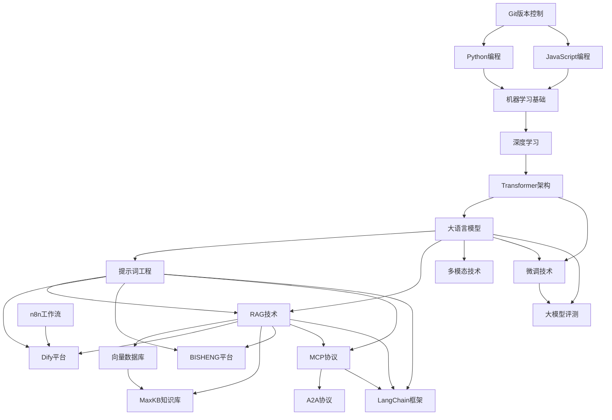
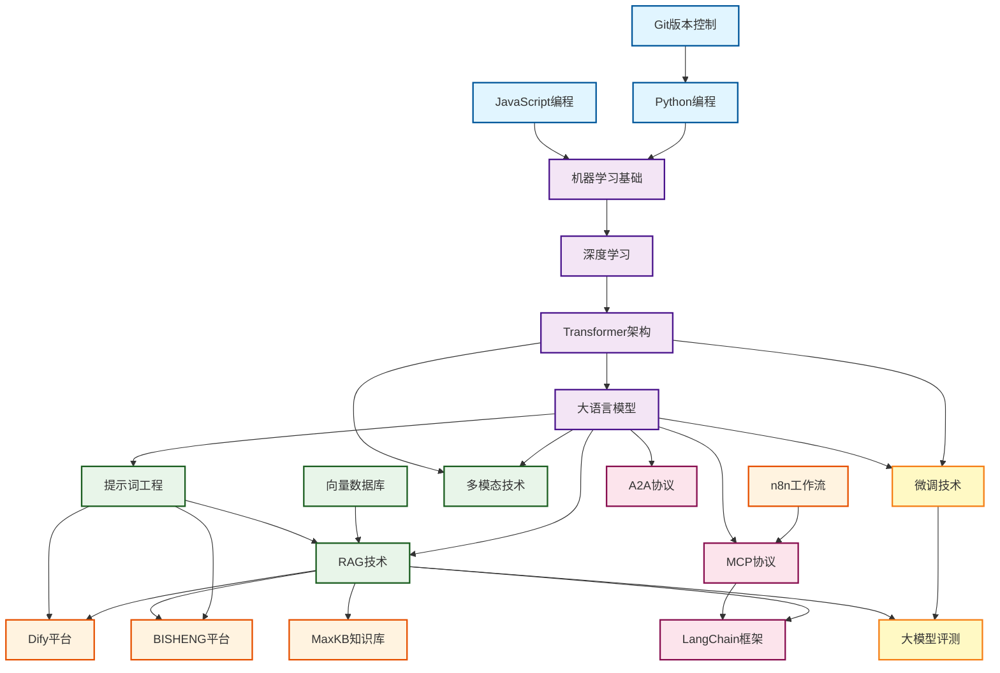

import TechStackMap from '@site/src/components/TechStackMap/TechStackMap';

# AI技术学习路径指南

<TechStackMap />

本指南为不同背景和水平的开发者提供了系统化的学习路径，帮助您高效掌握AI相关技术。

## 🎯 选择您的学习路径

### 初学者路径

适合：编程基础薄弱或刚接触AI的开发者

#### 第一阶段：基础准备（2-4周）

1. **编程基础**
   - Python基础语法
   - 数据结构与算法
   - 面向对象编程
   - 推荐资源：Python官方教程、Codecademy

2. **工具和环境**
   - Git版本控制
   - 虚拟环境管理
   - 包管理器使用
   - 推荐资源：Git教程、conda/pip使用

#### 第二阶段：AI基础概念（3-5周）

1. **机器学习基础**
   - 监督学习、无监督学习
   - 模型训练流程
   - 评估指标
   - 推荐：吴恩达机器学习课程

2. **深度学习入门**
   - 神经网络基础
   - 反向传播算法
   - 常用激活函数
   - 推荐：fast.ai课程

#### 第三阶段：实践项目（4-6周）

1. **第一个AI项目**
   - 使用预训练模型
   - 简单的文本分类
   - 图像识别入门

2. **推荐学习顺序**
   ```
   提示词工程 → RAG技术 → MCP协议 → Dify平台
   ```

### 中级开发者路径

适合：有编程经验，想深入学习AI应用的开发者

#### 第一阶段：核心技能（4-6周）

1. **大语言模型基础**
   - Transformer架构原理
   - 预训练与微调
   - Prompt工程
   - 推荐：学习路径：`transformer/intro` → `prompt/intro` → `prompt/development`

2. **RAG技术**
   - 向量数据库原理
   - 检索策略
   - 生成优化
   - 推荐：学习路径：`vector-database/intro` → `rag/intro` → `rag/development`

#### 第二阶段：应用开发（6-8周）

1. **平台使用**
   - Dify平台开发
   - MaxKB知识库
   - n8n工作流
   - 推荐：学习路径：`dify/getting-started` → `maxkb/getting-started` → `n8n/getting-started`

2. **协议开发**
   - MCP协议开发
   - A2A协议
   - 推荐：学习路径：`mcp/intro` → `mcp/server/python-implementation` → `a2a/intro`

#### 第三阶段：高级应用（6-8周）

1. **框架和工具**
   - LangChain框架
   - 多模态技术
   - 推荐：学习路径：`langchain/intro` → `multimodal/intro`

2. **模型优化**
   - 微调技术
   - 大模型评测
   - 推荐：学习路径：`finetune/intro` → `evaluation/intro`

### 高级开发者路径

适合：有丰富AI经验，想深入研究和优化的开发者

#### 第一阶段：深入理解（6-8周）

1. **架构深入**
   - Transformer变体研究
   - 注意力机制优化
   - 推荐：学习路径：`transformer/architecture` → `transformer/variants`

2. **性能优化**
   - 模型压缩
   - 推理加速
   - 分布式训练
   - 推荐：学习路径：`finetune/development` → `evaluation/methods`

#### 第二阶段：系统设计（8-10周）

1. **企业级应用**
   - BISHENG平台深度开发
   - 大规模RAG系统
   - 推荐：学习路径：`bisheng/advanced-development` → `rag/development`

2. **协议设计**
   - MCP协议扩展
   - A2A协议实现
   - 推荐：学习路径：`mcp/server/js-implementation` → `a2a/development`

#### 第三阶段：创新研究（持续）

1. **前沿技术**
   - 多模态融合
   - Agent系统
   - 推荐：学习路径：`multimodal/development` → 最新研究论文

2. **开源贡献**
   - 参与开源项目
   - 贡献代码和文档
   - 推荐：查看各主题的 `github-projects` 文档

## 📚 按角色分类的学习路径

### 前端开发者

**目标**：将AI能力集成到Web应用

**推荐路径**：
1. Prompt工程基础（1周）
2. MCP客户端开发（2周）
3. Dify平台集成（2周）
4. 前端AI应用开发（3周）

**重点文档**：
- `prompt/getting-started`
- `mcp/client/javascript`
- `dify/development`

### 后端开发者

**目标**：构建AI服务和API

**推荐路径**：
1. RAG技术（3周）
2. MCP服务器开发（2周）
3. LangChain框架（2周）
4. 微服务架构（3周）

**重点文档**：
- `rag/development`
- `mcp/server/python-implementation`
- `langchain/development`

### 数据科学家

**目标**：模型训练和优化

**推荐路径**：
1. Transformer架构（2周）
2. 微调技术（3周）
3. 大模型评测（2周）
4. 模型优化（3周）

**重点文档**：
- `transformer/architecture`
- `finetune/development`
- `evaluation/methods`

### 产品经理/业务人员

**目标**：理解AI能力，规划产品

**推荐路径**：
1. AI基础概念（1周）
2. 平台使用（Dify、MaxKB）（2周）
3. 工作流设计（n8n）（1周）
4. 应用案例学习（2周）

**重点文档**：
- `dify/intro`
- `maxkb/intro`
- `n8n/workflow-cases`
- `bisheng/classic-cases`

## 🗺️ 技术栈学习地图

以下图表展示了AI技术栈之间的关联关系和学习路径：



<TechStackMap />

### 基础层
```
编程基础 → Python/JavaScript → Git → 环境管理
```

### 理论层
```
机器学习基础 → 深度学习 → Transformer → 大语言模型
```

### 应用层
```
Prompt工程 → RAG技术 → 向量数据库 → 多模态技术
```

### 平台层
```
Dify → MaxKB → n8n → BISHENG
```

### 协议层
```
MCP协议 → A2A协议 → LangChain
```

### 优化层
```
微调技术 → 模型评测 → 性能优化
```

## 📖 学习资源推荐

### 官方文档
- 各主题的 `intro` 和 `getting-started` 文档
- GitHub项目文档（`github-projects`）

### 实践项目
- 各主题的 `examples` 和 `cases` 文档
- 实际应用案例

### 进阶学习
- `development` 和 `advanced-development` 文档
- `best-practices` 文档

### 问题解决
- `faq` 文档
- GitHub Issues

## 🎓 学习建议

### 1. 循序渐进
- 不要跳过基础内容
- 每个阶段都要有实际项目练习
- 遇到问题及时查阅FAQ

### 2. 实践为主
- 理论学习后立即实践
- 完成每个主题的示例项目
- 尝试改造和扩展示例

### 3. 持续学习
- AI技术更新快，保持学习
- 关注更新日志
- 参与社区讨论

### 4. 建立知识体系
- 理解技术之间的关联
- 绘制自己的知识地图
- 定期复习和总结

## 🚀 快速开始

### 如果您是初学者
1. 阅读 `prompt/intro` 了解AI基础
2. 完成 `dify/getting-started` 创建第一个AI应用
3. 学习 `rag/intro` 了解检索增强生成

### 如果您有编程经验
1. 直接学习 `mcp/intro` 开始协议开发
2. 完成 `rag/development` 构建RAG系统
3. 探索 `langchain/development` 使用框架

### 如果您想深入研究
1. 学习 `transformer/architecture` 理解原理
2. 完成 `finetune/development` 进行模型优化
3. 研究 `evaluation/methods` 评估模型性能

## 🗺️ 技术栈关联图谱

下方图表展示了AI技术栈之间的关联关系和学习路径：



### 图例说明

- **基础层**（蓝色）：编程基础和工具
- **理论层**（紫色）：AI理论基础
- **应用层**（绿色）：实际应用技术
- **平台层**（橙色）：开发平台
- **协议层**（粉色）：通信协议和框架
- **优化层**（黄色）：模型优化和评测

## 📝 学习计划模板

### 周计划示例

**第1周：基础准备**
- [ ] 完成Python基础复习
- [ ] 设置开发环境
- [ ] 阅读 `prompt/intro`

**第2周：Prompt工程**
- [ ] 完成 `prompt/getting-started`
- [ ] 实践Prompt优化
- [ ] 阅读 `prompt/development`

**第3周：RAG技术**
- [ ] 学习 `rag/intro`
- [ ] 完成 `rag/getting-started`
- [ ] 构建简单RAG系统

**第4周：平台使用**
- [ ] 学习 `dify/getting-started`
- [ ] 创建Dify应用
- [ ] 学习 `maxkb/intro`

## 💡 学习技巧

1. **做笔记**：记录关键概念和代码示例
2. **建项目**：每个主题都要有实际项目
3. **教别人**：通过教学加深理解
4. **参与社区**：加入讨论，提问和回答
5. **定期回顾**：复习之前学过的内容

---

**开始您的AI学习之旅吧！** 🎉

如有问题，请查阅各主题的FAQ文档或提交Issue。


