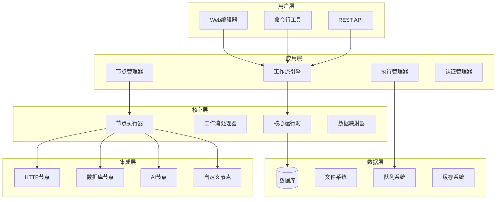

# 高级开发指南

本章将深入探讨n8n工作流的高级开发技术，从n8n平台的深度解析开始，到自定义节点开发、复杂工作流设计、性能优化和企业级部署等高级主题。

## n8n平台深度解析

### 什么是n8n？

n8n（发音为 "n-eight-n"）是一个开源的、可视化的工作流自动化平台，专门设计用于连接各种服务和应用程序。它采用了"公平代码"许可证，既保持开源特性，又为商业使用提供了可持续的商业模式。

#### 核心价值主张

- **无代码/低代码自动化**: 通过可视化界面构建复杂的业务流程，大大降低了自动化的技术门槛
- **隐私优先**: 支持完全本地部署，所有数据处理都在您的控制范围内
- **高度可扩展**: 提供了400+个预构建的集成节点，同时支持自定义节点开发
- **AI能力集成**: 原生支持各种AI服务，让工作流具备智能处理能力

### n8n的技术架构

n8n采用现代化的技术栈和模块化架构设计，确保了平台的可扩展性和可维护性。

#### 整体架构图



#### 关键组件详解

**1. 工作流引擎 (Workflow Engine)**
- 负责解析工作流定义和执行计划
- 管理节点之间的数据流转
- 处理条件分支和循环逻辑
- 支持并行和串行执行模式

**2. 节点执行器 (Node Executor)**
- 动态加载和执行节点代码
- 管理节点的生命周期
- 处理节点间的数据传递
- 提供错误处理和重试机制

**3. 数据映射器 (Data Mapper)**
- 处理复杂的数据转换和映射
- 支持表达式语言进行动态计算
- 提供数据验证和类型转换
- 优化内存使用和性能

### n8n的核心概念

#### 1. 工作流 (Workflows)

工作流是n8n中的基本执行单元，由多个相互连接的节点组成。每个工作流都有明确的输入、处理和输出定义。

```typescript
// 工作流定义结构
interface WorkflowDefinition {
  id: string;                    // 工作流唯一标识
  name: string;                  // 工作流名称
  nodes: INode[];               // 节点列表
  connections: IConnections;     // 节点连接关系
  active: boolean;              // 是否激活
  settings: IWorkflowSettings;   // 工作流设置
  staticData?: IDataObject;      // 静态数据
  pinData?: IPinData;           // 固定数据
}

// 节点定义结构
interface INode {
  id: string;                   // 节点ID
  name: string;                 // 节点名称
  type: string;                 // 节点类型
  typeVersion: number;          // 节点版本
  position: [number, number];   // 节点位置
  parameters: INodeParameters;  // 节点参数
  credentials?: INodeCredentials; // 认证信息
  webhookId?: string;           // Webhook ID
  onError?: WorkflowExecuteMode; // 错误处理模式
}
```

#### 2. 节点 (Nodes)

节点是工作流的基本组成单元，每个节点都有特定的功能和用途。

**节点分类**:

- **触发节点 (Trigger Nodes)**: 启动工作流执行
  - Webhook节点：接收HTTP请求
  - Cron节点：定时执行
  - 文件监视器：监控文件变化
  - 邮件触发器：监听新邮件

- **常规节点 (Regular Nodes)**: 执行具体操作
  - HTTP请求节点：发送API请求
  - 数据库节点：数据库操作
  - 邮件节点：发送邮件
  - 文件操作节点：处理文件

- **控制节点 (Control Nodes)**: 控制执行流程
  - IF节点：条件判断
  - Switch节点：多路分支
  - Merge节点：数据合并
  - Wait节点：等待延迟

#### 3. 数据流转 (Data Flow)

n8n中的数据以JSON格式在节点间流转，每个数据项都包含主要数据和可选的二进制数据。

```typescript
// 数据项结构
interface INodeExecutionData {
  json: IDataObject;           // 主要JSON数据
  binary?: IBinaryKeyData;     // 二进制数据（可选）
  pairedItem?: IPairedItemData; // 配对项数据
  error?: NodeApiError;        // 错误信息
}

// 示例数据流
const executionData: INodeExecutionData[] = [
  {
    json: {
      id: 1,
      name: "张三",
      email: "zhangsan@example.com",
      department: "技术部"
    },
    binary: {
      avatar: {
        data: "base64_encoded_image_data",
        mimeType: "image/jpeg",
        fileName: "avatar.jpg"
      }
    }
  },
  {
    json: {
      id: 2,
      name: "李四",
      email: "lisi@example.com",
      department: "销售部"
    }
  }
];
```

#### 4. 表达式语言 (Expression Language)

n8n提供了强大的表达式语言，允许在工作流中进行动态数据处理和计算。

**基础语法**:
```javascript
// 访问输入数据
{{ $json.fieldName }}              // 访问当前节点的JSON字段
{{ $binary.dataKey }}              // 访问二进制数据
{{ $input.all() }}                 // 获取所有输入数据
{{ $input.first() }}               // 获取第一个输入项

// 访问其他节点数据
{{ $node["节点名称"].json.field }}   // 访问指定节点的数据
{{ $("节点名称").all() }}            // 获取指定节点的所有数据

// 工作流和执行信息
{{ $workflow.id }}                  // 工作流ID
{{ $workflow.name }}                // 工作流名称
{{ $execution.id }}                 // 执行ID
{{ $execution.mode }}               // 执行模式

// 环境和系统信息
{{ $env.NODE_ENV }}                 // 环境变量
{{ $now }}                          // 当前时间戳
{{ $today }}                        // 今天的日期
{{ $vars.customVariable }}          // 自定义变量
```

**高级表达式示例**:
```javascript
// 条件表达式
{{ $json.score >= 80 ? '优秀' : $json.score >= 60 ? '及格' : '不及格' }}

// 数组操作
{{ $json.items.filter(item => item.price > 100) }}
{{ $json.users.map(user => user.email) }}

// 字符串处理
{{ $json.name.toUpperCase() }}
{{ $json.content.replace(/\s+/g, ' ').trim() }}

// 日期计算
{{ new Date($json.created_at).toISOString().split('T')[0] }}
{{ DateTime.now().minus({ days: 7 }).toFormat('yyyy-MM-dd') }}

// 数学计算
{{ Math.round($json.price * 1.2 * 100) / 100 }}
{{ $json.items.reduce((sum, item) => sum + item.quantity, 0) }}
```

### n8n的部署架构选择

#### 1. 单机部署

适用于小团队和开发测试环境。

**Docker Compose配置**:
```yaml
version: '3.8'

services:
  n8n:
    image: n8nio/n8n
    restart: always
    ports:
      - "5678:5678"
    environment:
      - N8N_BASIC_AUTH_ACTIVE=true
      - N8N_BASIC_AUTH_USER=admin
      - N8N_BASIC_AUTH_PASSWORD=password
      - N8N_HOST=${SUBDOMAIN}.${DOMAIN_NAME}
      - N8N_PROTOCOL=https
      - NODE_ENV=production
      - WEBHOOK_URL=https://${SUBDOMAIN}.${DOMAIN_NAME}/
      - GENERIC_TIMEZONE=${GENERIC_TIMEZONE}
    volumes:
      - ~/.n8n:/home/node/.n8n
      - ./workflows:/home/node/workflows
      - ./custom-nodes:/home/node/custom-nodes
```

#### 2. 分布式部署

适用于大规模企业环境，支持高可用和负载均衡。

**主从架构**:
```yaml
version: '3.8'

services:
  # 主节点 - 负责UI和工作流管理
  n8n-main:
    image: n8nio/n8n
    restart: always
    ports:
      - "5678:5678"
    environment:
      - DB_TYPE=postgresdb
      - DB_POSTGRESDB_HOST=postgres
      - DB_POSTGRESDB_DATABASE=n8n
      - DB_POSTGRESDB_USER=n8n
      - DB_POSTGRESDB_PASSWORD=n8n
      - EXECUTIONS_MODE=queue
      - QUEUE_BULL_REDIS_HOST=redis
      - N8N_ENCRYPTION_KEY=${N8N_ENCRYPTION_KEY}
    depends_on:
      - postgres
      - redis

  # 工作节点 - 负责执行工作流
  n8n-worker:
    image: n8nio/n8n
    restart: always
    command: n8n worker
    environment:
      - DB_TYPE=postgresdb
      - DB_POSTGRESDB_HOST=postgres
      - DB_POSTGRESDB_DATABASE=n8n
      - DB_POSTGRESDB_USER=n8n
      - DB_POSTGRESDB_PASSWORD=n8n
      - QUEUE_BULL_REDIS_HOST=redis
      - N8N_ENCRYPTION_KEY=${N8N_ENCRYPTION_KEY}
    depends_on:
      - postgres
      - redis
    deploy:
      replicas: 3

  # PostgreSQL数据库
  postgres:
    image: postgres:13
    restart: always
    environment:
      - POSTGRES_DB=n8n
      - POSTGRES_USER=n8n
      - POSTGRES_PASSWORD=n8n
    volumes:
      - postgres_data:/var/lib/postgresql/data

  # Redis队列系统
  redis:
    image: redis:6-alpine
    restart: always
    volumes:
      - redis_data:/data

volumes:
  postgres_data:
  redis_data:
```

### n8n的安全机制

#### 1. 认证和授权

**基础认证配置**:
```bash
# 环境变量配置
export N8N_BASIC_AUTH_ACTIVE=true
export N8N_BASIC_AUTH_USER=admin
export N8N_BASIC_AUTH_PASSWORD=secure_password

# LDAP集成
export N8N_USER_MANAGEMENT_LDAP_ENABLED=true
export N8N_USER_MANAGEMENT_LDAP_SERVER_URL=ldap://ldap.company.com
export N8N_USER_MANAGEMENT_LDAP_BIND_DN=cn=admin,dc=company,dc=com
export N8N_USER_MANAGEMENT_LDAP_BIND_PASSWORD=ldap_password

# JWT配置
export N8N_USER_MANAGEMENT_JWT_SECRET=your_jwt_secret_key
export N8N_USER_MANAGEMENT_JWT_DURATION=7d
```

#### 2. 数据加密

**敏感数据加密**:
```typescript
// 自定义加密实现
import { createCipher, createDecipher } from 'crypto';

class DataEncryption {
  private encryptionKey: string;

  constructor(key: string) {
    this.encryptionKey = key;
  }

  encrypt(data: string): string {
    const cipher = createCipher('aes-256-cbc', this.encryptionKey);
    let encrypted = cipher.update(data, 'utf8', 'hex');
    encrypted += cipher.final('hex');
    return encrypted;
  }

  decrypt(encryptedData: string): string {
    const decipher = createDecipher('aes-256-cbc', this.encryptionKey);
    let decrypted = decipher.update(encryptedData, 'hex', 'utf8');
    decrypted += decipher.final('utf8');
    return decrypted;
  }
}

// 在节点中使用加密
export class SecureDataProcessor implements INodeType {
  private encryption = new DataEncryption(process.env.N8N_ENCRYPTION_KEY!);

  async execute(this: IExecuteFunctions): Promise<INodeExecutionData[][]> {
    const items = this.getInputData();
    
    const processedItems = items.map(item => {
      const sensitiveData = item.json.sensitiveField as string;
      const encryptedData = this.encryption.encrypt(sensitiveData);
      
      return {
        json: {
          ...item.json,
          sensitiveField: encryptedData,
          _encrypted: true
        }
      };
    });

    return [processedItems];
  }
}
```

#### 3. 网络安全

**HTTPS和SSL配置**:
```nginx
# Nginx配置示例
server {
    listen 443 ssl http2;
    server_name n8n.yourdomain.com;

    ssl_certificate /path/to/certificate.crt;
    ssl_certificate_key /path/to/private.key;
    ssl_protocols TLSv1.2 TLSv1.3;
    ssl_ciphers ECDHE-RSA-AES256-GCM-SHA384:ECDHE-RSA-AES128-GCM-SHA256;

    # 安全头配置
    add_header Strict-Transport-Security "max-age=31536000; includeSubDomains; preload";
    add_header X-Frame-Options DENY;
    add_header X-Content-Type-Options nosniff;
    add_header X-XSS-Protection "1; mode=block";

    location / {
        proxy_pass http://127.0.0.1:5678;
        proxy_http_version 1.1;
        proxy_set_header Upgrade $http_upgrade;
        proxy_set_header Connection 'upgrade';
        proxy_set_header Host $host;
        proxy_set_header X-Real-IP $remote_addr;
        proxy_set_header X-Forwarded-For $proxy_add_x_forwarded_for;
        proxy_set_header X-Forwarded-Proto $scheme;
        proxy_cache_bypass $http_upgrade;
    }
}
```

## 自定义节点开发详解

当n8n内置的400+节点无法满足特定业务需求时，开发自定义节点是扩展平台功能的最佳方式。本节将详细介绍节点开发的各个方面。

### 开发环境准备

#### 1. 项目初始化

使用官方提供的节点开发模板来确保最佳实践：

```bash
# 从模板创建新项目
git clone https://github.com/n8n-io/n8n-nodes-starter.git my-custom-node
cd my-custom-node

# 安装依赖
npm install

# 清理示例文件
rm -rf nodes/ExampleNode nodes/HTTPBin
rm -rf credentials/ExampleCredentials.credentials.ts credentials/HttpBinApi.credentials.ts

# 创建新的节点目录结构
mkdir -p nodes/WeatherService
mkdir -p credentials
```

#### 2. 开发工具配置

**TypeScript配置** (`tsconfig.json`):
```json
{
  "compilerOptions": {
    "target": "es2019",
    "module": "commonjs",
    "lib": ["es2019"],
    "declaration": true,
    "outDir": "./dist",
    "rootDir": "./",
    "strict": true,
    "noImplicitAny": false,
    "esModuleInterop": true,
    "skipLibCheck": true,
    "forceConsistentCasingInFileNames": true,
    "experimentalDecorators": true,
    "emitDecoratorMetadata": true
  },
  "include": [
    "credentials/**/*",
    "nodes/**/*"
  ],
  "exclude": [
    "node_modules/**/*",
    "dist/**/*"
  ]
}
```

**ESLint配置** (`.eslintrc.js`):
```javascript
module.exports = {
  root: true,
  env: {
    es6: true,
    node: true
  },
  parser: '@typescript-eslint/parser',
  parserOptions: {
    project: './tsconfig.json',
    sourceType: 'module',
    ecmaVersion: 2019
  },
  plugins: ['@typescript-eslint'],
  extends: [
    'eslint:recommended',
    '@typescript-eslint/recommended'
  ],
  rules: {
    '@typescript-eslint/no-unused-vars': ['error', { argsIgnorePattern: '^_' }],
    '@typescript-eslint/explicit-function-return-type': 'off',
    '@typescript-eslint/no-explicit-any': 'off',
    '@typescript-eslint/no-non-null-assertion': 'off'
  }
};
```

### 节点类型详解

#### 1. 声明式节点 (Declarative Nodes)

声明式节点通过JSON配置来定义行为，适合简单的API集成场景。

**节点元数据文件** (`nodes/WeatherService/WeatherService.node.json`):
```json
{
  "displayName": "Weather Service",
  "name": "weatherService",
  "icon": "fa:cloud-sun",
  "group": ["input"],
  "version": 1,
  "description": "获取天气信息的专业服务节点",
  "defaults": {
    "name": "Weather Service"
  },
  "inputs": ["main"],
  "outputs": ["main"],
  "credentials": [
    {
      "name": "weatherServiceApi",
      "required": true
    }
  ],
  "requestDefaults": {
    "baseURL": "https://api.weatherservice.com/v1",
    "headers": {
      "Accept": "application/json",
      "Content-Type": "application/json"
    }
  },
  "properties": [
    {
      "displayName": "Resource",
      "name": "resource",
      "type": "options",
      "noDataExpression": true,
      "options": [
        {
          "name": "Current Weather",
          "value": "currentWeather"
        },
        {
          "name": "Weather Forecast",
          "value": "forecast"
        },
        {
          "name": "Historical Weather",
          "value": "historical"
        }
      ],
      "default": "currentWeather"
    },
    {
      "displayName": "Operation",
      "name": "operation",
      "type": "options",
      "noDataExpression": true,
      "displayOptions": {
        "show": {
          "resource": ["currentWeather"]
        }
      },
      "options": [
        {
          "name": "Get Current Weather",
          "value": "getCurrent",
          "action": "Get current weather for a location",
          "routing": {
            "request": {
              "method": "GET",
              "url": "/current"
            },
            "output": {
              "postReceive": [
                {
                  "type": "rootProperty",
                  "properties": {
                    "property": "data"
                  }
                }
              ]
            }
          }
        }
      ],
      "default": "getCurrent"
    },
    {
      "displayName": "Location",
      "name": "location",
      "type": "string",
      "default": "",
      "placeholder": "Beijing, China",
      "description": "城市名称或坐标",
      "required": true,
      "routing": {
        "request": {
          "qs": {
            "q": "={{ $value }}"
          }
        }
      }
    },
    {
      "displayName": "Units",
      "name": "units",
      "type": "options",
      "options": [
        {
          "name": "Metric (°C, m/s)",
          "value": "metric"
        },
        {
          "name": "Imperial (°F, mph)",
          "value": "imperial"
        },
        {
          "name": "Kelvin (K)",
          "value": "standard"
        }
      ],
      "default": "metric",
      "routing": {
        "request": {
          "qs": {
            "units": "={{ $value }}"
          }
        }
      }
    },
    {
      "displayName": "Additional Options",
      "name": "additionalOptions",
      "type": "collection",
      "placeholder": "Add Option",
      "default": {},
      "options": [
        {
          "displayName": "Include Air Quality",
          "name": "includeAirQuality",
          "type": "boolean",
          "default": false,
          "routing": {
            "request": {
              "qs": {
                "include_air_quality": "={{ $value }}"
              }
            }
          }
        },
        {
          "displayName": "Language",
          "name": "language",
          "type": "options",
          "options": [
            { "name": "English", "value": "en" },
            { "name": "中文", "value": "zh" },
            { "name": "Español", "value": "es" },
            { "name": "Français", "value": "fr" }
          ],
          "default": "en",
          "routing": {
            "request": {
              "qs": {
                "lang": "={{ $value }}"
              }
            }
          }
        }
      ]
    }
  ]
}
```

#### 2. 程序式节点 (Programmatic Nodes)

程序式节点提供完全的编程控制，适合复杂的业务逻辑。

**节点实现文件** (`nodes/DataProcessor/DataProcessor.node.ts`):
```typescript
import {
  IExecuteFunctions,
  INodeExecutionData,
  INodeType,
  INodeTypeDescription,
  NodeOperationError,
  NodeConnectionType,
} from 'n8n-workflow';

export class DataProcessor implements INodeType {
  description: INodeTypeDescription = {
    displayName: '高级数据处理器',
    name: 'dataProcessor',
    icon: 'fa:cogs',
    group: ['transform'],
    version: 1,
    description: '提供高级数据处理和转换功能',
    defaults: {
      name: '高级数据处理器',
    },
    inputs: [NodeConnectionType.Main],
    outputs: [NodeConnectionType.Main],
    properties: [
      {
        displayName: '处理操作',
        name: 'operation',
        type: 'options',
        noDataExpression: true,
        options: [
          {
            name: '数据清洗',
            value: 'cleanData',
            description: '清理和标准化数据',
            action: '执行数据清洗操作',
          },
          {
            name: '数据聚合',
            value: 'aggregateData',
            description: '聚合和分组数据',
            action: '执行数据聚合操作',
          },
          {
            name: '数据验证',
            value: 'validateData',
            description: '验证数据格式和完整性',
            action: '执行数据验证操作',
          },
          {
            name: '数据转换',
            value: 'transformData',
            description: '转换数据格式和结构',
            action: '执行数据转换操作',
          },
        ],
        default: 'cleanData',
      },
      {
        displayName: '处理配置',
        name: 'processingConfig',
        type: 'collection',
        placeholder: '添加配置',
        default: {},
        options: [
          {
            displayName: '移除空值',
            name: 'removeNull',
            type: 'boolean',
            default: true,
            description: '是否移除null、undefined和空字符串',
          },
          {
            displayName: '大小写转换',
            name: 'caseTransform',
            type: 'options',
            options: [
              { name: '保持原样', value: 'none' },
              { name: '转为小写', value: 'lower' },
              { name: '转为大写', value: 'upper' },
              { name: '首字母大写', value: 'title' },
              { name: '驼峰命名', value: 'camel' },
            ],
            default: 'none',
          },
          {
            displayName: '数据类型转换',
            name: 'typeConversion',
            type: 'boolean',
            default: false,
            description: '自动转换数据类型（数字、布尔值、日期）',
          },
          {
            displayName: '字段映射',
            name: 'fieldMapping',
            type: 'fixedCollection',
            default: { mappings: [] },
            typeOptions: {
              multipleValues: true,
            },
            options: [
              {
                displayName: '映射规则',
                name: 'mappings',
                values: [
                  {
                    displayName: '源字段',
                    name: 'source',
                    type: 'string',
                    default: '',
                    placeholder: 'original_field_name',
                  },
                  {
                    displayName: '目标字段',
                    name: 'target',
                    type: 'string',
                    default: '',
                    placeholder: 'new_field_name',
                  },
                  {
                    displayName: '转换函数',
                    name: 'transform',
                    type: 'string',
                    default: '',
                    placeholder: 'value => value.toString()',
                    description: '可选的JavaScript转换函数',
                  },
                ],
              },
            ],
          },
        ],
      },
      {
        displayName: '验证规则',
        name: 'validationRules',
        type: 'fixedCollection',
        displayOptions: {
          show: {
            operation: ['validateData'],
          },
        },
        default: { rules: [] },
        typeOptions: {
          multipleValues: true,
        },
        options: [
          {
            displayName: '验证规则',
            name: 'rules',
            values: [
              {
                displayName: '字段名',
                name: 'fieldName',
                type: 'string',
                default: '',
                required: true,
              },
              {
                displayName: '规则类型',
                name: 'ruleType',
                type: 'options',
                options: [
                  { name: '必填', value: 'required' },
                  { name: '邮箱格式', value: 'email' },
                  { name: '数字范围', value: 'numberRange' },
                  { name: '字符串长度', value: 'stringLength' },
                  { name: '正则表达式', value: 'regex' },
                ],
                default: 'required',
              },
              {
                displayName: '规则参数',
                name: 'ruleParams',
                type: 'string',
                default: '',
                placeholder: '{"min": 0, "max": 100}',
                description: '规则参数（JSON格式）',
              },
            ],
          },
        ],
      },
    ],
  };

  async execute(this: IExecuteFunctions): Promise<INodeExecutionData[][]> {
    const items = this.getInputData();
    const operation = this.getNodeParameter('operation', 0) as string;
    const processingConfig = this.getNodeParameter('processingConfig', 0) as any;

    const returnData: INodeExecutionData[] = [];

    for (let itemIndex = 0; itemIndex < items.length; itemIndex++) {
      try {
        const item = items[itemIndex];
        let processedData: any;

        switch (operation) {
          case 'cleanData':
            processedData = await this.cleanData(item.json, processingConfig);
            break;

          case 'aggregateData':
            processedData = await this.aggregateData(items.map(i => i.json), processingConfig);
            // 对于聚合操作，只返回一次结果
            if (itemIndex === 0) {
              returnData.push({ json: processedData });
            }
            continue;

          case 'validateData':
            const validationRules = this.getNodeParameter('validationRules', itemIndex) as any;
            processedData = await this.validateData(item.json, validationRules);
            break;

          case 'transformData':
            processedData = await this.transformData(item.json, processingConfig);
            break;

          default:
            throw new NodeOperationError(this.getNode(), `未知操作类型: ${operation}`, {
              itemIndex,
            });
        }

        returnData.push({
          json: processedData,
          binary: item.binary,
          pairedItem: { item: itemIndex },
        });

      } catch (error) {
        if (this.continueOnFail()) {
          returnData.push({
            json: {
              error: error.message,
              itemIndex,
              originalData: items[itemIndex].json,
            },
            pairedItem: { item: itemIndex },
          });
          continue;
        }
        throw error;
      }
    }

    return [returnData];
  }

  // 数据清洗方法
  private async cleanData(data: any, config: any): Promise<any> {
    let cleaned = { ...data };

    // 移除空值
    if (config.removeNull) {
      cleaned = this.removeNullValues(cleaned);
    }

    // 大小写转换
    if (config.caseTransform && config.caseTransform !== 'none') {
      cleaned = this.transformCase(cleaned, config.caseTransform);
    }

    // 数据类型转换
    if (config.typeConversion) {
      cleaned = this.convertTypes(cleaned);
    }

    // 字段映射
    if (config.fieldMapping && config.fieldMapping.mappings) {
      cleaned = await this.applyFieldMapping(cleaned, config.fieldMapping.mappings);
    }

    return cleaned;
  }

  // 数据聚合方法
  private async aggregateData(dataArray: any[], config: any): Promise<any> {
    const result = {
      totalCount: dataArray.length,
      summary: {},
      groups: {},
      statistics: {},
    };

    // 基础统计
    if (dataArray.length > 0) {
      const sampleData = dataArray[0];
      Object.keys(sampleData).forEach(key => {
        if (typeof sampleData[key] === 'number') {
          const values = dataArray.map(item => item[key]).filter(v => typeof v === 'number');
          result.statistics[key] = {
            count: values.length,
            sum: values.reduce((a, b) => a + b, 0),
            avg: values.reduce((a, b) => a + b, 0) / values.length,
            min: Math.min(...values),
            max: Math.max(...values),
          };
        } else if (typeof sampleData[key] === 'string') {
          const values = dataArray.map(item => item[key]).filter(v => typeof v === 'string');
          const counts = {};
          values.forEach(v => counts[v] = (counts[v] || 0) + 1);
          result.summary[key] = counts;
        }
      });
    }

    return result;
  }

  // 数据验证方法
  private async validateData(data: any, validationConfig: any): Promise<any> {
    const validationResult = {
      ...data,
      _validation: {
        isValid: true,
        errors: [],
        warnings: [],
        validatedAt: new Date().toISOString(),
      },
    };

    if (validationConfig.rules) {
      for (const rule of validationConfig.rules) {
        const fieldValue = data[rule.fieldName];
        const ruleParams = rule.ruleParams ? JSON.parse(rule.ruleParams) : {};

        let isValid = true;
        let errorMessage = '';

        switch (rule.ruleType) {
          case 'required':
            isValid = fieldValue !== null && fieldValue !== undefined && fieldValue !== '';
            errorMessage = `字段 ${rule.fieldName} 是必填项`;
            break;

          case 'email':
            const emailRegex = /^[^\s@]+@[^\s@]+\.[^\s@]+$/;
            isValid = !fieldValue || emailRegex.test(fieldValue);
            errorMessage = `字段 ${rule.fieldName} 不是有效的邮箱格式`;
            break;

          case 'numberRange':
            const numValue = Number(fieldValue);
            isValid = !isNaN(numValue) && 
                     (!ruleParams.min || numValue >= ruleParams.min) &&
                     (!ruleParams.max || numValue <= ruleParams.max);
            errorMessage = `字段 ${rule.fieldName} 应在 ${ruleParams.min || '无限'} 到 ${ruleParams.max || '无限'} 之间`;
            break;

          case 'stringLength':
            const strValue = String(fieldValue || '');
            isValid = (!ruleParams.min || strValue.length >= ruleParams.min) &&
                     (!ruleParams.max || strValue.length <= ruleParams.max);
            errorMessage = `字段 ${rule.fieldName} 长度应在 ${ruleParams.min || 0} 到 ${ruleParams.max || '无限'} 之间`;
            break;

          case 'regex':
            const regex = new RegExp(ruleParams.pattern, ruleParams.flags || '');
            isValid = !fieldValue || regex.test(fieldValue);
            errorMessage = `字段 ${rule.fieldName} 不匹配指定的正则表达式`;
            break;
        }

        if (!isValid) {
          validationResult._validation.isValid = false;
          validationResult._validation.errors.push({
            field: rule.fieldName,
            rule: rule.ruleType,
            message: errorMessage,
            value: fieldValue,
          });
        }
      }
    }

    return validationResult;
  }

  // 数据转换方法
  private async transformData(data: any, config: any): Promise<any> {
    let transformed = { ...data };

    // 应用字段映射
    if (config.fieldMapping && config.fieldMapping.mappings) {
      transformed = await this.applyFieldMapping(transformed, config.fieldMapping.mappings);
    }

    return transformed;
  }

  // 辅助方法：移除空值
  private removeNullValues(obj: any): any {
    const result = {};
    Object.keys(obj).forEach(key => {
      const value = obj[key];
      if (value !== null && value !== undefined && value !== '') {
        if (typeof value === 'object' && !Array.isArray(value)) {
          const cleaned = this.removeNullValues(value);
          if (Object.keys(cleaned).length > 0) {
            result[key] = cleaned;
          }
        } else {
          result[key] = value;
        }
      }
    });
    return result;
  }

  // 辅助方法：大小写转换
  private transformCase(obj: any, caseType: string): any {
    const result = {};
    Object.keys(obj).forEach(key => {
      let value = obj[key];
      if (typeof value === 'string') {
        switch (caseType) {
          case 'lower':
            value = value.toLowerCase();
            break;
          case 'upper':
            value = value.toUpperCase();
            break;
          case 'title':
            value = value.replace(/\w\S*/g, txt => 
              txt.charAt(0).toUpperCase() + txt.substr(1).toLowerCase()
            );
            break;
          case 'camel':
            value = value.replace(/(?:^\w|[A-Z]|\b\w)/g, (word, index) => 
              index === 0 ? word.toLowerCase() : word.toUpperCase()
            ).replace(/\s+/g, '');
            break;
        }
      }
      result[key] = value;
    });
    return result;
  }

  // 辅助方法：类型转换
  private convertTypes(obj: any): any {
    const result = {};
    Object.keys(obj).forEach(key => {
      let value = obj[key];
      if (typeof value === 'string' && value.trim() !== '') {
        // 尝试转换为数字
        const numValue = Number(value);
        if (!isNaN(numValue) && isFinite(numValue)) {
          value = numValue;
        }
        // 尝试转换为布尔值
        else if (value.toLowerCase() === 'true') {
          value = true;
        } else if (value.toLowerCase() === 'false') {
          value = false;
        }
        // 尝试转换为日期
        else if (Date.parse(value)) {
          value = new Date(value);
        }
      }
      result[key] = value;
    });
    return result;
  }

  // 辅助方法：应用字段映射
  private async applyFieldMapping(data: any, mappings: any[]): Promise<any> {
    const result = { ...data };
    
    for (const mapping of mappings) {
      if (mapping.source && mapping.target) {
        let value = data[mapping.source];
        
        // 应用转换函数
        if (mapping.transform && mapping.transform.trim()) {
          try {
            const transformFn = new Function('value', `return ${mapping.transform}`);
            value = transformFn(value);
          } catch (error) {
            throw new NodeOperationError(
              this.getNode(),
              `字段映射转换函数错误: ${error.message}`,
              { description: `映射: ${mapping.source} -> ${mapping.target}` }
            );
          }
        }
        
        result[mapping.target] = value;
        
        // 如果目标字段与源字段不同，删除源字段
        if (mapping.source !== mapping.target) {
          delete result[mapping.source];
        }
      }
    }
    
    return result;
  }
}

#### 缓存策略实现

```javascript
// Redis缓存实现
class WorkflowCache {
  constructor() {
    this.redis = require('redis').createClient({
      host: process.env.REDIS_HOST || 'localhost',
      port: process.env.REDIS_PORT || 6379,
      password: process.env.REDIS_PASSWORD
    });
  }

  // 带TTL的缓存设置
  async set(key, value, ttlSeconds = 3600) {
    const serialized = JSON.stringify({
      data: value,
      timestamp: Date.now(),
      ttl: ttlSeconds
    });
    
    await this.redis.setex(key, ttlSeconds, serialized);
  }

  // 智能缓存获取
  async get(key) {
    const cached = await this.redis.get(key);
    
    if (!cached) return null;
    
    try {
      const parsed = JSON.parse(cached);
      const age = (Date.now() - parsed.timestamp) / 1000;
      
      // 如果缓存即将过期，异步刷新
      if (age > parsed.ttl * 0.8) {
        this.refreshCacheAsync(key);
      }
      
      return parsed.data;
    } catch (error) {
      await this.redis.del(key);
      return null;
    }
  }

  // 批量缓存操作
  async mget(keys) {
    const pipeline = this.redis.pipeline();
    keys.forEach(key => pipeline.get(key));
    
    const results = await pipeline.exec();
    
    return results.map((result, index) => {
      if (result[1]) {
        try {
          return JSON.parse(result[1]).data;
        } catch {
          return null;
        }
      }
      return null;
    });
  }

  // 缓存模式：读穿透保护
  async getOrCompute(key, computeFn, ttl = 3600) {
    // 首先尝试从缓存获取
    let cached = await this.get(key);
    if (cached !== null) return cached;

    // 使用分布式锁防止缓存击穿
    const lockKey = `lock:${key}`;
    const lockValue = Date.now().toString();
    
    const lockAcquired = await this.redis.set(
      lockKey, 
      lockValue, 
      'PX', 5000, // 5秒超时
      'NX'  // 只在key不存在时设置
    );

    if (lockAcquired) {
      try {
        // 获得锁，计算并缓存结果
        const computed = await computeFn();
        await this.set(key, computed, ttl);
        return computed;
      } finally {
        // 释放锁
        const script = `
          if redis.call("get", KEYS[1]) == ARGV[1] then
            return redis.call("del", KEYS[1])
          else
            return 0
          end
        `;
        await this.redis.eval(script, 1, lockKey, lockValue);
      }
    } else {
      // 未获得锁，等待一段时间后重试
      await new Promise(resolve => setTimeout(resolve, 100));
      return await this.getOrCompute(key, computeFn, ttl);
    }
  }
}

// 在工作流中使用缓存
const cache = new WorkflowCache();

const getCachedUserData = async (userId) => {
  return await cache.getOrCompute(
    `user:${userId}`,
    async () => {
      // 这里是实际的数据获取逻辑
      const userData = await $http.request({
        method: 'GET',
        url: `https://api.example.com/users/${userId}`,
        headers: { 'Authorization': `Bearer ${$credentials.apiToken}` }
      });
      
      return userData.data;
    },
    1800 // 30分钟缓存
  );
};
```

### 2. 性能监控实现

#### 执行时间监控

```javascript
// 性能监控装饰器
class PerformanceMonitor {
  constructor() {
    this.metrics = new Map();
    this.alerts = [];
  }

  // 监控函数执行时间
  async measureExecution(name, fn, context = {}) {
    const startTime = process.hrtime.bigint();
    const startMemory = process.memoryUsage();
    
    try {
      const result = await fn();
      
      const endTime = process.hrtime.bigint();
      const endMemory = process.memoryUsage();
      
      const metrics = {
        name,
        context,
        duration: Number(endTime - startTime) / 1000000, // 转换为毫秒
        memory: {
          heapUsed: endMemory.heapUsed - startMemory.heapUsed,
          heapTotal: endMemory.heapTotal - startMemory.heapTotal,
          external: endMemory.external - startMemory.external,
          rss: endMemory.rss - startMemory.rss
        },
        timestamp: new Date().toISOString(),
        success: true
      };
      
      this.recordMetrics(metrics);
      return result;
      
    } catch (error) {
      const endTime = process.hrtime.bigint();
      
      const metrics = {
        name,
        context,
        duration: Number(endTime - startTime) / 1000000,
        error: error.message,
        timestamp: new Date().toISOString(),
        success: false
      };
      
      this.recordMetrics(metrics);
      throw error;
    }
  }

  recordMetrics(metrics) {
    // 存储到时序数据库
    this.metrics.set(`${metrics.name}_${Date.now()}`, metrics);
    
    // 检查性能阈值
    this.checkThresholds(metrics);
    
    // 发送到监控系统
    this.sendToMonitoring(metrics);
  }

  checkThresholds(metrics) {
    const thresholds = {
      'api_call': { maxDuration: 5000, maxMemory: 50 * 1024 * 1024 },
      'data_processing': { maxDuration: 10000, maxMemory: 100 * 1024 * 1024 },
      'file_upload': { maxDuration: 30000, maxMemory: 200 * 1024 * 1024 }
    };

    const threshold = thresholds[metrics.name];
    if (!threshold) return;

    const alerts = [];
    
    if (metrics.duration > threshold.maxDuration) {
      alerts.push({
        type: 'performance',
        severity: 'warning',
        message: `${metrics.name} 执行时间超过阈值`,
        details: {
          actual: metrics.duration,
          threshold: threshold.maxDuration,
          context: metrics.context
        }
      });
    }

    if (metrics.memory?.heapUsed > threshold.maxMemory) {
      alerts.push({
        type: 'memory',
        severity: 'warning', 
        message: `${metrics.name} 内存使用超过阈值`,
        details: {
          actual: metrics.memory.heapUsed,
          threshold: threshold.maxMemory,
          context: metrics.context
        }
      });
    }

    this.alerts.push(...alerts);
  }

  async sendToMonitoring(metrics) {
    // 发送到Prometheus
    if (process.env.PROMETHEUS_GATEWAY) {
      await this.sendToPrometheus(metrics);
    }
    
    // 发送到DataDog
    if (process.env.DATADOG_API_KEY) {
      await this.sendToDataDog(metrics);
    }
    
    // 发送到自定义监控端点
    if (process.env.CUSTOM_METRICS_URL) {
      await this.sendToCustomEndpoint(metrics);
    }
  }

  async sendToPrometheus(metrics) {
    const gateway = require('prom-client').Pushgateway;
    const pushgateway = new gateway(process.env.PROMETHEUS_GATEWAY);
    
    const register = require('prom-client').register;
    const histogram = new require('prom-client').Histogram({
      name: 'n8n_workflow_execution_duration_seconds',
      help: 'Duration of workflow executions',
      labelNames: ['workflow_name', 'node_name', 'status'],
      buckets: [0.1, 0.5, 1, 2, 5, 10, 30, 60]
    });
    
    histogram.observe(
      {
        workflow_name: metrics.context.workflowName || 'unknown',
        node_name: metrics.name,
        status: metrics.success ? 'success' : 'error'
      },
      metrics.duration / 1000
    );

    await pushgateway.pushAdd({ jobName: 'n8n_workflows' });
  }
}

// 在工作流中使用监控
const monitor = new PerformanceMonitor();

const result = await monitor.measureExecution(
  'api_call',
  async () => {
    return await $http.request({
      method: 'POST',
      url: 'https://api.example.com/data',
      body: $json,
      timeout: 10000
    });
  },
  {
    workflowName: $workflow.name,
    executionId: $execution.id,
    nodeType: 'http_request'
  }
);
```

#### 错误监控和告警

```javascript
// 错误监控系统
class ErrorMonitor {
  constructor() {
    this.errorCounts = new Map();
    this.errorPatterns = new Map();
    this.alertThresholds = {
      errorRate: 0.1, // 10%错误率触发告警
      consecutiveErrors: 5, // 连续5次错误触发告警
      timeWindow: 300000 // 5分钟时间窗口
    };
  }

  recordError(error, context = {}) {
    const errorKey = this.generateErrorKey(error);
    const timestamp = Date.now();
    
    // 记录错误统计
    if (!this.errorCounts.has(errorKey)) {
      this.errorCounts.set(errorKey, []);
    }
    
    this.errorCounts.get(errorKey).push({
      timestamp,
      error: error.message,
      stack: error.stack,
      context
    });
    
    // 清理过期错误记录
    this.cleanupOldErrors(errorKey);
    
    // 检查告警条件
    this.checkAlertConditions(errorKey, error, context);
  }

  generateErrorKey(error) {
    // 根据错误类型和消息生成唯一标识
    const errorType = error.constructor.name;
    const messagePattern = error.message.replace(/\d+/g, 'NUMBER').replace(/[a-f0-9-]{36}/g, 'UUID');
    return `${errorType}:${messagePattern}`;
  }

  cleanupOldErrors(errorKey) {
    const now = Date.now();
    const errors = this.errorCounts.get(errorKey);
    const validErrors = errors.filter(e => now - e.timestamp < this.alertThresholds.timeWindow);
    this.errorCounts.set(errorKey, validErrors);
  }

  checkAlertConditions(errorKey, error, context) {
    const errors = this.errorCounts.get(errorKey);
    const now = Date.now();
    
    // 检查错误率
    const recentExecutions = this.getRecentExecutions(context.workflowId);
    const errorRate = errors.length / recentExecutions;
    
    if (errorRate >= this.alertThresholds.errorRate) {
      this.sendAlert({
        type: 'high_error_rate',
        severity: 'critical',
        message: `工作流 ${context.workflowName} 错误率过高: ${(errorRate * 100).toFixed(2)}%`,
        details: {
          errorKey,
          errorCount: errors.length,
          totalExecutions: recentExecutions,
          timeWindow: this.alertThresholds.timeWindow / 1000 / 60 // 分钟
        }
      });
    }
    
    // 检查连续错误
    const consecutiveErrors = this.getConsecutiveErrors(context.workflowId);
    if (consecutiveErrors >= this.alertThresholds.consecutiveErrors) {
      this.sendAlert({
        type: 'consecutive_errors',
        severity: 'critical',
        message: `工作流 ${context.workflowName} 连续 ${consecutiveErrors} 次执行失败`,
        details: {
          workflowId: context.workflowId,
          consecutiveErrors,
          lastError: error.message
        }
      });
    }
  }

  async sendAlert(alert) {
    // 发送到Slack
    if (process.env.SLACK_WEBHOOK_URL) {
      await this.sendSlackAlert(alert);
    }
    
    // 发送到邮件
    if (process.env.ALERT_EMAIL) {
      await this.sendEmailAlert(alert);
    }
    
    // 发送到PagerDuty
    if (process.env.PAGERDUTY_INTEGRATION_KEY) {
      await this.sendPagerDutyAlert(alert);
    }
  }

  async sendSlackAlert(alert) {
    const webhook = require('@slack/webhook');
    const url = process.env.SLACK_WEBHOOK_URL;
    
    const slackWebhook = new webhook.IncomingWebhook(url);
    
    const color = {
      'critical': 'danger',
      'warning': 'warning',
      'info': 'good'
    }[alert.severity] || 'warning';
    
    await slackWebhook.send({
      attachments: [{
        color,
        title: `🚨 n8n工作流告警 - ${alert.severity.toUpperCase()}`,
        text: alert.message,
        fields: [
          {
            title: '告警类型',
            value: alert.type,
            short: true
          },
          {
            title: '时间',
            value: new Date().toLocaleString('zh-CN'),
            short: true
          }
        ],
        footer: 'n8n监控系统'
      }]
    });
  }
}

// 在工作流中集成错误监控
const errorMonitor = new ErrorMonitor();

try {
  // 执行业务逻辑
  const result = await processData($json);
  return result;
} catch (error) {
  // 记录错误
  errorMonitor.recordError(error, {
    workflowId: $workflow.id,
    workflowName: $workflow.name,
    executionId: $execution.id,
    nodeId: $node.id,
    nodeName: $node.name
  });
  
  // 重新抛出错误或返回默认值
  if (this.continueOnFail()) {
    return { error: error.message, failed: true };
  } else {
    throw error;
  }
}
```

### 3. 资源使用优化

#### 数据库连接池管理

```javascript
// 数据库连接池优化
class DatabasePool {
  constructor(config) {
    this.pools = new Map();
    this.config = {
      min: 2,
      max: 20,
      acquireTimeoutMillis: 30000,
      createTimeoutMillis: 30000,
      destroyTimeoutMillis: 5000,
      idleTimeoutMillis: 30000,
      reapIntervalMillis: 1000,
      createRetryIntervalMillis: 200,
      ...config
    };
  }

  async getConnection(database) {
    if (!this.pools.has(database)) {
      const knex = require('knex')({
        client: 'mysql2',
        connection: {
          host: process.env.DB_HOST,
          user: process.env.DB_USER,
          password: process.env.DB_PASSWORD,
          database: database
        },
        pool: this.config,
        acquireConnectionTimeout: this.config.acquireTimeoutMillis
      });
      
      this.pools.set(database, knex);
    }
    
    return this.pools.get(database);
  }

  async executeQuery(database, query, params = []) {
    const connection = await this.getConnection(database);
    
    const startTime = Date.now();
    try {
      const result = await connection.raw(query, params);
      const duration = Date.now() - startTime;
      
      // 记录查询性能
      if (duration > 1000) {
        console.warn(`慢查询检测: ${duration}ms`, { query, params });
      }
      
      return result[0];
    } catch (error) {
      console.error(`数据库查询错误:`, { query, params, error: error.message });
      throw error;
    }
  }

  async healthCheck() {
    const health = {};
    
    for (const [database, pool] of this.pools) {
      try {
        await pool.raw('SELECT 1 as health');
        health[database] = {
          status: 'healthy',
          connections: {
            used: pool.client.pool.numUsed(),
            free: pool.client.pool.numFree(),
            pending: pool.client.pool.numPendingAcquires(),
            max: this.config.max
          }
        };
      } catch (error) {
        health[database] = {
          status: 'unhealthy',
          error: error.message
        };
      }
    }
    
    return health;
  }

  async cleanup() {
    for (const [database, pool] of this.pools) {
      await pool.destroy();
    }
    this.pools.clear();
  }
}

// 全局数据库池实例
const dbPool = new DatabasePool();

// 在工作流中使用
const userData = await dbPool.executeQuery(
  'user_database',
  'SELECT * FROM users WHERE status = ? AND created_at > ?',
  ['active', new Date(Date.now() - 30 * 24 * 60 * 60 * 1000)]
);
```

通过实施这些性能优化和监控策略，您可以确保n8n工作流在生产环境中稳定、高效地运行，并及时发现和解决性能问题。 

## 企业级运维实践

在企业环境中部署和运维n8n需要考虑高可用性、安全性、可扩展性和合规性等多个方面。本节提供企业级n8n运维的最佳实践。

### 1. 高可用性架构

#### 多节点集群配置

```yaml
# docker-compose-ha.yml - 高可用配置
version: '3.8'

services:
  # 负载均衡器
  nginx:
    image: nginx:alpine
    ports:
      - "80:80"
      - "443:443"
    volumes:
      - ./nginx/nginx.conf:/etc/nginx/nginx.conf
      - ./nginx/ssl:/etc/nginx/ssl
    depends_on:
      - n8n-main-1
      - n8n-main-2
    restart: unless-stopped

  # 主节点集群
  n8n-main-1:
    image: n8nio/n8n
    environment:
      - N8N_HOST=n8n.company.com
      - N8N_PROTOCOL=https
      - DB_TYPE=postgresdb
      - DB_POSTGRESDB_HOST=postgres-primary
      - DB_POSTGRESDB_DATABASE=n8n
      - DB_POSTGRESDB_USER=n8n
      - DB_POSTGRESDB_PASSWORD=${DB_PASSWORD}
      - EXECUTIONS_MODE=queue
      - QUEUE_BULL_REDIS_HOST=redis-cluster
      - N8N_ENCRYPTION_KEY=${ENCRYPTION_KEY}
      - GENERIC_TIMEZONE=Asia/Shanghai
      - N8N_METRICS=true
      - N8N_DIAGNOSTICS_ENABLED=false
      - N8N_VERSION_NOTIFICATIONS_ENABLED=false
      - N8N_TEMPLATES_ENABLED=false
      - N8N_ONBOARDING_FLOW_DISABLED=true
      - N8N_PERSONALIZATION_ENABLED=false
    volumes:
      - n8n-main-1-data:/home/node/.n8n
      - ./custom-nodes:/home/node/custom-nodes:ro
    restart: unless-stopped
    healthcheck:
      test: ["CMD", "curl", "-f", "http://localhost:5678/healthz"]
      interval: 30s
      timeout: 10s
      retries: 3

  n8n-main-2:
    image: n8nio/n8n
    environment:
      - N8N_HOST=n8n.company.com
      - N8N_PROTOCOL=https
      - DB_TYPE=postgresdb
      - DB_POSTGRESDB_HOST=postgres-primary
      - DB_POSTGRESDB_DATABASE=n8n
      - DB_POSTGRESDB_USER=n8n
      - DB_POSTGRESDB_PASSWORD=${DB_PASSWORD}
      - EXECUTIONS_MODE=queue
      - QUEUE_BULL_REDIS_HOST=redis-cluster
      - N8N_ENCRYPTION_KEY=${ENCRYPTION_KEY}
      - GENERIC_TIMEZONE=Asia/Shanghai
      - N8N_METRICS=true
    volumes:
      - n8n-main-2-data:/home/node/.n8n
      - ./custom-nodes:/home/node/custom-nodes:ro
    restart: unless-stopped
    healthcheck:
      test: ["CMD", "curl", "-f", "http://localhost:5678/healthz"]
      interval: 30s
      timeout: 10s
      retries: 3

  # 工作节点集群
  n8n-worker-1:
    image: n8nio/n8n
    command: n8n worker
    environment:
      - DB_TYPE=postgresdb
      - DB_POSTGRESDB_HOST=postgres-primary
      - DB_POSTGRESDB_DATABASE=n8n
      - DB_POSTGRESDB_USER=n8n
      - DB_POSTGRESDB_PASSWORD=${DB_PASSWORD}
      - QUEUE_BULL_REDIS_HOST=redis-cluster
      - N8N_ENCRYPTION_KEY=${ENCRYPTION_KEY}
      - EXECUTIONS_PROCESS=main
      - N8N_METRICS=true
    volumes:
      - ./custom-nodes:/home/node/custom-nodes:ro
    restart: unless-stopped
    deploy:
      replicas: 3

  # PostgreSQL主从复制
  postgres-primary:
    image: postgres:13
    environment:
      - POSTGRES_DB=n8n
      - POSTGRES_USER=n8n
      - POSTGRES_PASSWORD=${DB_PASSWORD}
      - POSTGRES_REPLICATION_MODE=master
      - POSTGRES_REPLICATION_USER=replicator
      - POSTGRES_REPLICATION_PASSWORD=${REPLICATION_PASSWORD}
    volumes:
      - postgres-primary-data:/var/lib/postgresql/data
      - ./postgres/primary.conf:/etc/postgresql/postgresql.conf
    command: postgres -c config_file=/etc/postgresql/postgresql.conf
    restart: unless-stopped

  postgres-replica:
    image: postgres:13
    environment:
      - POSTGRES_MASTER_SERVICE=postgres-primary
      - POSTGRES_REPLICATION_MODE=slave
      - POSTGRES_REPLICATION_USER=replicator
      - POSTGRES_REPLICATION_PASSWORD=${REPLICATION_PASSWORD}
      - POSTGRES_MASTER_PORT_NUMBER=5432
    volumes:
      - postgres-replica-data:/var/lib/postgresql/data
    restart: unless-stopped

  # Redis集群
  redis-cluster:
    image: redis/redis-stack:latest
    ports:
      - "6379:6379"
    environment:
      - REDIS_ARGS=--appendonly yes --cluster-enabled yes
    volumes:
      - redis-cluster-data:/data
    restart: unless-stopped

  # 监控组件
  prometheus:
    image: prom/prometheus
    ports:
      - "9090:9090"
    volumes:
      - ./prometheus/prometheus.yml:/etc/prometheus/prometheus.yml
      - prometheus-data:/prometheus
    restart: unless-stopped

  grafana:
    image: grafana/grafana
    ports:
      - "3000:3000"
    environment:
      - GF_SECURITY_ADMIN_PASSWORD=${GRAFANA_PASSWORD}
    volumes:
      - grafana-data:/var/lib/grafana
      - ./grafana/dashboards:/var/lib/grafana/dashboards
    restart: unless-stopped

volumes:
  n8n-main-1-data:
  n8n-main-2-data:
  postgres-primary-data:
  postgres-replica-data:
  redis-cluster-data:
  prometheus-data:
  grafana-data:
```

#### Nginx负载均衡配置

```nginx
# nginx/nginx.conf
upstream n8n_backend {
    least_conn;
    server n8n-main-1:5678 max_fails=3 fail_timeout=30s;
    server n8n-main-2:5678 max_fails=3 fail_timeout=30s;
    
    # 健康检查
    keepalive 32;
}

upstream n8n_webhook {
    ip_hash;  # Webhook需要会话保持
    server n8n-main-1:5678;
    server n8n-main-2:5678;
}

server {
    listen 80;
    server_name n8n.company.com;
    return 301 https://$server_name$request_uri;
}

server {
    listen 443 ssl http2;
    server_name n8n.company.com;

    # SSL配置
    ssl_certificate /etc/nginx/ssl/n8n.crt;
    ssl_certificate_key /etc/nginx/ssl/n8n.key;
    ssl_protocols TLSv1.2 TLSv1.3;
    ssl_ciphers ECDHE-RSA-AES256-GCM-SHA384:ECDHE-RSA-AES128-GCM-SHA256;
    ssl_prefer_server_ciphers off;

    # 安全头
    add_header Strict-Transport-Security "max-age=63072000; includeSubDomains; preload";
    add_header X-Frame-Options DENY;
    add_header X-Content-Type-Options nosniff;
    add_header X-XSS-Protection "1; mode=block";
    add_header Referrer-Policy "strict-origin-when-cross-origin";

    # 主应用
    location / {
        proxy_pass http://n8n_backend;
        proxy_http_version 1.1;
        proxy_set_header Upgrade $http_upgrade;
        proxy_set_header Connection 'upgrade';
        proxy_set_header Host $host;
        proxy_set_header X-Real-IP $remote_addr;
        proxy_set_header X-Forwarded-For $proxy_add_x_forwarded_for;
        proxy_set_header X-Forwarded-Proto $scheme;
        proxy_cache_bypass $http_upgrade;
        
        # 超时设置
        proxy_connect_timeout 60s;
        proxy_send_timeout 60s;
        proxy_read_timeout 60s;
        
        # 缓冲设置
        proxy_buffering on;
        proxy_buffer_size 128k;
        proxy_buffers 4 256k;
        proxy_busy_buffers_size 256k;
    }

    # Webhook路由
    location /webhook/ {
        proxy_pass http://n8n_webhook;
        proxy_http_version 1.1;
        proxy_set_header Host $host;
        proxy_set_header X-Real-IP $remote_addr;
        proxy_set_header X-Forwarded-For $proxy_add_x_forwarded_for;
        proxy_set_header X-Forwarded-Proto $scheme;
        
        # Webhook特殊配置
        proxy_read_timeout 300s;
        client_max_body_size 50m;
    }

    # 健康检查端点
    location /healthz {
        proxy_pass http://n8n_backend/healthz;
        access_log off;
    }

    # 静态资源缓存
    location ~* \.(js|css|png|jpg|jpeg|gif|ico|svg)$ {
        proxy_pass http://n8n_backend;
        proxy_cache_valid 200 1d;
        add_header Cache-Control "public, immutable";
    }
}
```

### 2. 安全管理

#### 企业级身份验证

```typescript
// SAML SSO集成示例
import { Strategy as SamlStrategy } from 'passport-saml';
import passport from 'passport';

class EnterpriseAuth {
  constructor() {
    this.initSAML();
    this.initOIDC();
    this.initLDAP();
  }

  initSAML() {
    passport.use(new SamlStrategy({
      path: '/auth/saml/callback',
      entryPoint: process.env.SAML_ENTRY_POINT,
      issuer: process.env.SAML_ISSUER,
      cert: process.env.SAML_CERT,
      signatureAlgorithm: 'sha256',
      digestAlgorithm: 'sha256',
    }, async (profile, done) => {
      try {
        const user = await this.processUserProfile(profile);
        return done(null, user);
      } catch (error) {
        return done(error);
      }
    }));
  }

  async processUserProfile(profile) {
    const userInfo = {
      id: profile.nameID,
      email: profile.email || profile['http://schemas.xmlsoap.org/ws/2005/05/identity/claims/emailaddress'],
      firstName: profile.firstName || profile['http://schemas.xmlsoap.org/ws/2005/05/identity/claims/givenname'],
      lastName: profile.lastName || profile['http://schemas.xmlsoap.org/ws/2005/05/identity/claims/surname'],
      roles: this.extractRoles(profile),
      department: profile.department,
      manager: profile.manager
    };

    // 角色映射和权限分配
    const n8nRoles = this.mapToN8nRoles(userInfo.roles);
    
    // 创建或更新用户
    const user = await this.createOrUpdateUser(userInfo, n8nRoles);
    
    // 记录审计日志
    await this.auditLog('user_login', {
      userId: user.id,
      email: user.email,
      roles: n8nRoles,
      loginMethod: 'saml',
      timestamp: new Date().toISOString()
    });

    return user;
  }

  mapToN8nRoles(externalRoles) {
    const roleMapping = {
      'IT_ADMIN': ['admin'],
      'WORKFLOW_MANAGER': ['editor', 'user'],
      'BUSINESS_USER': ['user'],
      'AUDITOR': ['viewer']
    };

    const n8nRoles = [];
    externalRoles.forEach(role => {
      if (roleMapping[role]) {
        n8nRoles.push(...roleMapping[role]);
      }
    });

    return [...new Set(n8nRoles)]; // 去重
  }
}
```

#### 数据加密和密钥管理

```typescript
// 企业级密钥管理
class KeyManagement {
  constructor() {
    this.vaultClient = this.initVault();
    this.rotationSchedule = new Map();
  }

  async initVault() {
    const vault = require('node-vault')({
      apiVersion: 'v1',
      endpoint: process.env.VAULT_ENDPOINT,
      token: process.env.VAULT_TOKEN
    });

    // 验证连接
    await vault.read('sys/health');
    return vault;
  }

  async getEncryptionKey(keyId) {
    try {
      const result = await this.vaultClient.read(`secret/data/n8n/keys/${keyId}`);
      return result.data.data.key;
    } catch (error) {
      throw new Error(`无法获取加密密钥: ${error.message}`);
    }
  }

  async rotateKey(keyId) {
    const newKey = this.generateKey();
    
    // 保存新密钥
    await this.vaultClient.write(`secret/data/n8n/keys/${keyId}`, {
      data: {
        key: newKey,
        created: new Date().toISOString(),
        version: await this.getNextVersion(keyId)
      }
    });

    // 更新工作流中的密钥引用
    await this.updateWorkflowCredentials(keyId, newKey);
    
    // 记录密钥轮换事件
    await this.auditLog('key_rotation', {
      keyId,
      timestamp: new Date().toISOString(),
      initiator: 'system'
    });

    return newKey;
  }

  generateKey() {
    const crypto = require('crypto');
    return crypto.randomBytes(32).toString('hex');
  }

  // 自动密钥轮换
  scheduleKeyRotation(keyId, intervalDays = 90) {
    const interval = intervalDays * 24 * 60 * 60 * 1000;
    
    const rotationTimer = setInterval(async () => {
      try {
        await this.rotateKey(keyId);
        console.log(`密钥 ${keyId} 轮换成功`);
      } catch (error) {
        console.error(`密钥 ${keyId} 轮换失败:`, error);
        // 发送告警
        await this.sendAlert('key_rotation_failed', {
          keyId,
          error: error.message
        });
      }
    }, interval);

    this.rotationSchedule.set(keyId, rotationTimer);
  }

  // 数据库字段级加密
  async encryptSensitiveField(data, fieldName, keyId) {
    const key = await this.getEncryptionKey(keyId);
    const crypto = require('crypto');
    
    const iv = crypto.randomBytes(16);
    const cipher = crypto.createCipher('aes-256-gcm', key, iv);
    
    let encrypted = cipher.update(data[fieldName], 'utf8', 'hex');
    encrypted += cipher.final('hex');
    
    const authTag = cipher.getAuthTag();
    
    return {
      ...data,
      [fieldName]: {
        encrypted: encrypted,
        iv: iv.toString('hex'),
        authTag: authTag.toString('hex'),
        keyId: keyId
      }
    };
  }

  async decryptSensitiveField(data, fieldName) {
    if (!data[fieldName] || typeof data[fieldName] !== 'object') {
      return data; // 字段未加密
    }

    const encryptedData = data[fieldName];
    const key = await this.getEncryptionKey(encryptedData.keyId);
    const crypto = require('crypto');
    
    const decipher = crypto.createDecipher('aes-256-gcm', key, Buffer.from(encryptedData.iv, 'hex'));
    decipher.setAuthTag(Buffer.from(encryptedData.authTag, 'hex'));
    
    let decrypted = decipher.update(encryptedData.encrypted, 'hex', 'utf8');
    decrypted += decipher.final('utf8');
    
    return {
      ...data,
      [fieldName]: decrypted
    };
  }
}
```

### 3. 审计和合规

#### 审计日志系统

```typescript
// 全面的审计日志系统
class AuditLogger {
  constructor() {
    this.logStream = this.initLogStream();
    this.complianceChecks = new Map();
  }

  async initLogStream() {
    if (process.env.ELASTICSEARCH_URL) {
      return this.initElasticsearch();
    } else if (process.env.SPLUNK_URL) {
      return this.initSplunk();
    } else {
      return this.initFileLogger();
    }
  }

  async log(event, details = {}) {
    const auditEntry = {
      timestamp: new Date().toISOString(),
      event,
      details,
      sessionId: details.sessionId || 'system',
      userId: details.userId || 'system',
      userAgent: details.userAgent,
      ipAddress: details.ipAddress,
      workflowId: details.workflowId,
      nodeId: details.nodeId,
      executionId: details.executionId,
      severity: this.calculateSeverity(event),
      compliance: {
        gdpr: this.checkGDPRCompliance(event, details),
        sox: this.checkSOXCompliance(event, details),
        pci: this.checkPCICompliance(event, details)
      }
    };

    // 记录到日志系统
    await this.writeToLogStream(auditEntry);

    // 实时合规检查
    await this.performComplianceChecks(auditEntry);

    // 敏感事件即时告警
    if (this.isSensitiveEvent(event)) {
      await this.sendSecurityAlert(auditEntry);
    }
  }

  calculateSeverity(event) {
    const severityMap = {
      'user_login': 'info',
      'user_logout': 'info',
      'workflow_created': 'info',
      'workflow_modified': 'warn',
      'workflow_deleted': 'warn',
      'credential_accessed': 'warn',
      'credential_modified': 'error',
      'admin_action': 'error',
      'failed_login': 'warn',
      'multiple_failed_logins': 'error',
      'data_export': 'warn',
      'api_key_created': 'warn',
      'api_key_deleted': 'error'
    };

    return severityMap[event] || 'info';
  }

  checkGDPRCompliance(event, details) {
    const gdprEvents = [
      'personal_data_accessed',
      'personal_data_modified',
      'personal_data_deleted',
      'data_export',
      'consent_granted',
      'consent_revoked'
    ];

    return {
      applicable: gdprEvents.includes(event),
      dataSubject: details.dataSubject,
      legalBasis: details.legalBasis,
      retentionPeriod: details.retentionPeriod,
      encrypted: details.encrypted || false
    };
  }

  async performComplianceChecks(auditEntry) {
    // 数据保留政策检查
    if (auditEntry.event === 'personal_data_accessed') {
      await this.checkDataRetention(auditEntry);
    }

    // 访问频率异常检测
    if (auditEntry.event === 'credential_accessed') {
      await this.checkAccessFrequency(auditEntry);
    }

    // 权限分离检查
    if (auditEntry.event === 'admin_action') {
      await this.checkSeparationOfDuties(auditEntry);
    }
  }

  async generateComplianceReport(type, startDate, endDate) {
    const query = {
      startDate,
      endDate,
      complianceType: type
    };

    const events = await this.queryAuditLogs(query);
    
    const report = {
      reportType: type,
      period: { startDate, endDate },
      summary: {
        totalEvents: events.length,
        eventsByType: this.groupEventsByType(events),
        userActivity: this.analyzeUserActivity(events),
        complianceViolations: this.findComplianceViolations(events, type)
      },
      recommendations: this.generateRecommendations(events, type),
      generatedAt: new Date().toISOString()
    };

    // 保存报告
    await this.saveComplianceReport(report);
    
    return report;
  }

  findComplianceViolations(events, complianceType) {
    const violations = [];

    events.forEach(event => {
      switch (complianceType) {
        case 'gdpr':
          if (this.isGDPRViolation(event)) {
            violations.push({
              type: 'gdpr_violation',
              event: event.event,
              details: event.details,
              timestamp: event.timestamp,
              severity: 'high'
            });
          }
          break;

        case 'sox':
          if (this.isSOXViolation(event)) {
            violations.push({
              type: 'sox_violation',
              event: event.event,
              details: event.details,
              timestamp: event.timestamp,
              severity: 'critical'
            });
          }
          break;

        case 'pci':
          if (this.isPCIViolation(event)) {
            violations.push({
              type: 'pci_violation',
              event: event.event,
              details: event.details,
              timestamp: event.timestamp,
              severity: 'high'
            });
          }
          break;
      }
    });

    return violations;
  }
}
```

### 4. 备份和灾难恢复

#### 自动化备份策略

```bash
#!/bin/bash
# backup-n8n.sh - 自动化备份脚本

set -euo pipefail

# 配置
BACKUP_DIR="/opt/n8n-backups"
RETENTION_DAYS=30
S3_BUCKET="company-n8n-backups"
ENCRYPTION_KEY_FILE="/etc/n8n/backup.key"

# 日志函数
log() {
    echo "[$(date '+%Y-%m-%d %H:%M:%S')] $1" | tee -a /var/log/n8n-backup.log
}

# 创建备份目录
create_backup_dir() {
    local backup_date=$(date '+%Y%m%d-%H%M%S')
    local backup_path="${BACKUP_DIR}/${backup_date}"
    mkdir -p "${backup_path}"
    echo "${backup_path}"
}

# 数据库备份
backup_database() {
    local backup_path=$1
    log "开始数据库备份..."
    
    # PostgreSQL备份
    PGPASSWORD=${DB_PASSWORD} pg_dump \
        -h ${DB_HOST} \
        -U ${DB_USER} \
        -d ${DB_NAME} \
        --no-owner \
        --no-privileges \
        --create \
        --clean \
        --if-exists \
        > "${backup_path}/database.sql"
    
    # 压缩数据库备份
    gzip "${backup_path}/database.sql"
    
    log "数据库备份完成: ${backup_path}/database.sql.gz"
}

# 工作流备份
backup_workflows() {
    local backup_path=$1
    log "开始工作流备份..."
    
    # 导出所有工作流
    docker exec n8n-main-1 n8n export:workflow \
        --backup \
        --output=/tmp/workflows-backup.json
    
    # 复制到备份目录
    docker cp n8n-main-1:/tmp/workflows-backup.json "${backup_path}/"
    
    # 导出凭据模板（不包含实际密钥）
    docker exec n8n-main-1 n8n export:credentials \
        --backup \
        --output=/tmp/credentials-backup.json
    
    docker cp n8n-main-1:/tmp/credentials-backup.json "${backup_path}/"
    
    log "工作流备份完成"
}

# 配置备份
backup_config() {
    local backup_path=$1
    log "开始配置备份..."
    
    # Docker Compose配置
    cp docker-compose.yml "${backup_path}/"
    cp .env "${backup_path}/"
    
    # Nginx配置
    cp -r nginx/ "${backup_path}/"
    
    # 自定义节点
    if [ -d "custom-nodes" ]; then
        cp -r custom-nodes/ "${backup_path}/"
    fi
    
    log "配置备份完成"
}

# 加密备份
encrypt_backup() {
    local backup_path=$1
    log "开始加密备份..."
    
    cd "${BACKUP_DIR}"
    local backup_name=$(basename "${backup_path}")
    
    # 创建压缩包
    tar -czf "${backup_name}.tar.gz" "${backup_name}/"
    
    # 加密
    openssl enc -aes-256-cbc -salt \
        -in "${backup_name}.tar.gz" \
        -out "${backup_name}.tar.gz.enc" \
        -pass file:"${ENCRYPTION_KEY_FILE}"
    
    # 删除未加密的文件
    rm -rf "${backup_name}/" "${backup_name}.tar.gz"
    
    log "备份加密完成: ${backup_name}.tar.gz.enc"
}

# 上传到云存储
upload_to_cloud() {
    local backup_file=$1
    log "开始上传到云存储..."
    
    aws s3 cp "${backup_file}" "s3://${S3_BUCKET}/$(basename ${backup_file})" \
        --storage-class STANDARD_IA \
        --server-side-encryption AES256
    
    # 验证上传
    if aws s3 ls "s3://${S3_BUCKET}/$(basename ${backup_file})" > /dev/null; then
        log "云存储上传成功"
        return 0
    else
        log "错误: 云存储上传失败"
        return 1
    fi
}

# 清理旧备份
cleanup_old_backups() {
    log "开始清理旧备份..."
    
    # 本地清理
    find "${BACKUP_DIR}" -name "*.tar.gz.enc" -mtime +${RETENTION_DAYS} -delete
    
    # S3清理（使用生命周期策略更好）
    aws s3 ls "s3://${S3_BUCKET}/" --recursive | \
    while read -r line; do
        file_date=$(echo "$line" | awk '{print $1}')
        file_name=$(echo "$line" | awk '{print $4}')
        
        if [[ $(date -d "$file_date" +%s) -lt $(date -d "${RETENTION_DAYS} days ago" +%s) ]]; then
            aws s3 rm "s3://${S3_BUCKET}/${file_name}"
            log "删除旧备份: ${file_name}"
        fi
    done
    
    log "旧备份清理完成"
}

# 备份验证
verify_backup() {
    local backup_file=$1
    log "开始备份验证..."
    
    # 检查文件完整性
    if [ ! -f "${backup_file}" ]; then
        log "错误: 备份文件不存在"
        return 1
    fi
    
    # 检查加密文件可以解密
    local temp_dir=$(mktemp -d)
    openssl enc -aes-256-cbc -d \
        -in "${backup_file}" \
        -out "${temp_dir}/test.tar.gz" \
        -pass file:"${ENCRYPTION_KEY_FILE}"
    
    if [ $? -eq 0 ]; then
        log "备份验证成功"
        rm -rf "${temp_dir}"
        return 0
    else
        log "错误: 备份验证失败"
        rm -rf "${temp_dir}"
        return 1
    fi
}

# 发送通知
send_notification() {
    local status=$1
    local message=$2
    
    if [ "${status}" = "success" ]; then
        # 发送成功通知到Slack
        curl -X POST -H 'Content-type: application/json' \
            --data "{\"text\":\"✅ n8n备份成功: ${message}\"}" \
            "${SLACK_WEBHOOK_URL}"
    else
        # 发送失败告警
        curl -X POST -H 'Content-type: application/json' \
            --data "{\"text\":\"❌ n8n备份失败: ${message}\"}" \
            "${SLACK_WEBHOOK_URL}"
        
        # 发送邮件告警
        echo "${message}" | mail -s "n8n备份失败告警" "${ALERT_EMAIL}"
    fi
}

# 主备份流程
main() {
    log "开始n8n备份流程..."
    
    local backup_path=$(create_backup_dir)
    local backup_success=true
    local error_message=""
    
    # 执行备份步骤
    if ! backup_database "${backup_path}"; then
        backup_success=false
        error_message="数据库备份失败"
    elif ! backup_workflows "${backup_path}"; then
        backup_success=false
        error_message="工作流备份失败"
    elif ! backup_config "${backup_path}"; then
        backup_success=false
        error_message="配置备份失败"
    elif ! encrypt_backup "${backup_path}"; then
        backup_success=false
        error_message="备份加密失败"
    else
        local encrypted_file="${backup_path}.tar.gz.enc"
        
        if ! verify_backup "${encrypted_file}"; then
            backup_success=false
            error_message="备份验证失败"
        elif ! upload_to_cloud "${encrypted_file}"; then
            backup_success=false
            error_message="云存储上传失败"
        fi
    fi
    
    # 清理旧备份
    cleanup_old_backups
    
    # 发送通知
    if [ "${backup_success}" = true ]; then
        log "n8n备份流程成功完成"
        send_notification "success" "备份文件: $(basename ${backup_path}).tar.gz.enc"
    else
        log "错误: n8n备份流程失败 - ${error_message}"
        send_notification "failure" "${error_message}"
        exit 1
    fi
}

# 执行主流程
main "$@"
```

#### 灾难恢复计划

```bash
#!/bin/bash
# restore-n8n.sh - 灾难恢复脚本

set -euo pipefail

BACKUP_FILE=$1
RECOVERY_TYPE=${2:-"full"}  # full, database, workflows, config
ENCRYPTION_KEY_FILE="/etc/n8n/backup.key"

log() {
    echo "[$(date '+%Y-%m-%d %H:%M:%S')] $1"
}

# 从云存储下载备份
download_backup() {
    local backup_name=$1
    log "从云存储下载备份: ${backup_name}"
    
    aws s3 cp "s3://${S3_BUCKET}/${backup_name}" "/tmp/${backup_name}"
    
    if [ ! -f "/tmp/${backup_name}" ]; then
        log "错误: 备份下载失败"
        exit 1
    fi
}

# 解密和解压备份
extract_backup() {
    local backup_file=$1
    local extract_dir="/tmp/n8n-restore"
    
    log "解密和解压备份..."
    
    # 解密
    openssl enc -aes-256-cbc -d \
        -in "${backup_file}" \
        -out "/tmp/backup.tar.gz" \
        -pass file:"${ENCRYPTION_KEY_FILE}"
    
    # 解压
    mkdir -p "${extract_dir}"
    tar -xzf "/tmp/backup.tar.gz" -C "${extract_dir}" --strip-components=1
    
    echo "${extract_dir}"
}

# 恢复数据库
restore_database() {
    local backup_dir=$1
    log "开始数据库恢复..."
    
    # 停止n8n服务
    docker-compose down
    
    # 备份当前数据库
    log "备份当前数据库..."
    PGPASSWORD=${DB_PASSWORD} pg_dump \
        -h ${DB_HOST} \
        -U ${DB_USER} \
        -d ${DB_NAME} \
        > "/tmp/current-db-backup-$(date +%Y%m%d%H%M%S).sql"
    
    # 恢复数据库
    log "恢复数据库数据..."
    gunzip -c "${backup_dir}/database.sql.gz" | \
    PGPASSWORD=${DB_PASSWORD} psql \
        -h ${DB_HOST} \
        -U ${DB_USER} \
        -d ${DB_NAME}
    
    log "数据库恢复完成"
}

# 恢复工作流
restore_workflows() {
    local backup_dir=$1
    log "开始工作流恢复..."
    
    # 启动n8n（如果未运行）
    if ! docker-compose ps | grep -q "Up"; then
        docker-compose up -d
        sleep 30  # 等待服务启动
    fi
    
    # 导入工作流
    docker cp "${backup_dir}/workflows-backup.json" n8n-main-1:/tmp/
    docker exec n8n-main-1 n8n import:workflow --input=/tmp/workflows-backup.json
    
    # 导入凭据模板
    docker cp "${backup_dir}/credentials-backup.json" n8n-main-1:/tmp/
    docker exec n8n-main-1 n8n import:credentials --input=/tmp/credentials-backup.json
    
    log "工作流恢复完成"
}

# 恢复配置
restore_config() {
    local backup_dir=$1
    log "开始配置恢复..."
    
    # 备份当前配置
    cp docker-compose.yml "docker-compose.yml.bak.$(date +%Y%m%d%H%M%S)"
    cp .env ".env.bak.$(date +%Y%m%d%H%M%S)"
    
    # 恢复配置文件
    cp "${backup_dir}/docker-compose.yml" ./
    cp "${backup_dir}/.env" ./
    
    # 恢复Nginx配置
    if [ -d "${backup_dir}/nginx" ]; then
        cp -r "${backup_dir}/nginx/" ./
    fi
    
    # 恢复自定义节点
    if [ -d "${backup_dir}/custom-nodes" ]; then
        cp -r "${backup_dir}/custom-nodes/" ./
    fi
    
    log "配置恢复完成"
}

# 验证恢复
verify_recovery() {
    log "开始验证恢复..."
    
    # 检查服务状态
    if ! docker-compose ps | grep -q "Up"; then
        log "启动服务..."
        docker-compose up -d
        sleep 60
    fi
    
    # 健康检查
    local health_check_attempts=0
    while [ $health_check_attempts -lt 30 ]; do
        if curl -f http://localhost:5678/healthz > /dev/null 2>&1; then
            log "n8n服务健康检查通过"
            break
        fi
        
        health_check_attempts=$((health_check_attempts + 1))
        log "等待服务启动... (${health_check_attempts}/30)"
        sleep 10
    done
    
    if [ $health_check_attempts -eq 30 ]; then
        log "错误: 服务健康检查失败"
        return 1
    fi
    
    # 验证数据库连接
    if docker exec n8n-main-1 n8n worker --help > /dev/null 2>&1; then
        log "数据库连接验证通过"
    else
        log "错误: 数据库连接验证失败"
        return 1
    fi
    
    log "恢复验证成功"
    return 0
}

# 主恢复流程
main() {
    log "开始n8n灾难恢复流程..."
    log "恢复类型: ${RECOVERY_TYPE}"
    
    # 下载备份文件（如果是S3路径）
    if [[ $BACKUP_FILE == s3://* ]]; then
        local backup_name=$(basename $BACKUP_FILE)
        download_backup $backup_name
        BACKUP_FILE="/tmp/${backup_name}"
    fi
    
    # 解压备份
    local backup_dir=$(extract_backup $BACKUP_FILE)
    
    # 根据恢复类型执行相应操作
    case $RECOVERY_TYPE in
        "full")
            restore_database $backup_dir
            restore_workflows $backup_dir
            restore_config $backup_dir
            ;;
        "database")
            restore_database $backup_dir
            ;;
        "workflows")
            restore_workflows $backup_dir
            ;;
        "config")
            restore_config $backup_dir
            ;;
        *)
            log "错误: 未知恢复类型 ${RECOVERY_TYPE}"
            exit 1
            ;;
    esac
    
    # 验证恢复
    if verify_recovery; then
        log "n8n灾难恢复完成"
        
        # 发送成功通知
        curl -X POST -H 'Content-type: application/json' \
            --data "{\"text\":\"✅ n8n灾难恢复成功完成\"}" \
            "${SLACK_WEBHOOK_URL}"
    else
        log "错误: 灾难恢复验证失败"
        
        # 发送失败告警
        curl -X POST -H 'Content-type: application/json' \
            --data "{\"text\":\"❌ n8n灾难恢复失败\"}" \
            "${SLACK_WEBHOOK_URL}"
        
        exit 1
    fi
    
    # 清理临时文件
    rm -rf $backup_dir /tmp/backup.tar.gz
}

# 参数验证
if [ $# -lt 1 ]; then
    echo "用法: $0 <backup_file> [recovery_type]"
    echo "recovery_type: full|database|workflows|config (默认: full)"
    exit 1
fi

# 执行主流程
main
```

通过实施这些企业级运维实践，您可以确保n8n在企业环境中的高可用性、安全性和合规性，满足企业级应用的各项要求。

---

## 总结

本高级开发指南涵盖了n8n平台的深度技术解析、自定义节点开发、复杂工作流设计模式、性能优化与监控，以及企业级运维实践等方面。通过掌握这些高级技术和最佳实践，您可以：

1. **深入理解n8n架构** - 掌握平台核心概念和技术原理
2. **开发高质量自定义节点** - 扩展平台功能满足特定需求
3. **设计健壮的工作流** - 应用设计模式构建可靠的自动化流程
4. **优化性能和监控** - 确保生产环境的稳定运行
5. **实施企业级运维** - 满足安全、合规和可靠性要求

这些技术和实践将帮助您充分发挥n8n的潜力，构建企业级的工作流自动化解决方案。 