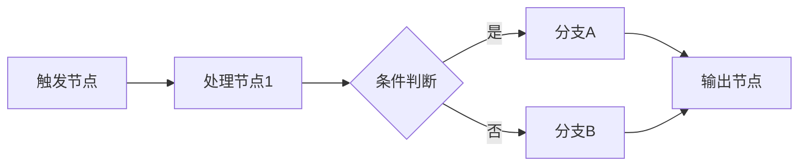

# 入门介绍

## n8n工作流简介

n8n 是一个开源的工作流自动化平台，它让您可以通过可视化的方式连接不同的应用程序和服务，创建强大的自动化工作流。n8n 采用节点式的设计理念，每个节点代表一个特定的操作或服务，通过连接这些节点来构建复杂的业务流程。

### 核心特性

- **可视化编辑器**: 直观的拖拽式界面，无需编写复杂代码
- **丰富的集成**: 支持400+个内置节点，涵盖常用的SaaS应用和API
- **灵活部署**: 支持云端和本地部署，满足不同安全需求
- **开源透明**: 完全开源，可自定义扩展和修改
- **实时执行**: 支持定时触发、Webhook触发和手动执行

## 什么是n8n工作流？

n8n工作流是通过连接多个节点来实现特定业务逻辑的自动化流程。每个工作流由以下基本元素组成：

- **触发节点**: 启动工作流的事件源（如定时器、Webhook、文件变化等）
- **功能节点**: 执行具体操作的节点（如发送邮件、处理数据、调用API等）
- **条件节点**: 根据条件分支执行不同逻辑的节点
- **连接线**: 定义数据流向和执行顺序的连接

### 工作流执行原理

n8n工作流的执行遵循以下基本原理：

1. **事件触发**: 触发节点监听特定事件或条件
2. **数据传递**: 数据在节点之间按照连接顺序流动
3. **节点处理**: 每个节点接收输入数据，执行操作，产生输出
4. **流程控制**: 通过条件节点实现分支和循环逻辑
5. **结果输出**: 最终处理结果可以发送到目标系统或服务

## 为什么选择n8n？

相比其他自动化平台，n8n具有以下优势：

### 1. 开源与自主控制
- **完全开源**: 代码透明，可自由修改和扩展
- **数据安全**: 可本地部署，数据完全受控
- **无供应商锁定**: 避免对特定厂商的依赖

### 2. 强大的集成能力
- **广泛支持**: 内置400+个常用服务和API的连接器
- **自定义节点**: 支持开发自定义节点满足特殊需求
- **标准协议**: 支持HTTP、GraphQL、SOAP等标准协议

### 3. 灵活的部署方式
- **云端服务**: n8n.cloud提供托管服务
- **本地部署**: Docker、npm等多种部署方式
- **混合架构**: 支持云端管理，本地执行的混合模式

### 4. 用户友好的设计
- **低代码开发**: 可视化编程，降低技术门槛
- **实时调试**: 内置调试工具，方便开发测试
- **丰富模板**: 社区提供大量现成的工作流模板

## n8n的应用场景

n8n适用于多种业务场景的自动化需求：

### 1. 数据集成与同步
- **CRM数据同步**: 在不同CRM系统间同步客户数据
- **数据库备份**: 定期备份重要数据到云存储
- **报表自动化**: 自动生成和发送业务报表

### 2. 营销自动化
- **邮件营销**: 基于用户行为触发个性化邮件
- **社交媒体**: 自动发布内容到多个社交平台
- **潜客培育**: 自动化的潜在客户培育流程

### 3. 客户服务
- **工单处理**: 自动分配和处理客户工单
- **通知系统**: 实时通知相关人员重要事件
- **反馈收集**: 自动收集和分析客户反馈

### 4. IT运维自动化
- **监控告警**: 系统异常时自动发送告警
- **部署流程**: 自动化的代码部署和测试
- **日志分析**: 自动分析日志并生成报告

### 5. 内容管理
- **内容发布**: 跨平台内容自动发布
- **文件处理**: 自动处理和转换文件格式
- **备份归档**: 定期备份和归档重要文件

## n8n与其他自动化平台的对比

| 特性 | n8n | Zapier | Microsoft Power Automate | IFTTT |
|------|-----|--------|--------------------------|-------|
| 开源性 | ✅ 完全开源 | ❌ 闭源 | ❌ 闭源 | ❌ 闭源 |
| 本地部署 | ✅ 支持 | ❌ 仅云端 | ⚠️ 部分支持 | ❌ 仅云端 |
| 自定义节点 | ✅ 支持 | ❌ 不支持 | ⚠️ 有限支持 | ❌ 不支持 |
| 复杂逻辑 | ✅ 强大 | ⚠️ 中等 | ✅ 强大 | ❌ 简单 |
| 定价模式 | 💰 免费/按需付费 | 💰💰 按操作付费 | 💰💰 按用户付费 | 💰 免费版有限 |
| 学习曲线 | ⚠️ 中等 | ✅ 简单 | ⚠️ 中等 | ✅ 简单 |

## 核心提示词技术

n8n工作流开发中常用的几种核心技术：

### 1. 零样本提示
创建清晰、有效的指令

- **节点配置**: 为每个节点配置适当的参数和条件
- **数据映射**: 正确映射输入输出数据字段
- **错误处理**: 设置适当的错误处理和重试机制

### 2. 少样本提示
调整提示以提高性能

- **条件逻辑**: 使用IF/Switch节点实现复杂的条件判断
- **循环处理**: 通过Split In Batches节点处理大量数据
- **数据转换**: 使用Function节点进行自定义数据处理

### 3. 链式提示
应用成熟的模板和策略

- **模块化设计**: 将复杂工作流拆分为可重用的子流程
- **模板使用**: 基于社区模板快速构建工作流
- **最佳实践**: 遵循n8n社区的最佳实践指南

### 4. 无制约提示
测试和比较不同的效果

- **A/B测试**: 通过不同分支测试不同的处理逻辑
- **性能监控**: 监控工作流执行时间和成功率
- **迭代优化**: 根据运行结果不断优化工作流设计

## 入门学习路径

要掌握n8n工作流开发，建议按照以下路径学习：

### 阶段一：基础入门
1. **环境搭建**: 安装和配置n8n开发环境
2. **基础概念**: 理解节点、连接、数据流等核心概念
3. **简单实践**: 创建第一个hello world工作流

### 阶段二：技能提升
1. **常用节点**: 掌握HTTP Request、Code、IF等核心节点
2. **数据处理**: 学习数据格式转换和处理技巧
3. **实际项目**: 完成一个完整的业务自动化项目

### 阶段三：高级应用
1. **自定义节点**: 开发符合特定需求的自定义节点
2. **性能优化**: 优化工作流执行效率和资源使用
3. **企业部署**: 在生产环境中部署和维护n8n工作流

## 推荐资源

- **官方文档**: [n8n.io/docs](https://docs.n8n.io/)
- **社区论坛**: [community.n8n.io](https://community.n8n.io/)
- **GitHub仓库**: [github.com/n8n-io/n8n](https://github.com/n8n-io/n8n)
- **YouTube频道**: n8n官方频道提供丰富的视频教程
- **模板库**: 社区提供的工作流模板和最佳实践

在接下来的章节中，我们将深入探讨n8n工作流的各个方面，从基础开发到高级应用，帮助您成为n8n工作流自动化的专家。 