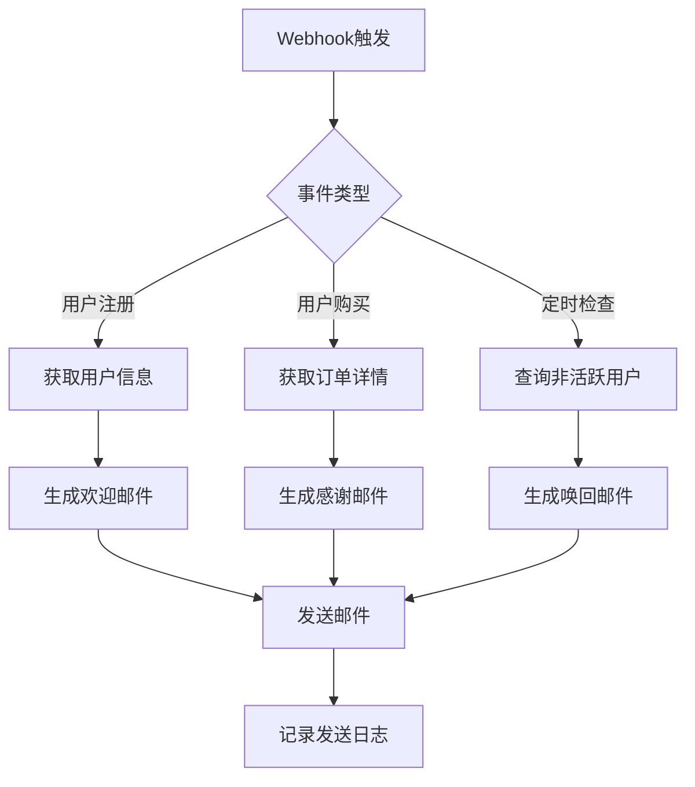
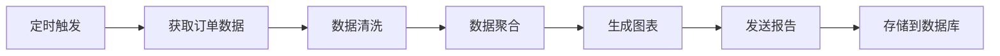
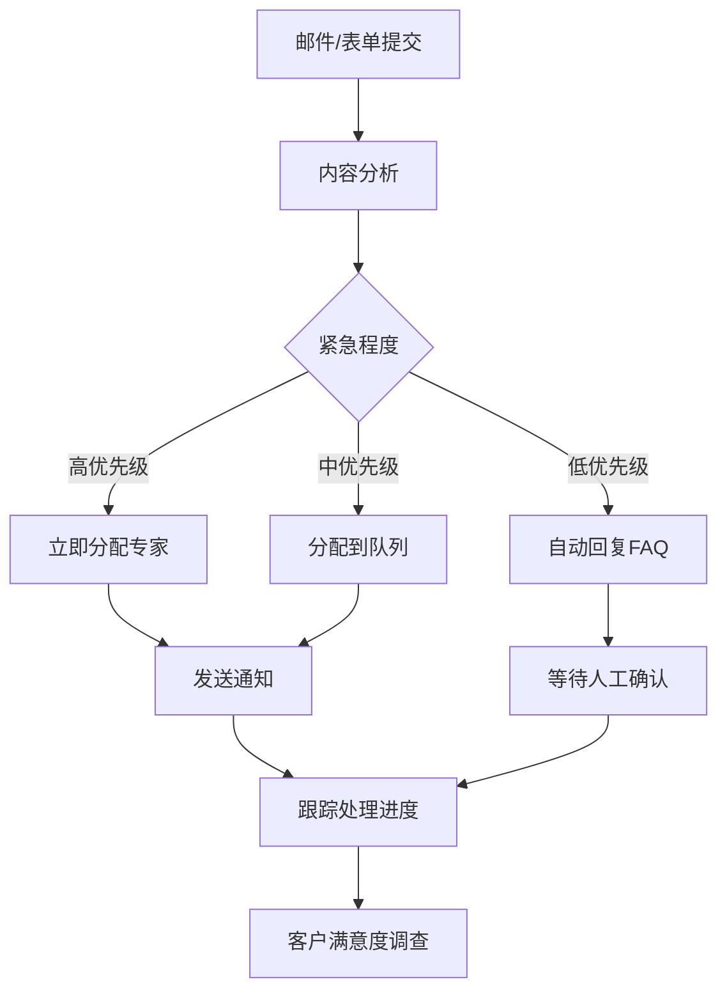
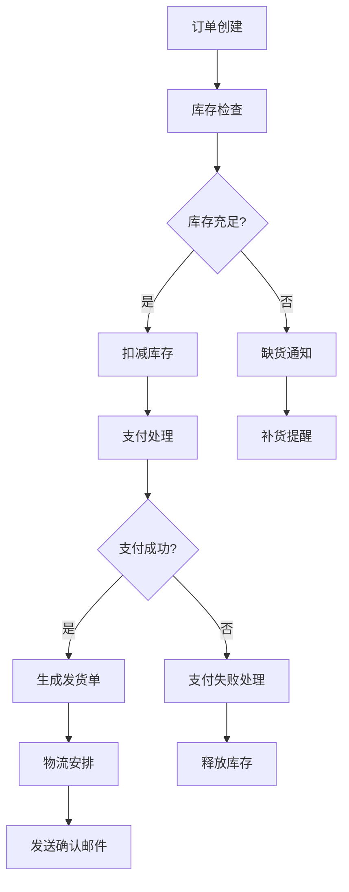

# 经典工作流案例

本章将为您展示多种实际应用场景的n8n工作流案例，帮助您理解如何在实际业务中应用工作流自动化技术。

## 营销自动化案例

### 1. 智能邮件营销系统

这个工作流可以根据用户行为自动发送个性化的营销邮件。

#### 业务场景
- 新用户注册时发送欢迎邮件
- 用户购买后发送感谢邮件
- 长期未活跃用户发送唤回邮件
- 节日期间发送促销邮件

#### 工作流设计



#### 核心节点配置

**Webhook节点**:
```json
{
  "httpMethod": "POST",
  "path": "marketing-trigger",
  "responseMode": "respondWith200"
}
```

**Switch节点 - 事件分发**:
```javascript
// 根据事件类型分发到不同分支
const eventType = $json.event_type;

switch(eventType) {
  case 'user_registered':
    return [0]; // 用户注册分支
  case 'order_completed':
    return [1]; // 订单完成分支
  case 'inactive_check':
    return [2]; // 非活跃用户检查分支
  default:
    return [];
}
```

**Function节点 - 邮件内容生成**:
```javascript
// 生成个性化邮件内容
const user = $json.user;
const eventType = $json.event_type;

let emailContent = {};

if (eventType === 'user_registered') {
  emailContent = {
    subject: `欢迎加入我们，${user.firstName}！`,
    html: `
      <h2>欢迎您，${user.firstName}！</h2>
      <p>感谢您注册我们的服务。</p>
      <p>作为新用户，您可以享受首次购买8折优惠。</p>
      <a href="https://yoursite.com/shop?code=WELCOME20">立即购买</a>
    `,
    to: user.email
  };
} else if (eventType === 'order_completed') {
  emailContent = {
    subject: `感谢您的购买，${user.firstName}！`,
    html: `
      <h2>订单确认</h2>
      <p>亲爱的${user.firstName}，</p>
      <p>您的订单 #${$json.order.id} 已确认。</p>
      <p>预计发货时间：2-3个工作日</p>
    `,
    to: user.email
  };
}

return { json: emailContent };
```

#### 关键特性
- 📧 多触发器支持（Webhook、定时器）
- 🎯 基于用户行为的智能分发
- 📝 动态邮件内容生成
- 📊 完整的发送日志记录
- 🔄 失败重试机制

### 2. 社交媒体自动发布

自动将内容发布到多个社交媒体平台。

#### 工作流组件
- **RSS触发器**: 监听博客或新闻源
- **内容处理**: 格式化适合不同平台的内容
- **多平台发布**: 同时发布到Twitter、LinkedIn、Facebook
- **结果汇总**: 统计发布结果和互动数据

#### 实现代码
```javascript
// 内容格式化函数
function formatForPlatform(content, platform) {
  const maxLength = {
    'twitter': 280,
    'linkedin': 700,
    'facebook': 500
  };
  
  let formattedContent = content;
  
  if (formattedContent.length > maxLength[platform]) {
    formattedContent = formattedContent.substring(0, maxLength[platform] - 3) + '...';
  }
  
  // 添加平台特定的标签
  if (platform === 'twitter') {
    formattedContent += ' #automation #n8n';
  } else if (platform === 'linkedin') {
    formattedContent += '\n\n#技术分享 #自动化';
  }
  
  return formattedContent;
}

// 处理RSS内容
const rssItem = $json;
const platforms = ['twitter', 'linkedin', 'facebook'];

const posts = platforms.map(platform => ({
  platform: platform,
  content: formatForPlatform(rssItem.contentSnippet, platform),
  title: rssItem.title,
  url: rssItem.link
}));

return posts.map(post => ({ json: post }));
```

## 数据处理案例

### 1. 电商数据分析流水线

处理电商平台的销售数据，生成分析报告。

#### 数据流程



#### 核心处理逻辑

**数据清洗节点**:
```javascript
// 清洗和标准化订单数据
const orders = $input.all().map(item => item.json);
const cleanedOrders = [];

orders.forEach(order => {
  // 数据验证和清理
  if (order.amount && order.date && order.status) {
    cleanedOrders.push({
      orderId: order.id,
      amount: parseFloat(order.amount),
      date: new Date(order.date),
      status: order.status.toLowerCase(),
      customerType: order.customer?.type || 'unknown',
      productCategory: order.items?.[0]?.category || 'other'
    });
  }
});

return cleanedOrders.map(order => ({ json: order }));
```

**数据聚合节点**:
```javascript
// 生成销售统计数据
const orders = $input.all().map(item => item.json);

// 按日期聚合
const dailySales = {};
const categoryStats = {};

orders.forEach(order => {
  const dateKey = order.date.toISOString().split('T')[0];
  
  // 日销售额
  dailySales[dateKey] = (dailySales[dateKey] || 0) + order.amount;
  
  // 分类统计
  categoryStats[order.productCategory] = {
    count: (categoryStats[order.productCategory]?.count || 0) + 1,
    revenue: (categoryStats[order.productCategory]?.revenue || 0) + order.amount
  };
});

// 计算增长率
const dates = Object.keys(dailySales).sort();
const growthRate = dates.length > 1 ? 
  ((dailySales[dates[dates.length - 1]] - dailySales[dates[0]]) / dailySales[dates[0]] * 100).toFixed(2) : 0;

return {
  json: {
    totalRevenue: orders.reduce((sum, order) => sum + order.amount, 0),
    totalOrders: orders.length,
    averageOrderValue: orders.reduce((sum, order) => sum + order.amount, 0) / orders.length,
    dailySales,
    categoryStats,
    growthRate: `${growthRate}%`,
    reportDate: new Date().toISOString()
  }
};
```

### 2. CSV数据处理和转换

批量处理CSV文件，转换格式并导入到数据库。

#### 工作流特点
- 📁 监听文件目录变化
- 📊 解析多种CSV格式
- 🔄 数据格式转换和验证
- 💾 批量导入数据库
- 📧 处理结果通知

#### 文件处理逻辑
```javascript
// CSV数据转换函数
function transformCSVData(csvData, mappingRules) {
  const transformed = csvData.map(row => {
    const newRow = {};
    
    Object.keys(mappingRules).forEach(targetField => {
      const sourceField = mappingRules[targetField];
      
      if (typeof sourceField === 'string') {
        newRow[targetField] = row[sourceField];
      } else if (typeof sourceField === 'function') {
        newRow[targetField] = sourceField(row);
      }
    });
    
    return newRow;
  });
  
  return transformed;
}

// 使用示例
const csvData = $json.data;
const mappingRules = {
  'customer_id': 'CustomerID',
  'full_name': row => `${row.FirstName} ${row.LastName}`,
  'email': 'Email',
  'registration_date': row => new Date(row.RegDate).toISOString(),
  'total_spent': row => parseFloat(row.TotalSpent || 0)
};

const transformedData = transformCSVData(csvData, mappingRules);

return transformedData.map(row => ({ json: row }));
```

## 客户服务案例

### 1. 智能客服工单系统

自动处理客户咨询，分配工单并跟踪处理进度。

#### 系统流程



#### 智能分类算法

```javascript
// 工单优先级分类
function classifyTicket(content, subject) {
  const urgentKeywords = ['紧急', '无法登录', '系统崩溃', '数据丢失', '支付失败'];
  const mediumKeywords = ['帮助', '问题', '咨询', '建议'];
  const lowKeywords = ['信息', '了解', '一般咨询'];
  
  const text = (subject + ' ' + content).toLowerCase();
  
  // 检查紧急关键词
  if (urgentKeywords.some(keyword => text.includes(keyword))) {
    return {
      priority: 'high',
      estimatedTime: '2小时内',
      department: 'technical_support',
      autoResponse: false
    };
  }
  
  // 检查中等优先级
  if (mediumKeywords.some(keyword => text.includes(keyword))) {
    return {
      priority: 'medium',
      estimatedTime: '24小时内',
      department: 'customer_service',
      autoResponse: false
    };
  }
  
  // 默认低优先级
  return {
    priority: 'low',
    estimatedTime: '3个工作日',
    department: 'general_support',
    autoResponse: true
  };
}

// 处理工单
const ticket = $json;
const classification = classifyTicket(ticket.content, ticket.subject);

return {
  json: {
    ticketId: `T${Date.now()}`,
    customerId: ticket.customer_id,
    subject: ticket.subject,
    content: ticket.content,
    ...classification,
    createdAt: new Date().toISOString(),
    status: 'open'
  }
};
```

### 2. 客户反馈收集和分析

自动收集客户反馈，进行情感分析并生成报告。

#### 反馈处理流程
- 📝 多渠道反馈收集（邮件、表单、社交媒体）
- 🧠 AI情感分析
- 📊 趋势分析和报告生成
- 🔄 自动问题升级
- 📧 团队通知和跟进

## IT运维案例

### 1. 服务器监控和告警

监控服务器状态，异常时自动发送告警并尝试修复。

#### 监控工作流

```javascript
// 服务器健康检查
async function checkServerHealth(serverConfig) {
  const checks = {
    ping: false,
    cpu: 0,
    memory: 0,
    disk: 0,
    services: []
  };
  
  try {
    // CPU使用率检查
    const cpuUsage = await getCPUUsage(serverConfig.host);
    checks.cpu = cpuUsage;
    
    // 内存使用率检查
    const memoryUsage = await getMemoryUsage(serverConfig.host);
    checks.memory = memoryUsage;
    
    // 磁盘使用率检查
    const diskUsage = await getDiskUsage(serverConfig.host);
    checks.disk = diskUsage;
    
    checks.ping = true;
  } catch (error) {
    console.error(`服务器 ${serverConfig.name} 检查失败:`, error);
  }
  
  return checks;
}

// 告警判断
function shouldAlert(checks, thresholds) {
  const alerts = [];
  
  if (!checks.ping) {
    alerts.push({ type: 'critical', message: '服务器无响应' });
  }
  
  if (checks.cpu > thresholds.cpu) {
    alerts.push({ type: 'warning', message: `CPU使用率过高: ${checks.cpu}%` });
  }
  
  if (checks.memory > thresholds.memory) {
    alerts.push({ type: 'warning', message: `内存使用率过高: ${checks.memory}%` });
  }
  
  if (checks.disk > thresholds.disk) {
    alerts.push({ type: 'critical', message: `磁盘使用率过高: ${checks.disk}%` });
  }
  
  return alerts;
}

// 执行检查
const serverConfig = $json.server;
const thresholds = $json.thresholds || {
  cpu: 80,
  memory: 85,
  disk: 90
};

const healthChecks = await checkServerHealth(serverConfig);
const alerts = shouldAlert(healthChecks, thresholds);

return {
  json: {
    serverId: serverConfig.id,
    serverName: serverConfig.name,
    checkTime: new Date().toISOString(),
    healthStatus: healthChecks,
    alerts: alerts,
    needsAttention: alerts.length > 0
  }
};
```

### 2. 自动化部署流水线

代码提交后自动触发测试、构建和部署流程。

#### 部署流程设计
- 🔄 Git Webhook触发
- 🧪 自动化测试执行
- 🏗️ 构建和打包
- 🚀 多环境部署
- 📊 部署结果通知
- 🔙 失败自动回滚

## 文档和内容管理案例

### 1. 知识库自动更新

监控技术文档变更，自动更新知识库并通知团队。

#### 更新流程
```javascript
// 文档变更检测
function detectDocumentChanges(oldDoc, newDoc) {
  const changes = {
    title: oldDoc.title !== newDoc.title,
    content: oldDoc.content !== newDoc.content,
    tags: JSON.stringify(oldDoc.tags) !== JSON.stringify(newDoc.tags),
    lastModified: oldDoc.lastModified !== newDoc.lastModified
  };
  
  const changesSummary = Object.keys(changes)
    .filter(key => changes[key])
    .map(key => {
      switch(key) {
        case 'title': return '标题更新';
        case 'content': return '内容修改';
        case 'tags': return '标签变更';
        case 'lastModified': return '修改时间更新';
      }
    });
  
  return {
    hasChanges: changesSummary.length > 0,
    changes: changesSummary,
    changeCount: changesSummary.length
  };
}

// 生成更新通知
function generateUpdateNotification(document, changes) {
  return {
    subject: `知识库文档更新: ${document.title}`,
    content: `
      文档 "${document.title}" 已更新
      
      变更内容:
      ${changes.changes.map(change => `• ${change}`).join('\n')}
      
      文档链接: ${document.url}
      更新时间: ${new Date().toLocaleString()}
      修改者: ${document.author}
    `,
    priority: changes.changeCount > 2 ? 'high' : 'normal'
  };
}

const document = $json.document;
const oldVersion = $json.oldVersion;

const changeDetection = detectDocumentChanges(oldVersion, document);

if (changeDetection.hasChanges) {
  const notification = generateUpdateNotification(document, changeDetection);
  return { json: { ...document, notification, changes: changeDetection } };
} else {
  return { json: { ...document, skipNotification: true } };
}
```

### 2. 多语言内容同步

将主语言内容自动翻译并同步到多个语言版本。

#### 翻译工作流特点
- 🌐 检测内容语言
- 🔄 批量翻译处理
- ✅ 翻译质量检查
- 📝 人工审核流程
- 🚀 自动发布更新

## 业务流程案例

### 1. 订单处理自动化

完整的电商订单处理流程自动化。

#### 订单处理流程



#### 订单状态管理

```javascript
// 订单状态机
class OrderStateMachine {
  constructor() {
    this.states = {
      'created': ['inventory_check'],
      'inventory_check': ['payment_pending', 'out_of_stock'],
      'payment_pending': ['payment_success', 'payment_failed'],
      'payment_success': ['preparing_shipment'],
      'payment_failed': ['cancelled'],
      'out_of_stock': ['cancelled', 'backorder'],
      'preparing_shipment': ['shipped'],
      'shipped': ['delivered', 'returned'],
      'delivered': ['completed'],
      'returned': ['refunded'],
      'cancelled': [],
      'completed': [],
      'refunded': []
    };
  }
  
  canTransition(currentState, newState) {
    return this.states[currentState]?.includes(newState) || false;
  }
  
  processOrder(order, newState) {
    if (!this.canTransition(order.status, newState)) {
      throw new Error(`无法从 ${order.status} 转换到 ${newState}`);
    }
    
    const updatedOrder = {
      ...order,
      status: newState,
      statusHistory: [
        ...(order.statusHistory || []),
        {
          from: order.status,
          to: newState,
          timestamp: new Date().toISOString(),
          automated: true
        }
      ]
    };
    
    return updatedOrder;
  }
}

// 使用状态机处理订单
const stateMachine = new OrderStateMachine();
const order = $json;
const targetStatus = $json.targetStatus;

try {
  const updatedOrder = stateMachine.processOrder(order, targetStatus);
  
  // 根据新状态执行相应操作
  const actions = {
    'payment_success': () => ({
      sendEmail: true,
      emailType: 'payment_confirmation',
      createShipment: true
    }),
    'shipped': () => ({
      sendEmail: true,
      emailType: 'shipping_notification',
      updateTracking: true
    }),
    'delivered': () => ({
      sendEmail: true,
      emailType: 'delivery_confirmation',
      requestReview: true
    })
  };
  
  const actionResult = actions[targetStatus] ? actions[targetStatus]() : {};
  
  return {
    json: {
      ...updatedOrder,
      actions: actionResult
    }
  };
} catch (error) {
  return {
    json: {
      error: error.message,
      order: order
    }
  };
}
```

### 2. 员工入职流程

新员工入职的自动化流程管理。

#### 入职任务清单
- 📋 创建员工账号和邮箱
- 💻 分配设备和软件许可
- 📚 发送入职手册和培训材料
- 🏢 安排办公工位
- 👥 介绍团队成员
- 📅 安排首周培训日程

## 最佳实践总结

### 1. 工作流设计原则

- **模块化设计**: 将复杂流程拆分为独立的可重用模块
- **错误处理**: 为每个关键步骤添加错误处理和重试机制
- **监控日志**: 记录详细的执行日志便于问题排查
- **性能优化**: 合理使用批处理和并发处理提高效率

### 2. 数据管理

- **数据验证**: 在处理前验证输入数据的完整性和格式
- **数据备份**: 关键数据操作前进行备份
- **版本控制**: 对重要的配置和工作流进行版本管理
- **安全考虑**: 敏感数据加密和访问控制

### 3. 运维监控

- **健康检查**: 定期检查工作流的运行状态
- **性能监控**: 监控执行时间和资源使用情况
- **告警机制**: 建立完善的告警和通知机制
- **文档维护**: 保持工作流文档的更新和完整性

通过这些经典案例的学习，您可以了解如何在实际业务场景中应用n8n工作流，并根据自己的需求进行定制和优化。记住，好的工作流不仅要解决问题，还要易于维护和扩展。 