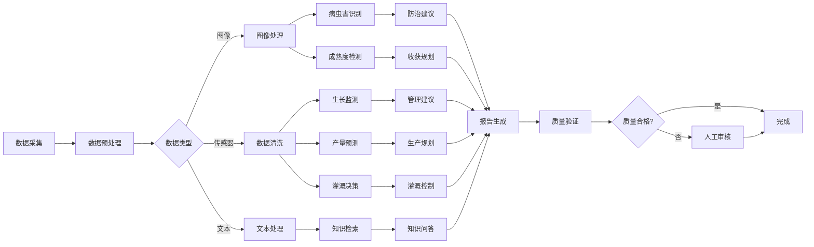

# 5. 智能体与业务编排

## 5.1 Agent技能链

### 技能定义

智能农业Agent需要具备多种技能，通过技能链组合完成复杂任务：

#### 核心技能

**1. 图像处理技能（Image Processing）**
- **功能**：处理农业图像（裁剪、增强、标准化等）
- **输入**：图像文件
- **输出**：处理后的图像
- **实现**：基于OpenCV、PIL等工具
- **应用场景**：病虫害识别、作物监测

**2. 病虫害识别技能（Pest Disease Identification）**
- **功能**：识别作物病虫害类型和严重程度
- **输入**：作物图像
- **输出**：病虫害识别结果（类型、严重程度、置信度）
- **实现**：基于ResNet、EfficientNet等图像识别模型
- **应用场景**：病虫害识别、防治建议

**3. 作物生长监测技能（Crop Growth Monitoring）**
- **功能**：监测作物生长状态，预测生长趋势
- **输入**：传感器数据、图像数据
- **输出**：生长状态评估、生长趋势预测
- **实现**：基于多模态融合模型
- **应用场景**：作物监测、生长预测

**4. 产量预测技能（Yield Prediction）**
- **功能**：预测作物产量
- **输入**：传感器数据、气象数据、历史产量数据
- **输出**：产量预测结果（预测值、置信区间）
- **实现**：基于LSTM、Transformer等时序预测模型
- **应用场景**：产量预测、收获规划

**5. 灌溉决策技能（Irrigation Decision）**
- **功能**：基于土壤数据判断是否需要灌溉
- **输入**：土壤湿度、温度、气象数据
- **输出**：灌溉建议（是否需要灌溉、灌溉量、灌溉时间）
- **实现**：基于规则引擎和AI模型
- **应用场景**：智能灌溉、水资源管理

**6. 成熟度检测技能（Maturity Detection）**
- **功能**：检测作物成熟度，判断收获时机
- **输入**：作物图像、传感器数据
- **输出**：成熟度评估、收获时机建议
- **实现**：基于YOLO等目标检测模型
- **应用场景**：收获规划、收获时机判断

**7. 农业知识检索技能（Agricultural Knowledge Retrieval）**
- **功能**：从农业知识库检索相关知识
- **输入**：用户问题、检索条件
- **输出**：相关知识列表
- **实现**：基于RAG检索系统
- **应用场景**：农业知识问答、技术指导

**8. 报告生成技能（Report Generation）**
- **功能**：生成农业监测报告、分析报告等
- **输入**：分析结果、报告模板
- **输出**：格式化的报告文档
- **实现**：基于模板引擎和大语言模型
- **应用场景**：监测报告生成、分析报告生成

### 技能链设计

技能链按照业务流程组织，形成完整的处理流程：



## 5.2 业务流程编排

### 工作流设计

#### 作物监测工作流

**工作流描述**：定期监测作物生长状态，识别异常情况，生成监测报告

**工作流步骤**：

1. **数据采集**
   - 采集IoT传感器数据（土壤湿度、温度、光照等）
   - 采集多光谱图像数据（无人机或卫星）
   - 采集气象数据

2. **数据预处理**
   - 清洗传感器数据（去除异常值、缺失值填充）
   - 预处理图像数据（裁剪、增强、标准化）

3. **生长状态分析**
   - 分析传感器数据，评估土壤状态
   - 分析图像数据，评估作物生长状态
   - 融合多模态数据，综合评估

4. **异常检测**
   - 检测生长异常（如生长缓慢、叶片发黄等）
   - 检测病虫害迹象
   - 检测环境异常（如土壤干旱、温度异常等）

5. **预测分析**
   - 预测生长趋势
   - 预测产量
   - 预测病虫害风险

6. **报告生成**
   - 生成监测报告
   - 生成管理建议
   - 发送告警通知（如发现异常）

**工作流配置**：

```yaml
workflow:
  name: 作物监测工作流
  triggers:
    - type: schedule
      cron: "0 */6 * * *"  # 每6小时执行一次
  nodes:
    - id: collect-sensor-data
      type: iot-collector
      sensors: ["soil_moisture", "temperature", "light"]
    - id: collect-image-data
      type: image-collector
      source: "drone|satellite"
    - id: preprocess-data
      type: data-preprocessor
      rules: ["remove_outliers", "fill_missing"]
    - id: analyze-growth
      type: ai-agent
      agent: growth-analysis-agent
      tools:
        - sensor-analysis-tool
        - image-analysis-tool
        - growth-prediction-tool
    - id: detect-anomalies
      type: ai-agent
      agent: anomaly-detection-agent
      tools:
        - anomaly-detection-tool
        - pest-disease-detection-tool
    - id: generate-report
      type: ai-agent
      agent: report-generation-agent
      tools:
        - report-template-tool
        - formatting-tool
    - id: send-notification
      type: notification
      channels: ["sms", "app"]
      conditions:
        - anomaly_detected == true
```

#### 病虫害识别工作流

**工作流描述**：识别作物病虫害，提供防治建议

**工作流步骤**：

1. **图像上传**
   - 用户上传病虫害图片（手机拍摄或无人机拍摄）

2. **图像预处理**
   - 图像裁剪和增强
   - 图像标准化

3. **病虫害识别**
   - 使用图像识别模型识别病虫害类型
   - 评估病虫害严重程度
   - 计算识别置信度

4. **知识检索**
   - 从知识库检索病虫害信息
   - 检索防治方法
   - 检索用药方案

5. **防治建议生成**
   - 生成防治建议（农业防治、生物防治、化学防治）
   - 生成用药方案（如适用）
   - 生成注意事项

6. **报告生成**
   - 生成识别报告
   - 发送通知给用户

**工作流配置**：

```yaml
workflow:
  name: 病虫害识别工作流
  triggers:
    - type: webhook
      path: /api/pest-disease/identify
  nodes:
    - id: receive-image
      type: webhook
    - id: preprocess-image
      type: image-preprocessor
      operations: ["crop", "enhance", "normalize"]
    - id: identify-pest-disease
      type: ai-agent
      agent: pest-disease-identification-agent
      tools:
        - image-recognition-tool
        - severity-assessment-tool
    - id: retrieve-knowledge
      type: ai-agent
      agent: knowledge-retrieval-agent
      tools:
        - knowledge-base-tool
        - pesticide-database-tool
    - id: generate-suggestions
      type: ai-agent
      agent: suggestion-generation-agent
      tools:
        - suggestion-template-tool
    - id: generate-report
      type: ai-agent
      agent: report-generation-agent
      tools:
        - report-template-tool
    - id: send-notification
      type: notification
      channels: ["app", "sms"]
```

### 异常处理

#### 异常类型

**1. 数据异常**
- **传感器故障**：传感器数据异常或缺失
- **图像质量问题**：图像模糊、光线不足等
- **数据格式错误**：数据格式不符合要求

**2. 模型异常**
- **识别置信度低**：模型识别置信度低于阈值
- **预测异常**：预测结果异常（如负产量）
- **模型服务不可用**：模型服务故障

**3. 系统异常**
- **网络异常**：网络连接失败
- **服务异常**：服务不可用
- **资源不足**：计算资源不足

#### 异常处理策略

**1. 重试机制**
- **自动重试**：对于临时性错误，自动重试
- **重试次数**：最多重试3次
- **重试间隔**：指数退避（1秒、2秒、4秒）

**2. 降级策略**
- **模型降级**：主模型不可用时，使用备用模型
- **功能降级**：部分功能不可用时，提供简化功能
- **服务降级**：服务不可用时，返回缓存结果

**3. 人工介入**
- **低置信度转人工**：识别置信度低于阈值时，转人工审核
- **异常情况告警**：发现异常情况时，立即告警
- **人工审核流程**：建立人工审核流程，确保质量

## 5.3 MCP工具集成

### 工具定义

#### IoT工具

**1. 传感器数据采集工具（Sensor Data Collection Tool）**
- **功能**：采集IoT传感器数据
- **输入**：传感器ID、时间范围
- **输出**：传感器数据（JSON格式）
- **实现**：基于MQTT、CoAP等IoT协议
- **MCP注册**：通过MCP服务器注册

**2. 图像采集工具（Image Collection Tool）**
- **功能**：采集无人机或卫星图像
- **输入**：农田ID、采集时间
- **输出**：图像文件路径和元数据
- **实现**：基于无人机API、卫星API
- **MCP注册**：通过MCP服务器注册

**3. 灌溉控制工具（Irrigation Control Tool）**
- **功能**：控制灌溉设备
- **输入**：设备ID、控制指令（开启/关闭、灌溉量）
- **输出**：控制结果
- **实现**：基于IoT设备控制协议
- **MCP注册**：通过MCP服务器注册

#### 农业知识工具

**4. 病虫害知识检索工具（Pest Disease Knowledge Retrieval Tool）**
- **功能**：从知识库检索病虫害信息
- **输入**：病虫害名称、检索条件
- **输出**：病虫害信息列表
- **实现**：基于向量数据库（Milvus）的RAG检索
- **MCP注册**：通过MCP服务器注册

**5. 作物知识检索工具（Crop Knowledge Retrieval Tool）**
- **功能**：从知识库检索作物信息
- **输入**：作物名称、检索条件
- **输出**：作物信息列表
- **实现**：基于向量数据库和知识图谱
- **MCP注册**：通过MCP服务器注册

**6. 农业知识图谱工具（Agricultural Knowledge Graph Tool）**
- **功能**：查询农业知识图谱，获取概念关系
- **输入**：农业概念、关系类型
- **输出**：相关农业概念和关系
- **实现**：基于Neo4j图数据库
- **MCP注册**：通过MCP服务器注册

#### AI工具

**7. 图像识别工具（Image Recognition Tool）**
- **功能**：识别作物图像中的病虫害、成熟度等
- **输入**：图像文件路径
- **输出**：识别结果（JSON格式）
- **实现**：基于ResNet、EfficientNet等模型
- **MCP注册**：通过MCP服务器注册

**8. 产量预测工具（Yield Prediction Tool）**
- **功能**：预测作物产量
- **输入**：传感器数据、气象数据、历史产量数据
- **输出**：产量预测结果
- **实现**：基于LSTM、Transformer等模型
- **MCP注册**：通过MCP服务器注册

**9. 农业分析工具（Agricultural Analysis Tool）**
- **功能**：进行农业数据分析
- **输入**：分析需求、数据
- **输出**：分析结果
- **实现**：基于大语言模型
- **MCP注册**：通过MCP服务器注册

### 工具注册流程

#### 注册步骤

**步骤1：工具开发**
- 开发工具功能，实现标准接口
- 编写工具文档和测试用例
- 确保工具的安全性和性能

**步骤2：工具注册**
- 在MCP服务器注册工具
- 提供工具名称、描述、参数、返回值等信息
- 配置工具权限和访问控制

**步骤3：工具测试**
- 在测试环境测试工具功能
- 验证工具的安全性和性能
- 确保工具符合质量标准

**步骤4：工具发布**
- 工具审核通过后发布
- 配置工具版本和更新策略
- 通知相关用户

#### MCP工具注册示例

```python
from mcp import MCPServer, Tool

# 创建MCP服务器
server = MCPServer("agricultural-tools-server")

# 注册病虫害识别工具
@server.tool(
    name="pest_disease_identification",
    description="识别作物病虫害类型和严重程度",
    parameters={
        "image_path": {
            "type": "string",
            "description": "图像文件路径",
            "required": True
        },
        "crop_type": {
            "type": "string",
            "description": "作物类型",
            "required": True
        }
    },
    returns={
        "pest_disease_type": "string",
        "pest_disease_name": "string",
        "severity": "string",
        "confidence": "float"
    }
)
def pest_disease_identification(image_path: str, crop_type: str):
    """识别病虫害"""
    # 实现识别逻辑
    result = identify_pest_disease(image_path, crop_type)
    return result

# 注册产量预测工具
@server.tool(
    name="yield_prediction",
    description="预测作物产量",
    parameters={
        "sensor_data": {
            "type": "object",
            "description": "传感器数据",
            "required": True
        },
        "weather_forecast": {
            "type": "object",
            "description": "气象预测数据",
            "required": True
        }
    },
    returns={
        "predicted_yield": "float",
        "confidence": "float",
        "prediction_basis": "string"
    }
)
def yield_prediction(sensor_data: dict, weather_forecast: dict):
    """预测产量"""
    # 实现预测逻辑
    result = predict_yield(sensor_data, weather_forecast)
    return result

# 启动MCP服务器
if __name__ == "__main__":
    server.run()
```

