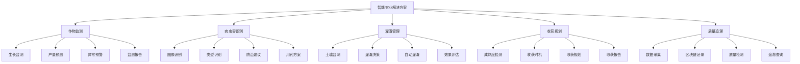
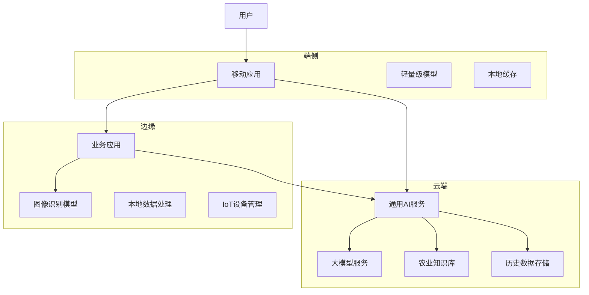
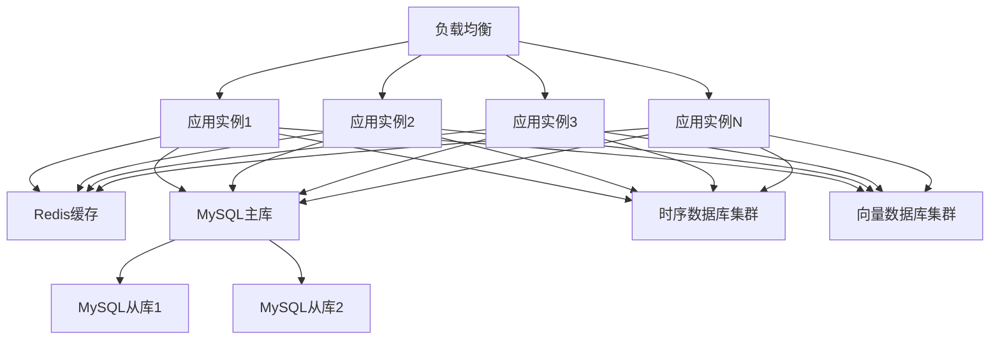

# 2. 总体架构

## 2.1 业务架构

### 角色定义

智能农业解决方案涉及多个角色，每个角色有不同的职责和权限：

- **农场主/农户**：
  - 职责：使用智能农业工具进行作物监测、病虫害识别、灌溉管理、收获规划
  - 权限：访问农田数据，使用AI监测工具，查看分析报告
  - 使用场景：田间管理，病虫害识别，灌溉决策，收获规划

- **农技人员**：
  - 职责：使用智能农业工具进行技术指导、问题诊断、效果评估
  - 权限：访问多农场数据，使用高级分析工具，生成技术报告
  - 使用场景：技术指导，问题诊断，效果评估，培训农户

- **农业专家**：
  - 职责：使用智能农业工具进行农业研究、模型优化、知识库构建
  - 权限：访问全部数据，使用研究工具，构建知识库
  - 使用场景：农业研究，模型优化，知识库构建，学术研究

- **系统管理员**：
  - 职责：管理系统配置，监控系统运行，处理系统故障
  - 权限：系统配置，用户管理，监控告警
  - 使用场景：系统维护，用户管理，故障处理

### 用例分析

#### 用例1：智能作物监测

**参与者**：农场主、作物监测系统、AI分析引擎

**前置条件**：
- 农场主已登录系统
- 农田已配置IoT设备和传感器
- 监测规则和阈值已配置

**主流程**：
1. 农场主选择要监测的农田
2. 系统自动采集IoT传感器数据（土壤湿度、温度、光照等）
3. 系统采集多光谱图像数据（无人机或卫星）
4. AI模型分析传感器数据和图像数据，识别作物生长状态
5. 系统预测作物生长趋势和产量
6. 生成监测报告（包括生长状态、预测产量、异常预警）
7. 农场主查看报告，根据建议采取管理措施

**异常流程**：
- 如果传感器故障，提示用户检查设备
- 如果AI识别置信度低，转人工审核
- 如果发现异常情况，立即告警

**后置条件**：
- 监测报告已生成
- 作物状态已识别和评估
- 管理建议已提供

#### 用例2：智能病虫害识别

**参与者**：农场主、病虫害识别系统、图像识别模型

**前置条件**：
- 农场主已登录系统
- 已拍摄作物病虫害图片
- 病虫害知识库已构建

**主流程**：
1. 农场主上传病虫害图片（手机拍摄或无人机拍摄）
2. 系统对图片进行预处理（裁剪、增强、标准化）
3. AI图像识别模型识别病虫害类型和严重程度
4. 系统检索病虫害知识库，获取防治建议
5. 匹配相关农药和防治方案
6. 生成识别报告（包括病虫害类型、严重程度、防治建议、用药方案）
7. 农场主查看报告，根据建议采取防治措施

**异常流程**：
- 如果图片质量差，提示用户重新拍摄
- 如果识别置信度低，转人工识别
- 如果发现严重病虫害，立即告警

**后置条件**：
- 病虫害已识别
- 防治建议已提供
- 识别报告已生成

#### 用例3：智能灌溉管理

**参与者**：农场主、灌溉管理系统、IoT传感器

**前置条件**：
- 农场主已登录系统
- 农田已配置土壤湿度传感器
- 灌溉设备已接入系统

**主流程**：
1. 系统实时采集土壤湿度、温度、降雨量等数据
2. AI模型分析土壤数据，判断是否需要灌溉
3. 系统结合天气预报，预测未来降雨情况
4. 计算最佳灌溉时间和灌溉量
5. 生成灌溉建议（包括灌溉时间、灌溉量、灌溉方式）
6. 农场主确认后，系统自动控制灌溉设备
7. 系统监控灌溉效果，调整灌溉策略

**异常流程**：
- 如果传感器故障，提示用户检查设备
- 如果灌溉设备故障，提示用户维修
- 如果预测不准确，人工调整

**后置条件**：
- 灌溉建议已生成
- 灌溉设备已控制
- 灌溉效果已监控

### 故事地图

智能农业解决方案的用户故事地图如下：



## 2.2 技术架构

### AI-Native四层架构

智能农业解决方案采用AI-Native四层架构，从下到上包括基础设施层、模型层、编排层和应用层。

#### 应用层

应用层提供面向业务用户的应用界面和API接口：

**核心应用**：

- **智能监测平台**：
  - 农田数据展示界面
  - 实时监测界面
  - 历史数据查询界面
  - 监测报告生成和导出

- **病虫害识别平台**：
  - 图片上传界面
  - 识别结果展示界面
  - 防治建议界面
  - 识别报告生成工具

- **灌溉管理平台**：
  - 土壤数据展示界面
  - 灌溉决策界面
  - 灌溉控制界面
  - 灌溉效果评估工具

- **收获规划平台**：
  - 成熟度检测界面
  - 收获时机预测界面
  - 收获规划界面
  - 收获报告生成工具

**技术栈**：
- 前端：Vue 3 + TypeScript + Vite + TailwindCSS
- 后端API：FastAPI + Python 3.11
- 状态管理：Pinia
- UI组件库：Element Plus

#### 编排层

编排层负责业务流程编排和智能体协调：

**核心组件**：

- **工作流引擎（n8n）**：
  - 业务流程编排
  - 任务调度和执行
  - 异常处理和重试
  - 工作流监控

- **智能体编排（Dify）**：
  - 多智能体协调
  - 工具调用管理
  - 上下文管理
  - 对话管理

- **MCP服务器**：
  - 工具注册中心
  - 工具调用接口
  - 数据源接入
  - 外部系统集成

**编排示例**：

```yaml
# 作物监测工作流
workflow:
  name: 智能作物监测
  triggers:
    - type: schedule
      cron: "0 */6 * * *"  # 每6小时执行一次
  nodes:
    - id: collect-sensor-data
      type: iot-collector
      sensors: ["soil_moisture", "temperature", "light"]
    - id: collect-image-data
      type: image-collector
      source: "drone|satellite"
    - id: analyze-growth
      type: ai-agent
      agent: growth-analysis-agent
      tools:
        - sensor-analysis-tool
        - image-analysis-tool
        - growth-prediction-tool
    - id: generate-report
      type: ai-agent
      agent: report-generation-agent
      tools:
        - report-template-tool
        - formatting-tool
    - id: send-notification
      type: notification
      channels: ["sms", "app"]
```

#### 模型层

模型层提供AI模型服务和推理能力：

**核心模型**：

- **图像识别模型**：
  - 病虫害识别模型（ResNet、EfficientNet + 农业领域微调）
  - 作物生长状态识别模型（CNN + 多光谱图像）
  - 成熟度检测模型（YOLO + 目标检测）
  - 杂草识别模型（语义分割模型）

- **时序预测模型**：
  - 产量预测模型（LSTM、Transformer）
  - 生长趋势预测模型（时间序列分析）
  - 气象预测模型（结合天气预报数据）

- **多模态融合模型**：
  - 传感器数据 + 图像数据融合模型
  - 多光谱图像分析模型
  - 知识图谱增强模型（结合农业知识库）

**模型服务**：

- **模型推理服务**：
  - 实时推理API
  - 批量推理服务
  - 模型版本管理
  - A/B测试支持

- **模型训练服务**：
  - 数据预处理
  - 模型训练
  - 模型评估
  - 模型部署

**技术栈**：
- 模型框架：PyTorch、TensorFlow、Transformers
- 模型服务：TorchServe、TensorFlow Serving、Triton
- 大模型：OpenAI API、Anthropic API、本地部署模型
- 知识图谱：Neo4j、ArangoDB

#### 基础设施层

基础设施层提供计算、存储、网络等基础能力：

**核心组件**：

- **计算资源**：
  - Kubernetes集群（GPU节点 + CPU节点）
  - 容器编排和管理
  - 自动扩缩容
  - 资源调度

- **存储系统**：
  - 关系数据库（MySQL 8.0）：业务数据存储
  - 时序数据库（InfluxDB、TimescaleDB）：IoT传感器数据存储
  - 向量数据库（Milvus、Qdrant）：农业知识库和相似度搜索
  - 图数据库（Neo4j）：农业知识图谱存储
  - 对象存储（MinIO、阿里云OSS）：图像和视频存储
  - 缓存系统（Redis）：热点数据缓存
  - 消息队列（RabbitMQ、Kafka）：异步消息处理

- **IoT设备管理**：
  - IoT设备接入和管理
  - 设备数据采集和传输
  - 设备状态监控
  - 设备远程控制

- **网络和安全**：
  - 负载均衡（Nginx、HAProxy）
  - API网关（Kong、Traefik）
  - 防火墙和安全组
  - VPN和专线

- **监控和日志**：
  - 监控系统（Prometheus + Grafana）
  - 日志系统（ELK Stack）
  - 链路追踪（Jaeger）
  - 告警系统（AlertManager）

**技术栈**：
- 容器化：Docker、Kubernetes
- 数据库：MySQL 8.0、Redis、InfluxDB、Milvus、Neo4j
- 消息队列：RabbitMQ、Kafka
- 监控：Prometheus、Grafana、ELK

### 技术栈

#### 前端技术栈

- **Vue 3**：渐进式JavaScript框架，用于构建用户界面
- **TypeScript**：类型安全的JavaScript超集，提高代码质量
- **Vite**：快速的前端构建工具，提供极速的开发体验
- **TailwindCSS**：实用优先的CSS框架，快速构建美观界面
- **Pinia**：Vue的状态管理库，管理应用状态
- **Element Plus**：基于Vue 3的组件库，提供丰富的UI组件
- **Axios**：HTTP客户端，用于API调用
- **ECharts**：数据可视化库，用于图表展示
- **Mapbox/高德地图**：地图组件，用于农田位置展示

#### 后端技术栈

- **FastAPI**：现代、快速的Python Web框架，用于构建API
- **Python 3.11**：编程语言，提供丰富的AI库支持
- **SQLAlchemy**：Python ORM框架，用于数据库操作
- **Pydantic**：数据验证库，用于API数据验证
- **Celery**：分布式任务队列，用于异步任务处理
- **Redis**：内存数据库，用于缓存和消息队列
- **MySQL 8.0**：关系数据库，用于业务数据存储
- **InfluxDB**：时序数据库，用于IoT传感器数据存储

#### AI技术栈

- **PyTorch**：深度学习框架，用于模型训练和推理
- **Transformers**：Hugging Face的Transformer模型库
- **LangChain**：LLM应用开发框架，用于构建AI应用
- **RAG技术**：检索增强生成，提升AI回答准确性
- **向量数据库**：Milvus、Qdrant，用于知识库存储和检索
- **图数据库**：Neo4j，用于农业知识图谱存储
- **模型服务**：TorchServe、Triton，用于模型部署和推理
- **计算机视觉**：OpenCV、PIL，用于图像处理

#### IoT技术栈

- **MQTT**：轻量级消息传输协议，用于IoT设备通信
- **CoAP**：受限应用协议，用于资源受限设备
- **LoRaWAN**：低功耗广域网，用于远距离IoT通信
- **边缘计算**：EdgeX Foundry，用于边缘数据处理

#### 基础设施技术栈

- **Docker**：容器化技术，用于应用打包和部署
- **Kubernetes**：容器编排平台，用于容器管理和调度
- **Nginx**：Web服务器和反向代理
- **Prometheus**：监控系统，用于指标收集
- **Grafana**：可视化平台，用于监控数据展示
- **ELK Stack**：日志系统，用于日志收集和分析

## 2.3 部署架构

### 云/边/端混合部署

智能农业解决方案采用云/边/端混合部署架构，根据业务需求和数据敏感性，灵活选择部署位置：

**云端部署**：

- **适用场景**：
  - 大规模数据分析和模型训练
  - 农业知识库和通用服务
  - 历史数据存储和分析
  - 开发测试环境

- **部署内容**：
  - 大语言模型服务
  - 通用AI模型服务
  - 农业知识库
  - 历史数据存储

- **优势**：
  - 弹性扩展，按需付费
  - 无需维护基础设施
  - 全球部署，低延迟

**边缘部署**：

- **适用场景**：
  - 实时数据处理和分析
  - 低延迟要求的业务
  - 农田现场数据处理
  - 离线场景支持

- **部署内容**：
  - 图像识别模型
  - 本地数据处理服务
  - IoT设备管理服务
  - 业务应用服务

- **优势**：
  - 低延迟，快速响应
  - 降低网络带宽成本
  - 支持离线场景

**端侧部署**：

- **适用场景**：
  - 移动端应用
  - 离线场景
  - 隐私保护要求高的场景
  - 农田现场使用

- **部署内容**：
  - 轻量级识别模型
  - 本地缓存
  - 离线功能

- **优势**：
  - 完全离线，保护隐私
  - 快速响应，无需网络
  - 降低服务器负载

**部署架构图**：



### 高可用设计

**多机房部署**：

- **主备机房**：
  - 主机房：承担主要业务流量
  - 备机房：实时同步数据，主备切换时间&lt;5分钟

- **异地容灾**：
  - 同城双活：两个机房同时提供服务，负载均衡
  - 异地灾备：异地机房作为灾备，定期同步数据

**服务高可用**：

- **多实例部署**：
  - 每个服务至少部署3个实例
  - 使用负载均衡分发请求
  - 自动故障检测和切换

- **数据库高可用**：
  - MySQL主从复制
  - Redis Sentinel集群
  - 时序数据库集群
  - 向量数据库多副本

**故障恢复**：

- **自动故障检测**：
  - 健康检查：每30秒检查一次服务健康状态
  - 故障告警：故障时立即告警
  - 自动切换：检测到故障后自动切换到备用实例

- **数据备份**：
  - 数据库每日全量备份
  - 增量备份每6小时一次
  - 备份保留30天

### 扩展性设计

**水平扩展**：

- **无状态服务**：
  - 应用服务设计为无状态，可以水平扩展
  - 使用负载均衡分发请求
  - 支持动态扩缩容

- **数据库扩展**：
  - 读写分离：读请求分发到从库
  - 分库分表：按业务维度分库分表
  - 缓存层：热点数据缓存到Redis

**垂直扩展**：

- **资源升级**：
  - CPU和内存可以根据负载动态调整
  - GPU资源可以根据模型推理需求调整
  - 存储容量可以动态扩容

**弹性伸缩**：

- **自动扩缩容**：
  - 基于CPU、内存、请求量等指标自动扩缩容
  - 扩容阈值：CPU使用率&gt;70%或请求量&gt;80%
  - 缩容阈值：CPU使用率&lt;30%且请求量&lt;40%

- **预测性扩缩容**：
  - 基于历史数据预测未来负载
  - 提前扩容，避免突发流量导致服务不可用

**扩展性架构图**：



