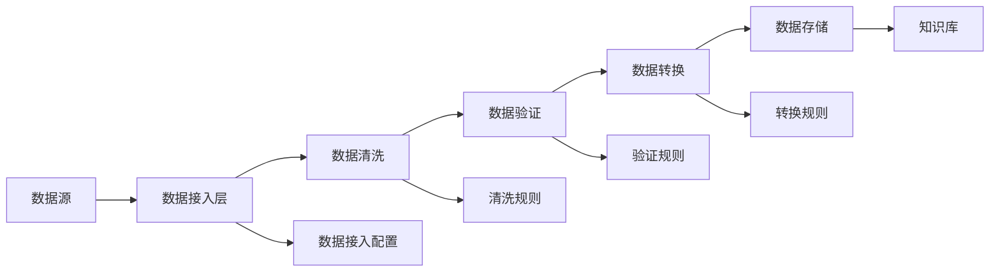

# 3. 数据与知识治理

## 3.1 私有数据接入

### 数据源类型

智能农业解决方案需要接入多种类型的农业数据源：

#### IoT传感器数据

**1. 土壤传感器数据**
- **数据来源**：农田部署的土壤传感器
- **数据格式**：时序数据（JSON、CSV）
- **更新频率**：实时更新（每5-30分钟）
- **数据量**：每个传感器每天产生288-2880条数据
- **关键字段**：传感器ID、时间戳、土壤湿度、土壤温度、pH值、EC值、氮磷钾含量

**2. 气象传感器数据**
- **数据来源**：农田部署的气象站
- **数据格式**：时序数据
- **更新频率**：实时更新（每5-30分钟）
- **数据量**：每个气象站每天产生288-2880条数据
- **关键字段**：气象站ID、时间戳、温度、湿度、风速、风向、降雨量、光照强度

**3. 作物生长监测数据**
- **数据来源**：多光谱相机、无人机、卫星
- **数据格式**：图像数据（JPG、PNG、TIFF）+ 元数据（JSON）
- **更新频率**：每日更新（无人机）或每周更新（卫星）
- **数据量**：每个农田每次采集产生10-100MB图像数据
- **关键字段**：农田ID、采集时间、图像文件路径、NDVI值、作物高度、叶面积指数

#### 病虫害数据

**4. 病虫害图像库**
- **数据来源**：农户拍摄、农技人员采集、公开数据集
- **数据格式**：图像数据（JPG、PNG）+ 标注数据（JSON）
- **更新频率**：按需更新
- **数据量**：超过10万张病虫害图像
- **关键字段**：图像ID、病虫害类型、严重程度、作物类型、拍摄时间、地理位置

**5. 病虫害知识库**
- **数据来源**：农业专家、农业科研院所、农业部门
- **数据格式**：结构化文本（JSON、XML）
- **更新频率**：按需更新
- **数据量**：超过5000种病虫害信息
- **关键字段**：病虫害名称、分类、症状描述、发生规律、防治方法、用药方案

#### 农业知识数据

**6. 作物知识库**
- **数据来源**：农业科研院所、农业部门、农业专家
- **数据格式**：结构化文本
- **更新频率**：按需更新
- **数据量**：超过1000种作物信息
- **关键字段**：作物名称、品种、生长周期、适宜环境、栽培技术、收获标准

**7. 农业标准库**
- **数据来源**：国家标准、行业标准、地方标准
- **数据格式**：结构化文本
- **更新频率**：实时更新（标准发布后24小时内）
- **数据量**：超过5000条农业标准
- **关键字段**：标准名称、标准号、发布机构、生效日期、适用范围、标准内容

#### 企业私有数据

**8. 农田基础信息库**
- **数据来源**：企业内部农田管理系统
- **数据格式**：结构化数据（JSON、数据库）
- **更新频率**：实时同步
- **数据量**：根据企业规模，从数百到数万块农田
- **关键字段**：农田ID、农田位置、面积、作物类型、种植时间、历史产量

**9. 生产管理记录库**
- **数据来源**：企业内部生产管理系统
- **数据格式**：结构化数据、文档
- **更新频率**：实时同步
- **数据量**：根据企业规模，从数千到数十万条记录
- **关键字段**：记录ID、农田ID、操作类型、操作时间、操作人员、操作内容、效果评估

### 数据接入流程

#### 数据接入步骤

**步骤1：数据源识别和评估**
- 识别数据源类型和格式
- 评估数据质量和完整性
- 确定数据接入方式（API、文件导入、数据库同步、IoT设备接入等）

**步骤2：数据接入配置**
- 配置数据源连接信息（API密钥、数据库连接、IoT设备配置等）
- 设置数据同步频率和策略
- 配置数据过滤和清洗规则

**步骤3：数据接入测试**
- 在测试环境测试数据接入
- 验证数据格式和内容
- 检查数据质量

**步骤4：数据接入上线**
- 在生产环境配置数据接入
- 启动数据同步任务
- 监控数据接入状态

**步骤5：数据质量监控**
- 监控数据更新频率
- 检查数据质量指标
- 及时发现和处理数据问题

#### 数据接入架构

### 数据质量保证

#### 数据质量指标

**完整性**：
- 数据字段完整率≥95%
- 关键字段缺失率&lt;1%
- 数据记录完整率≥98%

**准确性**：
- 数据准确率≥99%
- 传感器数据准确率≥95%
- 图像标注准确率≥98%

**及时性**：
- IoT传感器数据更新延迟&lt;5分钟
- 图像数据更新延迟&lt;24小时
- 企业数据同步延迟&lt;1小时

**一致性**：
- 数据格式一致性100%
- 数据编码一致性100%
- 数据命名一致性≥95%

#### 数据质量保证措施

**数据清洗**：
- 去除重复数据
- 修正错误数据（异常值处理、缺失值填充）
- 补充缺失数据
- 标准化数据格式

**数据验证**：
- 格式验证：验证数据格式是否符合规范
- 内容验证：验证数据内容是否合理（范围检查、逻辑检查）
- 关联验证：验证数据关联关系是否正确

**数据监控**：
- 实时监控数据质量指标
- 及时发现数据质量问题
- 自动告警数据异常

**数据修复**：
- 自动修复常见数据问题
- 人工审核和修复复杂问题
- 记录数据修复历史

## 3.2 向量知识库

### 知识库构建

#### 农业知识库结构

智能农业解决方案构建多层次的向量知识库：

**1. 病虫害知识库**
- **内容**：病虫害图像、症状描述、防治方法、用药方案
- **向量化粒度**：按病虫害类型和症状级别向量化
- **索引结构**：病虫害类型、作物类型、发生季节、严重程度
- **向量维度**：768维（基于BERT）或1536维（基于OpenAI Embedding）

**2. 作物知识库**
- **内容**：作物信息、栽培技术、生长规律、收获标准
- **向量化粒度**：按作物类型和知识单元级别向量化
- **索引结构**：作物类型、品种、生长阶段、知识类型
- **向量维度**：768维或1536维

**3. 农业标准知识库**
- **内容**：农业标准、技术规范、操作规程
- **向量化粒度**：按标准条款级别向量化
- **索引结构**：标准类型、适用范围、标准号
- **向量维度**：768维或1536维

**4. 农业经验知识库**
- **内容**：农业专家经验、农户实践经验、案例分析
- **向量化粒度**：按经验单元级别向量化
- **索引结构**：经验类型、适用场景、作物类型
- **向量维度**：768维或1536维

#### 知识库构建流程

**步骤1：数据收集和预处理**
- 收集农业数据源
- 数据清洗和格式化
- 数据分类和标注

**步骤2：文本分块**
- 按照语义单元分块（病虫害描述、栽培技术、标准条款等）
- 设置合理的块大小（通常256-512 tokens）
- 保留上下文信息

**步骤3：向量化**
- 使用农业领域微调的Embedding模型
- 生成文本向量
- 存储向量和元数据

**步骤4：索引构建**
- 构建向量索引（使用Milvus、Qdrant等）
- 构建元数据索引（使用Elasticsearch等）
- 优化索引性能

**步骤5：质量验证**
- 验证向量质量
- 测试检索效果
- 优化检索策略

### 向量化策略

#### Embedding模型选择

**1. 通用Embedding模型**
- **OpenAI text-embedding-ada-002**：1536维，通用性强
- **OpenAI text-embedding-3-large**：3072维，性能更好
- **优势**：通用性好，易于使用
- **劣势**：对农业领域理解可能不够深入

**2. 农业领域微调模型**
- **基于BERT的农业领域微调模型**：768维
- **基于RoBERTa的农业领域微调模型**：768维
- **优势**：对农业领域理解深入，检索准确率高
- **劣势**：需要训练和维护

**3. 多模型融合**
- 结合通用模型和农业领域模型
- 使用加权平均或学习融合策略
- 提升检索准确率和召回率

#### 向量化优化策略

**1. 文本预处理**
- 去除无关字符和格式
- 标准化农业术语
- 保留关键信息（病虫害名称、作物类型等）

**2. 分块策略**
- **固定长度分块**：按固定token数分块，简单高效
- **语义分块**：按语义单元分块，保留完整语义
- **重叠分块**：相邻块之间重叠，避免边界信息丢失

**3. 元数据增强**
- 添加病虫害类型、作物类型、发生季节等元数据
- 使用元数据进行过滤和排序
- 提升检索准确率

### 检索优化

#### 检索策略

**1. 混合检索（Hybrid Search）**
- **向量检索**：基于语义相似度检索
- **关键词检索**：基于BM25等传统检索方法
- **融合策略**：使用RRF（Reciprocal Rank Fusion）等方法融合结果

**2. 多阶段检索**
- **第一阶段**：粗检索，使用向量检索获取候选结果
- **第二阶段**：精检索，使用重排序模型对候选结果排序
- **优势**：平衡检索速度和准确率

**3. 查询扩展**
- **同义词扩展**：扩展农业术语的同义词
- **相关概念扩展**：扩展相关农业概念
- **提升召回率**

#### 检索优化技术

**1. 重排序（Reranking）**
- 使用Cross-Encoder模型对检索结果重排序
- 提升Top-K结果的准确率
- 常用模型：BGE-Reranker、Cohere Rerank

**2. 查询理解**
- 理解用户查询意图
- 提取关键农业要素
- 优化查询向量

**3. 结果过滤**
- 基于元数据过滤（病虫害类型、作物类型、季节等）
- 基于置信度过滤
- 提升结果相关性

#### 检索性能优化

**1. 索引优化**
- 使用HNSW索引算法（Milvus）
- 优化索引参数（M、ef_construction等）
- 定期重建索引

**2. 缓存策略**
- 缓存热门查询结果
- 缓存向量计算结果
- 提升响应速度

**3. 并行检索**
- 并行检索多个知识库
- 并行计算多个查询
- 提升检索速度

## 3.3 数据版本与血缘

### 版本管理

#### 农业数据版本管理

农业数据具有时效性和季节性，需要严格的版本管理：

**1. 传感器数据版本管理**
- **版本标识**：使用数据采集时间戳和批次号
- **版本历史**：记录数据的采集和更新历史
- **版本查询**：支持按时间点查询特定版本的数据

**2. 图像数据版本管理**
- **版本标识**：使用图像ID和时间戳
- **版本历史**：记录图像的采集和标注历史
- **版本关联**：关联同一农田的不同时间点的图像

**3. 知识库版本管理**
- **版本标识**：使用知识库ID和版本号
- **版本历史**：记录知识库的更新历史
- **版本对比**：支持不同版本知识库的对比

#### 版本管理策略

**1. 时间点版本**
- 为每个数据版本记录时间点
- 支持按时间点查询历史版本
- 适用于传感器数据、图像数据等有时间属性的数据

**2. 语义版本**
- 使用语义版本号（如1.0.0、1.1.0等）
- 主版本号：重大修订
- 次版本号：功能增加
- 修订版本号：错误修复

**3. 快照版本**
- 定期创建数据快照
- 支持快速回滚到历史快照
- 适用于大规模数据版本管理

### 血缘追踪

#### 数据血缘关系

农业数据之间存在复杂的血缘关系：

**1. 传感器数据血缘关系**
- **采集关系**：传感器与数据采集的关系
- **处理关系**：原始数据与处理后数据的关系
- **关联关系**：不同传感器数据之间的关联关系

**2. 图像数据血缘关系**
- **采集关系**：图像采集设备与图像的关系
- **处理关系**：原始图像与处理后图像的关系
- **标注关系**：图像与标注数据的关系

**3. 知识库血缘关系**
- **来源关系**：知识库与数据源的关系
- **更新关系**：知识库版本之间的更新关系
- **引用关系**：知识库之间的引用关系

#### 血缘追踪实现

**1. 血缘图构建**
- 使用图数据库（Neo4j）存储血缘关系
- 构建血缘关系图
- 支持血缘关系查询和可视化

**2. 血缘追踪查询**
- 查询数据的上游来源
- 查询数据的下游影响
- 查询数据的完整血缘链

**3. 血缘影响分析**
- 分析数据变更的影响范围
- 识别受影响的数据和系统
- 支持影响分析报告生成

### 数据治理流程

#### 数据治理组织

**1. 数据治理委员会**
- 制定数据治理政策和标准
- 审批数据治理重大决策
- 监督数据治理执行

**2. 数据管理团队**
- 负责数据质量管理
- 负责数据版本管理
- 负责数据血缘管理

**3. 数据使用团队**
- 负责数据使用规范
- 负责数据质量反馈
- 负责数据需求提出

#### 数据治理流程

**1. 数据接入流程**
- 数据源评估 → 数据接入申请 → 数据接入审批 → 数据接入实施 → 数据质量验证

**2. 数据更新流程**
- 数据更新申请 → 数据更新审批 → 数据更新实施 → 数据质量验证 → 版本发布

**3. 数据质量监控流程**
- 数据质量监控 → 质量问题发现 → 问题分析 → 问题修复 → 质量验证

**4. 数据版本管理流程**
- 版本创建申请 → 版本审批 → 版本创建 → 版本发布 → 版本归档

#### 数据治理工具

**1. 数据质量监控工具**
- 实时监控数据质量指标
- 自动发现数据质量问题
- 生成数据质量报告

**2. 数据版本管理工具**
- 管理数据版本
- 支持版本对比和回滚
- 生成版本变更报告

**3. 数据血缘追踪工具**
- 可视化数据血缘关系
- 支持血缘查询和分析
- 生成血缘影响分析报告

