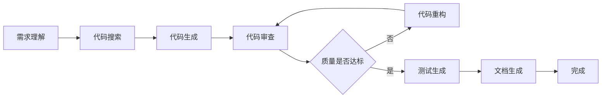
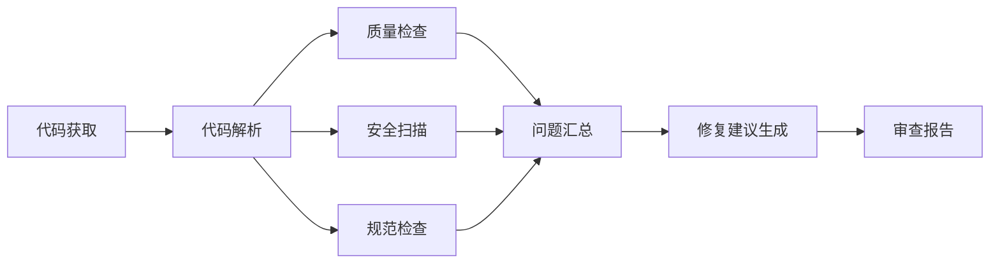
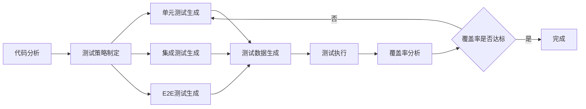
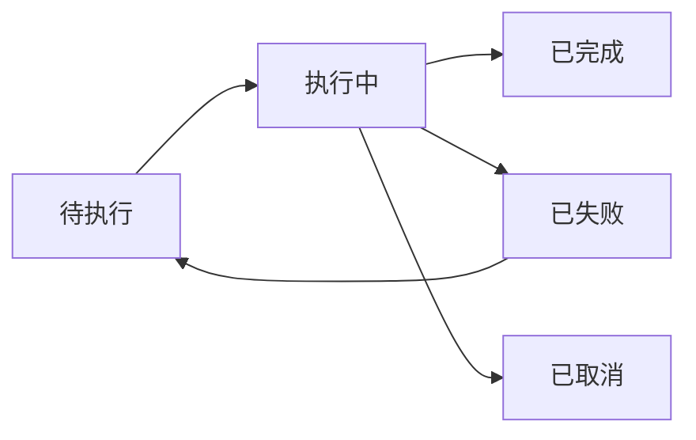

# 5. 智能体与业务编排

## 5.1 Agent技能链

### 技能定义

智能代码生成系统中的Agent具备多种技能，通过技能链组合完成复杂任务。

#### 代码理解技能
- **代码解析**：解析代码结构，理解代码逻辑
- **代码分析**：分析代码复杂度、依赖关系等
- **代码解释**：解释代码功能和实现逻辑
- **代码搜索**：在代码库中搜索相关代码

#### 代码生成技能
- **代码补全**：基于上下文补全代码
- **代码生成**：根据需求生成完整代码
- **代码重构**：重构代码，提升代码质量
- **代码转换**：转换代码语言或框架

#### 代码审查技能
- **质量检查**：检查代码质量，识别问题
- **安全扫描**：扫描安全漏洞
- **规范检查**：检查代码是否符合规范
- **性能分析**：分析代码性能问题

#### 测试生成技能
- **单元测试生成**：生成单元测试用例
- **集成测试生成**：生成集成测试用例
- **E2E测试生成**：生成端到端测试用例
- **测试数据生成**：生成测试数据

#### 文档生成技能
- **代码注释生成**：生成代码注释
- **API文档生成**：生成API文档
- **README生成**：生成项目README
- **技术文档生成**：生成技术文档

### 技能链设计

技能链是将多个技能组合起来完成复杂任务的机制。

#### 代码生成技能链


**流程说明**：
1. **需求理解**：理解用户需求，提取关键信息
2. **代码搜索**：在代码库中搜索相关代码和示例
3. **代码生成**：基于需求和示例生成代码
4. **代码审查**：审查生成的代码质量
5. **代码重构**：如果质量不达标，重构代码
6. **测试生成**：生成测试用例
7. **文档生成**：生成代码文档

#### 代码审查技能链


**流程说明**：
1. **代码获取**：获取待审查的代码
2. **代码解析**：解析代码结构
3. **并行检查**：并行进行质量检查、安全扫描、规范检查
4. **问题汇总**：汇总发现的问题
5. **修复建议生成**：生成修复建议
6. **审查报告**：生成审查报告

#### 测试生成技能链


**流程说明**：
1. **代码分析**：分析代码结构和逻辑
2. **测试策略制定**：制定测试策略
3. **并行生成**：并行生成单元测试、集成测试、E2E测试
4. **测试数据生成**：生成测试数据
5. **测试执行**：执行测试用例
6. **覆盖率分析**：分析测试覆盖率
7. **补充测试**：如果覆盖率不足，补充测试用例

### 执行流程

#### 任务分解
复杂任务需要分解为多个子任务，每个子任务由相应的技能处理。

**分解策略**：
- **按功能分解**：按功能模块分解任务
- **按步骤分解**：按执行步骤分解任务
- **按依赖分解**：按依赖关系分解任务

#### 任务调度
任务调度器负责调度技能执行任务。

**调度策略**：
- **顺序执行**：按顺序执行任务
- **并行执行**：并行执行独立任务
- **条件执行**：根据条件决定是否执行任务
- **循环执行**：循环执行直到满足条件

#### 结果聚合
多个技能的执行结果需要聚合为最终结果。

**聚合策略**：
- **结果合并**：合并多个结果
- **结果选择**：选择最优结果
- **结果融合**：融合多个结果

## 5.2 工具注册中心

### 工具类型

#### 代码分析工具
- **AST解析器**：Tree-sitter、ANTLR等，解析代码结构
- **静态分析工具**：SonarQube、CodeClimate等，分析代码质量
- **依赖分析工具**：分析代码依赖关系
- **复杂度分析工具**：分析代码复杂度

#### 代码生成工具
- **代码模板引擎**：Jinja2、Mustache等，生成代码模板
- **代码生成器**：根据配置生成代码
- **代码转换工具**：转换代码格式或语言

#### 测试工具
- **测试框架**：pytest、JUnit、Jest等，执行测试
- **测试覆盖率工具**：Coverage.py、JaCoCo等，分析测试覆盖率
- **Mock工具**：Mockito、unittest.mock等，创建Mock对象

#### 代码审查工具
- **代码审查平台**：GitHub Pull Requests、GitLab Merge Requests等
- **代码审查工具**：Review Board、Phabricator等
- **自动化审查工具**：自动化代码审查工具

#### 文档工具
- **文档生成工具**：Sphinx、JSDoc等，生成API文档
- **Markdown工具**：处理Markdown文档
- **图表生成工具**：生成代码流程图、架构图等

### 工具注册流程

#### 1. 工具开发
开发符合规范的Agent工具。

**工具规范**：
- **接口规范**：统一的工具接口规范
- **输入输出**：定义清晰的输入输出格式
- **错误处理**：统一的错误处理机制
- **日志记录**：完整的日志记录

#### 2. 工具注册
将工具注册到工具注册中心。

**注册信息**：
- **工具名称**：工具的唯一标识
- **工具描述**：工具的功能描述
- **工具类型**：工具的类型分类
- **输入输出**：输入输出格式定义
- **工具配置**：工具的配置参数

**注册示例**：
```yaml
# 工具注册示例
tools:
  - name: "code_analyzer"
    type: "code_analysis"
    description: "代码质量分析工具"
    input:
      - name: "code"
        type: "string"
        required: true
    output:
      - name: "quality_score"
        type: "float"
      - name: "issues"
        type: "array"
    config:
      - name: "language"
        type: "string"
        default: "python"
```

#### 3. 工具验证
验证工具是否符合规范。

**验证内容**：
- **接口验证**：验证接口是否符合规范
- **功能验证**：验证功能是否正常
- **性能验证**：验证性能是否满足要求
- **安全验证**：验证安全性

#### 4. 工具发布
发布工具到生产环境。

**发布流程**：
1. **版本管理**：管理工具版本
2. **部署**：部署工具到生产环境
3. **监控**：监控工具运行状态
4. **文档**：更新工具文档

### 工具调用机制

#### 工具发现
Agent需要发现可用的工具。

**发现机制**：
- **注册中心查询**：从工具注册中心查询工具
- **工具推荐**：根据任务推荐合适的工具
- **工具匹配**：匹配任务和工具

#### 工具调用
Agent调用工具执行任务。

**调用流程**：
1. **工具选择**：选择合适的工具
2. **参数准备**：准备工具输入参数
3. **工具调用**：调用工具执行任务
4. **结果处理**：处理工具返回结果
5. **错误处理**：处理工具调用错误

#### 工具编排
多个工具可以编排成工具链。

**编排方式**：
- **顺序编排**：按顺序调用工具
- **并行编排**：并行调用工具
- **条件编排**：根据条件调用工具
- **循环编排**：循环调用工具

#### 工具调用示例
```python
# 工具调用示例
from agent_tools import ToolRegistry

# 获取工具
tool_registry = ToolRegistry()
code_analyzer = tool_registry.get_tool("code_analyzer")

# 调用工具
result = code_analyzer.call({
    "code": "def hello(): print('Hello')",
    "language": "python"
})

# 处理结果
quality_score = result["quality_score"]
issues = result["issues"]
```

## 5.3 长记忆与状态管理

### 记忆机制

#### 短期记忆
短期记忆存储当前对话或任务的上下文信息。

**存储内容**：
- **对话历史**：用户和Agent的对话历史
- **任务上下文**：当前任务的上下文信息
- **代码上下文**：当前编辑的代码上下文

**存储方式**：
- **内存存储**：存储在内存中，速度快但容量有限
- **Redis存储**：存储在Redis中，速度快容量大
- **数据库存储**：存储在数据库中，持久化但速度较慢

#### 长期记忆
长期记忆存储历史任务和知识。

**存储内容**：
- **历史任务**：历史任务的执行记录
- **代码模式**：常见的代码模式和最佳实践
- **用户偏好**：用户的编码偏好和习惯
- **项目知识**：项目的特定知识和规范

**存储方式**：
- **向量数据库**：使用向量数据库存储，支持语义检索
- **关系数据库**：使用关系数据库存储结构化数据
- **知识图谱**：使用知识图谱存储知识关系

#### 记忆检索
从记忆中检索相关信息。

**检索方式**：
- **关键词检索**：基于关键词检索
- **语义检索**：基于语义相似度检索
- **时间检索**：基于时间范围检索
- **关联检索**：基于关联关系检索

### 状态管理

#### 任务状态
管理任务的执行状态。

**状态类型**：
- **待执行**：任务等待执行
- **执行中**：任务正在执行
- **已完成**：任务执行完成
- **已失败**：任务执行失败
- **已取消**：任务已取消

**状态转换**：


#### 会话状态
管理用户会话状态。

**状态内容**：
- **用户信息**：用户身份信息
- **项目信息**：当前项目信息
- **代码上下文**：当前代码上下文
- **历史记录**：历史操作记录

#### 状态持久化
状态需要持久化存储，支持恢复。

**持久化方式**：
- **数据库存储**：存储在数据库中
- **文件存储**：存储在文件中
- **分布式存储**：存储在分布式存储系统中

### 上下文维护

#### 上下文收集
收集任务执行所需的上下文信息。

**上下文来源**：
- **代码仓库**：从代码仓库获取代码和文档
- **项目配置**：从项目配置文件获取配置信息
- **历史记录**：从历史记录获取相关信息
- **用户输入**：从用户输入获取需求信息

#### 上下文管理
管理上下文信息的生命周期。

**管理策略**：
- **上下文缓存**：缓存常用上下文信息
- **上下文更新**：及时更新上下文信息
- **上下文清理**：清理过期的上下文信息
- **上下文压缩**：压缩上下文信息，减少存储空间

#### 上下文传递
在不同技能和工具之间传递上下文信息。

**传递方式**：
- **参数传递**：通过参数传递上下文
- **共享存储**：通过共享存储传递上下文
- **消息队列**：通过消息队列传递上下文

#### 上下文维护示例
```python
# 上下文维护示例
class ContextManager:
    def __init__(self):
        self.context = {}
        self.memory = LongTermMemory()
        
    def collect_context(self, task):
        # 收集代码上下文
        code_context = self.get_code_context(task.project_id)
        
        # 收集历史记录
        history = self.memory.search(task.user_id, task.project_id)
        
        # 收集项目配置
        config = self.get_project_config(task.project_id)
        
        # 合并上下文
        self.context = {
            "code": code_context,
            "history": history,
            "config": config
        }
        
    def update_context(self, new_info):
        # 更新上下文
        self.context.update(new_info)
        
    def get_context(self):
        # 获取上下文
        return self.context
```
