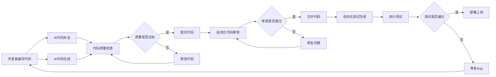
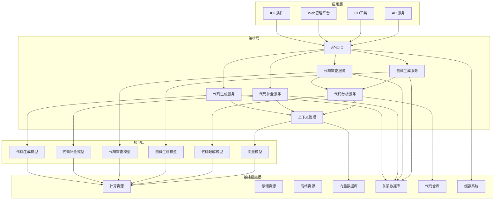
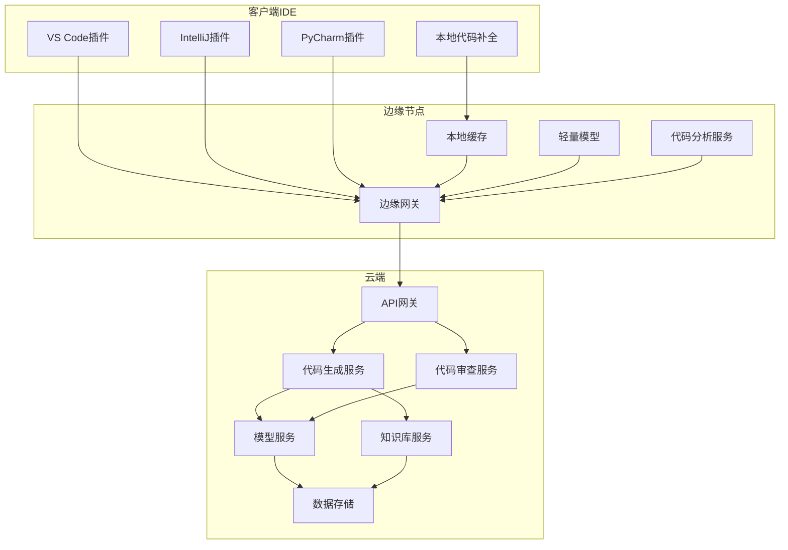

# 2. 总体架构

## 2.1 业务架构

### 角色定义

#### 开发者（Developer）
- **职责**：使用AI代码生成工具进行日常开发工作，包括代码编写、代码审查、测试编写等
- **权限**：代码生成、代码补全、代码审查、测试生成、查看历史记录
- **典型场景**：编写新功能、修复bug、代码重构、编写测试用例

#### 代码审查员（Code Reviewer）
- **职责**：审查AI生成的代码和开发者编写的代码，确保代码质量和规范性
- **权限**：代码审查、质量评估、问题标记、审批合并
- **典型场景**：代码审查、质量检查、规范检查、安全审查

#### 项目管理员（Project Manager）
- **职责**：管理项目配置、代码规范、质量阈值，监控项目进度和质量
- **权限**：项目配置、规范管理、质量监控、数据分析、团队管理
- **典型场景**：项目配置、规范制定、质量监控、团队管理

#### 系统管理员（System Admin）
- **职责**：系统运维、性能监控、安全管理、数据备份
- **权限**：系统配置、用户管理、安全审计、数据管理、模型管理
- **典型场景**：系统部署、性能优化、安全加固、故障处理

#### 质量保证工程师（QA Engineer）
- **职责**：使用AI测试生成工具编写测试用例，执行测试，分析测试结果
- **权限**：测试生成、测试执行、测试报告、缺陷管理
- **典型场景**：测试用例生成、测试执行、缺陷分析、测试报告

### 用例分析

#### 用例1：AI代码生成
- **参与者**：开发者、AI代码生成系统
- **前置条件**：开发者已登录系统，项目代码库已连接，代码规范已配置
- **主流程**：
  1. 开发者输入自然语言描述或代码注释
  2. 系统分析上下文和代码风格
  3. 系统调用大语言模型生成代码
  4. 系统进行代码质量检查和安全扫描
  5. 系统返回生成的代码和建议
  6. 开发者审查并接受或修改代码
- **后置条件**：代码保存到本地，生成记录保存
- **扩展流程**：如果代码质量不达标，系统提示修改建议；如果安全扫描发现问题，系统阻止使用

#### 用例2：智能代码补全
- **参与者**：开发者、代码补全系统
- **前置条件**：开发者在IDE中编写代码，代码补全服务已启动
- **主流程**：
  1. 开发者输入代码，触发补全请求
  2. 系统分析当前代码上下文
  3. 系统调用代码补全模型生成补全建议
  4. 系统返回多个补全选项
  5. 开发者选择接受的补全
- **后置条件**：补全代码插入到编辑器中，补全记录保存
- **扩展流程**：如果补全质量不高，开发者可以拒绝并继续输入

#### 用例3：自动化代码审查
- **参与者**：代码审查员、代码审查系统
- **前置条件**：代码已提交到代码仓库，代码审查已触发
- **主流程**：
  1. 系统获取代码变更
  2. 系统进行代码质量检查、安全扫描、规范检查
  3. 系统调用AI模型进行深度分析
  4. 系统生成审查报告和建议
  5. 代码审查员查看报告
  6. 代码审查员标记问题和审批
- **后置条件**：审查报告保存，问题记录到缺陷管理系统
- **扩展流程**：如果发现严重问题，系统自动阻止合并；如果问题已修复，系统重新审查

#### 用例4：自动化测试生成
- **参与者**：质量保证工程师、测试生成系统
- **前置条件**：代码已编写完成，测试生成服务已配置
- **主流程**：
  1. 质量保证工程师选择要测试的代码
  2. 系统分析代码结构和逻辑
  3. 系统调用测试生成模型生成测试用例
  4. 系统生成单元测试、集成测试、E2E测试
  5. 质量保证工程师审查和修改测试用例
  6. 系统执行测试并生成报告
- **后置条件**：测试用例保存到测试仓库，测试报告保存
- **扩展流程**：如果测试覆盖率不足，系统提示补充测试用例

### 故事地图

## 2.2 技术架构

### AI-Native四层架构

智能代码生成系统采用AI-Native四层架构，从下到上依次为基础设施层、模型层、编排层和应用层。

#### 应用层

应用层提供多种接入方式，满足不同开发场景的需求：

- **IDE插件**：支持VS Code、IntelliJ IDEA、PyCharm等主流IDE，提供代码补全、代码生成、代码审查等功能，无缝融入开发流程

- **Web管理平台**：基于Vue 3 + TypeScript开发，提供项目管理、代码审查、质量监控、数据分析等功能

- **CLI工具**：命令行工具，支持批量代码生成、代码审查、测试生成等操作，适合CI/CD集成

- **API服务**：RESTful API和GraphQL API，支持第三方系统集成，如GitHub Actions、GitLab CI等

**技术栈**：
- IDE插件：TypeScript、Language Server Protocol (LSP)
- Web前端：Vue 3、React 18、TypeScript
- CLI工具：Python、Node.js
- API服务：FastAPI、GraphQL

#### 编排层

编排层是系统的核心，负责业务流程编排和AI能力调用：

- **API网关**：统一入口，负责路由、限流、认证、日志等，支持多种协议（HTTP、WebSocket、gRPC）

- **代码生成服务**：基于大语言模型，根据自然语言描述或代码注释生成代码，支持多种编程语言

- **代码补全服务**：实时代码补全，基于上下文分析，提供智能补全建议

- **代码审查服务**：自动化代码审查，检查代码质量、安全性、规范性，生成审查报告

- **测试生成服务**：根据代码自动生成测试用例，支持单元测试、集成测试、E2E测试

- **代码分析服务**：代码结构分析、依赖分析、复杂度分析等，为代码生成和审查提供支持

- **上下文管理**：管理代码上下文、项目信息、代码风格等，为AI模型提供准确的上下文

**技术栈**：
- 框架：FastAPI（Python）、Spring Boot（Java）
- 消息队列：RabbitMQ、Kafka
- 工作流引擎：n8n、LangChain、MCP
- 缓存：Redis、Memcached
- 代码分析：Tree-sitter、AST解析器

#### 模型层

模型层提供各种AI能力：

- **代码生成模型**：支持GPT-4、Claude、CodeLlama、StarCoder等，根据任务选择最优模型

- **代码补全模型**：支持Codex、TabNine、GitHub Copilot等，提供实时补全

- **代码审查模型**：专门训练的代码审查模型，识别代码问题、安全漏洞、性能问题

- **测试生成模型**：专门训练的测试生成模型，生成高质量的测试用例

- **代码理解模型**：代码理解、代码解释、代码文档生成等

- **向量模型**：支持text-embedding-ada-002、code-embedding等，用于代码语义检索

**技术栈**：
- 模型服务：OpenAI API、Azure OpenAI、本地部署模型（Ollama、vLLM）
- 向量化：sentence-transformers、code-embeddings
- 模型管理：ModelScope、Hugging Face、MCP Server

#### 基础设施层

基础设施层提供计算、存储、网络等基础资源：

- **计算资源**：Kubernetes集群，支持弹性伸缩，GPU节点用于模型推理，CPU节点用于代码分析

- **存储资源**：对象存储（OSS/S3）存储代码、文档、模型等，块存储用于数据库

- **网络资源**：CDN加速、负载均衡、专线连接，支持GitHub、GitLab等代码仓库访问

- **向量数据库**：Milvus、Qdrant、Pinecone，存储代码向量，支持语义检索

- **关系数据库**：MySQL 8.0、PostgreSQL，存储项目信息、用户数据、审查记录等

- **代码仓库**：集成GitHub、GitLab、Bitbucket等，支持代码读取和提交

- **缓存系统**：Redis集群，提供高性能缓存服务，缓存代码上下文、模型结果等

**技术栈**：
- 容器编排：Kubernetes、Docker
- 服务网格：Istio
- 监控：Prometheus、Grafana
- 日志：ELK Stack（Elasticsearch、Logstash、Kibana）
- 代码仓库集成：GitHub API、GitLab API

### 技术栈

#### 前端技术
- **Vue 3 + TypeScript**：现代化前端框架，类型安全，开发效率高
- **Vite**：快速构建工具，开发体验好
- **TailwindCSS**：实用优先的CSS框架，快速构建UI
- **Monaco Editor**：VS Code编辑器核心，提供代码编辑能力
- **Language Server Protocol**：IDE插件标准协议

#### 后端技术
- **Python 3.11 + FastAPI**：高性能异步框架，API开发效率高
- **Node.js + TypeScript**：CLI工具和部分服务使用Node.js
- **MySQL 8.0**：关系型数据库，存储结构化数据
- **Redis**：内存数据库，提供缓存和会话存储
- **RabbitMQ**：消息队列，处理异步任务

#### AI技术
- **大语言模型**：GPT-4、Claude、CodeLlama、StarCoder等
- **RAG技术**：检索增强生成，结合代码知识库提升代码生成质量
- **LangChain**：LLM应用开发框架，简化开发流程
- **MCP协议**：模型上下文协议，标准化AI能力调用
- **向量数据库**：Milvus/Qdrant，存储和检索代码向量

#### DevOps技术
- **Docker**：容器化部署
- **Kubernetes**：容器编排，支持弹性伸缩
- **GitHub Actions**：CI/CD自动化
- **Prometheus + Grafana**：监控和可视化
- **n8n**：工作流自动化，集成各种工具和服务

## 2.3 部署架构

### 云/边/端混合部署

智能代码生成系统采用云边端混合部署架构，满足不同场景的需求：

#### 云端部署
- **主要服务**：API网关、代码生成服务、代码审查服务、大模型服务、知识库服务、数据存储
- **优势**：集中管理、易于扩展、资源充足、模型更新方便
- **适用场景**：大规模代码生成、复杂代码审查、模型推理、知识库管理

#### 边缘节点部署
- **主要服务**：边缘网关、本地缓存、轻量级模型、代码分析服务
- **优势**：低延迟、减少带宽消耗、提高响应速度、保护代码隐私
- **适用场景**：代码补全、本地代码分析、离线场景、隐私敏感场景

#### 客户端IDE部署
- **主要功能**：代码编辑、本地补全、语法高亮、代码格式化
- **优势**：用户体验好、减少服务器压力、支持离线使用
- **适用场景**：日常开发、代码编写、本地调试

### 高可用设计

#### 多机房部署
- **主备模式**：主机房提供服务，备机房实时同步，主机房故障时自动切换
- **双活模式**：两个机房同时提供服务，负载均衡，任一机房故障不影响服务
- **异地容灾**：跨地域部署，应对自然灾害等极端情况

#### 服务高可用
- **无状态设计**：服务无状态，可水平扩展，任意实例故障不影响整体服务
- **健康检查**：定期健康检查，自动剔除故障实例
- **熔断降级**：服务异常时自动熔断，返回降级方案，避免雪崩效应
- **重试机制**：自动重试失败请求，提高成功率

#### 数据高可用
- **主从复制**：数据库主从复制，主库故障时自动切换到从库
- **数据备份**：定期全量备份和增量备份，支持快速恢复
- **多副本存储**：重要数据多副本存储，防止数据丢失
- **代码仓库镜像**：代码仓库多镜像，确保代码访问可用性

### 扩展性设计

#### 水平扩展
- **无状态服务**：所有服务无状态，可水平扩展
- **负载均衡**：通过负载均衡器分发请求，支持动态扩容
- **自动伸缩**：根据CPU、内存、请求量等指标自动扩容缩容
- **模型服务扩展**：模型服务支持多实例部署，通过负载均衡分发请求

#### 垂直扩展
- **资源升级**：支持CPU、内存、存储等资源升级
- **GPU加速**：AI模型推理支持GPU加速，提升性能
- **模型优化**：模型量化、蒸馏等优化技术，提升推理速度

#### 架构扩展
- **微服务架构**：服务拆分，独立部署和扩展
- **消息队列**：异步处理，削峰填谷，提升系统吞吐量
- **缓存层**：多级缓存，减少数据库压力，提升响应速度
- **CDN加速**：静态资源CDN加速，提升访问速度

#### 扩展性指标
- **并发支持**：单机支持500+并发，集群支持5万+并发
- **响应时间**：代码补全P99响应时间&lt;200ms，代码生成P99响应时间&lt;3s
- **吞吐量**：单机QPS&gt;500，集群QPS&gt;5万
- **模型推理**：单GPU支持10+并发推理，集群支持1000+并发推理
