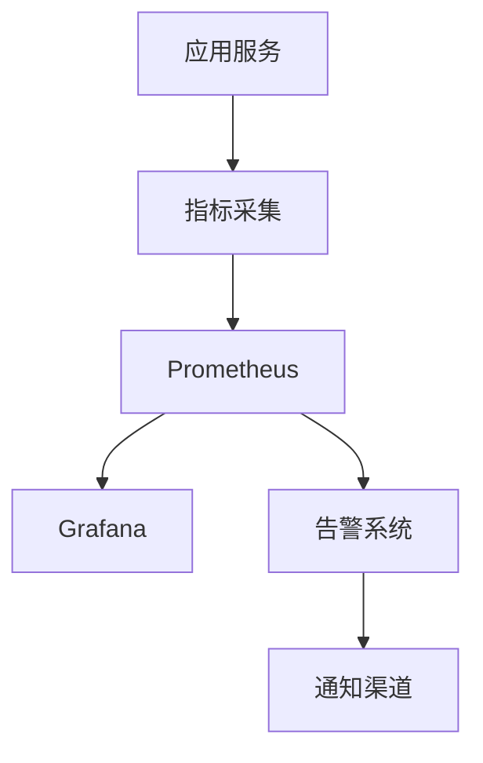
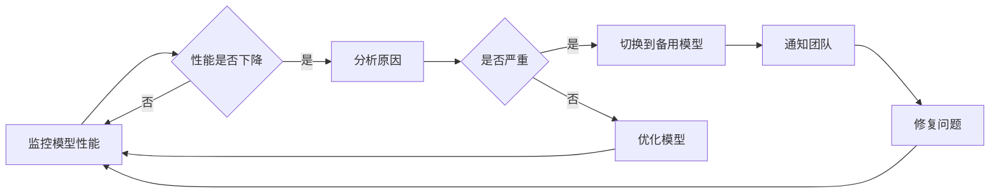

# 9. 监控与可观测

## 9.1 业务指标

### 核心业务指标

#### 代码生成指标
- **代码生成次数**：每日/每周/每月的代码生成总次数
- **代码生成成功率**：代码生成成功次数 / 总请求次数，目标≥95%
- **代码生成平均响应时间**：P50/P95/P99响应时间，目标P95&lt;3s
- **代码生成准确率**：生成代码的语法正确率，目标≥90%

#### 代码质量指标
- **平均代码质量评分**：生成代码的平均质量评分，目标≥0.85
- **代码审查问题发现率**：代码审查发现问题的比例，目标≤5%
- **代码审查问题修复率**：问题修复比例，目标≥90%
- **生产环境bug率**：生产环境bug数量，目标减少60%

#### 测试覆盖率指标
- **单元测试覆盖率**：单元测试覆盖率，目标≥75%
- **集成测试覆盖率**：集成测试覆盖率，目标≥60%
- **E2E测试覆盖率**：E2E测试覆盖率，目标≥40%
- **测试生成准确率**：测试生成准确率，目标≥80%

#### 用户使用指标
- **活跃用户数**：每日/每周/每月活跃用户数
- **用户留存率**：用户留存率，目标≥80%
- **用户满意度**：用户满意度评分，目标≥4.5/5.0
- **API调用量**：API调用总量和峰值QPS

### 指标监控

#### 监控系统架构


#### 指标采集
使用Prometheus采集指标数据。

**采集方式**：
- **应用埋点**：在应用中埋点采集业务指标
- **系统指标**：采集系统指标（CPU、内存、网络等）
- **自定义指标**：采集自定义业务指标

**指标示例**：
```python
# Prometheus指标采集示例
from prometheus_client import Counter, Histogram, Gauge

# 代码生成次数
code_generation_total = Counter(
    'code_generation_total',
    'Total number of code generations',
    ['project_id', 'language', 'status']
)

# 代码生成响应时间
code_generation_duration = Histogram(
    'code_generation_duration_seconds',
    'Code generation duration',
    ['project_id', 'language']
)

# 代码质量评分
code_quality_score = Gauge(
    'code_quality_score',
    'Average code quality score',
    ['project_id']
)

# 记录指标
code_generation_total.labels(
    project_id='proj_123',
    language='python',
    status='success'
).inc()

code_generation_duration.labels(
    project_id='proj_123',
    language='python'
).observe(1.2)

code_quality_score.labels(
    project_id='proj_123'
).set(0.92)
```

#### 指标可视化
使用Grafana可视化指标数据。

**仪表盘配置**：
- **概览仪表盘**：显示系统整体运行情况
- **业务仪表盘**：显示业务指标
- **性能仪表盘**：显示性能指标
- **成本仪表盘**：显示成本指标

### 告警机制

#### 告警规则
```yaml
# Prometheus告警规则示例
groups:
  - name: code_generation_alerts
    rules:
      - alert: HighCodeGenerationFailureRate
        expr: rate(code_generation_total{status="failed"}[5m]) > 0.1
        for: 5m
        labels:
          severity: warning
        annotations:
          summary: "代码生成失败率过高"
          description: "代码生成失败率超过10%，当前值：{{ $value }}"
      
      - alert: HighCodeGenerationLatency
        expr: histogram_quantile(0.95, code_generation_duration_seconds) > 3
        for: 5m
        labels:
          severity: warning
        annotations:
          summary: "代码生成响应时间过长"
          description: "P95响应时间超过3秒，当前值：{{ $value }}秒"
      
      - alert: LowCodeQualityScore
        expr: code_quality_score < 0.8
        for: 10m
        labels:
          severity: critical
        annotations:
          summary: "代码质量评分过低"
          description: "代码质量评分低于0.8，当前值：{{ $value }}"
```

#### 告警通知
- **通知渠道**：邮件、短信、钉钉、企业微信、Slack等
- **通知级别**：根据严重程度分级通知
- **通知聚合**：相同告警聚合，避免告警风暴
- **告警确认**：告警确认机制，避免重复通知

## 9.2 模型指标

### 模型性能指标

#### 准确率指标
- **代码生成准确率**：生成代码的语法和功能正确率
- **代码补全准确率**：代码补全的接受率
- **代码审查准确率**：代码审查问题识别准确率
- **测试生成准确率**：测试生成的功能正确率

#### 性能指标
- **响应时间**：模型推理响应时间（P50/P95/P99）
- **吞吐量**：模型推理吞吐量（QPS）
- **并发能力**：模型支持的并发数
- **资源使用**：CPU、内存、GPU使用率

#### 成本指标
- **Token消耗**：模型推理消耗的Token数量
- **推理成本**：单次推理成本
- **总成本**：模型推理总成本

### 模型监控

#### 模型性能监控
```python
# 模型性能监控示例
class ModelMonitor:
    def __init__(self):
        self.metrics = {
            "accuracy": [],
            "latency": [],
            "cost": [],
            "throughput": []
        }
    
    def record_inference(self, model_name, result, latency, cost):
        """记录模型推理结果"""
        # 记录准确率
        accuracy = self.calculate_accuracy(result)
        self.metrics["accuracy"].append({
            "model": model_name,
            "accuracy": accuracy,
            "timestamp": time.time()
        })
        
        # 记录延迟
        self.metrics["latency"].append({
            "model": model_name,
            "latency": latency,
            "timestamp": time.time()
        })
        
        # 记录成本
        self.metrics["cost"].append({
            "model": model_name,
            "cost": cost,
            "timestamp": time.time()
        })
    
    def get_model_performance(self, model_name):
        """获取模型性能指标"""
        return {
            "avg_accuracy": np.mean([
                m["accuracy"] for m in self.metrics["accuracy"]
                if m["model"] == model_name
            ]),
            "avg_latency": np.mean([
                m["latency"] for m in self.metrics["latency"]
                if m["model"] == model_name
            ]),
            "total_cost": sum([
                m["cost"] for m in self.metrics["cost"]
                if m["model"] == model_name
            ])
        }
```

### 模型退化检测

#### 退化检测方法
- **准确率趋势**：监控准确率趋势，发现下降趋势
- **A/B测试对比**：新模型与旧模型对比
- **用户反馈**：收集用户反馈，发现模型问题
- **异常检测**：使用异常检测算法发现异常

#### 退化处理流程


#### 退化告警
- **准确率下降告警**：准确率下降超过阈值时告警
- **响应时间增加告警**：响应时间增加超过阈值时告警
- **成本异常告警**：成本异常增加时告警

## 9.3 链路追踪

### 追踪系统

#### 分布式追踪
使用OpenTelemetry、Jaeger等工具进行分布式追踪。

**追踪内容**：
- **请求链路**：完整的请求处理链路
- **服务调用**：服务之间的调用关系
- **数据库查询**：数据库查询耗时
- **外部API调用**：外部API调用耗时
- **模型推理**：模型推理耗时

#### 追踪配置
```python
# OpenTelemetry追踪配置示例
from opentelemetry import trace
from opentelemetry.sdk.trace import TracerProvider
from opentelemetry.sdk.trace.export import BatchSpanProcessor
from opentelemetry.exporter.jaeger import JaegerExporter

# 设置追踪提供者
trace.set_tracer_provider(TracerProvider())

# 配置Jaeger导出器
jaeger_exporter = JaegerExporter(
    agent_host_name="localhost",
    agent_port=6831,
)

# 添加批处理处理器
trace.get_tracer_provider().add_span_processor(
    BatchSpanProcessor(jaeger_exporter)
)

# 使用追踪
tracer = trace.get_tracer(__name__)

def generate_code(requirement):
    with tracer.start_as_current_span("generate_code") as span:
        span.set_attribute("requirement", requirement)
        
        # 代码生成逻辑
        with tracer.start_as_current_span("model_inference"):
            result = model.generate(requirement)
        
        span.set_attribute("code_length", len(result.code))
        span.set_attribute("quality_score", result.quality_score)
        
        return result
```

### 日志管理

#### 日志级别
- **DEBUG**：调试信息，详细日志
- **INFO**：一般信息，正常操作日志
- **WARNING**：警告信息，潜在问题
- **ERROR**：错误信息，错误但不影响系统运行
- **CRITICAL**：严重错误，影响系统运行

#### 日志格式
```json
{
  "timestamp": "2024-01-01T12:00:00Z",
  "level": "INFO",
  "service": "code-generation",
  "trace_id": "abc123",
  "span_id": "def456",
  "message": "Code generation completed",
  "context": {
    "project_id": "proj_123",
    "language": "python",
    "duration": 1.2,
    "quality_score": 0.92
  }
}
```

#### 日志收集
使用ELK Stack（Elasticsearch、Logstash、Kibana）收集和管理日志。

**日志流程**：
1. **应用日志**：应用输出日志
2. **日志收集**：Filebeat收集日志
3. **日志处理**：Logstash处理日志
4. **日志存储**：Elasticsearch存储日志
5. **日志查询**：Kibana查询和可视化日志

### 问题定位

#### 问题定位流程
1. **告警触发**：监控告警触发
2. **日志查询**：查询相关日志
3. **链路追踪**：查看请求链路
4. **指标分析**：分析相关指标
5. **根因分析**：分析问题根因
6. **问题修复**：修复问题

#### 问题定位工具
- **日志查询工具**：Kibana、Grafana Loki等
- **链路追踪工具**：Jaeger、Zipkin等
- **指标分析工具**：Grafana、Prometheus等
- **APM工具**：New Relic、Datadog等

#### 问题定位示例
```python
# 问题定位示例
def diagnose_issue(alert):
    """诊断问题"""
    # 1. 查询相关日志
    logs = query_logs(
        service=alert.service,
        time_range=alert.time_range,
        level="ERROR"
    )
    
    # 2. 查询链路追踪
    traces = query_traces(
        service=alert.service,
        time_range=alert.time_range
    )
    
    # 3. 分析指标
    metrics = query_metrics(
        service=alert.service,
        time_range=alert.time_range
    )
    
    # 4. 分析根因
    root_cause = analyze_root_cause(logs, traces, metrics)
    
    return root_cause
```
