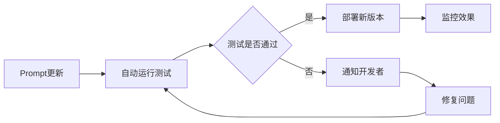
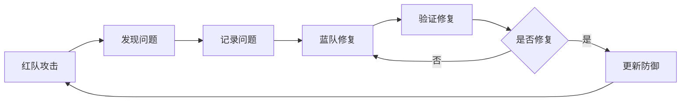

# 7. 质量与测试

## 7.1 提示词单元测试

### 测试框架

提示词单元测试用于验证Prompt模板的效果和质量。

#### 测试框架设计
```python
# 提示词测试框架示例
import pytest
from codegen.testing import PromptTester

class TestCodeGenerationPrompt:
    def setup_method(self):
        self.tester = PromptTester()
        self.prompt_template = "code_generation_v1"
    
    def test_simple_function_generation(self):
        """测试简单函数生成"""
        result = self.tester.test(
            template=self.prompt_template,
            input_data={
                "language": "python",
                "requirement": "创建一个计算两数之和的函数"
            },
            expected_output={
                "contains": ["def", "add", "return"],
                "syntax_valid": True,
                "executable": True
            }
        )
        assert result.passed, result.message
    
    def test_complex_class_generation(self):
        """测试复杂类生成"""
        result = self.tester.test(
            template=self.prompt_template,
            input_data={
                "language": "python",
                "requirement": "创建一个用户管理类，包含增删改查方法"
            },
            expected_output={
                "contains": ["class", "User", "def", "create", "delete", "update", "get"],
                "syntax_valid": True,
                "has_docstring": True
            }
        )
        assert result.passed, result.message
```

#### 测试指标
- **语法正确率**：生成代码的语法正确率
- **功能正确率**：生成代码的功能正确率
- **代码质量**：代码质量评分
- **响应时间**：模型响应时间
- **成本**：模型调用成本

#### 测试报告
```json
{
  "test_suite": "code_generation_prompt_v1",
  "total_tests": 100,
  "passed": 85,
  "failed": 15,
  "metrics": {
    "syntax_accuracy": 0.92,
    "function_accuracy": 0.85,
    "quality_score": 0.88,
    "avg_response_time": 1.2,
    "avg_cost": 0.05
  },
  "failed_tests": [
    {
      "test_name": "test_complex_api_generation",
      "reason": "生成的代码缺少错误处理",
      "suggestion": "在Prompt中添加错误处理要求"
    }
  ]
}
```

### 测试用例设计

#### 测试用例分类
- **功能测试**：测试Prompt是否能生成正确的功能代码
- **边界测试**：测试边界情况和异常情况
- **质量测试**：测试生成代码的质量
- **性能测试**：测试响应时间和成本
- **兼容性测试**：测试不同语言、框架的兼容性

#### 测试用例示例
```yaml
# 测试用例配置示例
test_cases:
  - name: "simple_function"
    description: "测试简单函数生成"
    input:
      language: "python"
      requirement: "创建一个计算两数之和的函数"
    expected:
      syntax_valid: true
      contains: ["def", "add", "return"]
      executable: true
      
  - name: "class_with_methods"
    description: "测试带方法的类生成"
    input:
      language: "python"
      requirement: "创建一个用户类，包含name和email属性，以及get_info方法"
    expected:
      syntax_valid: true
      contains: ["class", "User", "def", "get_info"]
      has_docstring: true
      
  - name: "error_handling"
    description: "测试错误处理代码生成"
    input:
      language: "python"
      requirement: "创建一个文件读取函数，包含错误处理"
    expected:
      syntax_valid: true
      contains: ["try", "except", "FileNotFoundError"]
      error_handling: true
```

### 自动化测试

#### 持续测试
- **每次提交测试**：每次Prompt模板更新后自动运行测试
- **定期回归测试**：定期运行完整测试套件
- **A/B测试**：新版本Prompt与旧版本对比测试

#### 测试自动化流程


#### 测试工具集成
- **CI/CD集成**：集成到CI/CD流程，自动测试
- **测试报告**：自动生成测试报告
- **告警通知**：测试失败时自动通知

## 7.2 端到端自动化

### E2E测试流程

端到端测试验证整个代码生成流程的完整性。

#### 测试场景
- **完整代码生成流程**：从需求输入到代码生成的完整流程
- **代码审查流程**：代码审查的完整流程
- **测试生成流程**：测试生成的完整流程
- **多轮交互流程**：多轮对话和代码修改流程

#### E2E测试示例
```python
# E2E测试示例
import pytest
from codegen.e2e import E2ETester

class TestCodeGenerationE2E:
    def setup_method(self):
        self.tester = E2ETester()
        self.project_id = "test_project_123"
    
    def test_complete_code_generation_flow(self):
        """测试完整代码生成流程"""
        # 1. 创建项目
        project = self.tester.create_project(
            name="Test Project",
            language="python"
        )
        
        # 2. 生成代码
        result = self.tester.generate_code(
            project_id=project.id,
            requirement="创建一个用户登录函数"
        )
        assert result.code is not None
        assert result.quality_score > 0.8
        
        # 3. 代码审查
        review = self.tester.review_code(
            project_id=project.id,
            code=result.code
        )
        assert len(review.issues) == 0
        
        # 4. 生成测试
        tests = self.tester.generate_tests(
            project_id=project.id,
            code=result.code
        )
        assert len(tests.test_cases) > 0
        
        # 5. 执行测试
        test_result = self.tester.run_tests(
            project_id=project.id,
            code=result.code,
            tests=tests
        )
        assert test_result.passed
        
        # 6. 清理
        self.tester.delete_project(project.id)
```

### 测试覆盖

#### 功能覆盖
- **代码生成**：覆盖各种代码生成场景
- **代码补全**：覆盖各种代码补全场景
- **代码审查**：覆盖各种代码审查场景
- **测试生成**：覆盖各种测试生成场景

#### 语言覆盖
- **Python**：Python代码生成和审查
- **JavaScript/TypeScript**：JavaScript/TypeScript代码生成和审查
- **Java**：Java代码生成和审查
- **Go**：Go代码生成和审查

#### 场景覆盖
- **简单场景**：简单函数、类生成
- **复杂场景**：复杂业务逻辑、架构设计
- **边界场景**：边界情况、异常处理
- **集成场景**：多模块集成、API集成

### 持续集成

#### CI/CD流程
```yaml
# GitHub Actions CI/CD配置示例
name: E2E Tests

on:
  push:
    branches: [ main, develop ]
  pull_request:
    branches: [ main ]

jobs:
  e2e-tests:
    runs-on: ubuntu-latest
    steps:
      - uses: actions/checkout@v3
      
      - name: Setup Python
        uses: actions/setup-python@v4
        with:
          python-version: '3.11'
      
      - name: Install dependencies
        run: |
          pip install -r requirements.txt
          pip install pytest pytest-cov
      
      - name: Run E2E tests
        env:
          CODEGEN_API_KEY: ${{ secrets.CODEGEN_API_KEY }}
        run: |
          pytest tests/e2e/ -v --cov=codegen --cov-report=html
      
      - name: Upload coverage
        uses: codecov/codecov-action@v3
        with:
          files: ./coverage.xml
```

#### 测试报告
- **测试结果报告**：详细的测试结果报告
- **覆盖率报告**：代码覆盖率报告
- **性能报告**：性能测试报告
- **质量报告**：代码质量报告

## 7.3 红蓝对抗

### 对抗测试方法

红蓝对抗测试用于发现系统的弱点和漏洞。

#### 红队（攻击方）
红队模拟攻击者，尝试发现系统漏洞。

**攻击方法**：
- **恶意输入**：输入恶意代码、SQL注入、XSS攻击等
- **边界测试**：测试边界情况和异常情况
- **性能攻击**：大量并发请求，测试系统性能
- **安全攻击**：尝试绕过安全机制

#### 蓝队（防御方）
蓝队负责防御，修复发现的问题。

**防御措施**：
- **输入验证**：验证和过滤用户输入
- **安全扫描**：扫描生成代码的安全漏洞
- **性能优化**：优化系统性能，应对高并发
- **安全加固**：加强安全机制

#### 对抗测试流程


### 安全测试

#### 安全测试内容
- **代码注入**：测试SQL注入、代码注入等
- **XSS攻击**：测试跨站脚本攻击
- **CSRF攻击**：测试跨站请求伪造攻击
- **权限绕过**：测试权限绕过漏洞
- **敏感信息泄露**：测试敏感信息泄露

#### 安全测试工具
- **SAST工具**：静态应用安全测试工具（SonarQube、Checkmarx等）
- **DAST工具**：动态应用安全测试工具（OWASP ZAP、Burp Suite等）
- **依赖扫描**：依赖漏洞扫描工具（Snyk、OWASP Dependency-Check等）

#### 安全测试示例
```python
# 安全测试示例
import pytest
from codegen.security import SecurityTester

class TestSecurity:
    def setup_method(self):
        self.tester = SecurityTester()
    
    def test_sql_injection_prevention(self):
        """测试SQL注入防护"""
        malicious_input = "'; DROP TABLE users; --"
        result = self.tester.test_code_generation(
            requirement=f"查询用户信息：{malicious_input}"
        )
        # 验证生成的代码不包含SQL注入漏洞
        assert not self.tester.contains_sql_injection(result.code)
    
    def test_xss_prevention(self):
        """测试XSS攻击防护"""
        malicious_input = "<script>alert('XSS')</script>"
        result = self.tester.test_code_generation(
            requirement=f"显示用户输入：{malicious_input}"
        )
        # 验证生成的代码包含XSS防护
        assert self.tester.has_xss_protection(result.code)
```

### 性能测试

#### 性能测试内容
- **响应时间**：测试API响应时间
- **吞吐量**：测试系统吞吐量
- **并发性能**：测试并发处理能力
- **资源使用**：测试CPU、内存、GPU使用情况
- **扩展性**：测试系统扩展性

#### 性能测试工具
- **负载测试工具**：Apache JMeter、Locust、k6等
- **性能分析工具**：Profiling工具、APM工具等
- **监控工具**：Prometheus、Grafana等

#### 性能测试示例
```python
# 性能测试示例
import pytest
from locust import HttpUser, task, between

class CodeGenUser(HttpUser):
    wait_time = between(1, 3)
    
    @task
    def generate_code(self):
        self.client.post("/api/v1/code/generate", json={
            "project_id": "test_project",
            "language": "python",
            "requirement": "创建一个简单的函数"
        })
    
    @task(3)
    def complete_code(self):
        self.client.post("/api/v1/code/complete", json={
            "project_id": "test_project",
            "code": "def hello():\n    "
        })

# 运行性能测试
# locust -f performance_test.py --host=https://api.codegen.com
```

#### 性能基准
- **响应时间**：P95响应时间&lt;2s，P99响应时间&lt;5s
- **吞吐量**：单机QPS&gt;500，集群QPS&gt;5万
- **并发支持**：支持1000+并发用户
- **资源使用**：CPU使用率&lt;80%，内存使用率&lt;85%
