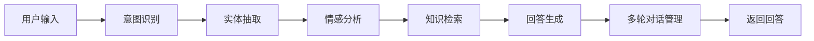
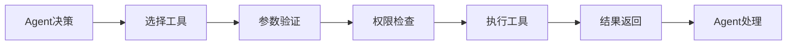
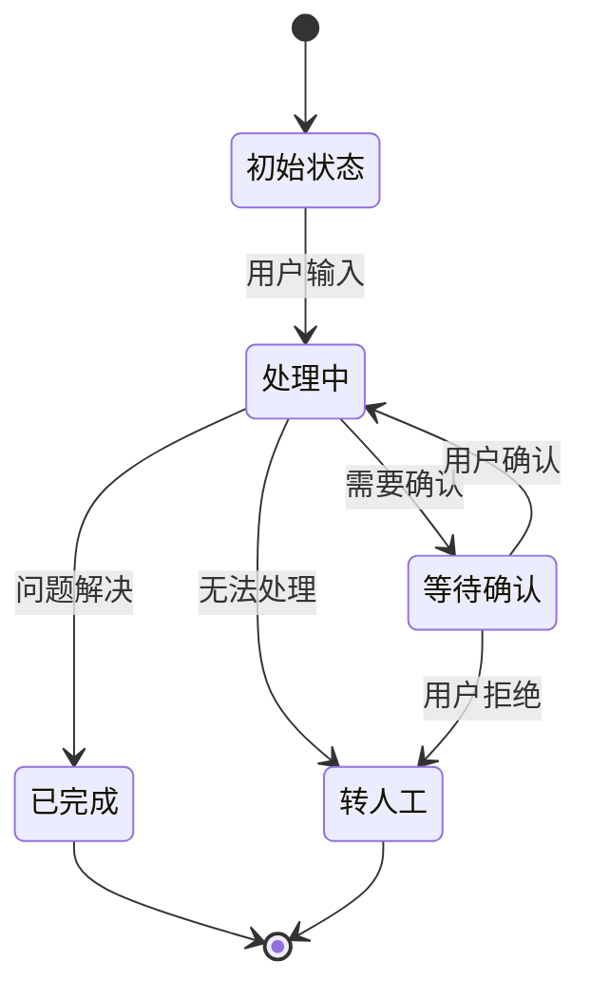

# 5. 智能体与业务编排

## 5.1 Agent技能链

### 技能定义

智能客服Agent需要具备多种技能，通过技能链组合完成复杂任务：

#### 核心技能

**1. 意图识别技能（Intent Recognition）**
- **功能**：识别用户问题的意图类型
- **输入**：用户问题文本
- **输出**：意图类别（产品咨询、技术支持、投诉建议等）
- **实现**：基于BERT的分类模型

**2. 实体抽取技能（Entity Extraction）**
- **功能**：从用户问题中抽取关键实体
- **输入**：用户问题文本
- **输出**：实体列表（产品名称、订单号、时间等）
- **实现**：基于BERT的NER模型

**3. 知识检索技能（Knowledge Retrieval）**
- **功能**：从知识库检索相关信息
- **输入**：用户问题、对话历史
- **输出**：相关文档片段列表
- **实现**：RAG检索系统

**4. 回答生成技能（Answer Generation）**
- **功能**：基于检索结果生成回答
- **输入**：用户问题、检索结果、对话历史
- **输出**：生成的回答文本
- **实现**：大语言模型（GPT-4等）

**5. 情感分析技能（Sentiment Analysis）**
- **功能**：分析用户情感状态
- **输入**：用户问题文本、对话历史
- **输出**：情感类别（积极、中性、消极）、情感强度
- **实现**：情感分析模型

**6. 多轮对话管理技能（Dialogue Management）**
- **功能**：管理对话状态和上下文
- **输入**：当前问题、对话历史
- **输出**：更新的对话状态
- **实现**：基于规则或学习的对话状态跟踪

### 技能链设计

技能链按照业务流程组织，形成完整的处理流程：



#### 标准技能链

**简单问答链**：
1. 意图识别 → 2. 知识检索 → 3. 回答生成

**复杂问答链**：
1. 意图识别 → 2. 实体抽取 → 3. 情感分析 → 4. 知识检索 → 5. 回答生成 → 6. 多轮对话管理

**投诉处理链**：
1. 意图识别 → 2. 情感分析 → 3. 实体抽取 → 4. 知识检索 → 5. 回答生成 → 6. 人工转接判断

**实现示例**：
```python
from langchain.agents import AgentExecutor, create_react_agent
from langchain.tools import Tool

# 定义工具
tools = [
    Tool(
        name="intent_recognition",
        func=intent_recognition_skill,
        description="识别用户意图"
    ),
    Tool(
        name="knowledge_retrieval",
        func=knowledge_retrieval_skill,
        description="从知识库检索信息"
    ),
    Tool(
        name="answer_generation",
        func=answer_generation_skill,
        description="生成回答"
    ),
]

# 创建Agent
agent = create_react_agent(llm, tools, prompt)
agent_executor = AgentExecutor(agent=agent, tools=tools)
```

### 执行流程

#### 流程控制

**顺序执行**：
- 技能按顺序执行，前一个技能的输出作为下一个技能的输入
- 适用于有依赖关系的技能链

**并行执行**：
- 多个独立技能并行执行，提升处理速度
- 适用于无依赖关系的技能（如意图识别和情感分析可并行）

**条件分支**：
- 根据中间结果选择不同的执行路径
- 适用于需要动态调整的场景

**实现示例**：
```python
class SkillChain:
    def __init__(self):
        self.skills = []
    
    def add_skill(self, skill, condition=None):
        self.skills.append({"skill": skill, "condition": condition})
    
    def execute(self, input_data):
        result = input_data
        for item in self.skills:
            skill = item["skill"]
            condition = item["condition"]
            
            # 检查条件
            if condition and not condition(result):
                continue
            
            # 执行技能
            result = skill.execute(result)
        
        return result
```

## 5.2 工具注册中心

### 工具类型

智能客服系统需要集成多种外部工具，扩展Agent能力：

#### 业务工具

**1. 订单查询工具（Order Query）**
- **功能**：查询订单信息
- **输入**：订单号
- **输出**：订单详情（状态、商品、金额、时间等）
- **实现**：调用订单系统API

**2. 产品信息工具（Product Info）**
- **功能**：查询产品信息
- **输入**：产品ID或名称
- **输出**：产品详情（名称、价格、规格、库存等）
- **实现**：调用产品系统API

**3. 用户信息工具（User Info）**
- **功能**：查询用户信息
- **输入**：用户ID
- **输出**：用户详情（等级、积分、订单历史等）
- **实现**：调用用户系统API

#### AI工具

**4. 计算器工具（Calculator）**
- **功能**：执行数学计算
- **输入**：数学表达式
- **输出**：计算结果
- **实现**：Python eval函数（安全限制）

**5. 天气查询工具（Weather）**
- **功能**：查询天气信息
- **输入**：城市名称
- **输出**：天气详情（温度、湿度、预报等）
- **实现**：调用天气API

**6. 翻译工具（Translation）**
- **功能**：文本翻译
- **输入**：源文本、目标语言
- **输出**：翻译结果
- **实现**：调用翻译API或使用翻译模型

#### 系统工具

**7. 数据库查询工具（Database Query）**
- **功能**：查询数据库
- **输入**：SQL查询语句（受限）
- **输出**：查询结果
- **实现**：安全的SQL执行接口

**8. 文件操作工具（File Operations）**
- **功能**：读取、写入文件
- **输入**：文件路径、操作类型
- **输出**：文件内容或操作结果
- **实现**：受限的文件系统接口

### 工具注册流程

#### 注册步骤

**步骤1：工具开发**
- 开发工具功能，实现标准接口
- 编写工具文档和测试用例

**步骤2：工具注册**
- 在工具注册中心注册工具
- 提供工具名称、描述、参数、返回值等信息

**步骤3：工具测试**
- 在测试环境测试工具功能
- 验证工具的安全性和性能

**步骤4：工具发布**
- 工具审核通过后发布
- 配置工具权限和访问控制

**实现示例**：
```python
class ToolRegistry:
    def __init__(self):
        self.tools = {}
    
    def register_tool(self, name, tool_func, description, parameters):
        self.tools[name] = {
            "func": tool_func,
            "description": description,
            "parameters": parameters,
            "status": "active"
        }
    
    def get_tool(self, name):
        return self.tools.get(name)
    
    def list_tools(self):
        return [name for name, info in self.tools.items() 
                if info["status"] == "active"]
```

### 工具调用机制

#### 调用流程



#### 安全机制

**参数验证**：
- 验证工具参数类型和范围
- 防止SQL注入、命令注入等攻击

**权限控制**：
- 基于角色的访问控制（RBAC）
- 限制工具调用权限

**执行隔离**：
- 在沙箱环境中执行工具
- 限制资源使用（CPU、内存、网络）

**实现示例**：
```python
class ToolExecutor:
    def __init__(self, tool_registry):
        self.registry = tool_registry
        self.permissions = {}
    
    def execute_tool(self, tool_name, parameters, user_context):
        # 获取工具
        tool = self.registry.get_tool(tool_name)
        if not tool:
            raise ValueError(f"Tool {tool_name} not found")
        
        # 权限检查
        if not self.check_permission(tool_name, user_context):
            raise PermissionError(f"No permission to use {tool_name}")
        
        # 参数验证
        self.validate_parameters(tool["parameters"], parameters)
        
        # 执行工具
        try:
            result = tool["func"](**parameters)
            return result
        except Exception as e:
            raise RuntimeError(f"Tool execution failed: {e}")
```

## 5.3 长记忆与状态管理

### 记忆机制

智能客服Agent需要记忆对话历史和用户信息，提供个性化服务：

#### 记忆类型

**短期记忆（Short-term Memory）**：
- **内容**：当前对话的上下文信息
- **存储**：内存中，对话结束后清除
- **用途**：理解当前对话的上下文

**长期记忆（Long-term Memory）**：
- **内容**：用户历史对话、偏好、个人信息
- **存储**：数据库中，持久化存储
- **用途**：提供个性化服务和历史回顾

**工作记忆（Working Memory）**：
- **内容**：当前任务的状态和中间结果
- **存储**：内存中，任务完成后清除
- **用途**：管理复杂任务的执行状态

#### 记忆实现

**向量记忆**：
- 将对话历史向量化存储
- 快速检索相关历史信息
- 适用于大规模历史数据

**结构化记忆**：
- 将对话信息结构化存储（用户ID、时间、问题、回答等）
- 便于查询和分析
- 适用于需要精确查询的场景

**实现示例**：
```python
class MemoryManager:
    def __init__(self):
        self.short_term = {}  # 短期记忆
        self.long_term_db = None  # 长期记忆数据库
        self.vector_store = None  # 向量存储
    
    def add_to_short_term(self, session_id, message):
        if session_id not in self.short_term:
            self.short_term[session_id] = []
        self.short_term[session_id].append(message)
    
    def retrieve_relevant_history(self, session_id, query, top_k=5):
        # 从向量存储检索相关历史
        history = self.vector_store.similarity_search(
            query, 
            filter={"session_id": session_id},
            k=top_k
        )
        return history
```

### 状态管理

#### 对话状态

**状态定义**：
- **初始状态**：对话开始，等待用户输入
- **处理中**：正在处理用户问题
- **等待确认**：等待用户确认信息
- **已完成**：问题已解决，对话结束
- **转人工**：需要人工客服介入

**状态转换**：


**实现示例**：
```python
class DialogueState:
    INIT = "init"
    PROCESSING = "processing"
    WAITING_CONFIRM = "waiting_confirm"
    COMPLETED = "completed"
    TRANSFER_HUMAN = "transfer_human"

class StateManager:
    def __init__(self):
        self.states = {}
    
    def get_state(self, session_id):
        return self.states.get(session_id, DialogueState.INIT)
    
    def set_state(self, session_id, state):
        self.states[session_id] = state
    
    def transition(self, session_id, event):
        current_state = self.get_state(session_id)
        # 状态转换逻辑
        if current_state == DialogueState.INIT and event == "user_input":
            self.set_state(session_id, DialogueState.PROCESSING)
        # ... 其他转换逻辑
```

### 上下文维护

#### 上下文结构

**对话上下文**：
- 对话历史（问题和回答）
- 当前意图和实体
- 对话状态

**用户上下文**：
- 用户基本信息
- 历史偏好
- 当前会话信息

**业务上下文**：
- 当前处理的业务（订单、产品等）
- 业务状态和进度

#### 上下文管理

**上下文窗口**：
- 限制上下文长度，避免超出模型限制
- 使用滑动窗口，保留最近的对话
- 使用摘要技术，压缩历史信息

**上下文更新**：
- 每次对话后更新上下文
- 定期持久化上下文到数据库
- 清理过期上下文

**实现示例**：
```python
class ContextManager:
    def __init__(self, max_length=4000):
        self.max_length = max_length
        self.contexts = {}
    
    def add_message(self, session_id, role, content):
        if session_id not in self.contexts:
            self.contexts[session_id] = []
        
        self.contexts[session_id].append({
            "role": role,
            "content": content,
            "timestamp": datetime.now()
        })
        
        # 限制上下文长度
        self._truncate_context(session_id)
    
    def _truncate_context(self, session_id):
        context = self.contexts[session_id]
        total_length = sum(len(msg["content"]) for msg in context)
        
        if total_length > self.max_length:
            # 保留系统消息和最近的对话
            system_messages = [msg for msg in context if msg["role"] == "system"]
            recent_messages = context[-10:]  # 保留最近10条
            self.contexts[session_id] = system_messages + recent_messages
```
