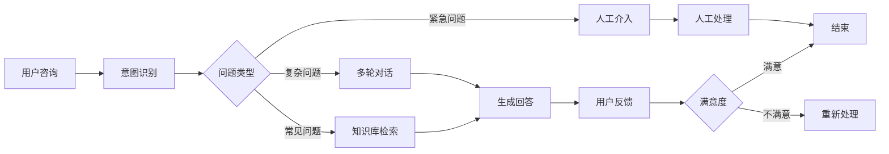
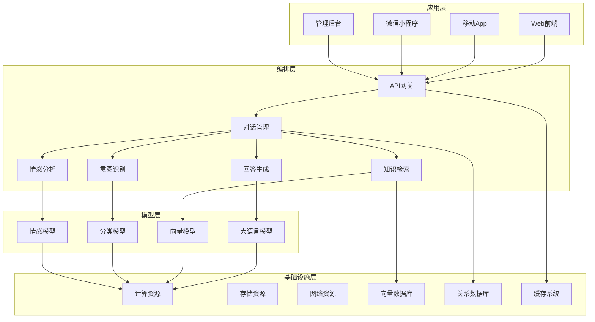
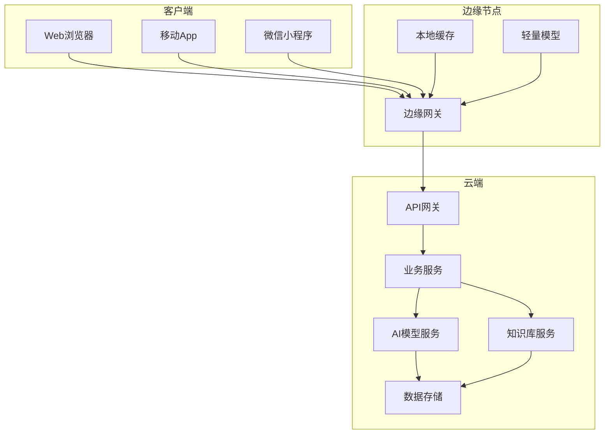

# 2. 总体架构

## 2.1 业务架构

### 角色定义

#### 终端用户（Customer）
- **职责**：通过Web、移动App、微信小程序等渠道咨询问题，获得智能客服服务
- **权限**：发起咨询、查看历史记录、评价服务
- **典型场景**：商品咨询、订单查询、售后服务、技术支持

#### 客服管理员（Admin）
- **职责**：管理知识库、配置智能客服、监控服务质量、处理升级问题
- **权限**：知识库管理、模型配置、数据分析、人工介入
- **典型场景**：知识库更新、模型调优、质量监控、异常处理

#### 系统管理员（System Admin）
- **职责**：系统运维、性能监控、安全管理、数据备份
- **权限**：系统配置、用户管理、安全审计、数据管理
- **典型场景**：系统部署、性能优化、安全加固、故障处理

#### 业务分析师（Analyst）
- **职责**：分析服务数据、优化业务流程、制定改进策略
- **权限**：数据查询、报表生成、分析工具使用
- **典型场景**：服务质量分析、用户行为分析、业务优化建议

### 用例分析

#### 用例1：智能问答服务
- **参与者**：终端用户、智能客服系统
- **前置条件**：用户已登录系统，知识库已构建完成
- **主流程**：
  1. 用户输入问题
  2. 系统进行意图识别和实体抽取
  3. 系统从知识库检索相关信息
  4. 系统生成回答并返回给用户
  5. 用户查看回答，可选择继续提问或结束对话
- **后置条件**：对话记录保存，用户满意度记录
- **扩展流程**：如果回答置信度低，转人工客服

#### 用例2：知识库管理
- **参与者**：客服管理员、知识库系统
- **前置条件**：管理员已登录，具有知识库管理权限
- **主流程**：
  1. 管理员上传文档或输入知识
  2. 系统进行文档解析和向量化
  3. 系统建立索引并存储到向量数据库
  4. 管理员审核知识内容
  5. 知识发布并生效
- **后置条件**：知识库更新，检索服务可用
- **扩展流程**：如果知识质量不合格，退回修改

#### 用例3：服务质量监控
- **参与者**：客服管理员、监控系统
- **前置条件**：系统运行中，监控数据已收集
- **主流程**：
  1. 系统实时收集服务指标数据
  2. 系统进行数据分析和可视化展示
  3. 管理员查看监控看板
  4. 发现异常情况，系统自动告警
  5. 管理员处理异常问题
- **后置条件**：问题解决，监控数据记录
- **扩展流程**：如果问题严重，启动应急响应流程

### 故事地图

## 2.2 技术架构

### AI-Native四层架构

智能客服系统采用AI-Native四层架构，从下到上依次为基础设施层、模型层、编排层和应用层。

#### 应用层

应用层提供多种终端接入方式，满足不同用户的使用习惯：

- **Web前端**：基于Vue 3 + TypeScript开发，支持PC和移动端自适应，提供流畅的对话体验
- **移动App**：原生iOS和Android应用，支持推送通知、离线缓存等功能
- **微信小程序**：轻量级接入方式，无需下载安装，即用即走
- **管理后台**：基于React + Ant Design开发，提供知识库管理、模型配置、数据分析等功能

**技术栈**：
- 前端框架：Vue 3、React 18
- UI组件库：Element Plus、Ant Design
- 状态管理：Pinia、Redux
- 构建工具：Vite、Webpack

#### 编排层

编排层是系统的核心，负责业务流程编排和AI能力调用：

- **API网关**：统一入口，负责路由、限流、认证、日志等
- **对话管理**：维护对话上下文，管理多轮对话状态
- **意图识别**：识别用户意图，支持意图分类和实体抽取
- **知识检索**：基于RAG技术，从向量知识库检索相关信息
- **回答生成**：调用大语言模型，基于检索结果生成回答
- **情感分析**：分析用户情感，调整回答策略

**技术栈**：
- 框架：FastAPI（Python）、Spring Boot（Java）
- 消息队列：RabbitMQ、Kafka
- 工作流引擎：n8n、LangChain
- 缓存：Redis、Memcached

#### 模型层

模型层提供各种AI能力：

- **大语言模型**：支持GPT-4、Claude、通义千问、文心一言等，通过模型路由选择最优模型
- **向量模型**：支持text-embedding-ada-002、bge-large-zh等，用于文本向量化
- **分类模型**：BERT、RoBERTa等，用于意图分类和情感分析
- **情感模型**：专门训练的情感识别模型，识别用户情感状态

**技术栈**：
- 模型服务：OpenAI API、Azure OpenAI、本地部署模型
- 向量化：sentence-transformers、LangChain Embeddings
- 模型管理：ModelScope、Hugging Face

#### 基础设施层

基础设施层提供计算、存储、网络等基础资源：

- **计算资源**：Kubernetes集群，支持弹性伸缩，GPU节点用于模型推理
- **存储资源**：对象存储（OSS/S3）存储文档和媒体文件，块存储用于数据库
- **网络资源**：CDN加速、负载均衡、专线连接
- **向量数据库**：Milvus、Qdrant、Pinecone，存储向量化知识
- **关系数据库**：MySQL 8.0、PostgreSQL，存储结构化数据
- **缓存系统**：Redis集群，提供高性能缓存服务

**技术栈**：
- 容器编排：Kubernetes、Docker
- 服务网格：Istio
- 监控：Prometheus、Grafana
- 日志：ELK Stack（Elasticsearch、Logstash、Kibana）

### 技术栈

#### 前端技术
- **Vue 3 + TypeScript**：现代化前端框架，类型安全，开发效率高
- **Vite**：快速构建工具，开发体验好
- **TailwindCSS**：实用优先的CSS框架，快速构建UI
- **Pinia**：轻量级状态管理，替代Vuex

#### 后端技术
- **Python 3.11 + FastAPI**：高性能异步框架，API开发效率高
- **MySQL 8.0**：关系型数据库，存储结构化数据
- **Redis**：内存数据库，提供缓存和会话存储
- **RabbitMQ**：消息队列，处理异步任务

#### AI技术
- **RAG技术**：检索增强生成，提升回答准确性
- **LangChain**：LLM应用开发框架，简化开发流程
- **向量数据库**：Milvus/Qdrant，存储和检索向量数据
- **大语言模型**：GPT-4、Claude、通义千问等

#### DevOps技术
- **Docker**：容器化部署
- **Kubernetes**：容器编排，支持弹性伸缩
- **GitHub Actions**：CI/CD自动化
- **Prometheus + Grafana**：监控和可视化

## 2.3 部署架构

### 云/边/端混合部署

智能客服系统采用云边端混合部署架构，满足不同场景的需求：

#### 云端部署
- **主要服务**：API网关、业务逻辑、AI模型、知识库、数据存储
- **优势**：集中管理、易于扩展、资源充足
- **适用场景**：大规模服务、复杂AI模型推理、知识库管理

#### 边缘节点部署
- **主要服务**：边缘网关、本地缓存、轻量级模型
- **优势**：低延迟、减少带宽消耗、提高响应速度
- **适用场景**：高频访问、实时性要求高、带宽受限场景

#### 客户端部署
- **主要功能**：UI展示、本地缓存、离线功能
- **优势**：用户体验好、减少服务器压力
- **适用场景**：移动端应用、离线场景

### 高可用设计

#### 多机房部署
- **主备模式**：主机房提供服务，备机房实时同步，主机房故障时自动切换
- **双活模式**：两个机房同时提供服务，负载均衡，任一机房故障不影响服务
- **异地容灾**：跨地域部署，应对自然灾害等极端情况

#### 服务高可用
- **无状态设计**：服务无状态，可水平扩展，任意实例故障不影响整体服务
- **健康检查**：定期健康检查，自动剔除故障实例
- **熔断降级**：服务异常时自动熔断，返回降级方案，避免雪崩效应

#### 数据高可用
- **主从复制**：数据库主从复制，主库故障时自动切换到从库
- **数据备份**：定期全量备份和增量备份，支持快速恢复
- **多副本存储**：重要数据多副本存储，防止数据丢失

### 扩展性设计

#### 水平扩展
- **无状态服务**：所有服务无状态，可水平扩展
- **负载均衡**：通过负载均衡器分发请求，支持动态扩容
- **自动伸缩**：根据CPU、内存、请求量等指标自动扩容缩容

#### 垂直扩展
- **资源升级**：支持CPU、内存、存储等资源升级
- **GPU加速**：AI模型推理支持GPU加速，提升性能

#### 架构扩展
- **微服务架构**：服务拆分，独立部署和扩展
- **消息队列**：异步处理，削峰填谷，提升系统吞吐量
- **缓存层**：多级缓存，减少数据库压力，提升响应速度

#### 扩展性指标
- **并发支持**：单机支持1000+并发，集群支持10万+并发
- **响应时间**：P99响应时间&lt;500ms，平均响应时间&lt;200ms
- **吞吐量**：单机QPS&gt;1000，集群QPS&gt;10万
