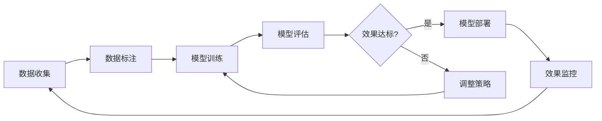

# 4. 模型与提示词管理

## 4.1 多模型路由

### 模型选择策略

智能客服系统需要支持多个大语言模型，根据不同场景选择最优模型：

#### 模型池配置

**通用对话模型**：
- **GPT-4**：OpenAI最新模型，理解能力强，适合复杂问题，成本较高
- **Claude 3**：Anthropic模型，安全性好，适合敏感场景
- **通义千问**：阿里云模型，中文优化，成本适中
- **文心一言**：百度模型，中文理解好，API稳定

**专用模型**：
- **GPT-3.5-turbo**：成本低，响应快，适合简单问题
- **ChatGLM3**：开源模型，可本地部署，数据安全
- **Qwen-Chat**：通义千问开源版本，支持本地部署

**模型选择矩阵**：

| 场景 | 推荐模型 | 原因 |
|------|---------|------|
| 复杂问题 | GPT-4 | 理解能力强，回答质量高 |
| 简单问题 | GPT-3.5-turbo | 成本低，响应快 |
| 中文场景 | 通义千问/文心一言 | 中文优化，效果更好 |
| 敏感数据 | ChatGLM3（本地） | 数据不出域，安全可控 |
| 高并发 | GPT-3.5-turbo | 并发能力强，成本低 |

#### 选择策略实现

**基于问题复杂度**：
```python
def select_model_by_complexity(question, context):
    # 分析问题复杂度
    complexity_score = analyze_complexity(question, context)
    
    if complexity_score > 0.8:
        return "gpt-4"  # 复杂问题使用GPT-4
    elif complexity_score > 0.5:
        return "gpt-3.5-turbo"  # 中等复杂度使用GPT-3.5
    else:
        return "gpt-3.5-turbo"  # 简单问题使用GPT-3.5
```

**基于语言类型**：
```python
def select_model_by_language(text):
    # 检测语言类型
    language = detect_language(text)
    
    if language == "zh":
        return "qwen-plus"  # 中文使用通义千问
    else:
        return "gpt-4"  # 其他语言使用GPT-4
```

**基于成本优化**：
```python
def select_model_by_cost(question, budget):
    # 根据预算选择模型
    if budget > 0.01:  # 高预算
        return "gpt-4"
    elif budget > 0.001:  # 中预算
        return "gpt-3.5-turbo"
    else:  # 低预算
        return "qwen-turbo"
```

### 路由规则

#### 路由规则配置

**规则1：按意图路由**
- 产品咨询 → GPT-3.5-turbo（成本低，足够准确）
- 技术支持 → GPT-4（需要深度理解）
- 投诉处理 → Claude 3（安全性好）

**规则2：按用户等级路由**
- VIP用户 → GPT-4（高质量服务）
- 普通用户 → GPT-3.5-turbo（标准服务）
- 新用户 → GPT-3.5-turbo（成本控制）

**规则3：按时间段路由**
- 高峰期 → GPT-3.5-turbo（高并发）
- 低峰期 → GPT-4（高质量）
- 夜间 → 本地模型（降低成本）

**实现示例**：
```python
class ModelRouter:
    def __init__(self):
        self.rules = [
            {"condition": lambda q: q.intent == "product", "model": "gpt-3.5-turbo"},
            {"condition": lambda q: q.intent == "technical", "model": "gpt-4"},
            {"condition": lambda q: q.user_level == "VIP", "model": "gpt-4"},
            {"condition": lambda q: is_peak_hour(), "model": "gpt-3.5-turbo"},
        ]
    
    def route(self, question):
        for rule in self.rules:
            if rule["condition"](question):
                return rule["model"]
        return "gpt-3.5-turbo"  # 默认模型
```

### 负载均衡

#### 负载均衡策略

**轮询（Round Robin）**：
- 依次选择模型实例，均匀分配负载
- 适用于模型性能相近的场景

**加权轮询（Weighted Round Robin）**：
- 根据模型性能分配权重，高性能模型分配更多请求
- 适用于模型性能差异较大的场景

**最少连接（Least Connections）**：
- 选择当前连接数最少的模型实例
- 适用于长连接场景

**响应时间（Response Time）**：
- 选择响应时间最短的模型实例
- 适用于对响应时间敏感的场景

**实现示例**：
```python
from collections import defaultdict

class ModelLoadBalancer:
    def __init__(self):
        self.models = {
            "gpt-4": {"instances": ["gpt-4-1", "gpt-4-2"], "weight": 1},
            "gpt-3.5-turbo": {"instances": ["gpt-3.5-1", "gpt-3.5-2", "gpt-3.5-3"], "weight": 3},
        }
        self.connections = defaultdict(int)
        self.response_times = defaultdict(list)
    
    def select_instance(self, model_name):
        instances = self.models[model_name]["instances"]
        # 选择连接数最少的实例
        instance = min(instances, key=lambda x: self.connections[x])
        self.connections[instance] += 1
        return instance
```

## 4.2 Prompt工程化

### Prompt模板设计

Prompt模板是智能客服系统的核心，直接影响回答质量：

#### 基础Prompt模板

**RAG问答模板**：
```
你是一个专业的客服助手，负责回答用户的问题。

上下文信息：
{context}

用户问题：{question}

请基于上下文信息回答用户问题，要求：
1. 回答要准确、专业、友好
2. 如果上下文信息不足以回答问题，请如实告知
3. 回答要简洁明了，控制在200字以内

回答：
```

**多轮对话模板**：
```
你是一个专业的客服助手，正在与用户进行对话。

对话历史：
{history}

当前问题：{question}

请基于对话历史理解用户意图，给出合适的回答。
```

**情感响应模板**：
```
你是一个专业的客服助手。检测到用户情感状态：{emotion}

用户问题：{question}

请根据用户的情感状态调整回答的语气和策略：
- 如果用户情绪消极，要更加耐心和体贴
- 如果用户情绪积极，要保持友好和热情
- 如果用户情绪中性，要保持专业和礼貌

回答：
```

#### Prompt优化技巧

**Few-Shot示例**：
```
你是一个专业的客服助手。以下是几个示例：

示例1：
用户：这个产品有什么功能？
助手：这个产品具有以下功能：1. 功能A 2. 功能B 3. 功能C

示例2：
用户：如何退货？
助手：退货流程如下：1. 登录账户 2. 选择订单 3. 申请退货 4. 等待审核

现在请回答用户问题：
用户：{question}
助手：
```

**角色设定**：
```
你是一位经验丰富的客服专家，具有以下特点：
- 专业知识丰富，能够准确回答各类问题
- 服务态度友好，始终以客户为中心
- 沟通能力强，能够清晰表达
```

**约束条件**：
```
请遵守以下约束：
1. 只能基于提供的上下文信息回答，不要编造信息
2. 如果不知道答案，请如实告知，不要猜测
3. 不要提供任何医疗、法律、金融等专业建议
4. 回答要符合公司价值观和政策
```

### 版本管理

#### Prompt版本控制

**版本命名规则**：
- 主版本号：重大变更，如v2.0.0
- 次版本号：新增功能，如v1.1.0
- 修订版本号：优化调整，如v1.0.1

**版本管理流程**：
1. **开发**：在开发环境创建新版本Prompt
2. **测试**：在测试环境验证Prompt效果
3. **灰度发布**：小流量灰度发布，观察效果
4. **全量发布**：效果达标后全量发布
5. **回滚**：如果效果不达标，快速回滚

**实现示例**：
```python
class PromptVersionManager:
    def __init__(self):
        self.versions = {}
        self.current_version = "v1.0.0"
    
    def create_version(self, version, template):
        self.versions[version] = {
            "template": template,
            "created_at": datetime.now(),
            "status": "draft"
        }
    
    def publish_version(self, version, traffic=1.0):
        # 灰度发布
        self.versions[version]["status"] = "published"
        self.versions[version]["traffic"] = traffic
    
    def rollback(self, target_version):
        self.current_version = target_version
```

### A/B测试

#### A/B测试框架

**测试设计**：
- **对照组**：使用当前版本的Prompt（A组）
- **实验组**：使用新版本的Prompt（B组）
- **分流比例**：50%:50%或90%:10%（根据风险调整）

**评估指标**：
- **回答准确率**：人工评估回答是否正确
- **用户满意度**：用户对回答的评分
- **问题解决率**：用户是否满意，是否需要继续提问
- **响应时间**：Prompt处理时间

**实现示例**：
```python
import random

class PromptABTest:
    def __init__(self):
        self.group_a = "v1.0.0"
        self.group_b = "v1.1.0"
        self.split_ratio = 0.5
    
    def select_prompt(self, user_id):
        # 基于用户ID进行一致性分流
        hash_value = hash(user_id) % 100
        if hash_value < self.split_ratio * 100:
            return self.group_a
        else:
            return self.group_b
    
    def evaluate(self, group, metrics):
        # 评估A/B测试效果
        accuracy_a = metrics[self.group_a]["accuracy"]
        accuracy_b = metrics[self.group_b]["accuracy"]
        
        if accuracy_b > accuracy_a * 1.05:  # B组准确率提升5%以上
            return "winner_b"
        elif accuracy_a > accuracy_b * 1.05:
            return "winner_a"
        else:
            return "no_winner"
```

## 4.3 微调与持续学习

### 微调策略

#### 微调场景

**领域适配**：
- 针对特定行业（如金融、医疗）进行微调
- 提升领域专业术语的理解和生成能力

**风格适配**：
- 调整回答风格，符合企业品牌调性
- 统一客服话术和表达方式

**任务适配**：
- 针对特定任务（如FAQ问答、情感分析）进行微调
- 提升任务执行效果

#### 微调方法

**全量微调（Full Fine-tuning）**：
- 更新模型所有权重参数
- 效果最好，但成本高，需要大量GPU资源

**LoRA微调（Low-Rank Adaptation）**：
- 只训练少量低秩矩阵，大幅降低训练成本
- 效果接近全量微调，推荐使用

**实现示例**：
```python
from peft import LoraConfig, get_peft_model

# LoRA配置
lora_config = LoraConfig(
    r=16,  # 低秩矩阵的秩
    lora_alpha=32,  # LoRA缩放参数
    target_modules=["q_proj", "v_proj"],  # 目标模块
    lora_dropout=0.1,
)

# 应用LoRA
model = get_peft_model(base_model, lora_config)
```

#### 微调数据准备

**数据收集**：
- 历史对话记录
- 人工标注的高质量问答对
- 领域专业知识文档

**数据格式**：
```json
{
    "instruction": "你是一个专业的客服助手",
    "input": "用户问题",
    "output": "标准回答"
}
```

**数据量要求**：
- 最少1000条高质量数据
- 推荐5000-10000条数据
- 数据质量比数量更重要

### 持续学习流程

#### 学习循环



#### 在线学习

**增量学习**：
- 定期收集新的对话数据
- 增量更新模型，避免遗忘旧知识
- 使用经验回放（Experience Replay）技术

**强化学习**：
- 基于用户反馈进行强化学习
- 优化回答策略，提升用户满意度
- 使用PPO（Proximal Policy Optimization）算法

### 模型评估

#### 评估指标

**自动评估指标**：
- **BLEU分数**：评估生成文本与参考文本的相似度
- **ROUGE分数**：评估召回率和精确率
- **BERTScore**：基于BERT的语义相似度评估

**人工评估指标**：
- **相关性**：回答是否与问题相关（1-5分）
- **准确性**：回答是否正确（1-5分）
- **有用性**：回答是否有用（1-5分）
- **流畅性**：回答是否流畅自然（1-5分）

#### 评估流程

**离线评估**：
1. 准备测试集（100-500条问题）
2. 使用模型生成回答
3. 人工评估或自动评估
4. 计算各项指标
5. 生成评估报告

**在线评估**：
1. 实时收集用户反馈
2. 计算用户满意度
3. 监控回答质量指标
4. 发现异常自动告警

**实现示例**：
```python
def evaluate_model(model, test_set):
    results = {
        "accuracy": 0,
        "relevance": 0,
        "usefulness": 0,
        "fluency": 0
    }
    
    for question, reference_answer in test_set:
        generated_answer = model.generate(question)
        
        # 自动评估
        bleu_score = calculate_bleu(generated_answer, reference_answer)
        results["accuracy"] += bleu_score
        
        # 人工评估（模拟）
        relevance = human_evaluate_relevance(question, generated_answer)
        results["relevance"] += relevance
    
    # 计算平均值
    for key in results:
        results[key] /= len(test_set)
    
    return results
```
