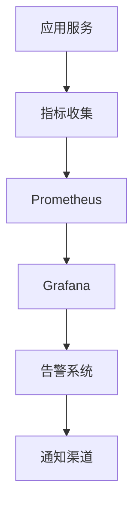
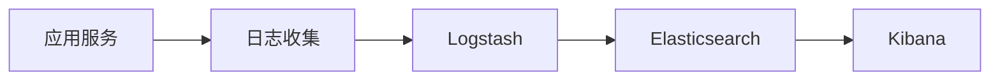

# 9. 监控与可观测

## 9.1 业务指标

### 核心业务指标

智能客服系统的核心业务指标用于评估服务质量和业务效果：

#### 服务质量指标

**1. 首次解决率（FCR - First Contact Resolution）**
- **定义**：用户首次咨询即解决问题的比例
- **计算公式**：FCR = (首次解决问题数 / 总问题数) × 100%
- **目标值**：≥85%
- **监控频率**：实时监控，每小时统计

**2. 客户满意度（CSAT - Customer Satisfaction）**
- **定义**：用户对服务的满意度评分
- **计算公式**：CSAT = (满意评价数 / 总评价数) × 100%
- **目标值**：≥4.5/5.0（90%）
- **监控频率**：实时监控，每天统计

**3. 平均响应时间（Average Response Time）**
- **定义**：从用户发送问题到收到回答的平均时间
- **计算公式**：平均响应时间 = 总响应时间 / 问题数
- **目标值**：≤5秒
- **监控频率**：实时监控，每分钟统计

**4. 回答准确率（Answer Accuracy）**
- **定义**：回答正确的比例
- **计算公式**：准确率 = (正确回答数 / 总回答数) × 100%
- **目标值**：≥90%
- **监控频率**：每天统计，人工抽样评估

#### 业务效率指标

**5. 平均对话轮次（Average Conversation Turns）**
- **定义**：解决一个问题平均需要的对话轮次
- **计算公式**：平均轮次 = 总对话轮次 / 问题数
- **目标值**：≤3轮
- **监控频率**：每小时统计

**6. 转人工率（Human Transfer Rate）**
- **定义**：需要转人工客服的比例
- **计算公式**：转人工率 = (转人工数 / 总问题数) × 100%
- **目标值**：≤15%
- **监控频率**：实时监控，每小时统计

**7. 问题解决率（Problem Resolution Rate）**
- **定义**：问题得到解决的比例
- **计算公式**：解决率 = (解决问题数 / 总问题数) × 100%
- **目标值**：≥90%
- **监控频率**：每天统计

### 指标监控

#### 监控架构



#### 监控实现

**Prometheus配置**：
```yaml
global:
  scrape_interval: 15s
  evaluation_interval: 15s

scrape_configs:
  - job_name: 'customer-service'
    static_configs:
      - targets: ['localhost:8000']
    metrics_path: '/metrics'
```

**指标收集代码**：
```python
from prometheus_client import Counter, Histogram, Gauge

# 定义指标
fcr_counter = Counter('fcr_total', 'First contact resolution count')
csat_gauge = Gauge('csat_score', 'Customer satisfaction score')
response_time = Histogram('response_time_seconds', 'Response time in seconds')

# 记录指标
def handle_question(question):
    start_time = time.time()
    answer = generate_answer(question)
    response_time.observe(time.time() - start_time)
    
    if is_resolved(answer):
        fcr_counter.inc()
```

#### 实时监控看板

**Grafana Dashboard配置**：
- 实时FCR指标
- CSAT趋势图
- 响应时间分布
- 问题分类统计
- 转人工率趋势

### 告警机制

#### 告警规则

**1. FCR告警**
- **条件**：FCR < 80%
- **级别**：警告
- **通知**：邮件 + 短信

**2. 响应时间告警**
- **条件**：平均响应时间 > 10秒
- **级别**：严重
- **通知**：电话 + 短信 + 邮件

**3. 系统可用性告警**
- **条件**：可用性 < 99%
- **级别**：严重
- **通知**：电话 + 短信 + 邮件

**Prometheus告警规则**：
```yaml
groups:
  - name: customer_service_alerts
    rules:
      - alert: LowFCR
        expr: fcr_rate < 0.8
        for: 5m
        annotations:
          summary: "FCR低于80%"
      
      - alert: HighResponseTime
        expr: avg(response_time_seconds) > 10
        for: 2m
        annotations:
          summary: "响应时间超过10秒"
```

## 9.2 模型指标

### 模型性能指标

#### 准确性指标

**1. 回答准确率（Answer Accuracy）**
- **定义**：模型生成回答的准确程度
- **计算方法**：人工评估或自动评估
- **目标值**：≥90%
- **监控频率**：每天统计

**2. 相关性得分（Relevance Score）**
- **定义**：回答与问题的相关程度
- **计算方法**：使用BERTScore或人工评估
- **目标值**：≥0.85
- **监控频率**：实时计算

**3. 流畅性得分（Fluency Score）**
- **定义**：回答的流畅自然程度
- **计算方法**：使用语言模型评估
- **目标值**：≥0.9
- **监控频率**：实时计算

#### 效率指标

**4. 推理延迟（Inference Latency）**
- **定义**：模型生成回答的时间
- **计算方法**：记录推理开始到结束的时间
- **目标值**：≤2秒
- **监控频率**：实时监控

**5. Token使用量（Token Usage）**
- **定义**：每次调用使用的Token数量
- **计算方法**：统计输入和输出Token数
- **目标值**：输入&lt;2000，输出&lt;500
- **监控频率**：实时统计

**6. 成本（Cost）**
- **定义**：每次调用的成本
- **计算方法**：根据Token使用量和定价计算
- **目标值**：≤0.01元/次
- **监控频率**：实时计算

### 模型监控

#### 监控实现

**模型指标收集**：
```python
class ModelMonitor:
    def __init__(self):
        self.metrics = {
            "accuracy": [],
            "latency": [],
            "token_usage": [],
            "cost": []
        }
    
    def record_inference(self, question, answer, latency, tokens, cost):
        """记录推理指标"""
        self.metrics["latency"].append(latency)
        self.metrics["token_usage"].append(tokens)
        self.metrics["cost"].append(cost)
        
        # 评估准确性（异步）
        accuracy = self.evaluate_accuracy(question, answer)
        self.metrics["accuracy"].append(accuracy)
    
    def get_statistics(self):
        """获取统计信息"""
        return {
            "avg_accuracy": np.mean(self.metrics["accuracy"]),
            "avg_latency": np.mean(self.metrics["latency"]),
            "avg_cost": np.mean(self.metrics["cost"])
        }
```

#### 模型性能看板

**Grafana Dashboard**：
- 准确率趋势
- 延迟分布
- Token使用量统计
- 成本分析
- 模型对比

### 模型退化检测

#### 退化检测方法

**1. 统计过程控制（SPC）**
- 使用控制图监控指标
- 检测异常波动
- 自动告警

**2. 时间序列分析**
- 分析指标趋势
- 预测未来值
- 检测异常偏离

**3. 对比分析**
- 对比不同时间段的表现
- 对比不同模型版本
- 识别性能下降

**实现示例**：
```python
class ModelDegradationDetector:
    def __init__(self):
        self.baseline_accuracy = 0.90
        self.degradation_threshold = 0.05
    
    def detect_degradation(self, current_accuracy):
        """检测模型退化"""
        degradation = self.baseline_accuracy - current_accuracy
        
        if degradation > self.degradation_threshold:
            return {
                "status": "degraded",
                "severity": "high" if degradation > 0.1 else "medium",
                "message": f"准确率下降{degradation:.2%}"
            }
        
        return {"status": "normal"}
```

## 9.3 链路追踪

### 追踪系统

#### 分布式追踪

**OpenTelemetry集成**：
```python
from opentelemetry import trace
from opentelemetry.sdk.trace import TracerProvider
from opentelemetry.sdk.trace.export import BatchSpanProcessor
from opentelemetry.exporter.jaeger import JaegerExporter

# 初始化追踪
trace.set_tracer_provider(TracerProvider())
tracer = trace.get_tracer(__name__)

# 配置Jaeger导出器
jaeger_exporter = JaegerExporter(
    agent_host_name="localhost",
    agent_port=6831,
)
span_processor = BatchSpanProcessor(jaeger_exporter)
trace.get_tracer_provider().add_span_processor(span_processor)

# 使用追踪
def handle_request(request):
    with tracer.start_as_current_span("handle_request") as span:
        span.set_attribute("user_id", request.user_id)
        span.set_attribute("question", request.question)
        
        # 处理请求
        answer = process_question(request.question)
        
        span.set_attribute("answer_length", len(answer))
        return answer
```

#### 追踪数据收集

**关键追踪点**：
- API请求入口
- 数据库查询
- 外部API调用
- 模型推理
- 缓存操作

**追踪信息**：
- Trace ID：唯一标识一次请求
- Span ID：标识请求中的每个操作
- 时间戳：操作开始和结束时间
- 标签：操作相关的元数据
- 日志：操作相关的日志

### 日志管理

#### 日志架构



#### 日志级别

**DEBUG**：详细的调试信息
**INFO**：一般信息，记录正常流程
**WARNING**：警告信息，不影响功能
**ERROR**：错误信息，功能受影响
**CRITICAL**：严重错误，系统可能崩溃

#### 日志格式

**结构化日志**：
```json
{
    "timestamp": "2024-01-01T10:00:00Z",
    "level": "INFO",
    "service": "customer-service",
    "trace_id": "abc123",
    "span_id": "def456",
    "message": "处理用户问题",
    "context": {
        "user_id": "user_123",
        "question": "产品价格？",
        "response_time": 0.5
    }
}
```

**日志收集配置**：
```python
import logging
import json
from pythonjsonlogger import jsonlogger

# 配置JSON格式日志
logHandler = logging.StreamHandler()
formatter = jsonlogger.JsonFormatter()
logHandler.setFormatter(formatter)

logger = logging.getLogger()
logger.addHandler(logHandler)
logger.setLevel(logging.INFO)

# 记录日志
logger.info("处理用户问题", extra={
    "user_id": "user_123",
    "question": "产品价格？"
})
```

### 问题定位

#### 问题定位流程

**1. 告警触发**
- 系统自动检测异常
- 发送告警通知

**2. 日志查询**
- 根据Trace ID查询日志
- 分析错误日志
- 定位问题根源

**3. 指标分析**
- 查看相关指标
- 分析指标异常
- 识别问题模式

**4. 根因分析**
- 分析问题原因
- 制定解决方案
- 实施修复

#### 问题定位工具

**Kibana日志查询**：
- 全文搜索
- 时间范围筛选
- 字段过滤
- 可视化分析

**Jaeger追踪查询**：
- Trace ID查询
- 服务依赖图
- 性能分析
- 错误追踪

**Grafana指标分析**：
- 指标趋势分析
- 多指标对比
- 异常检测
- 告警历史