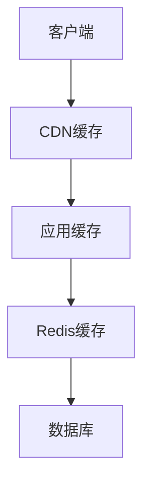

# 8. 性能与成本

## 8.1 弹性伸缩

### 伸缩策略

智能客服系统需要根据负载自动伸缩，确保服务稳定和成本优化：

#### 水平伸缩（Horizontal Scaling）

**自动伸缩规则**：
- **CPU使用率**：&gt;70%时扩容，&lt;30%时缩容
- **内存使用率**：&gt;80%时扩容，&lt;40%时缩容
- **请求队列长度**：&gt;100时扩容，&lt;10时缩容
- **响应时间**：P95&gt;1000ms时扩容

**Kubernetes HPA配置**：
```yaml
apiVersion: autoscaling/v2
kind: HorizontalPodAutoscaler
metadata:
  name: customer-service-hpa
spec:
  scaleTargetRef:
    apiVersion: apps/v1
    kind: Deployment
    name: customer-service
  minReplicas: 2
  maxReplicas: 20
  metrics:
  - type: Resource
    resource:
      name: cpu
      target:
        type: Utilization
        averageUtilization: 70
  - type: Resource
    resource:
      name: memory
      target:
        type: Utilization
        averageUtilization: 80
  behavior:
    scaleDown:
      stabilizationWindowSeconds: 300
      policies:
      - type: Percent
        value: 50
        periodSeconds: 60
    scaleUp:
      stabilizationWindowSeconds: 0
      policies:
      - type: Percent
        value: 100
        periodSeconds: 15
      - type: Pods
        value: 4
        periodSeconds: 15
      selectPolicy: Max
```

#### 垂直伸缩（Vertical Scaling）

**资源调整规则**：
- 根据历史负载预测资源需求
- 在业务高峰期前提前扩容
- 在业务低峰期自动缩容

**VPA配置**：
```yaml
apiVersion: autoscaling.k8s.io/v1
kind: VerticalPodAutoscaler
metadata:
  name: customer-service-vpa
spec:
  targetRef:
    apiVersion: apps/v1
    kind: Deployment
    name: customer-service
  updatePolicy:
    updateMode: "Auto"
  resourcePolicy:
    containerPolicies:
    - containerName: customer-service
      minAllowed:
        cpu: 100m
        memory: 128Mi
      maxAllowed:
        cpu: 4
        memory: 8Gi
```

### 资源调度

#### 调度策略

**节点选择**：
- GPU节点：用于AI模型推理
- CPU节点：用于业务逻辑处理
- 内存优化节点：用于缓存服务

**Pod调度**：
```yaml
apiVersion: v1
kind: Pod
spec:
  nodeSelector:
    node-type: gpu
  tolerations:
  - key: nvidia.com/gpu
    operator: Exists
    effect: NoSchedule
  containers:
  - name: ai-model
    resources:
      requests:
        nvidia.com/gpu: 1
      limits:
        nvidia.com/gpu: 1
```

#### 资源优化

**资源请求和限制**：
- 合理设置requests和limits
- 避免资源浪费
- 确保服务稳定性

**多租户隔离**：
- 使用命名空间隔离不同租户
- 设置资源配额
- 防止资源争抢

### 成本优化

#### 成本优化策略

**1. 使用Spot实例**
- 非关键服务使用Spot实例
- 成本降低60-90%
- 需要容忍中断

**2. 预留实例**
- 长期稳定负载使用预留实例
- 成本降低30-50%
- 需要提前规划

**3. 自动休眠**
- 低峰期自动休眠非关键服务
- 节省计算资源
- 需要快速唤醒机制

**4. 模型选择优化**
- 简单问题使用低成本模型
- 复杂问题使用高性能模型
- 平衡成本和效果

## 8.2 缓存策略

### 缓存设计

#### 多级缓存架构



**1. CDN缓存**
- 缓存静态资源（JS、CSS、图片）
- 缓存常见问题的回答
- 减少服务器压力

**2. 应用缓存（本地缓存）**
- 缓存热点数据
- 缓存用户会话
- 减少网络请求

**3. Redis缓存（分布式缓存）**
- 缓存知识库检索结果
- 缓存模型推理结果
- 缓存用户对话历史

#### 缓存策略

**1. 常见问题缓存**
- **Key**：问题文本的MD5
- **Value**：标准回答
- **TTL**：24小时
- **更新策略**：知识库更新时清除

**2. 知识检索结果缓存**
- **Key**：查询文本 + 知识库版本
- **Value**：检索到的文档列表
- **TTL**：1小时
- **更新策略**：知识库更新时清除

**3. 模型推理结果缓存**
- **Key**：问题 + 上下文 + 模型版本
- **Value**：生成的回答
- **TTL**：根据问题类型动态调整
- **更新策略**：模型更新时清除

**实现示例**：
```python
import redis
import hashlib
import json

class CacheManager:
    def __init__(self):
        self.redis_client = redis.Redis(host='localhost', port=6379)
    
    def get_cache_key(self, question, context=None):
        key_data = {
            "question": question,
            "context": context or "",
            "kb_version": self.get_kb_version()
        }
        key_str = json.dumps(key_data, sort_keys=True)
        return f"answer:{hashlib.md5(key_str.encode()).hexdigest()}"
    
    def get_answer(self, question, context=None):
        cache_key = self.get_cache_key(question, context)
        cached = self.redis_client.get(cache_key)
        if cached:
            return json.loads(cached)
        return None
    
    def set_answer(self, question, answer, context=None, ttl=3600):
        cache_key = self.get_cache_key(question, context)
        self.redis_client.setex(
            cache_key,
            ttl,
            json.dumps(answer)
        )
```

### 缓存更新

#### 更新策略

**1. 主动更新（Write-Through）**
- 数据更新时同步更新缓存
- 保证数据一致性
- 适合写多读少的场景

**2. 被动更新（Write-Back）**
- 数据更新时先更新缓存
- 异步更新数据库
- 适合写少读多的场景

**3. 失效更新（Cache-Aside）**
- 数据更新时删除缓存
- 下次读取时重新加载
- 简单可靠，推荐使用

**4. 定时更新**
- 定时刷新热点数据
- 保证数据新鲜度
- 适合数据变化不频繁的场景

#### 缓存失效

**失效场景**：
- 知识库更新
- 模型更新
- Prompt更新
- 用户数据更新

**失效策略**：
```python
class CacheInvalidator:
    def invalidate_by_pattern(self, pattern):
        """按模式清除缓存"""
        keys = self.redis_client.keys(pattern)
        if keys:
            self.redis_client.delete(*keys)
    
    def invalidate_knowledge_cache(self):
        """清除知识库相关缓存"""
        self.invalidate_by_pattern("answer:*")
        self.invalidate_by_pattern("knowledge:*")
    
    def invalidate_user_cache(self, user_id):
        """清除用户相关缓存"""
        self.invalidate_by_pattern(f"user:{user_id}:*")
```

### 缓存命中率优化

#### 优化策略

**1. 预热缓存**
- 系统启动时加载热点数据
- 业务高峰期前预热
- 提升缓存命中率

**2. 缓存分层**
- 热点数据使用更快的存储
- 冷数据使用较慢的存储
- 平衡成本和性能

**3. 缓存压缩**
- 压缩缓存数据
- 减少内存占用
- 提升缓存容量

**4. 智能淘汰**
- 使用LRU（最近最少使用）算法
- 使用LFU（最不经常使用）算法
- 根据业务特点选择淘汰策略

#### 监控指标

**缓存命中率**：
- 目标：&gt;80%
- 监控：实时监控命中率
- 告警：命中率&lt;70%时告警

**缓存性能**：
- 响应时间：&lt;10ms
- 吞吐量：&gt;10000 QPS
- 错误率：&lt;0.01%

## 8.3 成本仪表盘

### 成本监控

#### 成本分类

**1. 计算成本**
- 服务器成本
- GPU成本
- 容器服务成本

**2. 存储成本**
- 数据库存储成本
- 对象存储成本
- 备份存储成本

**3. 网络成本**
- 带宽成本
- CDN成本
- API调用成本

**4. AI模型成本**
- 大语言模型API调用成本
- 向量模型推理成本
- 模型训练成本

#### 成本监控实现

**成本数据收集**：
```python
class CostMonitor:
    def __init__(self):
        self.cost_data = {
            "compute": 0,
            "storage": 0,
            "network": 0,
            "ai_model": 0
        }
    
    def record_api_call(self, model, tokens):
        """记录API调用成本"""
        cost = self.calculate_api_cost(model, tokens)
        self.cost_data["ai_model"] += cost
    
    def calculate_api_cost(self, model, tokens):
        """计算API调用成本"""
        pricing = {
            "gpt-4": {"input": 0.03, "output": 0.06},  # 每1K tokens
            "gpt-3.5-turbo": {"input": 0.0015, "output": 0.002}
        }
        if model in pricing:
            return (tokens["input"] * pricing[model]["input"] + 
                    tokens["output"] * pricing[model]["output"]) / 1000
        return 0
```

### 成本分析

#### 成本分析维度

**1. 按服务分析**
- 各服务的成本占比
- 成本趋势分析
- 成本异常检测

**2. 按用户分析**
- 不同用户群体的成本
- 高价值用户识别
- 成本优化建议

**3. 按时间分析**
- 日/周/月成本趋势
- 高峰期成本分析
- 成本预测

**4. 按模型分析**
- 不同模型的调用成本
- 模型成本效益分析
- 模型选择建议

#### 成本报表

**日报**：
- 当日总成本
- 各分类成本
- 成本趋势

**周报**：
- 本周总成本
- 成本环比分析
- 成本优化建议

**月报**：
- 本月总成本
- 成本预算对比
- 成本优化总结

### 成本优化建议

#### 优化建议生成

**1. 模型选择优化**
- 分析各模型的使用场景
- 推荐成本效益最优的模型
- 预计节省成本

**2. 缓存优化**
- 分析缓存命中率
- 推荐缓存策略调整
- 预计节省成本

**3. 资源优化**
- 分析资源使用率
- 推荐资源调整方案
- 预计节省成本

**4. 架构优化**
- 分析系统架构瓶颈
- 推荐架构优化方案
- 预计节省成本

#### 成本优化目标

**短期目标（1-3个月）**：
- 成本降低20%
- 通过缓存和资源优化实现

**中期目标（3-6个月）**：
- 成本降低40%
- 通过架构优化和模型选择实现

**长期目标（6-12个月）**：
- 成本降低60%
- 通过全面优化实现