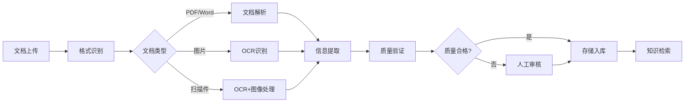
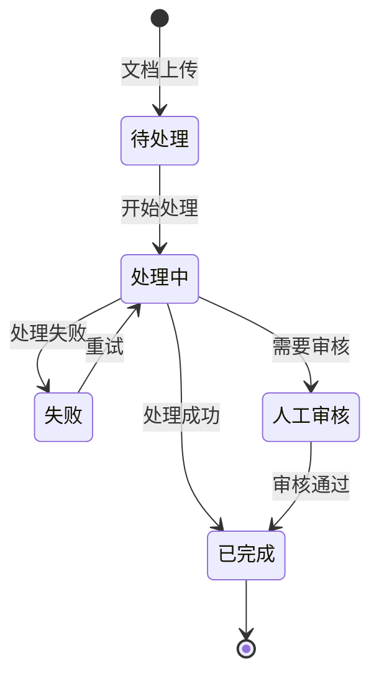

# 5. 智能体与业务编排

## 5.1 Agent技能链

### 技能定义

智能文档处理Agent需要具备多种技能，通过技能链组合完成复杂任务：

#### 核心技能

**1. 文档解析技能（Document Parsing）**
- **功能**：解析各种格式的文档（PDF、Word、Excel、图片等）
- **输入**：文档文件
- **输出**：解析后的文本内容和结构信息
- **实现**：基于PyPDF、python-docx、pandas等工具

**2. OCR识别技能（OCR Recognition）**
- **功能**：识别图片和扫描件中的文字
- **输入**：图片文件或扫描件
- **输出**：识别出的文字内容
- **实现**：基于PaddleOCR、Tesseract等OCR引擎

**3. 信息提取技能（Information Extraction）**
- **功能**：从文档中提取关键信息
- **输入**：文档文本、提取字段定义
- **输出**：结构化数据（JSON格式）
- **实现**：基于大语言模型（GPT-4等）

**4. 文档分类技能（Document Classification）**
- **功能**：对文档进行分类（合同、报告、发票等）
- **输入**：文档内容
- **输出**：文档类别和置信度
- **实现**：基于BERT、RoBERTa等分类模型

**5. 合同审查技能（Contract Review）**
- **功能**：审查合同，识别风险条款
- **输入**：合同内容、标准模板
- **输出**：审查报告、风险识别结果
- **实现**：基于大语言模型和规则引擎

**6. 知识检索技能（Knowledge Retrieval）**
- **功能**：从知识库检索相关信息
- **输入**：查询文本
- **输出**：相关文档片段列表
- **实现**：基于RAG检索系统

### 技能链设计

技能链按照业务流程组织，形成完整的处理流程：



#### 标准技能链

**文档处理链**：
1. 格式识别 → 2. 文档解析/OCR → 3. 信息提取 → 4. 质量验证

**合同审查链**：
1. 格式识别 → 2. 文档解析 → 3. 合同分类 → 4. 合同审查 → 5. 风险识别 → 6. 报告生成

**知识库构建链**：
1. 文档上传 → 2. 文档解析 → 3. 文本分块 → 4. 向量化 → 5. 存储入库

**实现示例**：
```python
from langchain.agents import AgentExecutor, create_react_agent
from langchain.tools import Tool

# 定义工具
tools = [
    Tool(
        name="document_parsing",
        func=document_parsing_skill,
        description="解析文档，提取文本内容"
    ),
    Tool(
        name="ocr_recognition",
        func=ocr_recognition_skill,
        description="识别图片中的文字"
    ),
    Tool(
        name="information_extraction",
        func=information_extraction_skill,
        description="从文档中提取关键信息"
    ),
]

# 创建Agent
agent = create_react_agent(llm, tools, prompt)
agent_executor = AgentExecutor(agent=agent, tools=tools)
```

### 执行流程

#### 流程控制

**顺序执行**：
- 技能按顺序执行，前一个技能的输出作为下一个技能的输入
- 适用于有依赖关系的技能链

**并行执行**：
- 多个独立技能并行执行，提升处理速度
- 适用于无依赖关系的技能（如文档解析和OCR可并行）

**条件分支**：
- 根据中间结果选择不同的执行路径
- 适用于需要动态调整的场景

## 5.2 工具注册中心

### 工具类型

智能文档处理系统需要集成多种外部工具，扩展Agent能力：

#### 文档处理工具

**1. PDF解析工具（PDF Parser）**
- **功能**：解析PDF文档，提取文本和结构
- **输入**：PDF文件路径
- **输出**：文本内容和结构信息
- **实现**：PyPDF、pdfplumber

**2. Word解析工具（Word Parser）**
- **功能**：解析Word文档，提取文本和格式
- **输入**：Word文件路径
- **输出**：文本内容和格式信息
- **实现**：python-docx

**3. Excel解析工具（Excel Parser）**
- **功能**：解析Excel文档，提取表格数据
- **输入**：Excel文件路径
- **输出**：表格数据（DataFrame）
- **实现**：pandas

**4. OCR工具（OCR Tool）**
- **功能**：识别图片中的文字
- **输入**：图片文件路径
- **输出**：识别出的文字内容
- **实现**：PaddleOCR、Tesseract

#### AI工具

**5. 信息提取工具（Information Extraction）**
- **功能**：从文档中提取结构化信息
- **输入**：文档文本、提取字段定义
- **输出**：结构化数据（JSON）
- **实现**：大语言模型（GPT-4等）

**6. 文档分类工具（Document Classification）**
- **功能**：对文档进行分类
- **输入**：文档内容
- **输出**：文档类别和置信度
- **实现**：分类模型（BERT等）

**7. 合同审查工具（Contract Review）**
- **功能**：审查合同，识别风险
- **输入**：合同内容、标准模板
- **输出**：审查报告、风险识别结果
- **实现**：大语言模型 + 规则引擎

### 工具注册流程

#### 注册步骤

**步骤1：工具开发**
- 开发工具功能，实现标准接口
- 编写工具文档和测试用例

**步骤2：工具注册**
- 在工具注册中心注册工具
- 提供工具名称、描述、参数、返回值等信息

**步骤3：工具测试**
- 在测试环境测试工具功能
- 验证工具的安全性和性能

**步骤4：工具发布**
- 工具审核通过后发布
- 配置工具权限和访问控制

### 工具调用机制

#### 调用流程


#### 安全机制

**参数验证**：
- 验证工具参数类型和范围
- 防止路径遍历、命令注入等攻击

**权限控制**：
- 基于角色的访问控制（RBAC）
- 限制工具调用权限

**执行隔离**：
- 在沙箱环境中执行工具
- 限制资源使用（CPU、内存、网络）

## 5.3 长记忆与状态管理

### 记忆机制

智能文档处理Agent需要记忆处理历史和文档信息：

#### 记忆类型

**短期记忆（Short-term Memory）**：
- **内容**：当前处理任务的上下文信息
- **存储**：内存中，任务结束后清除
- **用途**：理解当前处理任务的上下文

**长期记忆（Long-term Memory）**：
- **内容**：文档处理历史、提取规则、质量评估结果
- **存储**：数据库中，持久化存储
- **用途**：提供历史参考和质量改进

**工作记忆（Working Memory）**：
- **内容**：当前任务的状态和中间结果
- **存储**：内存中，任务完成后清除
- **用途**：管理复杂任务的执行状态

### 状态管理

#### 处理状态

**状态定义**：
- **待处理**：文档已上传，等待处理
- **处理中**：正在处理文档
- **已完成**：文档处理完成
- **失败**：文档处理失败
- **人工审核**：需要人工审核

**状态转换**：


### 上下文维护

#### 上下文结构

**文档上下文**：
- 文档基本信息（名称、类型、大小等）
- 文档处理历史
- 提取结果和评估结果

**任务上下文**：
- 当前处理任务
- 任务状态和进度
- 中间结果

**业务上下文**：
- 业务规则和配置
- 质量标准和要求
- 历史处理经验

#### 上下文管理

**上下文窗口**：
- 限制上下文长度，避免超出模型限制
- 使用滑动窗口，保留最近的上下文
- 使用摘要技术，压缩历史信息

**上下文更新**：
- 每次处理后更新上下文
- 定期持久化上下文到数据库
- 清理过期上下文