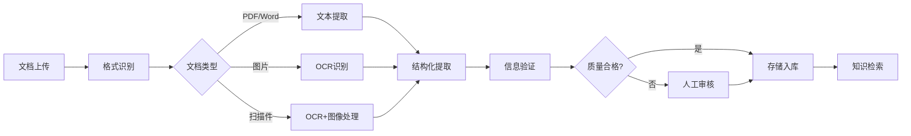
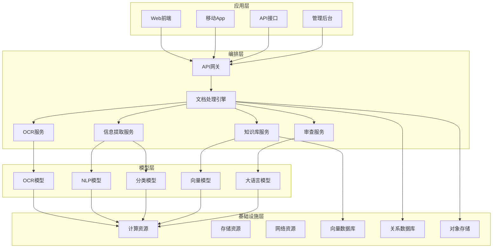

# 2. 总体架构

## 2.1 业务架构

### 角色定义

#### 文档管理员（Document Admin）
- **职责**：管理文档库、配置处理规则、监控处理质量
- **权限**：文档上传、规则配置、质量监控、数据导出
- **典型场景**：上传文档、配置处理规则、查看处理结果

#### 业务用户（Business User）
- **职责**：使用文档处理功能，查看处理结果，导出数据
- **权限**：文档上传、结果查看、数据导出
- **典型场景**：上传合同审查、查看审查结果、导出报告

#### 系统管理员（System Admin）
- **职责**：系统运维、性能监控、安全管理、数据备份
- **权限**：系统配置、用户管理、安全审计、数据管理
- **典型场景**：系统部署、性能优化、安全加固、故障处理

#### 数据分析师（Data Analyst）
- **职责**：分析文档数据、优化处理流程、制定改进策略
- **权限**：数据查询、报表生成、分析工具使用
- **典型场景**：文档统计分析、处理效率分析、质量分析

### 用例分析

#### 用例1：文档上传和处理
- **参与者**：业务用户、文档处理系统
- **前置条件**：用户已登录，有上传权限
- **主流程**：
  1. 用户上传文档（PDF、Word、图片等）
  2. 系统识别文档类型和格式
  3. 系统进行OCR识别（如需要）
  4. 系统提取文档结构和关键信息
  5. 系统生成结构化数据
  6. 用户查看处理结果
- **后置条件**：文档已处理，结果可查看
- **扩展流程**：如果识别失败，转人工处理

#### 用例2：合同审查和风险识别
- **参与者**：业务用户、合同审查系统
- **前置条件**：用户已上传合同文档
- **主流程**：
  1. 系统识别合同类型和结构
  2. 系统提取关键条款
  3. 系统对照标准模板检查合规性
  4. 系统识别风险条款
  5. 系统生成审查报告
  6. 用户查看报告和处理建议
- **后置条件**：审查报告已生成
- **扩展流程**：如果发现高风险，转人工审核

#### 用例3：知识库构建和管理
- **参与者**：文档管理员、知识库系统
- **前置条件**：管理员已登录，有管理权限
- **主流程**：
  1. 管理员上传知识文档
  2. 系统解析文档内容
  3. 系统提取知识点
  4. 系统向量化存储
  5. 系统建立索引
  6. 管理员审核和发布
- **后置条件**：知识已入库，可检索
- **扩展流程**：如果质量不合格，退回修改

### 故事地图

## 2.2 技术架构

### AI-Native四层架构

智能文档处理系统采用AI-Native四层架构：

#### 应用层

- **Web前端**：基于Vue 3开发，支持文档上传、结果查看、数据导出
- **移动App**：支持移动端文档上传和查看
- **API接口**：RESTful API，支持第三方系统集成
- **管理后台**：文档管理、规则配置、质量监控

#### 编排层

- **API网关**：统一入口，路由、限流、认证
- **文档处理引擎**：协调各个处理服务，管理处理流程
- **OCR服务**：文字识别，支持多种格式
- **信息提取服务**：提取关键信息，生成结构化数据
- **知识库服务**：知识存储和检索
- **审查服务**：合同审查、风险识别

#### 模型层

- **OCR模型**：PaddleOCR、Tesseract等，用于文字识别
- **NLP模型**：BERT、RoBERTa等，用于文本理解
- **分类模型**：文档分类、条款分类
- **向量模型**：文本向量化，用于语义检索
- **大语言模型**：GPT-4等，用于信息提取和生成

#### 基础设施层

- **计算资源**：Kubernetes集群，GPU节点用于模型推理
- **存储资源**：对象存储（OSS）存储文档，块存储用于数据库
- **网络资源**：CDN加速、负载均衡
- **向量数据库**：Milvus、Qdrant，存储向量化知识
- **关系数据库**：MySQL、PostgreSQL，存储结构化数据
- **对象存储**：OSS、S3，存储原始文档

### 技术栈

#### 前端技术
- **Vue 3 + TypeScript**：现代化前端框架
- **Element Plus**：UI组件库
- **Vite**：构建工具

#### 后端技术
- **Python 3.11 + FastAPI**：高性能异步框架
- **Celery**：异步任务处理
- **PostgreSQL**：关系数据库
- **Redis**：缓存和消息队列

#### AI技术
- **PaddleOCR**：OCR识别
- **LangChain**：LLM应用开发
- **Milvus**：向量数据库
- **GPT-4**：大语言模型

#### DevOps技术
- **Docker**：容器化
- **Kubernetes**：容器编排
- **Prometheus + Grafana**：监控

## 2.3 部署架构

### 云/边/端混合部署

- **云端部署**：主要服务部署在云端，集中管理
- **边缘部署**：OCR服务可部署在边缘，降低延迟
- **本地部署**：敏感文档可在本地处理，保证数据安全

### 高可用设计

- **多机房部署**：主备模式，自动故障切换
- **服务高可用**：无状态设计，水平扩展
- **数据高可用**：主从复制，定期备份

### 扩展性设计

- **水平扩展**：支持动态扩容
- **垂直扩展**：支持资源升级
- **架构扩展**：微服务架构，易于扩展