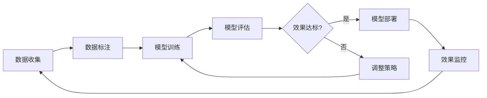

# 4. 模型与提示词管理

## 4.1 多模型路由

### 模型选择策略

智能文档处理系统需要支持多个AI模型，根据不同文档类型和处理任务选择最优模型：

#### 模型池配置

**OCR模型**：
- **PaddleOCR**：百度开源OCR，中文识别效果好，支持多语言
- **Tesseract**：开源OCR引擎，支持100+语言
- **EasyOCR**：简单易用的OCR库，支持80+语言

**NLP模型**：
- **GPT-4**：OpenAI最新模型，理解能力强，适合复杂文档理解
- **Claude 3**：Anthropic模型，安全性好，适合敏感文档
- **通义千问**：阿里云模型，中文优化，成本适中
- **ChatGLM3**：开源模型，可本地部署，数据安全

**向量模型**：
- **text-embedding-ada-002**：OpenAI向量模型，通用性强
- **bge-large-zh**：中文优化向量模型，中文效果更好
- **M3E-base**：开源中文向量模型，性能优秀

**模型选择矩阵**：

| 文档类型 | OCR模型 | NLP模型 | 向量模型 |
|---------|---------|---------|---------|
| 中文合同 | PaddleOCR | 通义千问 | bge-large-zh |
| 英文合同 | Tesseract | GPT-4 | text-embedding-ada-002 |
| 扫描件 | PaddleOCR | GPT-4 | bge-large-zh |
| 技术文档 | EasyOCR | GPT-4 | text-embedding-ada-002 |
| 敏感文档 | PaddleOCR | ChatGLM3（本地） | M3E-base |

#### 选择策略实现

**基于文档类型**：
```python
def select_model_by_doc_type(doc_type, language="zh"):
    """根据文档类型选择模型"""
    if doc_type == "contract":
        if language == "zh":
            return {
                "ocr": "paddleocr",
                "nlp": "qwen-plus",
                "embedding": "bge-large-zh"
            }
        else:
            return {
                "ocr": "tesseract",
                "nlp": "gpt-4",
                "embedding": "text-embedding-ada-002"
            }
    elif doc_type == "technical":
        return {
            "ocr": "easyocr",
            "nlp": "gpt-4",
            "embedding": "text-embedding-ada-002"
        }
```

**基于处理任务**：
```python
def select_model_by_task(task_type):
    """根据处理任务选择模型"""
    if task_type == "ocr":
        return "paddleocr"  # OCR任务使用PaddleOCR
    elif task_type == "extraction":
        return "gpt-4"  # 信息提取使用GPT-4
    elif task_type == "classification":
        return "qwen-plus"  # 分类任务使用通义千问
```

### 路由规则

#### 路由规则配置

**规则1：按文档格式路由**
- PDF文档 → PaddleOCR + GPT-4
- Word文档 → 直接解析 + GPT-4
- 图片文档 → PaddleOCR + GPT-4
- Excel文档 → pandas解析 + GPT-4

**规则2：按文档类型路由**
- 合同文档 → PaddleOCR + 通义千问（中文优化）
- 技术文档 → EasyOCR + GPT-4（理解能力强）
- 报告文档 → PaddleOCR + GPT-4

**规则3：按敏感级别路由**
- 公开文档 → 云端模型（GPT-4、通义千问）
- 内部文档 → 云端模型（GPT-4、通义千问）
- 敏感文档 → 本地模型（ChatGLM3）

**实现示例**：
```python
class ModelRouter:
    def __init__(self):
        self.rules = [
            {"condition": lambda d: d.format == "pdf", "ocr": "paddleocr", "nlp": "gpt-4"},
            {"condition": lambda d: d.type == "contract", "ocr": "paddleocr", "nlp": "qwen-plus"},
            {"condition": lambda d: d.sensitivity == "high", "nlp": "chatglm3-local"},
        ]
    
    def route(self, document):
        for rule in self.rules:
            if rule["condition"](document):
                return {"ocr": rule.get("ocr"), "nlp": rule.get("nlp")}
        return {"ocr": "paddleocr", "nlp": "gpt-4"}  # 默认模型
```

### 负载均衡

#### 负载均衡策略

**轮询（Round Robin）**：
- 依次选择模型实例，均匀分配负载
- 适用于模型性能相近的场景

**加权轮询（Weighted Round Robin）**：
- 根据模型性能分配权重，高性能模型分配更多请求
- 适用于模型性能差异较大的场景

**最少连接（Least Connections）**：
- 选择当前连接数最少的模型实例
- 适用于长连接场景

**响应时间（Response Time）**：
- 选择响应时间最短的模型实例
- 适用于对响应时间敏感的场景

## 4.2 Prompt工程化

### Prompt模板设计

Prompt模板是智能文档处理系统的核心，直接影响信息提取质量：

#### 基础Prompt模板

**文档解析模板**：
```
你是一个专业的文档解析助手，负责从文档中提取结构化信息。

文档内容：
{document_content}

请提取以下信息：
1. 文档标题
2. 文档类型
3. 关键字段（根据文档类型动态调整）
4. 重要条款（如果是合同）

要求：
1. 提取要准确、完整
2. 保持原始信息的准确性
3. 如果信息不存在，请标注为"未找到"

提取结果（JSON格式）：
```

**合同审查模板**：
```
你是一个专业的合同审查助手，负责审查合同并识别风险。

合同内容：
{contract_content}

标准合同模板：
{template_content}

请完成以下任务：
1. 识别合同中的关键条款
2. 对照标准模板检查合规性
3. 识别潜在风险条款
4. 提供修改建议

要求：
1. 审查要全面、专业
2. 风险识别要准确
3. 建议要具体、可操作

审查结果：
```

**信息提取模板**：
```
你是一个专业的信息提取助手，负责从文档中提取指定信息。

文档内容：
{document_content}

需要提取的信息：
{extraction_fields}

请按照以下格式提取信息：
{output_format}

要求：
1. 提取要准确、完整
2. 保持原始信息的准确性
3. 如果信息不存在，请标注为"未找到"

提取结果：
```

#### Prompt优化技巧

**Few-Shot示例**：
```
你是一个专业的信息提取助手。以下是几个示例：

示例1：
文档：合同编号：HT-2024-001，合同金额：100万元
提取：{"contract_no": "HT-2024-001", "amount": "100万元"}

示例2：
文档：订单号：ORD-2024-002，订单金额：50万元
提取：{"order_no": "ORD-2024-002", "amount": "50万元"}

现在请提取以下文档的信息：
文档：{document_content}
提取：
```

**角色设定**：
```
你是一位经验丰富的文档处理专家，具有以下特点：
- 专业知识丰富，能够准确理解各类文档
- 处理能力强，能够快速提取关键信息
- 质量意识高，确保提取信息的准确性
```

**约束条件**：
```
请遵守以下约束：
1. 只能基于提供的文档内容提取信息，不要编造信息
2. 如果信息不存在，请如实标注，不要猜测
3. 保持原始信息的准确性，不要修改或解释
4. 提取结果要符合指定的格式要求
```

### 版本管理

#### Prompt版本控制

**版本命名规则**：
- 主版本号：重大变更，如v2.0.0
- 次版本号：新增功能，如v1.1.0
- 修订版本号：优化调整，如v1.0.1

**版本管理流程**：
1. **开发**：在开发环境创建新版本Prompt
2. **测试**：在测试环境验证Prompt效果
3. **灰度发布**：小流量灰度发布，观察效果
4. **全量发布**：效果达标后全量发布
5. **回滚**：如果效果不达标，快速回滚

### A/B测试

#### A/B测试框架

**测试设计**：
- **对照组**：使用当前版本的Prompt（A组）
- **实验组**：使用新版本的Prompt（B组）
- **分流比例**：50%:50%或90%:10%（根据风险调整）

**评估指标**：
- **提取准确率**：人工评估提取结果是否正确
- **提取完整率**：评估是否提取了所有必要信息
- **处理时间**：Prompt处理时间
- **用户满意度**：用户对提取结果的满意度

## 4.3 微调与持续学习

### 微调策略

#### 微调场景

**领域适配**：
- 针对特定行业（如法律、金融、医疗）进行微调
- 提升领域专业术语的理解和提取能力

**任务适配**：
- 针对特定任务（如合同审查、信息提取）进行微调
- 提升任务执行效果

#### 微调方法

**全量微调（Full Fine-tuning）**：
- 更新模型所有权重参数
- 效果最好，但成本高，需要大量GPU资源

**LoRA微调（Low-Rank Adaptation）**：
- 只训练少量低秩矩阵，大幅降低训练成本
- 效果接近全量微调，推荐使用

**实现示例**：
```python
from peft import LoraConfig, get_peft_model

# LoRA配置
lora_config = LoraConfig(
    r=16,  # 低秩矩阵的秩
    lora_alpha=32,  # LoRA缩放参数
    target_modules=["q_proj", "v_proj"],  # 目标模块
    lora_dropout=0.1,
)

# 应用LoRA
model = get_peft_model(base_model, lora_config)
```

### 持续学习流程

#### 学习循环



#### 在线学习

**增量学习**：
- 定期收集新的文档处理数据
- 增量更新模型，避免遗忘旧知识
- 使用经验回放（Experience Replay）技术

**强化学习**：
- 基于用户反馈进行强化学习
- 优化提取策略，提升用户满意度
- 使用PPO（Proximal Policy Optimization）算法

### 模型评估

#### 评估指标

**自动评估指标**：
- **BLEU分数**：评估生成文本与参考文本的相似度
- **ROUGE分数**：评估召回率和精确率
- **F1分数**：评估提取准确率和完整率的平衡

**人工评估指标**：
- **准确性**：提取结果是否正确（1-5分）
- **完整性**：是否提取了所有必要信息（1-5分）
- **相关性**：提取的信息是否相关（1-5分）

#### 评估流程

**离线评估**：
1. 准备测试集（100-500个文档）
2. 使用模型处理文档
3. 人工评估或自动评估
4. 计算各项指标
5. 生成评估报告

**在线评估**：
1. 实时收集用户反馈
2. 计算用户满意度
3. 监控提取质量指标
4. 发现异常自动告警