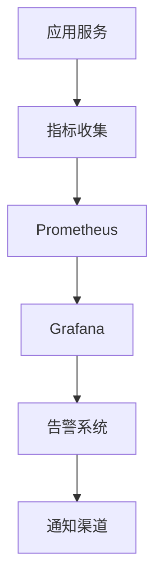

# 9. 监控与可观测

## 9.1 业务指标

### 核心业务指标

智能文档处理系统的核心业务指标用于评估处理质量和业务效果：

#### 处理质量指标

**1. OCR识别准确率（OCR Accuracy）**
- **定义**：OCR识别正确的文字比例
- **计算公式**：OCR准确率 = (正确识别字数 / 总字数) × 100%
- **目标值**：≥98%
- **监控频率**：实时监控，每小时统计

**2. 信息提取准确率（Extraction Accuracy）**
- **定义**：信息提取正确的比例
- **计算公式**：提取准确率 = (正确提取字段数 / 总字段数) × 100%
- **目标值**：≥95%
- **监控频率**：实时监控，每天统计

**3. 文档处理完整率（Processing Completeness）**
- **定义**：文档成功处理的比例
- **计算公式**：完整率 = (成功处理文档数 / 总文档数) × 100%
- **目标值**：≥95%
- **监控频率**：实时监控，每小时统计

#### 处理效率指标

**4. 平均处理时间（Average Processing Time）**
- **定义**：处理一个文档的平均时间
- **计算公式**：平均处理时间 = 总处理时间 / 文档数
- **目标值**：≤10分钟/文档
- **监控频率**：实时监控，每分钟统计

**5. 批量处理能力（Batch Processing Capacity）**
- **定义**：单位时间内处理的文档数量
- **计算公式**：处理能力 = 处理文档数 / 时间周期
- **目标值**：≥100文档/小时
- **监控频率**：每小时统计

### 指标监控

#### 监控架构



#### 监控实现

**Prometheus配置**：
```yaml
global:
  scrape_interval: 15s
  evaluation_interval: 15s

scrape_configs:
  - job_name: 'document-processing'
    static_configs:
      - targets: ['localhost:8000']
    metrics_path: '/metrics'
```

**指标收集代码**：
```python
from prometheus_client import Counter, Histogram, Gauge

# 定义指标
ocr_accuracy = Gauge('ocr_accuracy', 'OCR recognition accuracy')
extraction_accuracy = Gauge('extraction_accuracy', 'Information extraction accuracy')
processing_time = Histogram('processing_time_seconds', 'Document processing time in seconds')
documents_processed = Counter('documents_processed_total', 'Total number of documents processed')

# 记录指标
def process_document(document):
    start_time = time.time()
    result = extract_information(document)
    processing_time.observe(time.time() - start_time)
    documents_processed.inc()
    
    # 更新准确率
    accuracy = calculate_accuracy(result)
    extraction_accuracy.set(accuracy)
```

### 告警机制

#### 告警规则

**1. OCR准确率告警**
- **条件**：OCR准确率 &lt; 95%
- **级别**：警告
- **通知**：邮件 + 短信

**2. 处理时间告警**
- **条件**：平均处理时间 &gt; 30分钟
- **级别**：严重
- **通知**：电话 + 短信 + 邮件

**3. 系统可用性告警**
- **条件**：可用性 &lt; 99%
- **级别**：严重
- **通知**：电话 + 短信 + 邮件

## 9.2 模型指标

### 模型性能指标

#### 准确性指标

**1. OCR模型准确率**
- **定义**：OCR模型识别文字的准确程度
- **计算方法**：人工评估或自动评估
- **目标值**：≥98%
- **监控频率**：每天统计

**2. 信息提取模型准确率**
- **定义**：信息提取模型提取信息的准确程度
- **计算方法**：人工评估或自动评估
- **目标值**：≥95%
- **监控频率**：每天统计

#### 效率指标

**3. 推理延迟（Inference Latency）**
- **定义**：模型处理文档的时间
- **计算方法**：记录推理开始到结束的时间
- **目标值**：≤5秒
- **监控频率**：实时监控

**4. Token使用量（Token Usage）**
- **定义**：每次调用使用的Token数量
- **计算方法**：统计输入和输出Token数
- **目标值**：输入&lt;2000，输出&lt;500
- **监控频率**：实时统计

### 模型监控

#### 监控实现

**模型指标收集**：
```python
class ModelMonitor:
    def __init__(self):
        self.metrics = {
            "ocr_accuracy": [],
            "extraction_accuracy": [],
            "latency": [],
            "token_usage": []
        }
    
    def record_processing(self, document, result, latency, tokens):
        """记录处理指标"""
        self.metrics["latency"].append(latency)
        self.metrics["token_usage"].append(tokens)
        
        # 评估准确性（异步）
        ocr_accuracy = self.evaluate_ocr_accuracy(document, result)
        extraction_accuracy = self.evaluate_extraction_accuracy(document, result)
        self.metrics["ocr_accuracy"].append(ocr_accuracy)
        self.metrics["extraction_accuracy"].append(extraction_accuracy)
    
    def get_statistics(self):
        """获取统计信息"""
        return {
            "avg_ocr_accuracy": np.mean(self.metrics["ocr_accuracy"]),
            "avg_extraction_accuracy": np.mean(self.metrics["extraction_accuracy"]),
            "avg_latency": np.mean(self.metrics["latency"])
        }
```

### 模型退化检测

#### 退化检测方法

**1. 统计过程控制（SPC）**
- 使用控制图监控指标
- 检测异常波动
- 自动告警

**2. 时间序列分析**
- 分析指标趋势
- 预测未来值
- 检测异常偏离

**3. 对比分析**
- 对比不同时间段的表现
- 对比不同模型版本
- 识别性能下降

## 9.3 链路追踪

### 追踪系统

#### 分布式追踪

**OpenTelemetry集成**：
```python
from opentelemetry import trace
from opentelemetry.sdk.trace import TracerProvider
from opentelemetry.sdk.trace.export import BatchSpanProcessor
from opentelemetry.exporter.jaeger import JaegerExporter

# 初始化追踪
trace.set_tracer_provider(TracerProvider())
tracer = trace.get_tracer(__name__)

# 配置Jaeger导出器
jaeger_exporter = JaegerExporter(
    agent_host_name="localhost",
    agent_port=6831,
)
span_processor = BatchSpanProcessor(jaeger_exporter)
trace.get_tracer_provider().add_span_processor(span_processor)

# 使用追踪
def process_document(document):
    with tracer.start_as_current_span("process_document") as span:
        span.set_attribute("document_id", document.id)
        span.set_attribute("document_type", document.type)
        
        # 处理文档
        result = extract_information(document)
        
        span.set_attribute("extraction_fields", len(result))
        return result
```

### 日志管理

#### 日志级别

**DEBUG**：详细的调试信息
**INFO**：一般信息，记录正常流程
**WARNING**：警告信息，不影响功能
**ERROR**：错误信息，功能受影响
**CRITICAL**：严重错误，系统可能崩溃

#### 日志格式

**结构化日志**：
```json
{
    "timestamp": "2024-01-01T10:00:00Z",
    "level": "INFO",
    "service": "document-processing",
    "trace_id": "abc123",
    "span_id": "def456",
    "message": "处理文档",
    "context": {
        "document_id": "doc_123",
        "document_type": "contract",
        "processing_time": 5.2
    }
}
```

### 问题定位

#### 问题定位流程

**1. 告警触发**
- 系统自动检测异常
- 发送告警通知

**2. 日志查询**
- 根据Trace ID查询日志
- 分析错误日志
- 定位问题根源

**3. 指标分析**
- 查看相关指标
- 分析指标异常
- 识别问题模式

**4. 根因分析**
- 分析问题原因
- 制定解决方案
- 实施修复