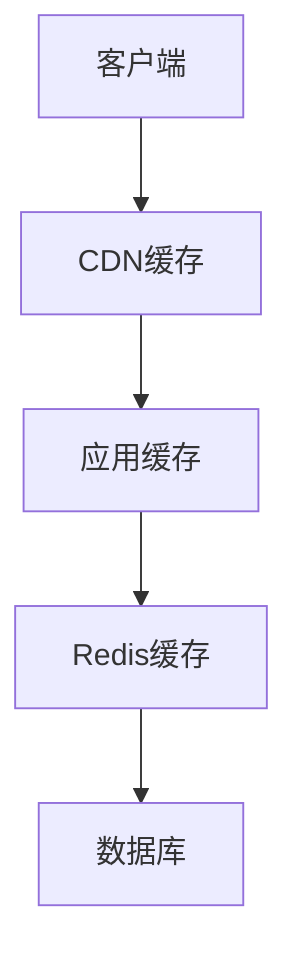

# 8. 性能与成本

## 8.1 弹性伸缩

### 伸缩策略

智能文档处理系统需要根据负载自动伸缩，确保服务稳定和成本优化：

#### 水平伸缩（Horizontal Scaling）

**自动伸缩规则**：
- **CPU使用率**：&gt;70%时扩容，&lt;30%时缩容
- **内存使用率**：&gt;80%时扩容，&lt;40%时缩容
- **队列长度**：&gt;100时扩容，&lt;10时缩容
- **处理时间**：平均处理时间&gt;60秒时扩容

**Kubernetes HPA配置**：
```yaml
apiVersion: autoscaling/v2
kind: HorizontalPodAutoscaler
metadata:
  name: document-processing-hpa
spec:
  scaleTargetRef:
    apiVersion: apps/v1
    kind: Deployment
    name: document-processing
  minReplicas: 2
  maxReplicas: 20
  metrics:
  - type: Resource
    resource:
      name: cpu
      target:
        type: Utilization
        averageUtilization: 70
  - type: Resource
    resource:
      name: memory
      target:
        type: Utilization
        averageUtilization: 80
```

### 资源调度

#### 调度策略

**节点选择**：
- GPU节点：用于OCR和AI模型推理
- CPU节点：用于文档解析和业务逻辑
- 内存优化节点：用于缓存服务

**Pod调度**：
```yaml
apiVersion: v1
kind: Pod
spec:
  nodeSelector:
    node-type: gpu
  tolerations:
  - key: nvidia.com/gpu
    operator: Exists
    effect: NoSchedule
  containers:
  - name: ocr-service
    resources:
      requests:
        nvidia.com/gpu: 1
      limits:
        nvidia.com/gpu: 1
```

### 成本优化

#### 成本优化策略

**1. 使用Spot实例**
- 非关键服务使用Spot实例
- 成本降低60-90%
- 需要容忍中断

**2. 预留实例**
- 长期稳定负载使用预留实例
- 成本降低30-50%
- 需要提前规划

**3. 自动休眠**
- 低峰期自动休眠非关键服务
- 节省计算资源
- 需要快速唤醒机制

**4. 模型选择优化**
- 简单文档使用低成本模型
- 复杂文档使用高性能模型
- 平衡成本和效果

## 8.2 缓存策略

### 缓存设计

#### 多级缓存架构



**1. CDN缓存**
- 缓存静态资源（JS、CSS、图片）
- 缓存常见文档的处理结果
- 减少服务器压力

**2. 应用缓存（本地缓存）**
- 缓存热点文档
- 缓存处理结果
- 减少网络请求

**3. Redis缓存（分布式缓存）**
- 缓存文档解析结果
- 缓存OCR识别结果
- 缓存信息提取结果

#### 缓存策略

**1. 文档解析结果缓存**
- **Key**：文档文件MD5
- **Value**：解析结果
- **TTL**：24小时
- **更新策略**：文档更新时清除

**2. OCR识别结果缓存**
- **Key**：图片文件MD5
- **Value**：识别结果
- **TTL**：7天
- **更新策略**：图片更新时清除

**3. 信息提取结果缓存**
- **Key**：文档ID + 提取字段
- **Value**：提取结果
- **TTL**：1小时
- **更新策略**：文档更新时清除

### 缓存更新

#### 更新策略

**1. 失效更新（Cache-Aside）**
- 数据更新时删除缓存
- 下次读取时重新加载
- 简单可靠，推荐使用

**2. 定时更新**
- 定时刷新热点数据
- 保证数据新鲜度
- 适合数据变化不频繁的场景

### 缓存命中率优化

#### 优化策略

**1. 预热缓存**
- 系统启动时加载热点数据
- 业务高峰期前预热
- 提升缓存命中率

**2. 缓存分层**
- 热点数据使用更快的存储
- 冷数据使用较慢的存储
- 平衡成本和性能

**3. 智能淘汰**
- 使用LRU（最近最少使用）算法
- 使用LFU（最不经常使用）算法
- 根据业务特点选择淘汰策略

#### 监控指标

**缓存命中率**：
- 目标：&gt;80%
- 监控：实时监控命中率
- 告警：命中率&lt;70%时告警

**缓存性能**：
- 响应时间：&lt;10ms
- 吞吐量：&gt;10000 QPS
- 错误率：&lt;0.01%

## 8.3 成本仪表盘

### 成本监控

#### 成本分类

**1. 计算成本**
- 服务器成本
- GPU成本（OCR和AI推理）
- 容器服务成本

**2. 存储成本**
- 数据库存储成本
- 对象存储成本（文档存储）
- 备份存储成本

**3. 网络成本**
- 带宽成本
- CDN成本
- API调用成本

**4. AI模型成本**
- OCR API调用成本
- 大语言模型API调用成本
- 向量模型推理成本

### 成本分析

#### 成本分析维度

**1. 按服务分析**
- 各服务的成本占比
- 成本趋势分析
- 成本异常检测

**2. 按文档类型分析**
- 不同文档类型的处理成本
- 成本优化建议
- 成本预测

**3. 按时间分析**
- 日/周/月成本趋势
- 高峰期成本分析
- 成本预测

### 成本优化建议

#### 优化建议生成

**1. 模型选择优化**
- 分析各模型的使用场景
- 推荐成本效益最优的模型
- 预计节省成本

**2. 缓存优化**
- 分析缓存命中率
- 推荐缓存策略调整
- 预计节省成本

**3. 资源优化**
- 分析资源使用率
- 推荐资源调整方案
- 预计节省成本

#### 成本优化目标

**短期目标（1-3个月）**：
- 成本降低20%
- 通过缓存和资源优化实现

**中期目标（3-6个月）**：
- 成本降低40%
- 通过架构优化和模型选择实现

**长期目标（6-12个月）**：
- 成本降低60%
- 通过全面优化实现