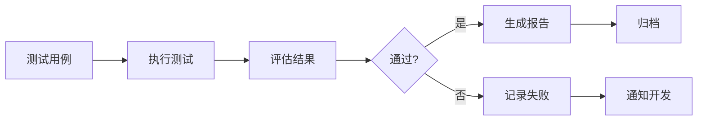
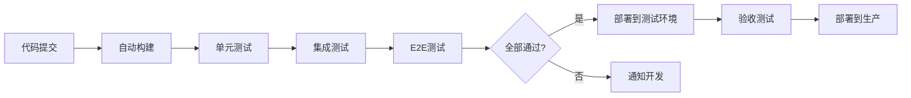

# 7. 质量与测试

## 7.1 提示词单元测试

### 测试框架

提示词单元测试是确保文档处理质量的关键环节：

#### 测试框架选择

**LangChain Evaluators**：
- LangChain提供的评估框架
- 支持多种评估指标
- 易于集成到现有系统

**自定义测试框架**：
- 基于项目需求定制
- 灵活度高
- 完全可控

#### 测试框架实现

**基础测试框架**：
```python
import unittest

class PromptTestCase(unittest.TestCase):
    def setUp(self):
        self.test_cases = [
            {
                "document": "合同编号：HT-2024-001，合同金额：100万元",
                "expected": {
                    "contract_no": "HT-2024-001",
                    "amount": "100万元"
                },
                "prompt": "extraction_prompt_v1"
            }
        ]
    
    def test_extraction_accuracy(self):
        for case in self.test_cases:
            result = self.extract_information(
                case["document"],
                case["prompt"]
            )
            self.assertEqual(result, case["expected"])
```

### 测试用例设计

#### 测试用例类型

**1. 功能测试用例**
- **目标**：验证Prompt能否正确提取信息
- **示例**：
  - 文档："合同编号：HT-2024-001，合同金额：100万元"
  - 期望：提取合同编号和金额
  - 验证：提取结果与期望一致

**2. 边界测试用例**
- **目标**：验证Prompt在边界情况下的表现
- **示例**：
  - 文档：空文档、超长文档、特殊字符
  - 期望：正确处理，不崩溃
  - 验证：返回合理结果或错误提示

**3. 负面测试用例**
- **目标**：验证Prompt对错误输入的处理
- **示例**：
  - 文档：格式错误、信息缺失
  - 期望：正确处理，标注缺失信息
  - 验证：不返回错误信息

**4. 多文档类型测试用例**
- **目标**：验证Prompt对不同文档类型的处理
- **示例**：
  - 文档：合同、发票、报告等不同类型
  - 期望：正确识别类型并提取信息
  - 验证：提取结果符合文档类型特点

### 自动化测试

#### 测试自动化流程



#### 持续集成集成

**GitHub Actions配置**：
```yaml
name: Prompt Tests

on:
  push:
    branches: [ main ]
  pull_request:
    branches: [ main ]

jobs:
  test:
    runs-on: ubuntu-latest
    steps:
      - uses: actions/checkout@v2
      - name: Set up Python
        uses: actions/setup-python@v2
        with:
          python-version: '3.11'
      - name: Install dependencies
        run: |
          pip install -r requirements.txt
      - name: Run tests
        run: |
          python -m pytest tests/prompt_tests.py
```

## 7.2 端到端自动化

### E2E测试流程

端到端测试验证整个系统的完整流程：

#### 测试场景

**场景1：文档上传和处理流程**
1. 用户上传文档
2. 系统识别文档格式
3. 系统解析文档
4. 系统提取信息
5. 用户查看结果

**场景2：批量处理流程**
1. 用户批量上传文档
2. 系统创建批量处理任务
3. 系统并行处理文档
4. 系统汇总处理结果
5. 用户下载结果

**场景3：合同审查流程**
1. 用户上传合同
2. 系统识别合同类型
3. 系统审查合同
4. 系统识别风险条款
5. 用户查看审查报告

### 测试覆盖

#### 覆盖范围

**功能覆盖**：
- 所有核心功能点
- 所有API接口
- 所有用户流程

**场景覆盖**：
- 正常场景
- 异常场景
- 边界场景

**数据覆盖**：
- 不同类型文档
- 不同格式文档
- 不同大小文档

### 持续集成

#### CI/CD流程



## 7.3 红蓝对抗

### 对抗测试方法

红蓝对抗测试模拟攻击场景，验证系统安全性：

#### 攻击类型

**1. 恶意文档攻击**
- **目标**：通过恶意文档绕过系统限制
- **示例**：
  - 上传包含恶意代码的文档
  - 期望：系统拒绝处理或安全处理
  - 验证：系统不执行恶意代码

**2. 越权访问攻击**
- **目标**：访问其他用户的文档
- **示例**：
  - 尝试访问其他用户的文档ID
  - 期望：系统拒绝访问
  - 验证：返回权限错误

**3. 数据泄露攻击**
- **目标**：获取敏感信息
- **示例**：
  - 尝试提取其他用户的敏感信息
  - 期望：系统拒绝提取
  - 验证：不返回敏感信息

### 安全测试

#### 安全测试内容

**1. 输入验证测试**
- 文件类型验证
- 文件大小限制
- 恶意文件检测

**2. 认证授权测试**
- API Key有效性测试
- Token有效性测试
- 权限控制测试

**3. 数据安全测试**
- 数据加密测试
- 数据传输安全测试
- 数据存储安全测试

### 性能测试

#### 性能测试类型

**1. 负载测试**
- **目标**：验证系统在正常负载下的性能
- **指标**：响应时间、吞吐量、错误率
- **方法**：模拟正常用户负载

**2. 压力测试**
- **目标**：验证系统在极限负载下的表现
- **指标**：最大并发数、系统崩溃点
- **方法**：逐步增加负载直到系统崩溃

**3. 稳定性测试**
- **目标**：验证系统长时间运行的稳定性
- **指标**：内存泄漏、CPU使用率、错误率
- **方法**：长时间运行，监控资源使用

#### 性能指标

**响应时间**：
- P50 &lt; 10秒
- P95 &lt; 30秒
- P99 &lt; 60秒

**吞吐量**：
- 单机处理能力 &gt; 100文档/小时
- 集群处理能力 &gt; 10000文档/小时

**错误率**：
- 错误率 &lt; 0.1%
- 可用性 &gt; 99.9%