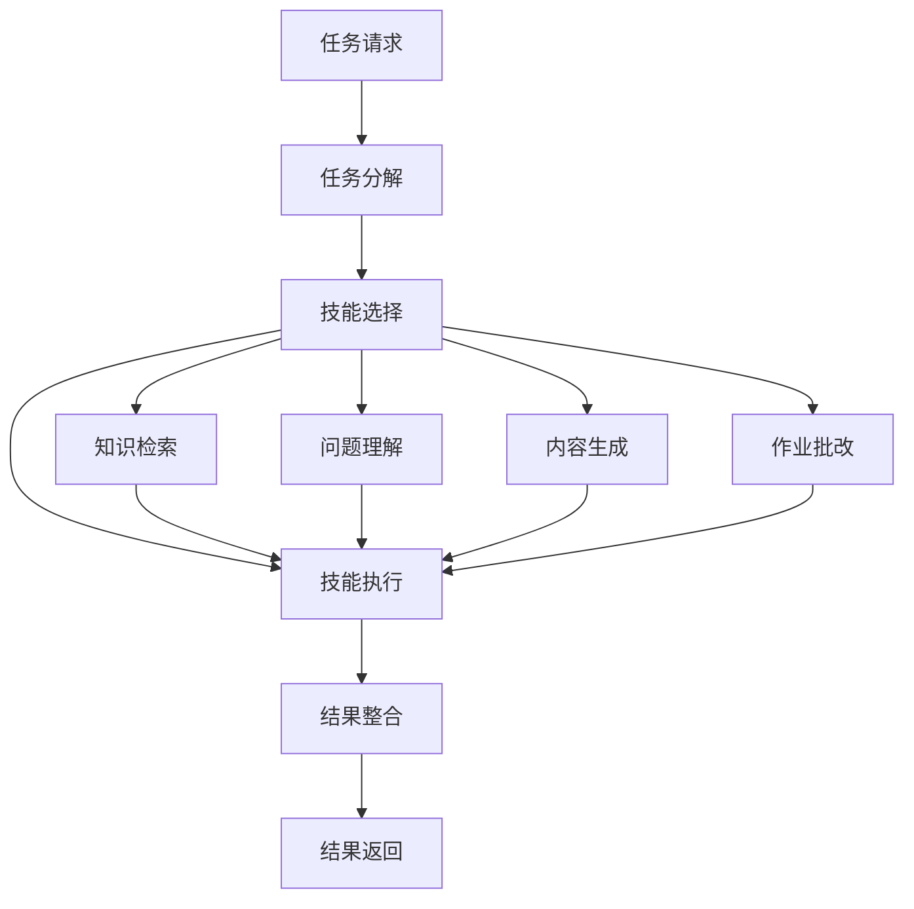
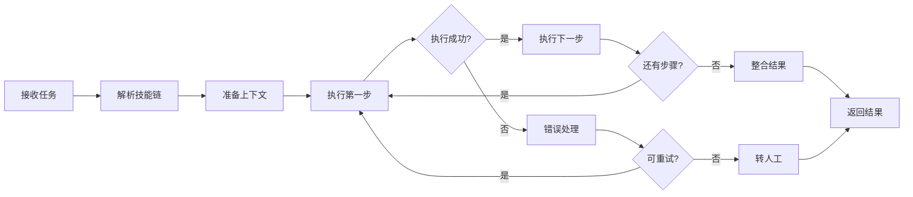
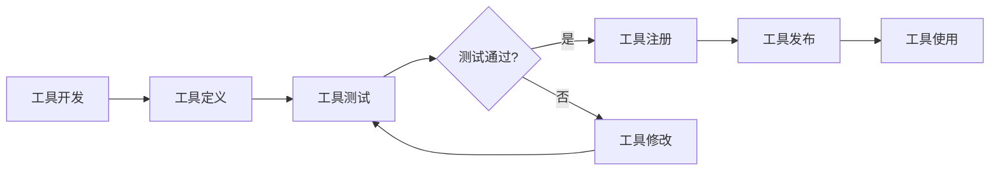
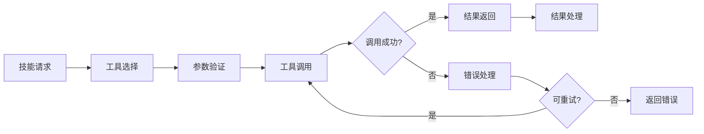

# 5. 智能体与业务编排

## 5.1 Agent技能链

### 技能定义

智能教育系统中的Agent需要具备多种技能，通过技能链的方式组合使用，完成复杂的教育任务。

#### 核心技能

- **知识检索技能（Knowledge Retrieval）**：
  - 从知识库中检索相关信息
  - 支持语义检索和关键词检索
  - 返回相关文档和知识点

- **问题理解技能（Question Understanding）**：
  - 理解学习者的问题意图
  - 识别问题类型（概念性问题、过程性问题、应用性问题等）
  - 抽取关键实体和知识点

- **内容生成技能（Content Generation）**：
  - 基于检索结果生成回答
  - 生成学习内容、练习题、解析等
  - 适配学习者的知识水平

- **作业批改技能（Homework Grading）**：
  - 识别作业类型和题目
  - 批改选择题、填空题、简答题等
  - 生成批改结果和解析

- **学习路径规划技能（Learning Path Planning）**：
  - 分析学习者能力模型
  - 基于知识图谱规划学习路径
  - 推荐学习内容和资源

- **学习效果评估技能（Learning Assessment）**：
  - 评估知识点掌握度
  - 分析学习行为
  - 预测学习效果

#### 技能定义示例

```python
# Agent技能定义
agent_skills = {
    "knowledge_retrieval": {
        "name": "知识检索",
        "description": "从知识库中检索相关信息",
        "input": {
            "query": "string",  # 查询问题
            "top_k": "int"  # 返回结果数量
        },
        "output": {
            "documents": "list",  # 相关文档列表
            "scores": "list"  # 相关性分数
        },
        "tools": ["vector_search", "keyword_search"]
    },
    "question_understanding": {
        "name": "问题理解",
        "description": "理解学习者的问题意图",
        "input": {
            "question": "string"  # 学习者问题
        },
        "output": {
            "intent": "string",  # 问题意图
            "entities": "list",  # 实体列表
            "knowledge_points": "list"  # 相关知识点
        },
        "tools": ["nlp_model", "ner_model"]
    },
    "content_generation": {
        "name": "内容生成",
        "description": "生成学习内容和回答",
        "input": {
            "context": "string",  # 上下文信息
            "task": "string"  # 生成任务
        },
        "output": {
            "content": "string"  # 生成的内容
        },
        "tools": ["llm_model"]
    }
}
```

### 技能链设计

#### 技能链架构



#### 智能答疑技能链

```python
# 智能答疑技能链
qa_skill_chain = {
    "name": "智能答疑",
    "steps": [
        {
            "skill": "question_understanding",
            "input": {"question": "{user_question}"},
            "output": {"intent": "intent", "entities": "entities"}
        },
        {
            "skill": "knowledge_retrieval",
            "input": {
                "query": "{user_question}",
                "knowledge_points": "{entities.knowledge_points}",
                "top_k": 5
            },
            "output": {"documents": "related_docs"}
        },
        {
            "skill": "content_generation",
            "input": {
                "context": "{related_docs}",
                "question": "{user_question}",
                "student_level": "{student.knowledge_level}",
                "task": "answer_generation"
            },
            "output": {"answer": "generated_answer"}
        }
    ],
    "error_handling": {
        "on_failure": "escalate_to_human",
        "retry_count": 2
    }
}
```

#### 作业批改技能链

```python
# 作业批改技能链
grading_skill_chain = {
    "name": "作业批改",
    "steps": [
        {
            "skill": "ocr_recognition",
            "input": {"image": "{homework_image}"},
            "output": {"text": "recognized_text"}
        },
        {
            "skill": "question_understanding",
            "input": {"question": "{recognized_text}"},
            "output": {"question_type": "type", "entities": "entities"}
        },
        {
            "skill": "knowledge_retrieval",
            "input": {
                "query": "{recognized_text}",
                "top_k": 3
            },
            "output": {"standard_answer": "answer"}
        },
        {
            "skill": "homework_grading",
            "input": {
                "question": "{recognized_text}",
                "student_answer": "{student_answer}",
                "standard_answer": "{answer}",
                "question_type": "{type}"
            },
            "output": {
                "is_correct": "correct",
                "score": "score",
                "feedback": "feedback"
            }
        }
    ]
}
```

### 执行流程

#### 技能链执行引擎

```python
# 技能链执行引擎
class SkillChainExecutor:
    def __init__(self, skill_registry, workflow_engine):
        self.skill_registry = skill_registry
        self.workflow_engine = workflow_engine
    
    def execute(self, skill_chain, context):
        """执行技能链"""
        results = {}
        
        for step in skill_chain["steps"]:
            # 获取技能
            skill = self.skill_registry.get_skill(step["skill"])
            
            # 准备输入
            inputs = self._prepare_inputs(step["input"], context, results)
            
            # 执行技能
            try:
                output = skill.execute(inputs)
                results[step["output"]] = output
            except Exception as e:
                # 错误处理
                if skill_chain.get("error_handling"):
                    self._handle_error(e, skill_chain["error_handling"])
                else:
                    raise
        
        return results
    
    def _prepare_inputs(self, input_template, context, results):
        """准备输入参数"""
        inputs = {}
        for key, value in input_template.items():
            # 支持变量替换
            if isinstance(value, str) and value.startswith("{"):
                var_name = value[1:-1]
                if "." in var_name:
                    # 支持嵌套属性访问
                    parts = var_name.split(".")
                    obj = context if parts[0] in context else results
                    for part in parts[1:]:
                        obj = getattr(obj, part) if hasattr(obj, part) else obj.get(part)
                    inputs[key] = obj
                else:
                    inputs[key] = context.get(var_name) or results.get(var_name)
            else:
                inputs[key] = value
        return inputs
```

#### 执行流程示例



## 5.2 工具注册中心

### 工具类型

智能教育系统需要集成多种工具，以支持Agent的技能执行。

#### 检索工具

- **向量检索工具（Vector Search Tool）**：
  - 功能：从向量数据库中检索相似文档
  - 实现：Milvus、Qdrant等向量数据库
  - 配置：索引类型、相似度阈值、返回数量

- **关键词检索工具（Keyword Search Tool）**：
  - 功能：基于关键词进行精确匹配检索
  - 实现：Elasticsearch、MySQL全文索引
  - 配置：分词器、检索字段、排序规则

- **知识图谱检索工具（Knowledge Graph Search Tool）**：
  - 功能：从知识图谱中检索实体和关系
  - 实现：Neo4j、ArangoDB
  - 配置：查询语言、返回格式

#### 生成工具

- **LLM生成工具（LLM Generation Tool）**：
  - 功能：调用大语言模型生成内容
  - 实现：OpenAI API、Azure OpenAI、本地模型
  - 配置：模型选择、温度参数、最大token数

- **模板生成工具（Template Generation Tool）**：
  - 功能：基于模板生成内容
  - 实现：Jinja2、Mustache等模板引擎
  - 配置：模板路径、变量映射

#### 处理工具

- **OCR识别工具（OCR Recognition Tool）**：
  - 功能：识别图片中的文字
  - 实现：PaddleOCR、Tesseract
  - 配置：语言模型、识别精度

- **语音识别工具（Speech Recognition Tool）**：
  - 功能：将语音转换为文字
  - 实现：Azure Speech、百度语音
  - 配置：语言、采样率

- **数学公式识别工具（Math Formula Recognition Tool）**：
  - 功能：识别数学公式
  - 实现：MathPix、LaTeX识别
  - 配置：识别模式、输出格式

#### 工具定义示例

```python
# 工具定义
tools = {
    "vector_search": {
        "name": "向量检索",
        "type": "retrieval",
        "description": "从向量数据库中检索相似文档",
        "implementation": "milvus_client",
        "config": {
            "collection_name": "education_knowledge",
            "top_k": 5,
            "similarity_threshold": 0.7
        },
        "input_schema": {
            "query": {"type": "string", "required": True},
            "top_k": {"type": "int", "default": 5}
        },
        "output_schema": {
            "documents": {"type": "list"},
            "scores": {"type": "list"}
        }
    },
    "llm_generate": {
        "name": "LLM生成",
        "type": "generation",
        "description": "调用大语言模型生成内容",
        "implementation": "openai_client",
        "config": {
            "model": "gpt-4",
            "temperature": 0.7,
            "max_tokens": 2000
        },
        "input_schema": {
            "prompt": {"type": "string", "required": True},
            "temperature": {"type": "float", "default": 0.7}
        },
        "output_schema": {
            "content": {"type": "string"}
        }
    }
}
```

### 工具注册流程

#### 工具注册流程



#### 工具注册实现

```python
# 工具注册中心
class ToolRegistry:
    def __init__(self):
        self.tools = {}
    
    def register_tool(self, tool_def):
        """注册工具"""
        # 验证工具定义
        self._validate_tool_def(tool_def)
        
        # 创建工具实例
        tool_instance = self._create_tool_instance(tool_def)
        
        # 注册工具
        self.tools[tool_def["name"]] = {
            "definition": tool_def,
            "instance": tool_instance,
            "status": "active"
        }
    
    def get_tool(self, tool_name):
        """获取工具"""
        if tool_name not in self.tools:
            raise ValueError(f"Tool {tool_name} not found")
        return self.tools[tool_name]["instance"]
    
    def list_tools(self, tool_type=None):
        """列出工具"""
        if tool_type:
            return [name for name, tool in self.tools.items() 
                   if tool["definition"]["type"] == tool_type]
        return list(self.tools.keys())
```

### 工具调用机制

#### 工具调用流程



#### 工具调用实现

```python
# 工具调用器
class ToolInvoker:
    def __init__(self, tool_registry):
        self.tool_registry = tool_registry
        self.call_history = []
    
    def invoke(self, tool_name, inputs):
        """调用工具"""
        # 获取工具
        tool = self.tool_registry.get_tool(tool_name)
        
        # 验证输入
        self._validate_inputs(tool, inputs)
        
        # 调用工具
        try:
            result = tool.execute(inputs)
            
            # 记录调用历史
            self.call_history.append({
                "tool": tool_name,
                "inputs": inputs,
                "result": result,
                "timestamp": datetime.now()
            })
            
            return result
        except Exception as e:
            # 错误处理
            self._handle_error(tool_name, inputs, e)
            raise
```

## 5.3 长记忆与状态管理

### 记忆机制

#### 记忆类型

- **短期记忆（Short-term Memory）**：
  - 存储当前对话的上下文信息
  - 容量有限，仅保留最近的对话
  - 用于理解当前对话的上下文

- **长期记忆（Long-term Memory）**：
  - 存储学习者的历史学习数据
  - 包括学习记录、作业记录、测试记录等
  - 用于个性化推荐和学习路径规划

- **工作记忆（Working Memory）**：
  - 存储当前任务的工作状态
  - 包括任务进度、中间结果等
  - 用于任务执行和状态管理

#### 记忆存储结构

```python
# 记忆存储结构
memory_structure = {
    "short_term": {
        "conversation_history": [
            {
                "role": "user",
                "content": "什么是光合作用？",
                "timestamp": "2024-01-01 10:00:00"
            },
            {
                "role": "assistant",
                "content": "光合作用是植物利用光能...",
                "timestamp": "2024-01-01 10:00:05"
            }
        ],
        "max_length": 10  # 最多保留10轮对话
    },
    "long_term": {
        "learning_history": {
            "courses": [],
            "homework": [],
            "tests": []
        },
        "knowledge_model": {
            "mastered_points": [],
            "weak_points": [],
            "learning_speed": {}
        }
    },
    "working": {
        "current_task": "homework_grading",
        "task_state": "processing",
        "intermediate_results": {}
    }
}
```

### 状态管理

#### 状态类型

- **对话状态（Conversation State）**：
  - 当前对话的主题和上下文
  - 对话轮数和历史
  - 用户意图和实体

- **任务状态（Task State）**：
  - 当前执行的任务
  - 任务进度和结果
  - 任务依赖关系

- **用户状态（User State）**：
  - 用户当前的学习状态
  - 用户偏好和设置
  - 用户会话信息

#### 状态管理实现

```python
# 状态管理器
class StateManager:
    def __init__(self, storage_backend):
        self.storage = storage_backend
        self.states = {}
    
    def get_state(self, session_id, state_type):
        """获取状态"""
        key = f"{session_id}:{state_type}"
        if key not in self.states:
            self.states[key] = self.storage.load(key) or {}
        return self.states[key]
    
    def update_state(self, session_id, state_type, updates):
        """更新状态"""
        state = self.get_state(session_id, state_type)
        state.update(updates)
        self.states[f"{session_id}:{state_type}"] = state
        self.storage.save(f"{session_id}:{state_type}", state)
    
    def clear_state(self, session_id, state_type):
        """清除状态"""
        key = f"{session_id}:{state_type}"
        if key in self.states:
            del self.states[key]
        self.storage.delete(key)
```

### 上下文维护

#### 上下文管理

- **上下文窗口**：维护固定大小的上下文窗口，保留最近的对话
- **上下文压缩**：当上下文过长时，压缩历史信息，保留关键信息
- **上下文注入**：将相关上下文注入到Prompt中，提升回答质量

#### 上下文维护实现

```python
# 上下文管理器
class ContextManager:
    def __init__(self, max_length=10):
        self.max_length = max_length
        self.contexts = {}
    
    def add_message(self, session_id, role, content):
        """添加消息到上下文"""
        if session_id not in self.contexts:
            self.contexts[session_id] = []
        
        self.contexts[session_id].append({
            "role": role,
            "content": content,
            "timestamp": datetime.now()
        })
        
        # 保持上下文窗口大小
        if len(self.contexts[session_id]) > self.max_length:
            self.contexts[session_id] = self.contexts[session_id][-self.max_length:]
    
    def get_context(self, session_id):
        """获取上下文"""
        return self.contexts.get(session_id, [])
    
    def compress_context(self, session_id):
        """压缩上下文"""
        context = self.contexts.get(session_id, [])
        if len(context) <= self.max_length:
            return context
        
        # 保留最重要的消息
        # 策略：保留第一条和最后N条
        compressed = [context[0]] + context[-self.max_length+1:]
        return compressed
```
