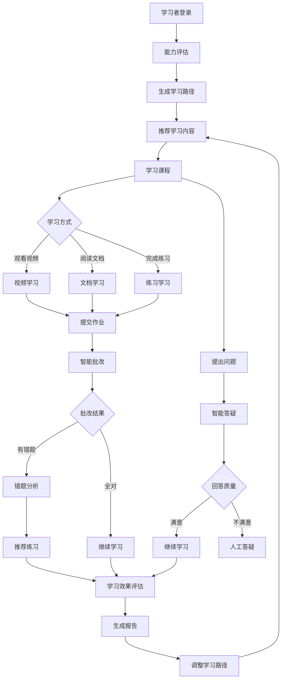
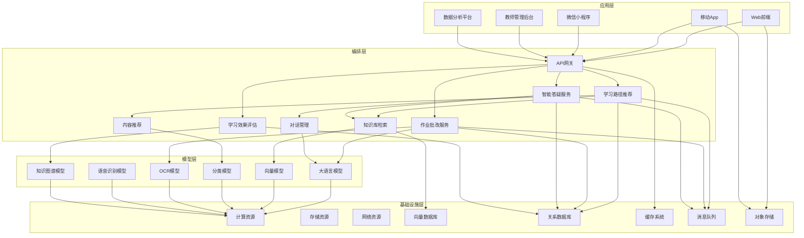
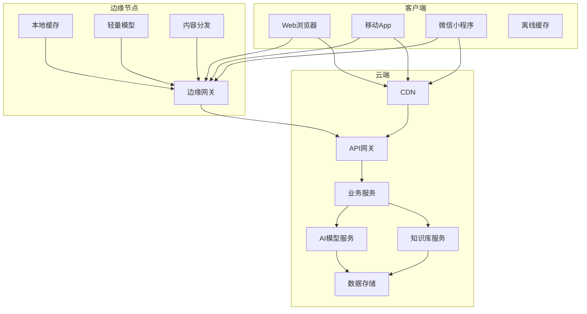

# 2. 总体架构

## 2.1 业务架构

### 角色定义

#### 学习者（Student）

- **职责**：通过Web、移动App等渠道进行学习，提交作业，提出问题，查看学习报告
- **权限**：学习课程、提交作业、提问、查看个人学习数据、评价课程
- **典型场景**：
  - 学习课程内容，观看视频、阅读文档
  - 完成作业和练习，提交作业
  - 提出学习疑问，获得智能答疑
  - 查看学习进度和效果报告

#### 教师（Teacher）

- **职责**：管理课程内容，监控学习进度，处理学习者问题，查看教学数据
- **权限**：课程管理、内容管理、学习监控、人工答疑、数据分析
- **典型场景**：
  - 创建和管理课程内容
  - 查看学习者学习进度和作业完成情况
  - 处理智能系统无法回答的复杂问题
  - 分析教学数据，优化教学内容

#### 教学管理员（Admin）

- **职责**：管理系统配置，管理用户权限，监控系统运行，处理异常问题
- **权限**：系统配置、用户管理、权限管理、数据管理、系统监控
- **典型场景**：
  - 配置智能教育系统参数
  - 管理学习者和教师账号
  - 监控系统运行状态和性能
  - 处理系统异常和故障

#### 内容管理员（Content Admin）

- **职责**：管理知识库，维护教学内容，审核AI生成内容
- **权限**：知识库管理、内容审核、内容发布、内容版本管理
- **典型场景**：
  - 上传和管理教学文档、视频等资源
  - 构建和维护知识库
  - 审核AI生成的回答和内容
  - 管理内容版本和更新

#### 数据分析师（Analyst）

- **职责**：分析学习数据，生成分析报告，提供教学优化建议
- **权限**：数据查询、报表生成、分析工具使用、数据导出
- **典型场景**：
  - 分析学习者学习行为和效果
  - 生成教学效果分析报告
  - 识别学习风险和问题
  - 提供教学优化建议

### 用例分析

#### 用例1：个性化学习路径推荐

- **参与者**：学习者、智能推荐系统
- **前置条件**：学习者已注册并完成能力评估测试
- **主流程**：
  1. 学习者登录系统，查看推荐的学习路径
  2. 系统基于学习者的能力模型和知识图谱，生成个性化学习路径
  3. 系统推荐适合的学习内容和资源
  4. 学习者选择学习内容，开始学习
  5. 系统跟踪学习进度，动态调整学习路径
- **后置条件**：学习路径已生成，学习数据已记录
- **扩展流程**：
  - 如果学习者对推荐内容不满意，可以手动调整
  - 如果学习进度异常，系统自动预警并通知教师

#### 用例2：智能作业批改

- **参与者**：学习者、智能批改系统、教师
- **前置条件**：学习者已完成作业并提交，作业批改系统已配置
- **主流程**：
  1. 学习者提交作业（文本、图片、文件等）
  2. 系统识别作业类型和题目
  3. 系统调用AI模型进行自动批改
  4. 系统生成批改结果和详细解析
  5. 学习者查看批改结果和错题分析
  6. 系统自动收集错题，生成错题本
- **后置条件**：作业已批改，批改结果已保存，错题已收集
- **扩展流程**：
  - 如果批改置信度低，转人工审核
  - 如果学习者对批改结果有异议，可以申请人工复核

#### 用例3：智能答疑

- **参与者**：学习者、智能答疑系统、教师
- **前置条件**：学习者已登录，知识库已构建完成
- **主流程**：
  1. 学习者输入问题（文本、语音、图片等）
  2. 系统进行意图识别和问题理解
  3. 系统从知识库检索相关信息
  4. 系统生成回答并返回给学习者
  5. 学习者查看回答，可选择继续提问或结束对话
  6. 系统记录对话历史，更新学习者知识模型
- **后置条件**：问题已回答，对话记录已保存
- **扩展流程**：
  - 如果回答置信度低或问题复杂，转人工答疑
  - 如果学习者对回答不满意，可以请求人工介入

#### 用例4：学习效果评估

- **参与者**：学习者、教师、评估系统
- **前置条件**：学习者已完成一定学习内容，有足够的学习数据
- **主流程**：
  1. 系统收集学习者的学习数据（作业、测试、学习行为等）
  2. 系统分析学习数据，计算知识点掌握度
  3. 系统生成学习效果评估报告
  4. 学习者和教师查看评估报告
  5. 系统基于评估结果，提供学习改进建议
- **后置条件**：评估报告已生成，改进建议已提供
- **扩展流程**：
  - 如果检测到学习风险，系统自动预警
  - 如果学习效果不理想，系统推荐补充学习内容

### 故事地图

## 2.2 技术架构

### AI-Native四层架构

智能教育系统采用AI-Native四层架构，从下到上依次为基础设施层、模型层、编排层和应用层。

#### 应用层

应用层提供多种终端接入方式，满足不同用户的使用习惯：

- **Web前端**：基于Vue 3 + TypeScript开发，支持PC和移动端自适应，提供流畅的学习体验
- **移动App**：原生iOS和Android应用，支持离线学习、推送通知等功能
- **微信小程序**：轻量级接入方式，无需下载安装，即用即走
- **教师管理后台**：基于React + Ant Design开发，提供课程管理、学习监控、数据分析等功能
- **数据分析平台**：提供学习数据分析、教学效果评估、报表生成等功能

**技术栈**：
- 前端框架：Vue 3、React 18
- UI组件库：Element Plus、Ant Design
- 状态管理：Pinia、Redux
- 构建工具：Vite、Webpack
- 图表库：ECharts、D3.js

#### 编排层

编排层是系统的核心，负责业务流程编排和AI能力调用：

- **API网关**：统一入口，负责路由、限流、认证、日志等
- **学习路径推荐**：基于知识图谱和能力模型，生成个性化学习路径
- **作业批改服务**：调用AI模型，自动批改作业，生成批改结果和解析
- **智能答疑服务**：基于RAG技术，从知识库检索信息，生成回答
- **学习效果评估**：分析学习数据，评估学习效果，生成评估报告
- **知识库检索**：基于向量数据库，进行语义检索
- **对话管理**：维护对话上下文，管理多轮对话状态
- **内容推荐**：基于协同过滤和内容过滤，推荐学习内容

**技术栈**：
- 框架：FastAPI（Python）、Spring Boot（Java）
- 消息队列：RabbitMQ、Kafka
- 工作流引擎：n8n、LangChain
- 缓存：Redis、Memcached
- RAG框架：LangChain、LlamaIndex

#### 模型层

模型层提供各种AI能力：

- **大语言模型**：支持GPT-4、Claude、通义千问、文心一言等，用于内容生成、问答、批改等
- **向量模型**：支持text-embedding-ada-002、bge-large-zh等，用于文本向量化
- **分类模型**：BERT、RoBERTa等，用于意图分类、题目分类等
- **OCR模型**：支持手写识别、印刷体识别，用于作业图像识别
- **语音识别模型**：支持语音转文字，用于语音问答
- **知识图谱模型**：用于知识图谱构建和推理

**技术栈**：
- 模型服务：OpenAI API、Azure OpenAI、本地部署模型（通义千问、文心一言等）
- 向量化：sentence-transformers、LangChain Embeddings
- 模型管理：ModelScope、Hugging Face
- OCR：PaddleOCR、Tesseract
- 语音识别：Azure Speech、百度语音

#### 基础设施层

基础设施层提供计算、存储、网络等基础资源：

- **计算资源**：Kubernetes集群，支持弹性伸缩，GPU节点用于模型推理
- **存储资源**：对象存储（OSS/S3）存储文档、视频、图片等，块存储用于数据库
- **网络资源**：CDN加速、负载均衡、专线连接
- **向量数据库**：Milvus、Qdrant、Pinecone，存储向量化知识
- **关系数据库**：MySQL 8.0、PostgreSQL，存储结构化数据
- **缓存系统**：Redis集群，提供高性能缓存服务
- **消息队列**：RabbitMQ、Kafka，处理异步任务
- **对象存储**：OSS、S3，存储教学资源

**技术栈**：
- 容器编排：Kubernetes、Docker
- 服务网格：Istio
- 监控：Prometheus、Grafana
- 日志：ELK Stack（Elasticsearch、Logstash、Kibana）
- CI/CD：GitHub Actions、Jenkins

### 技术栈

#### 前端技术

- **Vue 3 + TypeScript**：现代化前端框架，类型安全，开发效率高
- **Vite**：快速构建工具，开发体验好
- **TailwindCSS**：实用优先的CSS框架，快速构建UI
- **Pinia**：轻量级状态管理，替代Vuex
- **Element Plus**：Vue 3组件库，提供丰富的UI组件

#### 后端技术

- **Python 3.11 + FastAPI**：高性能异步框架，API开发效率高
- **MySQL 8.0**：关系型数据库，存储结构化数据
- **Redis**：内存数据库，提供缓存和会话存储
- **RabbitMQ**：消息队列，处理异步任务
- **Elasticsearch**：搜索引擎，支持全文检索

#### AI技术

- **RAG技术**：检索增强生成，提升回答准确性
- **LangChain**：LLM应用开发框架，简化开发流程
- **向量数据库**：Milvus/Qdrant，存储和检索向量数据
- **大语言模型**：GPT-4、Claude、通义千问、文心一言等
- **知识图谱**：Neo4j、ArangoDB，存储知识图谱数据

#### DevOps技术

- **Docker**：容器化部署
- **Kubernetes**：容器编排，支持弹性伸缩
- **GitHub Actions**：CI/CD自动化
- **Prometheus + Grafana**：监控和可视化

## 2.3 部署架构

### 云/边/端混合部署

智能教育系统采用云边端混合部署架构，满足不同场景的需求：

#### 云端部署

- **主要服务**：API网关、业务逻辑、AI模型、知识库、数据存储、CDN
- **优势**：集中管理、易于扩展、资源充足、计算能力强
- **适用场景**：
  - 大规模服务、复杂AI模型推理
  - 知识库管理和检索
  - 数据存储和分析
  - 视频等大文件存储和分发

#### 边缘节点部署

- **主要服务**：边缘网关、本地缓存、轻量级模型、内容分发
- **优势**：低延迟、减少带宽消耗、提高响应速度、支持离线
- **适用场景**：
  - 高频访问、实时性要求高
  - 带宽受限场景
  - 离线学习场景
  - 视频等大文件本地缓存

#### 客户端部署

- **主要功能**：UI展示、本地缓存、离线功能、轻量计算
- **优势**：用户体验好、减少服务器压力、支持离线学习
- **适用场景**：
  - 移动端应用
  - 离线学习场景
  - 本地内容缓存
  - 轻量级AI推理（如OCR）

### 高可用设计

#### 多机房部署

- **主备模式**：主机房提供服务，备机房实时同步，主机房故障时自动切换
- **双活模式**：两个机房同时提供服务，负载均衡，任一机房故障不影响服务
- **异地容灾**：跨地域部署，应对自然灾害等极端情况

#### 服务高可用

- **无状态设计**：服务无状态，可水平扩展，任意实例故障不影响整体服务
- **健康检查**：定期健康检查，自动剔除故障实例
- **熔断降级**：服务异常时自动熔断，返回降级方案，避免雪崩效应
- **限流保护**：API限流，防止服务过载

#### 数据高可用

- **主从复制**：数据库主从复制，主库故障时自动切换到从库
- **数据备份**：定期全量备份和增量备份，支持快速恢复
- **多副本存储**：重要数据多副本存储，防止数据丢失
- **数据一致性**：保证数据一致性，避免数据冲突

### 扩展性设计

#### 水平扩展

- **无状态服务**：所有服务无状态，可水平扩展
- **负载均衡**：通过负载均衡器分发请求，支持动态扩容
- **自动伸缩**：根据CPU、内存、请求量等指标自动扩容缩容
- **容器化部署**：基于Kubernetes，支持快速扩容

#### 垂直扩展

- **资源升级**：支持CPU、内存、存储等资源升级
- **GPU加速**：AI模型推理支持GPU加速，提升性能
- **SSD存储**：数据库使用SSD存储，提升IO性能

#### 架构扩展

- **微服务架构**：服务拆分，独立部署和扩展
- **消息队列**：异步处理，削峰填谷，提升系统吞吐量
- **缓存层**：多级缓存，减少数据库压力，提升响应速度
- **CDN加速**：静态资源CDN加速，提升访问速度

#### 扩展性指标

- **并发支持**：单机支持1000+并发，集群支持10万+并发
- **响应时间**：P99响应时间&lt;500ms，平均响应时间&lt;200ms
- **吞吐量**：单机QPS&gt;1000，集群QPS&gt;10万
- **存储容量**：支持PB级数据存储，支持海量教学资源
