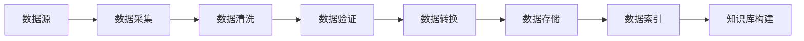
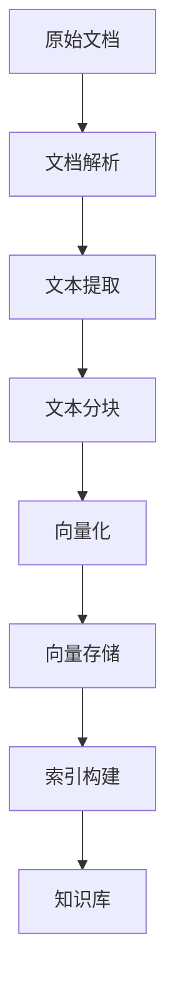
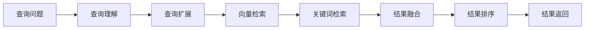
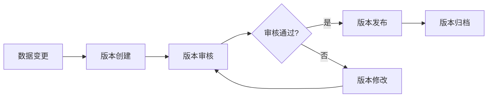
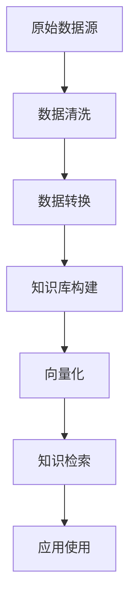
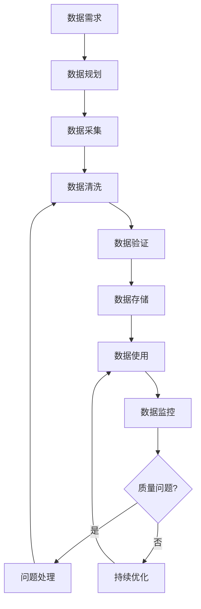

# 3. 数据与知识治理

## 3.1 私有数据接入

### 数据源类型

智能教育系统需要接入多种类型的数据源，以构建完整的教育知识库和学习者数据体系。

#### 结构化数据源

- **课程数据**：
  - 课程基本信息（课程名称、描述、分类等）
  - 课程章节结构（章节、小节、知识点等）
  - 课程资源（视频、文档、练习题等）
  - 数据格式：MySQL数据库、JSON文件、Excel表格
  - 接入方式：数据库同步、API接口、文件导入

- **学习者数据**：
  - 学习者基本信息（姓名、年龄、年级等）
  - 学习记录（学习时长、学习内容、学习进度等）
  - 作业数据（作业内容、提交时间、批改结果等）
  - 测试数据（测试题目、答案、得分等）
  - 数据格式：MySQL数据库、MongoDB、JSON文件
  - 接入方式：数据库同步、API接口、数据导入工具

- **教师数据**：
  - 教师基本信息（姓名、专业、职称等）
  - 教学记录（授课内容、学生反馈等）
  - 数据格式：MySQL数据库、JSON文件
  - 接入方式：数据库同步、API接口

#### 非结构化数据源

- **教学文档**：
  - 教材PDF、Word文档、PPT课件
  - 教学大纲、课程计划、学习指南
  - 数据格式：PDF、DOCX、PPTX、TXT
  - 接入方式：文件上传、批量导入、API接口
  - 处理方式：OCR识别、文本提取、结构化解析

- **视频资源**：
  - 教学视频、录播课程、直播回放
  - 数据格式：MP4、AVI、FLV等视频格式
  - 接入方式：文件上传、视频平台API、CDN链接
  - 处理方式：视频转码、字幕提取、关键帧提取

- **图片资源**：
  - 课件图片、图表、手写作业图片
  - 数据格式：JPG、PNG、GIF等图片格式
  - 接入方式：文件上传、批量导入
  - 处理方式：OCR识别、图像识别、内容提取

- **音频资源**：
  - 语音讲解、音频课程、语音问答
  - 数据格式：MP3、WAV、AAC等音频格式
  - 接入方式：文件上传、API接口
  - 处理方式：语音转文字、语音识别

#### 外部数据源

- **公开教育资源**：
  - 开放课程平台（MOOC、Coursera等）
  - 教育知识库（Wikipedia、百度百科等）
  - 接入方式：API接口、爬虫抓取、数据购买
  - 处理方式：数据清洗、去重、质量评估

- **第三方数据**：
  - 学习行为数据（来自第三方平台）
  - 教育评测数据（来自评测机构）
  - 接入方式：API接口、数据交换、数据购买
  - 处理方式：数据标准化、数据融合

### 数据接入流程

#### 数据接入整体流程



#### 步骤1：数据采集

- **采集方式**：
  - **批量导入**：支持Excel、CSV、JSON等格式的批量导入
  - **API接口**：提供RESTful API，支持第三方系统接入
  - **数据库同步**：支持MySQL、PostgreSQL等数据库的实时同步
  - **文件上传**：支持单文件和多文件上传，支持断点续传

- **采集工具**：
  - **数据导入工具**：提供Web界面，支持拖拽上传、批量导入
  - **API网关**：统一API入口，支持认证、限流、日志等
  - **数据同步工具**：支持定时同步、实时同步、增量同步

- **采集配置示例**：

```python
# 数据采集配置示例
data_source_config = {
    "source_type": "database",  # 数据源类型：database, api, file
    "connection": {
        "host": "localhost",
        "port": 3306,
        "database": "education_db",
        "username": "admin",
        "password": "***"
    },
    "sync_mode": "incremental",  # 同步模式：full, incremental
    "sync_schedule": "0 */6 * * *",  # 每6小时同步一次
    "table_mapping": {
        "courses": "course_info",
        "students": "student_info"
    }
}
```

#### 步骤2：数据清洗

- **清洗内容**：
  - **去重**：识别并删除重复数据
  - **格式标准化**：统一数据格式，如日期格式、编码格式等
  - **缺失值处理**：填充缺失值或标记缺失值
  - **异常值处理**：识别和处理异常值
  - **数据规范化**：统一命名规范、编码规范等

- **清洗规则配置**：

```python
# 数据清洗规则配置
cleaning_rules = {
    "deduplication": {
        "enabled": True,
        "key_fields": ["student_id", "course_id", "timestamp"]
    },
    "format_standardization": {
        "date_format": "YYYY-MM-DD HH:mm:ss",
        "encoding": "UTF-8"
    },
    "missing_value": {
        "strategy": "fill_default",  # fill_default, mark_missing, drop
        "default_values": {
            "age": 0,
            "grade": "未知"
        }
    }
}
```

#### 步骤3：数据验证

- **验证内容**：
  - **格式验证**：验证数据格式是否符合要求
  - **完整性验证**：验证必填字段是否完整
  - **合法性验证**：验证数据是否符合业务规则
  - **一致性验证**：验证数据之间的一致性

- **验证规则配置**：

```python
# 数据验证规则配置
validation_rules = {
    "student_data": {
        "required_fields": ["student_id", "name", "age"],
        "format_rules": {
            "student_id": r"^\d{10}$",  # 10位数字
            "email": r"^[a-zA-Z0-9._%+-]+@[a-zA-Z0-9.-]+\.[a-zA-Z]{2,}$"
        },
        "range_rules": {
            "age": {"min": 6, "max": 100}
        }
    }
}
```

#### 步骤4：数据转换

- **转换内容**：
  - **格式转换**：将数据转换为系统内部格式
  - **结构转换**：将数据转换为标准数据结构
  - **编码转换**：统一字符编码
  - **单位转换**：统一数据单位

#### 步骤5：数据存储

- **存储策略**：
  - **关系数据库**：存储结构化数据（MySQL、PostgreSQL）
  - **文档数据库**：存储半结构化数据（MongoDB）
  - **对象存储**：存储文件数据（OSS、S3）
  - **向量数据库**：存储向量化数据（Milvus、Qdrant）

### 数据质量保证

#### 数据质量评估指标

- **完整性**：数据完整程度，必填字段完整率≥95%
- **准确性**：数据准确程度，数据准确率≥98%
- **一致性**：数据一致程度，数据一致性≥95%
- **及时性**：数据更新及时程度，数据延迟≤1小时
- **有效性**：数据有效程度，有效数据率≥90%

#### 数据质量监控

- **实时监控**：实时监控数据质量指标，发现异常立即告警
- **定期评估**：定期评估数据质量，生成质量报告
- **自动修复**：自动修复常见的数据质量问题
- **人工审核**：对重要数据进行人工审核

#### 数据质量改进

- **问题追踪**：追踪数据质量问题，记录问题原因和解决方案
- **规则优化**：根据问题反馈，优化数据清洗和验证规则
- **流程改进**：改进数据接入流程，从源头保证数据质量

## 3.2 向量知识库

### 知识库构建

#### 知识库架构



#### 文档解析

- **支持的文档格式**：
  - **PDF文档**：使用PyPDF2、pdfplumber等库解析
  - **Word文档**：使用python-docx库解析
  - **PPT文档**：使用python-pptx库解析
  - **Markdown文档**：直接解析Markdown语法
  - **HTML文档**：使用BeautifulSoup解析

- **解析配置示例**：

```python
# 文档解析配置
document_parser_config = {
    "pdf": {
        "extract_text": True,
        "extract_images": False,
        "extract_tables": True
    },
    "word": {
        "extract_text": True,
        "extract_images": True,
        "preserve_formatting": True
    },
    "markdown": {
        "extract_code_blocks": True,
        "extract_tables": True
    }
}
```

#### 文本分块

- **分块策略**：
  - **固定大小分块**：按固定字符数或token数分块
  - **语义分块**：基于语义相似度分块，保持语义完整性
  - **段落分块**：按段落分块，保持段落完整性
  - **滑动窗口**：使用滑动窗口，保持上下文连续性

- **分块配置示例**：

```python
# 文本分块配置
chunking_config = {
    "strategy": "semantic",  # fixed, semantic, paragraph, sliding_window
    "chunk_size": 500,  # 字符数或token数
    "chunk_overlap": 50,  # 重叠字符数
    "min_chunk_size": 100,  # 最小分块大小
    "max_chunk_size": 1000  # 最大分块大小
}
```

#### 向量化

- **向量模型选择**：
  - **通用模型**：text-embedding-ada-002、bge-large-zh等
  - **教育领域模型**：针对教育领域微调的向量模型
  - **多语言模型**：支持中英文等多种语言的向量模型

- **向量化配置示例**：

```python
# 向量化配置
embedding_config = {
    "model": "bge-large-zh-v1.5",  # 向量模型
    "batch_size": 32,  # 批处理大小
    "device": "cuda",  # 设备：cpu, cuda
    "normalize": True,  # 是否归一化
    "dimension": 1024  # 向量维度
}
```

#### 向量存储

- **向量数据库选择**：
  - **Milvus**：开源向量数据库，性能好，功能丰富
  - **Qdrant**：轻量级向量数据库，易于部署
  - **Pinecone**：云服务向量数据库，无需运维

- **存储结构**：
  - **向量数据**：存储文本向量
  - **元数据**：存储文档ID、分块ID、来源、时间戳等
  - **原始文本**：存储原始文本内容，用于检索结果展示

- **存储配置示例**：

```python
# 向量存储配置
vector_store_config = {
    "type": "milvus",  # milvus, qdrant, pinecone
    "host": "localhost",
    "port": 19530,
    "collection_name": "education_knowledge",
    "index_type": "IVF_FLAT",  # 索引类型
    "metric_type": "L2"  # 距离度量：L2, IP, COSINE
}
```

### 向量化策略

#### 多粒度向量化

- **文档级向量**：对整个文档进行向量化，用于文档检索
- **段落级向量**：对段落进行向量化，用于段落检索
- **句子级向量**：对句子进行向量化，用于精确检索
- **知识点级向量**：对知识点进行向量化，用于知识点检索

#### 混合检索策略

- **向量检索**：基于向量相似度检索，支持语义检索
- **关键词检索**：基于关键词匹配检索，支持精确匹配
- **混合检索**：结合向量检索和关键词检索，提升检索效果

#### 向量化优化

- **领域适配**：针对教育领域进行模型微调，提升向量质量
- **多模型融合**：使用多个向量模型，融合检索结果
- **增量更新**：支持知识库增量更新，无需重建整个知识库

### 检索优化

#### 检索流程



#### 查询理解

- **意图识别**：识别查询意图，如概念查询、事实查询、过程查询等
- **实体抽取**：抽取查询中的实体，如知识点、课程名称等
- **查询扩展**：基于同义词、相关词扩展查询

#### 检索优化策略

- **重排序**：使用重排序模型，提升检索结果相关性
- **多样性保证**：保证检索结果的多样性，避免结果过于相似
- **时效性考虑**：考虑文档的时效性，优先返回最新文档

#### 检索性能优化

- **索引优化**：优化向量索引，提升检索速度
- **缓存机制**：缓存热门查询结果，减少重复计算
- **并行检索**：并行执行多个检索任务，提升吞吐量

## 3.3 数据版本与血缘

### 版本管理

#### 数据版本控制

- **版本标识**：使用语义化版本号（如v1.0.0）标识数据版本
- **版本历史**：记录数据版本的历史变更
- **版本回滚**：支持回滚到历史版本
- **版本对比**：支持对比不同版本的数据差异

#### 版本管理流程



#### 版本管理工具

- **Git LFS**：使用Git LFS管理大文件版本
- **数据版本管理系统**：自研数据版本管理系统
- **版本管理API**：提供版本管理API，支持程序化操作

### 血缘追踪

#### 数据血缘关系

- **上游数据源**：追踪数据的来源
- **下游数据使用**：追踪数据的使用情况
- **数据转换链路**：追踪数据的转换过程
- **影响分析**：分析数据变更的影响范围

#### 血缘关系图



#### 血缘追踪实现

- **自动追踪**：自动追踪数据流转过程
- **手动标注**：支持手动标注数据血缘关系
- **血缘可视化**：可视化展示数据血缘关系
- **影响分析**：分析数据变更对下游系统的影响

### 数据治理流程

#### 数据治理组织

- **数据治理委员会**：制定数据治理策略和标准
- **数据管理员**：负责数据管理和维护
- **数据质量团队**：负责数据质量监控和改进

#### 数据治理流程



#### 数据治理工具

- **数据目录**：统一的数据目录，方便数据发现和使用
- **数据质量监控平台**：实时监控数据质量
- **数据血缘追踪系统**：追踪数据血缘关系
- **数据治理工作流**：自动化数据治理流程
