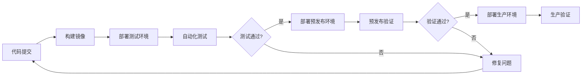
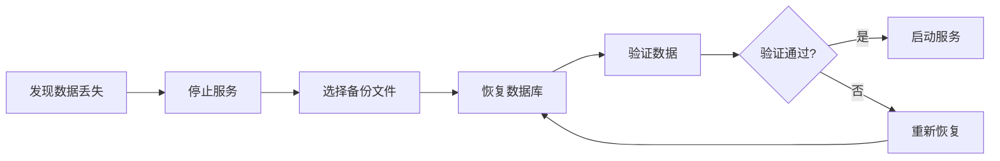
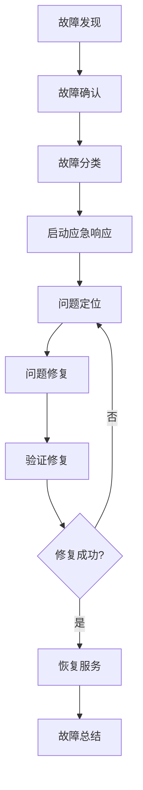

# 11. 交付与运维

## 11.1 部署流程

### 部署架构

#### 部署环境

- **开发环境（Dev）**：用于开发测试，资源较少
- **测试环境（Test）**：用于功能测试，资源适中
- **预发布环境（Staging）**：用于预发布验证，资源接近生产
- **生产环境（Prod）**：正式运行环境，资源充足，高可用

#### 部署流程



### 容器化部署

#### Docker镜像构建

```dockerfile
# Dockerfile示例
FROM python:3.11-slim

WORKDIR /app

# 安装依赖
COPY requirements.txt .
RUN pip install --no-cache-dir -r requirements.txt

# 复制代码
COPY . .

# 设置环境变量
ENV PYTHONUNBUFFERED=1

# 暴露端口
EXPOSE 8000

# 启动命令
CMD ["uvicorn", "main:app", "--host", "0.0.0.0", "--port", "8000"]
```

#### Kubernetes部署配置

```yaml
# Kubernetes部署配置
apiVersion: apps/v1
kind: Deployment
metadata:
  name: education-api
spec:
  replicas: 3
  selector:
    matchLabels:
      app: education-api
  template:
    metadata:
      labels:
        app: education-api
    spec:
      containers:
      - name: api
        image: education-api:latest
        ports:
        - containerPort: 8000
        env:
        - name: DATABASE_URL
          valueFrom:
            secretKeyRef:
              name: db-secret
              key: url
        resources:
          requests:
            cpu: "500m"
            memory: "1Gi"
          limits:
            cpu: "2000m"
            memory: "4Gi"
        livenessProbe:
          httpGet:
            path: /health
            port: 8000
          initialDelaySeconds: 30
          periodSeconds: 10
        readinessProbe:
          httpGet:
            path: /ready
            port: 8000
          initialDelaySeconds: 5
          periodSeconds: 5
---
apiVersion: v1
kind: Service
metadata:
  name: education-api-service
spec:
  selector:
    app: education-api
  ports:
  - protocol: TCP
    port: 80
    targetPort: 8000
  type: LoadBalancer
```

### CI/CD流程

#### GitHub Actions配置

```yaml
# .github/workflows/deploy.yml
name: Deploy

on:
  push:
    branches: [ main ]
  pull_request:
    branches: [ main ]

jobs:
  build:
    runs-on: ubuntu-latest
    steps:
      - uses: actions/checkout@v2
      
      - name: Set up Docker Buildx
        uses: docker/setup-buildx-action@v1
      
      - name: Login to Docker Hub
        uses: docker/login-action@v1
        with:
          username: ${{ secrets.DOCKER_USERNAME }}
          password: ${{ secrets.DOCKER_PASSWORD }}
      
      - name: Build and push
        uses: docker/build-push-action@v2
        with:
          context: .
          push: true
          tags: education-api:${{ github.sha }}
      
      - name: Deploy to Kubernetes
        uses: azure/k8s-deploy@v1
        with:
          manifests: k8s/
          images: education-api:${{ github.sha }}
          kubectl-version: 'latest'
```

## 11.2 运维管理

### 监控告警

#### 监控指标

- **系统指标**：CPU、内存、磁盘、网络使用率
- **应用指标**：请求量、响应时间、错误率
- **业务指标**：问答数量、批改数量、学习完成率
- **模型指标**：模型准确率、响应时间、资源使用率

#### 告警配置

```yaml
# Prometheus告警规则
groups:
- name: system_alerts
  rules:
  - alert: HighCPUUsage
    expr: cpu_usage > 80
    for: 5m
    labels:
      severity: warning
    annotations:
      summary: "CPU使用率过高"
  
  - alert: HighMemoryUsage
    expr: memory_usage > 85
    for: 5m
    labels:
      severity: warning
    annotations:
      summary: "内存使用率过高"
  
  - alert: HighErrorRate
    expr: error_rate > 5
    for: 5m
    labels:
      severity: critical
    annotations:
      summary: "错误率过高"
```

### 日志管理

#### 日志收集

- **应用日志**：使用Fluentd收集应用日志
- **系统日志**：使用Filebeat收集系统日志
- **访问日志**：使用Nginx日志收集访问日志

#### 日志存储

- **Elasticsearch**：存储日志数据
- **日志保留**：保留30天日志
- **日志归档**：超过30天的日志归档到对象存储

### 备份恢复

#### 备份策略

- **数据库备份**：每日全量备份，每小时增量备份
- **文件备份**：每日备份教学资源文件
- **配置备份**：每日备份系统配置

#### 备份实现

```bash
#!/bin/bash
# 数据库备份脚本

# 设置变量
DB_HOST="localhost"
DB_NAME="education_db"
DB_USER="backup_user"
BACKUP_DIR="/backup/database"
DATE=$(date +%Y%m%d_%H%M%S)

# 创建备份目录
mkdir -p $BACKUP_DIR

# 全量备份
mysqldump -h $DB_HOST -u $DB_USER -p$DB_PASSWORD $DB_NAME > $BACKUP_DIR/full_backup_$DATE.sql

# 压缩备份文件
gzip $BACKUP_DIR/full_backup_$DATE.sql

# 删除7天前的备份
find $BACKUP_DIR -name "*.sql.gz" -mtime +7 -delete

# 上传到对象存储
aws s3 cp $BACKUP_DIR/full_backup_$DATE.sql.gz s3://backup-bucket/database/
```

#### 恢复流程



## 11.3 故障处理

### 故障分类

#### 故障级别

- **P0-紧急**：系统完全不可用，影响所有用户
- **P1-高**：核心功能不可用，影响大部分用户
- **P2-中**：部分功能不可用，影响部分用户
- **P3-低**：非核心功能问题，影响少数用户

### 故障处理流程



### 故障预案

#### 常见故障预案

- **数据库故障**：切换到备用数据库
- **服务故障**：重启服务或切换到备用服务
- **网络故障**：切换到备用网络
- **存储故障**：切换到备用存储

#### 故障预案示例

```python
# 故障处理脚本
class IncidentHandler:
    def handle_database_failure(self):
        """处理数据库故障"""
        # 1. 检测主数据库故障
        if not self.check_database_health("primary"):
            # 2. 切换到备用数据库
            self.switch_to_backup_database()
            
            # 3. 通知运维团队
            self.notify_ops_team("数据库故障，已切换到备用数据库")
            
            # 4. 记录故障
            self.log_incident("database_failure", {
                "time": datetime.now(),
                "action": "switched_to_backup"
            })
    
    def handle_service_failure(self, service_name):
        """处理服务故障"""
        # 1. 检测服务故障
        if not self.check_service_health(service_name):
            # 2. 重启服务
            self.restart_service(service_name)
            
            # 3. 如果重启失败，切换到备用服务
            if not self.check_service_health(service_name):
                self.switch_to_backup_service(service_name)
            
            # 4. 通知运维团队
            self.notify_ops_team(f"服务{service_name}故障，已处理")
```
