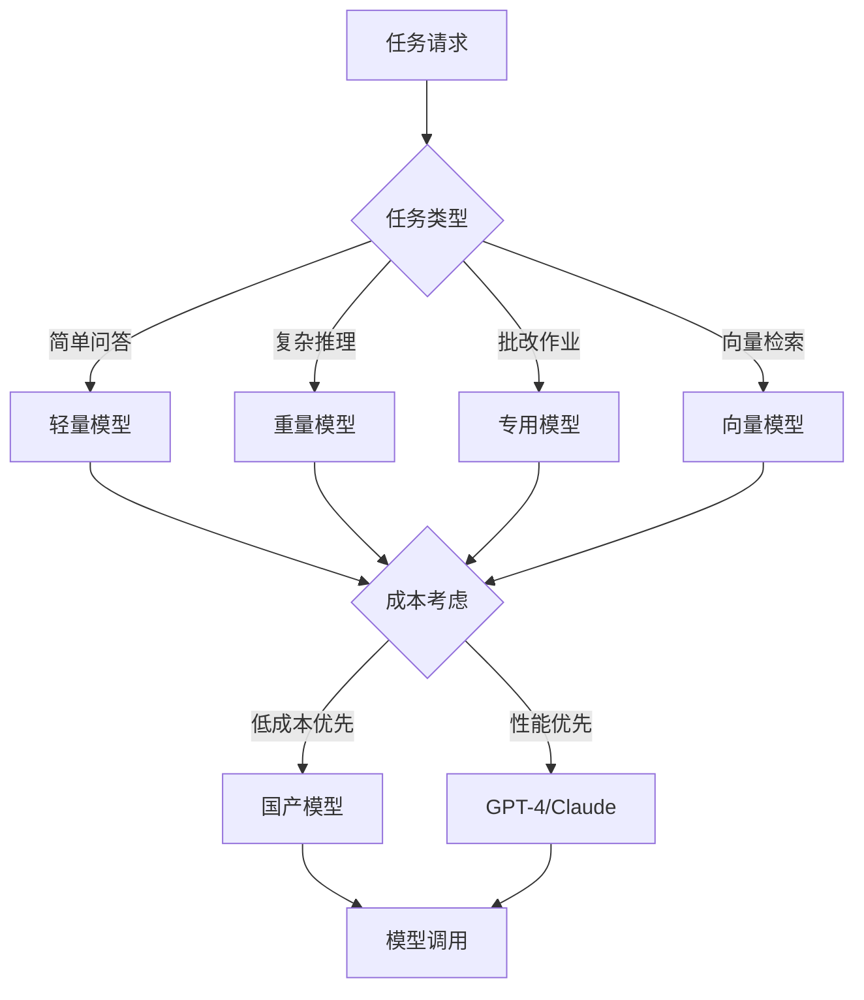
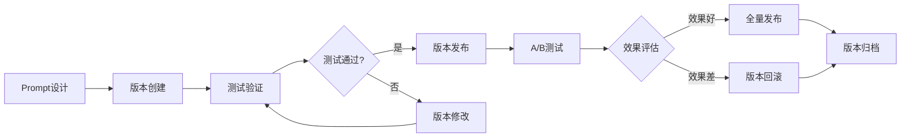
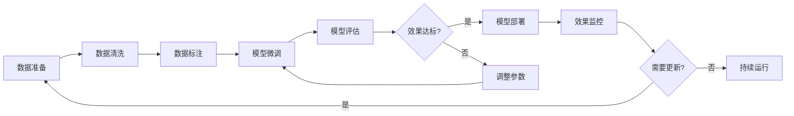
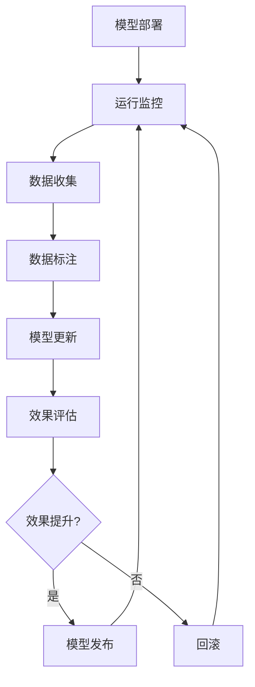

# 4. 模型与提示词管理

## 4.1 多模型路由

### 模型选择策略

智能教育系统需要支持多种AI模型，以满足不同场景的需求。通过多模型路由机制，可以根据任务类型、复杂度、成本等因素，选择最合适的模型。

#### 模型类型

- **大语言模型（LLM）**：
  - **GPT-4**：OpenAI的GPT-4模型，性能最强，适合复杂任务
  - **Claude 3**：Anthropic的Claude模型，安全性高，适合教育场景
  - **通义千问**：阿里云的大模型，中文能力强，成本较低
  - **文心一言**：百度的大模型，中文理解好，适合教育场景
  - **GLM-4**：智谱AI的模型，性能优秀，成本适中

- **向量模型（Embedding）**：
  - **text-embedding-ada-002**：OpenAI的向量模型，通用性强
  - **bge-large-zh-v1.5**：BAAI的中文向量模型，中文效果好
  - **m3e-base**：Moka的中文向量模型，轻量高效

- **专用模型**：
  - **OCR模型**：PaddleOCR、Tesseract，用于作业图像识别
  - **语音识别模型**：Azure Speech、百度语音，用于语音问答
  - **数学公式识别模型**：MathPix、LaTeX识别，用于数学题识别

#### 路由策略



#### 路由规则配置

```python
# 模型路由配置示例
model_routing_config = {
    "task_types": {
        "simple_qa": {
            "primary": "tongyi-qianwen",
            "fallback": "wenxin-yiyan",
            "cost_weight": 0.7,
            "performance_weight": 0.3
        },
        "complex_reasoning": {
            "primary": "gpt-4",
            "fallback": "claude-3",
            "cost_weight": 0.3,
            "performance_weight": 0.7
        },
        "homework_grading": {
            "primary": "glm-4",
            "fallback": "tongyi-qianwen",
            "cost_weight": 0.5,
            "performance_weight": 0.5
        },
        "vector_embedding": {
            "primary": "bge-large-zh-v1.5",
            "fallback": "m3e-base",
            "cost_weight": 0.6,
            "performance_weight": 0.4
        }
    },
    "routing_strategy": "cost_performance_balanced",  # cost_first, performance_first, balanced
    "load_balancing": "round_robin",  # round_robin, least_connections, weighted
    "failover": {
        "enabled": True,
        "max_retries": 3,
        "retry_delay": 1  # 秒
    }
}
```

### 路由规则

#### 基于任务类型的路由

- **简单问答**：使用轻量级模型（通义千问、文心一言），成本低，响应快
- **复杂推理**：使用高性能模型（GPT-4、Claude），准确率高
- **作业批改**：使用专用模型或中等性能模型（GLM-4），平衡成本和性能
- **向量检索**：使用向量模型（bge-large-zh），专门用于向量化

#### 基于复杂度的路由

- **低复杂度任务**：使用轻量级模型，如token数&lt;500的简单问答
- **中复杂度任务**：使用中等性能模型，如token数500-2000的问答
- **高复杂度任务**：使用高性能模型，如token数&gt;2000的复杂推理

#### 基于成本的路由

- **成本敏感场景**：优先使用国产模型，成本较低
- **性能优先场景**：使用GPT-4、Claude等高性能模型
- **平衡场景**：根据任务复杂度动态选择模型

#### 路由规则示例

```python
# 路由规则实现示例
def route_model(task_type, complexity, cost_sensitivity):
    """根据任务类型、复杂度和成本敏感性选择模型"""
    
    # 简单任务，成本敏感
    if task_type == "simple_qa" and complexity == "low" and cost_sensitivity == "high":
        return "tongyi-qianwen"
    
    # 复杂任务，性能优先
    if task_type == "complex_reasoning" and complexity == "high":
        return "gpt-4"
    
    # 作业批改，平衡场景
    if task_type == "homework_grading":
        if complexity == "low":
            return "tongyi-qianwen"
        else:
            return "glm-4"
    
    # 默认路由
    return "tongyi-qianwen"
```

### 负载均衡

#### 负载均衡策略

- **轮询（Round Robin）**：依次分配请求到各个模型实例
- **最少连接（Least Connections）**：分配请求到连接数最少的实例
- **加权轮询（Weighted Round Robin）**：根据模型性能分配不同权重
- **响应时间优先**：分配请求到响应时间最短的实例

#### 负载均衡实现

```python
# 负载均衡配置
load_balancer_config = {
    "strategy": "weighted_round_robin",
    "models": {
        "gpt-4": {
            "instances": [
                {"url": "https://api.openai.com/v1", "weight": 10},
                {"url": "https://api.openai-backup.com/v1", "weight": 8}
            ],
            "health_check": {
                "enabled": True,
                "interval": 30,  # 秒
                "timeout": 5  # 秒
            }
        },
        "tongyi-qianwen": {
            "instances": [
                {"url": "https://dashscope.aliyuncs.com/api/v1", "weight": 5}
            ]
        }
    },
    "circuit_breaker": {
        "enabled": True,
        "failure_threshold": 5,
        "recovery_timeout": 60  # 秒
    }
}
```

## 4.2 Prompt工程化

### Prompt模板设计

Prompt工程是智能教育系统的核心，好的Prompt设计能够大幅提升模型的表现。

#### Prompt模板结构

```python
# Prompt模板结构
prompt_template = {
    "system_prompt": """
    你是一位经验丰富的教育专家，擅长解答学习者的疑问，批改作业，提供学习建议。
    你的回答应该：
    1. 准确、专业、易懂
    2. 符合学习者的认知水平
    3. 提供清晰的解释和示例
    4. 鼓励学习者，保持积极的学习态度
    """,
    "user_prompt_template": """
    问题：{question}
    学习者信息：
    - 年级：{grade}
    - 学科：{subject}
    - 知识水平：{knowledge_level}
    
    请根据以上信息，为学习者提供详细的解答。
    """,
    "few_shot_examples": [
        {
            "question": "什么是光合作用？",
            "answer": "光合作用是植物利用光能将二氧化碳和水转化为有机物的过程..."
        }
    ]
}
```

#### 不同场景的Prompt设计

**1. 智能答疑Prompt**

```python
qa_prompt_template = """
你是一位{subject}学科的教师，擅长解答学习者的疑问。

学习者信息：
- 年级：{grade}
- 当前学习内容：{current_topic}
- 知识水平：{knowledge_level}

问题：{question}

相关知识：
{related_knowledge}

请根据学习者的知识水平，提供：
1. 准确、易懂的解答
2. 相关的例子和类比
3. 相关的练习题建议
4. 鼓励性的话语

回答：
"""
```

**2. 作业批改Prompt**

```python
grading_prompt_template = """
你是一位{subject}学科的教师，负责批改作业。

题目：{question}
标准答案：{standard_answer}
学生答案：{student_answer}
题目类型：{question_type}  # 选择题、填空题、简答题、计算题

请：
1. 判断学生答案是否正确
2. 如果错误，指出错误原因
3. 给出详细的解析
4. 提供改进建议
5. 给出评分（满分{full_score}分）

批改结果：
"""
```

**3. 学习路径推荐Prompt**

```python
learning_path_prompt_template = """
你是一位教育专家，擅长为学习者规划个性化的学习路径。

学习者信息：
- 年级：{grade}
- 学科：{subject}
- 当前知识水平：{current_level}
- 学习目标：{learning_goal}
- 学习时间：{available_time}

知识图谱：
{knowledge_graph}

请为学习者规划：
1. 学习路径（按顺序列出知识点）
2. 每个知识点的学习内容推荐
3. 每个知识点的练习题推荐
4. 学习时间安排
5. 学习目标达成时间预测

学习路径规划：
"""
```

#### Prompt优化策略

- **Few-shot Learning**：提供示例，引导模型生成期望的输出格式
- **Chain of Thought**：引导模型进行逐步推理，提升复杂问题的回答质量
- **角色设定**：设定模型角色（如"经验丰富的教师"），提升回答的专业性
- **上下文注入**：注入相关知识和上下文，提升回答的准确性
- **输出格式约束**：明确输出格式，便于后续处理

### 版本管理

#### Prompt版本控制

- **版本标识**：使用语义化版本号（如v1.0.0）标识Prompt版本
- **版本历史**：记录Prompt版本的历史变更
- **A/B测试**：支持多个Prompt版本同时运行，进行A/B测试
- **版本回滚**：支持回滚到历史版本

#### Prompt版本管理流程



#### Prompt版本管理工具

```python
# Prompt版本管理配置
prompt_version_config = {
    "versioning": {
        "enabled": True,
        "format": "semantic",  # semantic, timestamp
        "auto_increment": True
    },
    "storage": {
        "type": "database",  # database, file, git
        "backup": True
    },
    "ab_testing": {
        "enabled": True,
        "traffic_split": {
            "v1.0.0": 50,  # 50%流量
            "v1.1.0": 50   # 50%流量
        }
    }
}
```

### A/B测试

#### A/B测试流程

1. **假设提出**：提出Prompt改进假设，如"添加Few-shot示例能提升回答质量"
2. **版本设计**：设计A版本（原版本）和B版本（改进版本）
3. **流量分配**：分配流量到A版本和B版本，如50:50
4. **数据收集**：收集两个版本的性能数据
5. **效果评估**：评估B版本是否显著优于A版本
6. **决策执行**：如果B版本更好，全量发布B版本；否则保持A版本

#### A/B测试指标

- **回答准确率**：评估回答的准确性
- **用户满意度**：评估用户对回答的满意度
- **响应时间**：评估响应速度
- **成本**：评估模型调用成本
- **完成率**：评估任务完成率

#### A/B测试实现

```python
# A/B测试配置
ab_test_config = {
    "test_name": "prompt_few_shot_test",
    "variants": {
        "A": {
            "prompt_version": "v1.0.0",
            "traffic_percentage": 50,
            "description": "原版本，无Few-shot示例"
        },
        "B": {
            "prompt_version": "v1.1.0",
            "traffic_percentage": 50,
            "description": "改进版本，添加Few-shot示例"
        }
    },
    "metrics": [
        "answer_accuracy",
        "user_satisfaction",
        "response_time",
        "cost"
    ],
    "duration": 7,  # 天
    "min_sample_size": 1000,  # 最小样本量
    "significance_level": 0.05  # 显著性水平
}
```

## 4.3 微调与持续学习

### 微调策略

#### 微调场景

- **领域适配**：针对教育领域进行微调，提升模型在教育场景的表现
- **任务适配**：针对特定任务（如作业批改）进行微调
- **数据适配**：使用特定数据（如某学科数据）进行微调

#### 微调方法

- **全参数微调（Full Fine-tuning）**：微调所有参数，效果最好，但成本高
- **LoRA（Low-Rank Adaptation）**：只微调少量参数，成本低，效果接近全参数微调
- **QLoRA**：量化+LoRA，进一步降低成本
- **Prompt Tuning**：只微调Prompt，成本最低

#### 微调数据准备

```python
# 微调数据格式
fine_tuning_data = [
    {
        "instruction": "请解答以下数学问题",
        "input": "什么是二次函数？",
        "output": "二次函数是形如f(x)=ax²+bx+c的函数，其中a≠0..."
    },
    {
        "instruction": "请批改以下作业",
        "input": "题目：计算2+3=？\n学生答案：6",
        "output": "答案错误。正确答案是5。错误原因：学生可能混淆了加法和乘法..."
    }
]
```

#### 微调流程



### 持续学习流程

#### 持续学习机制

- **在线学习**：实时从用户反馈中学习，持续优化模型
- **增量学习**：定期使用新数据更新模型，无需重新训练
- **主动学习**：主动识别需要学习的样本，提升学习效率

#### 持续学习流程



#### 持续学习实现

```python
# 持续学习配置
continuous_learning_config = {
    "enabled": True,
    "learning_mode": "incremental",  # online, incremental, batch
    "update_frequency": "weekly",  # daily, weekly, monthly
    "min_new_samples": 1000,  # 最小新样本数
    "quality_threshold": 0.8,  # 数据质量阈值
    "improvement_threshold": 0.05,  # 效果提升阈值（5%）
    "rollback_enabled": True  # 是否支持回滚
}
```

### 模型评估

#### 评估指标

- **准确率（Accuracy）**：模型预测正确的比例
- **精确率（Precision）**：预测为正例中实际为正例的比例
- **召回率（Recall）**：实际为正例中被正确预测的比例
- **F1分数**：精确率和召回率的调和平均
- **BLEU分数**：用于评估生成文本的质量
- **ROUGE分数**：用于评估摘要质量

#### 评估方法

- **离线评估**：使用测试集评估模型性能
- **在线评估**：在生产环境中评估模型性能
- **人工评估**：人工评估模型输出质量
- **A/B测试**：对比不同模型版本的效果

#### 评估流程

```python
# 模型评估配置
model_evaluation_config = {
    "metrics": [
        "accuracy",
        "precision",
        "recall",
        "f1_score",
        "bleu_score",
        "rouge_score"
    ],
    "test_dataset": "test_set_v1.0",
    "evaluation_frequency": "weekly",
    "baseline_model": "v1.0.0",
    "improvement_threshold": 0.05  # 5%提升
}
```
