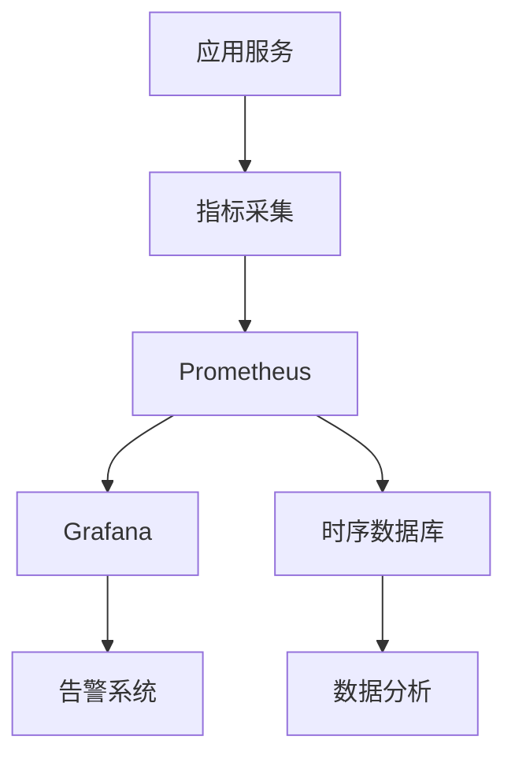
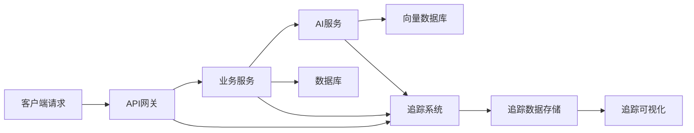
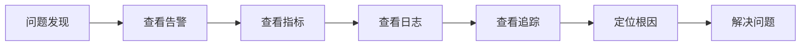

# 9. 监控与可观测

## 9.1 业务指标

### 核心业务指标

#### 学习相关指标

- **学习完成率**：完成学习的学习者占比
  - 计算公式：学习完成率 = 完成学习的学习者数 / 总学习者数
  - 目标值：≥70%
  - 监控频率：每日

- **平均学习时长**：学习者平均每天学习时长
  - 计算公式：平均学习时长 = 总学习时长 / 学习天数
  - 目标值：≥30分钟/天
  - 监控频率：每日

- **知识点掌握度**：学习者对知识点的平均掌握度
  - 计算公式：知识点掌握度 = Σ(各知识点掌握度) / 知识点总数
  - 目标值：≥80%
  - 监控频率：每周

#### 答疑相关指标

- **问答数量**：每日问答总数
  - 计算公式：问答数量 = 每日提问数
  - 目标值：≥1000次/天
  - 监控频率：实时

- **平均响应时间**：从提问到获得回答的平均时间
  - 计算公式：平均响应时间 = Σ(响应时间) / 问答数量
  - 目标值：≤5秒
  - 监控频率：实时

- **回答准确率**：回答准确的比例
  - 计算公式：回答准确率 = 准确回答数 / 总回答数
  - 目标值：≥90%
  - 监控频率：每日

- **用户满意度**：用户对回答的满意度评分
  - 计算公式：用户满意度 = Σ(满意度评分) / 评价数量
  - 目标值：≥4.5/5.0
  - 监控频率：每日

#### 作业批改指标

- **批改数量**：每日批改作业总数
  - 计算公式：批改数量 = 每日提交作业数
  - 目标值：≥500份/天
  - 监控频率：实时

- **批改准确率**：批改准确的比例
  - 计算公式：批改准确率 = 准确批改数 / 总批改数
  - 目标值：≥95%
  - 监控频率：每日

- **批改效率**：平均每份作业的批改时间
  - 计算公式：批改效率 = 总批改时间 / 批改数量
  - 目标值：≤10秒/份
  - 监控频率：实时

### 指标监控

#### 监控系统架构



#### 指标采集实现

```python
# 指标采集实现
from prometheus_client import Counter, Histogram, Gauge

# 定义指标
qa_count = Counter('qa_total', 'Total number of Q&A requests')
qa_response_time = Histogram('qa_response_time_seconds', 'Q&A response time')
qa_accuracy = Gauge('qa_accuracy', 'Q&A accuracy rate')
homework_graded = Counter('homework_graded_total', 'Total number of homework graded')
learning_completion_rate = Gauge('learning_completion_rate', 'Learning completion rate')

# 记录指标
def record_qa(question, answer, response_time, accuracy):
    """记录问答指标"""
    qa_count.inc()
    qa_response_time.observe(response_time)
    qa_accuracy.set(accuracy)

def record_homework_grading(homework_id, grading_time):
    """记录作业批改指标"""
    homework_graded.inc()
    # 记录批改时间等指标
```

### 告警机制

#### 告警规则

- **回答准确率告警**：当回答准确率&lt;85%时告警
- **响应时间告警**：当平均响应时间&gt;10秒时告警
- **系统可用性告警**：当系统可用性&lt;99.9%时告警
- **错误率告警**：当错误率&gt;5%时告警

#### 告警配置示例

```yaml
# Prometheus告警规则
groups:
- name: education_alerts
  rules:
  - alert: LowQAAccuracy
    expr: qa_accuracy < 0.85
    for: 5m
    labels:
      severity: warning
    annotations:
      summary: "问答准确率低于85%"
      description: "当前问答准确率为 {{ $value }}，低于目标值85%"
  
  - alert: HighResponseTime
    expr: qa_response_time_seconds_p99 > 10
    for: 5m
    labels:
      severity: warning
    annotations:
      summary: "响应时间过高"
      description: "P99响应时间为 {{ $value }}秒，超过10秒阈值"
  
  - alert: SystemDown
    expr: up == 0
    for: 1m
    labels:
      severity: critical
    annotations:
      summary: "系统宕机"
      description: "系统已宕机超过1分钟"
```

## 9.2 模型指标

### 模型性能指标

#### 模型准确率指标

- **回答准确率**：模型回答的准确率
  - 计算公式：准确率 = 正确回答数 / 总回答数
  - 目标值：≥90%
  - 评估方法：人工评估、自动评估

- **批改准确率**：模型批改的准确率
  - 计算公式：准确率 = 正确批改数 / 总批改数
  - 目标值：≥95%
  - 评估方法：与标准答案对比

#### 模型性能指标

- **响应时间**：模型推理时间
  - P50响应时间：目标≤500ms
  - P95响应时间：目标≤1s
  - P99响应时间：目标≤2s

- **吞吐量**：每秒处理的请求数
  - 目标值：≥100 QPS
  - 监控频率：实时

- **资源使用率**：GPU、CPU、内存使用率
  - GPU使用率：目标≥70%
  - CPU使用率：目标≤80%
  - 内存使用率：目标≤80%

### 模型监控

#### 模型监控实现

```python
# 模型监控实现
class ModelMonitor:
    def __init__(self):
        self.predictions = []
        self.performance_metrics = {}
    
    def record_prediction(self, model_name, input_data, prediction, ground_truth=None):
        """记录预测结果"""
        prediction_record = {
            "model": model_name,
            "input": input_data,
            "prediction": prediction,
            "ground_truth": ground_truth,
            "timestamp": datetime.now()
        }
        self.predictions.append(prediction_record)
        
        # 如果有真实值，计算准确率
        if ground_truth:
            self._update_accuracy(model_name, prediction, ground_truth)
    
    def _update_accuracy(self, model_name, prediction, ground_truth):
        """更新准确率"""
        if model_name not in self.performance_metrics:
            self.performance_metrics[model_name] = {
                "total": 0,
                "correct": 0
            }
        
        self.performance_metrics[model_name]["total"] += 1
        if prediction == ground_truth:
            self.performance_metrics[model_name]["correct"] += 1
        
        accuracy = (
            self.performance_metrics[model_name]["correct"] /
            self.performance_metrics[model_name]["total"]
        )
        
        # 记录到Prometheus
        model_accuracy.labels(model=model_name).set(accuracy)
```

### 模型退化检测

#### 退化检测方法

- **准确率下降检测**：监控模型准确率，发现下降趋势
- **响应时间增加检测**：监控响应时间，发现性能下降
- **错误率增加检测**：监控错误率，发现异常
- **A/B测试对比**：对比新旧模型效果

#### 退化检测实现

```python
# 模型退化检测实现
class ModelDegradationDetector:
    def __init__(self, baseline_accuracy=0.90, threshold=0.05):
        self.baseline_accuracy = baseline_accuracy
        self.threshold = threshold
        self.accuracy_history = []
    
    def check_degradation(self, current_accuracy):
        """检测模型退化"""
        self.accuracy_history.append({
            "accuracy": current_accuracy,
            "timestamp": datetime.now()
        })
        
        # 计算最近N次的平均准确率
        recent_accuracy = np.mean([
            h["accuracy"] for h in self.accuracy_history[-100:]
        ])
        
        # 检测是否下降超过阈值
        if recent_accuracy < self.baseline_accuracy - self.threshold:
            return {
                "degraded": True,
                "current_accuracy": recent_accuracy,
                "baseline_accuracy": self.baseline_accuracy,
                "degradation": self.baseline_accuracy - recent_accuracy
            }
        
        return {"degraded": False}
```

## 9.3 链路追踪

### 追踪系统

#### 分布式追踪架构



#### 追踪实现

```python
# 链路追踪实现
from opentelemetry import trace
from opentelemetry.sdk.trace import TracerProvider
from opentelemetry.sdk.trace.export import BatchSpanProcessor
from opentelemetry.exporter.jaeger import JaegerExporter

# 初始化追踪
trace.set_tracer_provider(TracerProvider())
tracer = trace.get_tracer(__name__)

# 配置Jaeger导出器
jaeger_exporter = JaegerExporter(
    agent_host_name="jaeger",
    agent_port=6831
)
span_processor = BatchSpanProcessor(jaeger_exporter)
trace.get_tracer_provider().add_span_processor(span_processor)

# 使用追踪
def qa_service(question):
    """问答服务，带追踪"""
    with tracer.start_as_current_span("qa_service") as span:
        span.set_attribute("question", question)
        
        # 调用知识检索
        with tracer.start_as_current_span("knowledge_retrieval") as retrieval_span:
            documents = retrieve_knowledge(question)
            retrieval_span.set_attribute("documents_count", len(documents))
        
        # 调用模型生成
        with tracer.start_as_current_span("answer_generation") as generation_span:
            answer = generate_answer(question, documents)
            generation_span.set_attribute("answer_length", len(answer))
        
        return answer
```

### 日志管理

#### 日志架构

- **日志采集**：使用Fluentd、Filebeat等工具采集日志
- **日志存储**：使用Elasticsearch存储日志
- **日志查询**：使用Kibana查询和分析日志
- **日志分析**：使用ELK Stack进行日志分析

#### 日志格式

```python
# 结构化日志格式
import logging
import json
from datetime import datetime

class StructuredLogger:
    def __init__(self, name):
        self.logger = logging.getLogger(name)
    
    def log(self, level, message, **kwargs):
        """记录结构化日志"""
        log_entry = {
            "timestamp": datetime.now().isoformat(),
            "level": level,
            "message": message,
            **kwargs
        }
        self.logger.log(
            getattr(logging, level.upper()),
            json.dumps(log_entry)
        )

# 使用示例
logger = StructuredLogger("education_api")
logger.log("info", "QA request received", 
           question="什么是光合作用？",
           student_id="student_123",
           request_id="req_456")
```

### 问题定位

#### 问题定位流程



#### 问题定位工具

- **Grafana**：可视化监控指标，快速定位问题
- **Kibana**：查询和分析日志，定位错误原因
- **Jaeger**：查看分布式追踪，定位性能瓶颈
- **Prometheus**：查询指标数据，分析问题趋势
