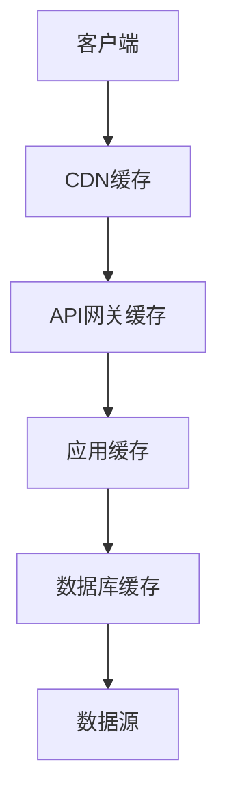

# 8. 性能与成本

## 8.1 弹性伸缩

### 伸缩策略

智能教育系统需要根据负载情况自动调整资源，以平衡性能和成本。

#### 水平伸缩（Horizontal Scaling）

- **自动扩容**：当CPU使用率&gt;70%或请求队列长度&gt;100时，自动增加实例
- **自动缩容**：当CPU使用率&lt;30%且持续10分钟时，自动减少实例
- **最小实例数**：保持至少2个实例，确保高可用
- **最大实例数**：最多20个实例，防止成本过高

#### 垂直伸缩（Vertical Scaling）

- **资源升级**：当单个实例资源不足时，升级实例规格
- **GPU加速**：AI推理任务自动使用GPU实例
- **资源降级**：低负载时降级实例规格，节省成本

#### 伸缩配置示例

```yaml
# Kubernetes HPA配置
apiVersion: autoscaling/v2
kind: HorizontalPodAutoscaler
metadata:
  name: education-api-hpa
spec:
  scaleTargetRef:
    apiVersion: apps/v1
    kind: Deployment
    name: education-api
  minReplicas: 2
  maxReplicas: 20
  metrics:
  - type: Resource
    resource:
      name: cpu
      target:
        type: Utilization
        averageUtilization: 70
  - type: Resource
    resource:
      name: memory
      target:
        type: Utilization
        averageUtilization: 80
  behavior:
    scaleDown:
      stabilizationWindowSeconds: 300
      policies:
      - type: Percent
        value: 50
        periodSeconds: 60
    scaleUp:
      stabilizationWindowSeconds: 0
      policies:
      - type: Percent
        value: 100
        periodSeconds: 60
      - type: Pods
        value: 2
        periodSeconds: 60
```

### 资源调度

#### 资源调度策略

- **优先级调度**：高优先级任务优先分配资源
- **负载均衡**：将任务均匀分配到各个节点
- **亲和性调度**：相关任务调度到同一节点，减少网络开销
- **反亲和性调度**：关键服务分散到不同节点，提高可用性

#### 资源调度配置

```yaml
# Kubernetes调度配置
apiVersion: v1
kind: Pod
metadata:
  name: education-api
spec:
  containers:
  - name: api
    image: education-api:latest
    resources:
      requests:
        cpu: "500m"
        memory: "1Gi"
      limits:
        cpu: "2000m"
        memory: "4Gi"
  affinity:
    podAntiAffinity:
      preferredDuringSchedulingIgnoredDuringExecution:
      - weight: 100
        podAffinityTerm:
          labelSelector:
            matchExpressions:
            - key: app
              operator: In
              values:
              - education-api
          topologyKey: kubernetes.io/hostname
```

### 成本优化

#### 成本优化策略

- **Spot实例**：使用Spot实例处理非关键任务，成本降低70%
- **预留实例**：对稳定负载使用预留实例，成本降低40%
- **资源利用率优化**：提高资源利用率，减少浪费
- **冷热数据分离**：热数据使用SSD，冷数据使用HDD

#### 成本优化示例

```python
# 成本优化配置
cost_optimization_config = {
    "spot_instances": {
        "enabled": True,
        "applicable_tasks": ["batch_processing", "data_analysis"],
        "max_price": 0.1,  # 每小时最大价格
        "fallback": "on_demand"  # Spot实例不可用时使用按需实例
    },
    "reserved_instances": {
        "enabled": True,
        "commitment": "1_year",
        "payment_option": "all_upfront",
        "savings": 0.4  # 节省40%成本
    },
    "resource_optimization": {
        "target_utilization": 0.8,  # 目标利用率80%
        "rightsizing": True,  # 自动调整实例规格
        "idle_resource_cleanup": True  # 清理闲置资源
    }
}
```

## 8.2 缓存策略

### 缓存设计

#### 多级缓存架构



#### 缓存层级

- **CDN缓存**：静态资源缓存，减少带宽消耗
- **API网关缓存**：API响应缓存，减少后端压力
- **应用缓存**：应用层缓存，提升响应速度
- **数据库缓存**：数据库查询缓存，减少数据库压力

#### 缓存配置示例

```python
# Redis缓存配置
cache_config = {
    "redis": {
        "host": "redis-cluster.example.com",
        "port": 6379,
        "db": 0,
        "max_connections": 100,
        "socket_timeout": 5
    },
    "cache_policies": {
        "learning_path": {
            "ttl": 3600,  # 1小时
            "key_prefix": "lp:",
            "serializer": "json"
        },
        "qa_answer": {
            "ttl": 1800,  # 30分钟
            "key_prefix": "qa:",
            "serializer": "json"
        },
        "homework_result": {
            "ttl": 7200,  # 2小时
            "key_prefix": "hw:",
            "serializer": "json"
        }
    }
}
```

### 缓存更新

#### 缓存更新策略

- **Cache-Aside**：应用先查缓存，缓存未命中时查数据库并更新缓存
- **Write-Through**：写入时同时更新缓存和数据库
- **Write-Back**：写入时先更新缓存，异步更新数据库
- **Refresh-Ahead**：提前刷新即将过期的缓存

#### 缓存更新实现

```python
# 缓存更新实现
class CacheManager:
    def __init__(self, redis_client):
        self.redis = redis_client
    
    async def get_or_set(self, key, fetch_func, ttl=3600):
        """获取或设置缓存"""
        # 先查缓存
        cached = await self.redis.get(key)
        if cached:
            return json.loads(cached)
        
        # 缓存未命中，从数据源获取
        data = await fetch_func()
        
        # 更新缓存
        await self.redis.setex(
            key,
            ttl,
            json.dumps(data)
        )
        
        return data
    
    async def invalidate(self, pattern):
        """失效缓存"""
        keys = await self.redis.keys(pattern)
        if keys:
            await self.redis.delete(*keys)
```

### 缓存命中率优化

#### 优化策略

- **预热缓存**：系统启动时预热热门数据
- **缓存分层**：不同数据使用不同的缓存策略
- **缓存压缩**：压缩缓存数据，提高存储效率
- **缓存监控**：监控缓存命中率，及时调整策略

#### 缓存命中率目标

- **API缓存命中率**：≥80%
- **数据库查询缓存命中率**：≥70%
- **CDN缓存命中率**：≥90%

## 8.3 成本仪表盘

### 成本监控

#### 成本监控指标

- **总成本**：系统总运行成本
- **成本趋势**：成本变化趋势
- **成本分布**：各模块成本分布
- **成本预测**：未来成本预测

#### 成本监控实现

```python
# 成本监控实现
class CostMonitor:
    def __init__(self):
        self.cost_data = []
    
    def record_cost(self, service, resource_type, cost, timestamp):
        """记录成本"""
        self.cost_data.append({
            "service": service,
            "resource_type": resource_type,
            "cost": cost,
            "timestamp": timestamp
        })
    
    def get_daily_cost(self, date):
        """获取每日成本"""
        daily_data = [
            d for d in self.cost_data
            if d["timestamp"].date() == date
        ]
        return sum(d["cost"] for d in daily_data)
    
    def get_cost_by_service(self, start_date, end_date):
        """按服务统计成本"""
        filtered_data = [
            d for d in self.cost_data
            if start_date <= d["timestamp"].date() <= end_date
        ]
        
        cost_by_service = {}
        for d in filtered_data:
            service = d["service"]
            cost_by_service[service] = cost_by_service.get(service, 0) + d["cost"]
        
        return cost_by_service
```

### 成本分析

#### 成本分析维度

- **按服务分析**：分析各服务的成本占比
- **按资源类型分析**：分析计算、存储、网络等资源成本
- **按时间分析**：分析成本的时间分布
- **按用户分析**：分析不同用户的成本贡献

#### 成本分析报告

```python
# 成本分析报告生成
def generate_cost_report(start_date, end_date):
    """生成成本分析报告"""
    monitor = CostMonitor()
    
    # 总成本
    total_cost = sum(
        d["cost"] for d in monitor.cost_data
        if start_date <= d["timestamp"].date() <= end_date
    )
    
    # 按服务统计
    cost_by_service = monitor.get_cost_by_service(start_date, end_date)
    
    # 按资源类型统计
    cost_by_resource = {}
    for d in monitor.cost_data:
        if start_date <= d["timestamp"].date() <= end_date:
            resource = d["resource_type"]
            cost_by_resource[resource] = cost_by_resource.get(resource, 0) + d["cost"]
    
    return {
        "total_cost": total_cost,
        "cost_by_service": cost_by_service,
        "cost_by_resource": cost_by_resource,
        "daily_cost_trend": monitor.get_daily_cost_trend(start_date, end_date)
    }
```

### 成本优化建议

#### 优化建议生成

- **资源利用率分析**：识别低利用率资源，建议降级或释放
- **成本异常检测**：检测成本异常，及时告警
- **优化建议**：基于成本分析，提供优化建议

#### 优化建议示例

```python
# 成本优化建议生成
def generate_optimization_suggestions():
    """生成优化建议"""
    suggestions = []
    
    # 分析资源利用率
    low_utilization_resources = analyze_resource_utilization()
    for resource in low_utilization_resources:
        suggestions.append({
            "type": "rightsizing",
            "resource": resource["id"],
            "current_spec": resource["spec"],
            "suggested_spec": resource["suggested_spec"],
            "savings": resource["savings"]
        })
    
    # 分析Spot实例使用
    spot_opportunities = analyze_spot_opportunities()
    for opportunity in spot_opportunities:
        suggestions.append({
            "type": "spot_instance",
            "task": opportunity["task"],
            "current_cost": opportunity["current_cost"],
            "spot_cost": opportunity["spot_cost"],
            "savings": opportunity["savings"]
        })
    
    return suggestions
```
