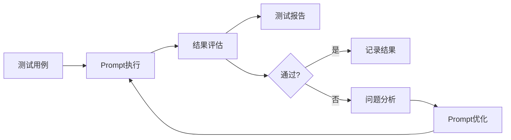
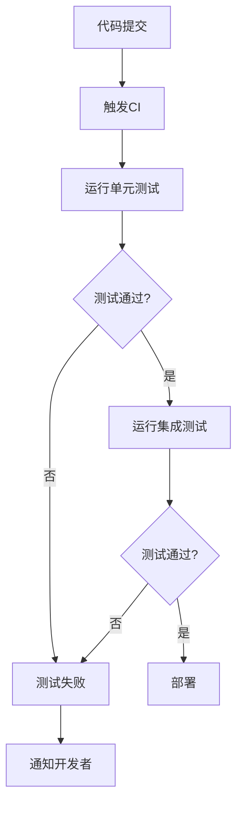
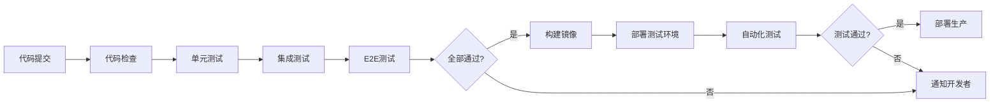

# 7. 质量与测试

## 7.1 提示词单元测试

### 测试框架

提示词单元测试是确保AI系统质量的关键环节。我们使用专门的测试框架来测试Prompt的效果。

#### 测试框架架构



#### 测试框架实现

```python
# Prompt测试框架
class PromptTestFramework:
    def __init__(self):
        self.test_cases = []
        self.results = []
    
    def add_test_case(self, test_case):
        """添加测试用例"""
        self.test_cases.append(test_case)
    
    def run_tests(self, prompt_template):
        """运行测试"""
        for test_case in self.test_cases:
            # 执行Prompt
            result = self._execute_prompt(prompt_template, test_case)
            
            # 评估结果
            evaluation = self._evaluate_result(result, test_case)
            
            # 记录结果
            self.results.append({
                "test_case": test_case,
                "result": result,
                "evaluation": evaluation
            })
        
        return self.results
    
    def _execute_prompt(self, prompt_template, test_case):
        """执行Prompt"""
        # 填充Prompt模板
        prompt = prompt_template.format(**test_case["input"])
        
        # 调用模型
        response = llm_client.generate(prompt)
        
        return response
    
    def _evaluate_result(self, result, test_case):
        """评估结果"""
        # 使用评估器评估结果
        evaluator = test_case.get("evaluator", "default")
        
        if evaluator == "exact_match":
            return result == test_case["expected_output"]
        elif evaluator == "semantic_similarity":
            return self._semantic_similarity(result, test_case["expected_output"])
        elif evaluator == "custom":
            return test_case["custom_evaluator"](result)
        
        return False
```

### 测试用例设计

#### 测试用例类型

- **功能测试**：测试Prompt的基本功能是否正常
- **边界测试**：测试边界情况，如空输入、超长输入等
- **异常测试**：测试异常情况的处理
- **性能测试**：测试Prompt的执行性能

#### 测试用例示例

```python
# 测试用例定义
test_cases = [
    {
        "name": "简单问答测试",
        "type": "functional",
        "input": {
            "question": "什么是光合作用？",
            "grade": "初中",
            "subject": "生物"
        },
        "expected_output": {
            "contains": ["光合作用", "植物", "光能"],
            "length_range": [100, 500]
        },
        "evaluator": "semantic_similarity",
        "threshold": 0.8
    },
    {
        "name": "边界测试-空问题",
        "type": "boundary",
        "input": {
            "question": "",
            "grade": "初中",
            "subject": "生物"
        },
        "expected_output": {
            "error_handled": True,
            "error_message": "问题不能为空"
        },
        "evaluator": "custom"
    },
    {
        "name": "性能测试",
        "type": "performance",
        "input": {
            "question": "什么是光合作用？",
            "grade": "初中",
            "subject": "生物"
        },
        "expected_output": {
            "max_response_time": 2.0  # 秒
        },
        "evaluator": "performance"
    }
]
```

### 自动化测试

#### 自动化测试流程



#### CI/CD集成

```yaml
# GitHub Actions配置示例
name: Prompt Tests

on:
  push:
    branches: [ main ]
  pull_request:
    branches: [ main ]

jobs:
  test:
    runs-on: ubuntu-latest
    steps:
      - uses: actions/checkout@v2
      
      - name: Set up Python
        uses: actions/setup-python@v2
        with:
          python-version: '3.11'
      
      - name: Install dependencies
        run: |
          pip install -r requirements.txt
      
      - name: Run prompt tests
        run: |
          python -m pytest tests/prompt_tests/ -v
      
      - name: Generate test report
        run: |
          pytest --html=report.html --self-contained-html
```

## 7.2 端到端自动化

### E2E测试流程

#### E2E测试场景

- **学习路径推荐流程**：从学习者登录到获得学习路径的完整流程
- **智能答疑流程**：从提问到获得回答的完整流程
- **作业批改流程**：从提交作业到获得批改结果的完整流程
- **学习效果评估流程**：从学习数据收集到生成评估报告的完整流程

#### E2E测试实现

```python
# E2E测试示例
import pytest
from playwright.sync_api import Page, expect

def test_qa_flow(page: Page):
    """测试智能答疑流程"""
    # 1. 登录
    page.goto("https://education.example.com/login")
    page.fill("#username", "student_001")
    page.fill("#password", "password123")
    page.click("#login-button")
    
    # 2. 进入答疑页面
    page.click("#qa-menu")
    
    # 3. 输入问题
    page.fill("#question-input", "什么是光合作用？")
    page.click("#submit-button")
    
    # 4. 等待回答
    answer = page.wait_for_selector("#answer-content", timeout=10000)
    
    # 5. 验证回答
    expect(answer).to_contain_text("光合作用")
    expect(answer).to_contain_text("植物")
    
    # 6. 验证回答质量
    answer_text = answer.inner_text()
    assert len(answer_text) > 100, "回答太短"
    assert len(answer_text) < 1000, "回答太长"
```

### 测试覆盖

#### 测试覆盖范围

- **功能覆盖**：覆盖所有核心功能
- **场景覆盖**：覆盖主要使用场景
- **边界覆盖**：覆盖边界情况
- **异常覆盖**：覆盖异常情况

#### 测试覆盖率目标

- **单元测试覆盖率**：≥80%
- **集成测试覆盖率**：≥70%
- **E2E测试覆盖率**：≥60%

### 持续集成

#### CI/CD流程



## 7.3 红蓝对抗

### 对抗测试方法

#### 对抗测试类型

- **安全性测试**：测试系统安全性，防止恶意攻击
- **鲁棒性测试**：测试系统鲁棒性，处理异常输入
- **性能测试**：测试系统性能，处理高负载
- **准确性测试**：测试系统准确性，防止错误回答

#### 对抗测试场景

- **恶意输入**：输入恶意内容，测试系统防护能力
- **异常输入**：输入异常格式，测试系统处理能力
- **高负载**：模拟高并发，测试系统性能
- **错误注入**：注入错误，测试系统容错能力

### 安全测试

#### 安全测试内容

- **输入验证**：测试输入验证机制
- **SQL注入**：测试SQL注入防护
- **XSS攻击**：测试XSS攻击防护
- **CSRF攻击**：测试CSRF攻击防护
- **权限控制**：测试权限控制机制

#### 安全测试工具

- **OWASP ZAP**：Web应用安全测试工具
- **Burp Suite**：Web安全测试工具
- **Nessus**：漏洞扫描工具

### 性能测试

#### 性能测试指标

- **响应时间**：P50、P95、P99响应时间
- **吞吐量**：QPS（每秒查询数）
- **并发数**：支持的最大并发数
- **资源使用**：CPU、内存、网络使用率

#### 性能测试工具

- **JMeter**：负载测试工具
- **Locust**：Python负载测试工具
- **k6**：现代化负载测试工具

#### 性能测试示例

```python
# 性能测试示例
import asyncio
import aiohttp
import time

async def performance_test():
    """性能测试"""
    url = "https://api.education.com/v1/qa/ask"
    headers = {"Authorization": "Bearer token"}
    
    async with aiohttp.ClientSession() as session:
        tasks = []
        start_time = time.time()
        
        # 并发100个请求
        for i in range(100):
            task = session.post(
                url,
                json={"question": f"测试问题{i}"},
                headers=headers
            )
            tasks.append(task)
        
        responses = await asyncio.gather(*tasks)
        end_time = time.time()
        
        # 计算性能指标
        total_time = end_time - start_time
        qps = 100 / total_time
        
        print(f"总耗时: {total_time:.2f}秒")
        print(f"QPS: {qps:.2f}")
        
        # 计算响应时间分布
        response_times = []
        for response in responses:
            response_times.append(response.headers.get("X-Response-Time"))
        
        print(f"平均响应时间: {sum(response_times)/len(response_times):.2f}ms")

asyncio.run(performance_test())
```
