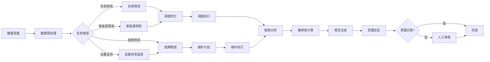
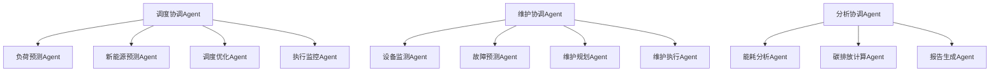

# 5. 智能体与业务编排

## 5.1 Agent技能链

### 技能定义

智能能源Agent需要具备多种技能，通过技能链组合完成复杂任务：

#### 核心技能

**1. 数据采集技能（Data Collection）**
- **功能**：从各种数据源采集能源数据（SCADA、传感器、气象站等）
- **输入**：数据源配置、采集参数
- **输出**：采集到的数据（时序数据、结构化数据）
- **实现**：基于Modbus、IEC61850、MQTT等协议
- **应用场景**：实时数据采集、历史数据同步

**2. 数据预处理技能（Data Preprocessing）**
- **功能**：清洗、转换、标准化数据
- **输入**：原始数据
- **输出**：预处理后的数据
- **实现**：基于Pandas、NumPy等数据处理库
- **应用场景**：数据清洗、特征工程

**3. 负荷预测技能（Load Forecasting）**
- **功能**：预测未来电力负荷
- **输入**：历史负荷数据、气象数据、时间特征
- **输出**：负荷预测结果（预测值、置信区间）
- **实现**：基于LSTM、Transformer、Prophet等模型
- **应用场景**：短期负荷预测、长期负荷预测

**4. 新能源预测技能（Renewable Energy Forecasting）**
- **功能**：预测风电、光伏等新能源发电量
- **输入**：气象数据、历史发电数据、设备状态
- **输出**：新能源发电预测结果
- **实现**：基于Transformer、Prophet等模型
- **应用场景**：风电预测、光伏预测

**5. 设备状态监测技能（Equipment Monitoring）**
- **功能**：监测设备运行状态，识别异常
- **输入**：设备监测数据（温度、振动、电流等）
- **输出**：设备状态评估、异常告警
- **实现**：基于时序异常检测算法
- **应用场景**：设备健康监测、故障预警

**6. 故障预测技能（Failure Prediction）**
- **功能**：预测设备故障概率和剩余寿命
- **输入**：设备监测数据、历史故障记录
- **输出**：故障预测结果（故障概率、故障类型、预计时间）
- **实现**：基于XGBoost、LightGBM等模型
- **应用场景**：预测性维护、故障预防

**7. 调度优化技能（Dispatch Optimization）**
- **功能**：优化电网调度方案
- **输入**：负荷预测、新能源预测、机组信息、约束条件
- **输出**：最优调度方案（发电计划、线路潮流等）
- **实现**：基于遗传算法、粒子群算法、强化学习等
- **应用场景**：日度调度、实时调度

**8. 能耗分析技能（Energy Consumption Analysis）**
- **功能**：分析能源消费模式，识别节能机会
- **输入**：能耗数据、设备信息、生产数据
- **输出**：能耗分析报告（消费趋势、异常分析、节能建议）
- **实现**：基于统计分析、机器学习方法
- **应用场景**：能耗监控、节能优化

**9. 碳排放计算技能（Carbon Emission Calculation）**
- **功能**：计算碳排放量，分析碳排放来源
- **输入**：能耗数据、排放因子、活动数据
- **输出**：碳排放计算结果（总排放量、分项排放、减排建议）
- **实现**：基于IPCC方法学、行业标准
- **应用场景**：碳足迹计算、减排分析

**10. 报告生成技能（Report Generation）**
- **功能**：生成各类分析报告
- **输入**：分析结果、报告模板
- **输出**：格式化的报告文档（PDF、Excel、Word）
- **实现**：基于模板引擎、大语言模型
- **应用场景**：调度报告、维护报告、分析报告

### 技能链设计

技能链按照业务流程组织，形成完整的处理流程：



## 5.2 业务流程编排

### 智能调度流程

#### 流程设计

```yaml
# 智能调度工作流
workflow:
  name: 智能电网调度
  description: 自动化的电网调度流程，包括数据采集、预测、优化和执行
  triggers:
    - type: schedule
      cron: "*/15 * * * *"  # 每15分钟执行一次
    - type: webhook
      path: /api/dispatch/trigger
  
  nodes:
    # 1. 数据采集
    - id: collect-grid-data
      type: data-collector
      name: 采集电网数据
      config:
        sources:
          - scada-system
          - load-monitoring-system
          - generation-monitoring-system
        interval: 300  # 5分钟
      
    # 2. 负荷预测
    - id: forecast-load
      type: ai-agent
      name: 负荷预测
      agent: load-forecast-agent
      model: lstm-load-forecast-v2
      inputs:
        historical_load: ${collect-grid-data.load_data}
        weather: ${collect-grid-data.weather_data}
        time_features: ${collect-grid-data.time_features}
      timeout: 60
      
    # 3. 新能源预测
    - id: forecast-renewable
      type: ai-agent
      name: 新能源预测
      agent: renewable-forecast-agent
      model: transformer-renewable-v2
      inputs:
        weather: ${collect-grid-data.weather_data}
        historical_generation: ${collect-grid-data.renewable_data}
        equipment_status: ${collect-grid-data.equipment_status}
      timeout: 60
      
    # 4. 调度优化
    - id: optimize-dispatch
      type: optimization-agent
      name: 调度优化
      agent: dispatch-optimization-agent
      algorithm: genetic-algorithm-v2
      inputs:
        load_forecast: ${forecast-load.result}
        renewable_forecast: ${forecast-renewable.result}
        generation_capacity: ${collect-grid-data.capacity_data}
        constraints: ${collect-grid-data.constraints}
      optimization_objectives:
        - minimize_generation_cost
        - maximize_renewable_utilization
        - minimize_curtailment
      timeout: 300
      
    # 5. 方案验证
    - id: validate-solution
      type: validation-agent
      name: 方案验证
      agent: solution-validation-agent
      rules:
        - voltage_constraints
        - thermal_constraints
        - frequency_constraints
        - stability_constraints
      inputs:
        solution: ${optimize-dispatch.solution}
        grid_state: ${collect-grid-data.current_state}
      
    # 6. 人工审核（可选）
    - id: human-review
      type: human-task
      name: 人工审核
      condition: ${validate-solution.risk_level} == "high"
      assignee: grid-dispatcher
      inputs:
        solution: ${optimize-dispatch.solution}
        validation_result: ${validate-solution.result}
      
    # 7. 执行调度
    - id: execute-dispatch
      type: dispatch-executor
      name: 执行调度
      condition: ${validate-solution.valid} == true
      system: scada-system
      commands: ${validate-solution.approved_solution}
      
    # 8. 监控执行
    - id: monitor-execution
      type: monitor-agent
      name: 监控执行
      interval: 300  # 每5分钟监控一次
      inputs:
        dispatch_plan: ${execute-dispatch.plan}
        actual_state: ${collect-grid-data.current_state}
      actions:
        - type: alert
          condition: ${monitor-execution.deviation} > 0.1
          message: "调度执行偏差超过10%"
      
    # 9. 生成报告
    - id: generate-report
      type: report-generator
      name: 生成调度报告
      template: dispatch-report-template
      inputs:
        forecast_results: 
          load: ${forecast-load.result}
          renewable: ${forecast-renewable.result}
        optimization_result: ${optimize-dispatch.result}
        execution_result: ${monitor-execution.result}
      output_format: pdf
      
    # 10. 完成
    - id: complete
      type: response
      name: 完成
      data:
        status: success
        report: ${generate-report.report_path}
```

### 设备维护流程

#### 流程设计

```yaml
# 设备预测性维护工作流
workflow:
  name: 设备预测性维护
  description: 基于AI的设备故障预测和维护计划制定流程
  triggers:
    - type: schedule
      cron: "0 */6 * * *"  # 每6小时执行一次
    - type: event
      event: equipment_anomaly_detected
  
  nodes:
    # 1. 采集设备数据
    - id: collect-equipment-data
      type: data-collector
      name: 采集设备数据
      config:
        sources:
          - equipment-monitoring-system
          - scada-system
        equipment_list: ${workflow.equipment_list}
        data_types:
          - temperature
          - vibration
          - current
          - voltage
          - pressure
      
    # 2. 设备状态监测
    - id: monitor-equipment-status
      type: ai-agent
      name: 设备状态监测
      agent: equipment-monitoring-agent
      model: isolation-forest-anomaly-v2
      inputs:
        monitoring_data: ${collect-equipment-data.data}
        historical_data: ${collect-equipment-data.historical_data}
      
    # 3. 故障预测
    - id: predict-failure
      type: ai-agent
      name: 故障预测
      agent: failure-prediction-agent
      model: xgboost-failure-prediction-v2
      condition: ${monitor-equipment-status.anomaly_score} > 0.7
      inputs:
        equipment_status: ${monitor-equipment-status.status}
        historical_failures: ${collect-equipment-data.failure_records}
        equipment_info: ${collect-equipment-data.equipment_info}
      
    # 4. 风险评估
    - id: assess-risk
      type: risk-assessment-agent
      name: 风险评估
      inputs:
        failure_probability: ${predict-failure.probability}
        failure_type: ${predict-failure.failure_type}
        equipment_criticality: ${collect-equipment-data.criticality}
        impact_analysis: ${predict-failure.impact}
      risk_levels:
        - high: probability > 0.8
        - medium: 0.5 < probability <= 0.8
        - low: probability <= 0.5
      
    # 5. 制定维护计划
    - id: plan-maintenance
      type: maintenance-planner-agent
      name: 制定维护计划
      inputs:
        risk_assessment: ${assess-risk.result}
        maintenance_resources: ${workflow.maintenance_resources}
        maintenance_history: ${collect-equipment-data.maintenance_history}
      optimization_objectives:
        - minimize_maintenance_cost
        - minimize_equipment_downtime
        - maximize_equipment_availability
      
    # 6. 人工审核（高风险）
    - id: human-review-high-risk
      type: human-task
      name: 人工审核高风险维护
      condition: ${assess-risk.risk_level} == "high"
      assignee: maintenance-engineer
      inputs:
        risk_assessment: ${assess-risk.result}
        maintenance_plan: ${plan-maintenance.plan}
      
    # 7. 安排维护任务
    - id: schedule-maintenance
      type: task-scheduler
      name: 安排维护任务
      system: maintenance-management-system
      inputs:
        maintenance_plan: ${plan-maintenance.approved_plan}
        maintenance_resources: ${workflow.maintenance_resources}
      
    # 8. 执行维护
    - id: execute-maintenance
      type: maintenance-executor
      name: 执行维护
      condition: ${schedule-maintenance.scheduled_time} == current_time
      inputs:
        maintenance_task: ${schedule-maintenance.task}
      
    # 9. 更新设备状态
    - id: update-equipment-status
      type: data-updater
      name: 更新设备状态
      system: equipment-management-system
      inputs:
        equipment_id: ${execute-maintenance.equipment_id}
        maintenance_result: ${execute-maintenance.result}
        new_status: ${execute-maintenance.new_status}
      
    # 10. 生成维护报告
    - id: generate-maintenance-report
      type: report-generator
      name: 生成维护报告
      template: maintenance-report-template
      inputs:
        monitoring_result: ${monitor-equipment-status.result}
        prediction_result: ${predict-failure.result}
        maintenance_result: ${execute-maintenance.result}
      output_format: pdf
```

## 5.3 MCP工具集成

### 工具定义

#### SCADA系统工具

```python
# SCADA数据采集工具
@mcp_tool
def collect_scada_data(
    device_id: str,
    data_type: str,
    start_time: datetime,
    end_time: datetime
) -> dict:
    """
    从SCADA系统采集数据
    
    Args:
        device_id: 设备ID
        data_type: 数据类型（voltage, current, power等）
        start_time: 开始时间
        end_time: 结束时间
    
    Returns:
        采集到的数据
    """
    # 实现SCADA数据采集逻辑
    pass
```

#### 气象数据工具

```python
# 气象数据获取工具
@mcp_tool
def get_weather_data(
    location: str,
    start_time: datetime,
    end_time: datetime,
    forecast: bool = False
) -> dict:
    """
    获取气象数据
    
    Args:
        location: 地理位置
        start_time: 开始时间
        end_time: 结束时间
        forecast: 是否为预报数据
    
    Returns:
        气象数据（风速、光照、温度等）
    """
    # 实现气象数据获取逻辑
    pass
```

#### 调度执行工具

```python
# 调度指令下发工具
@mcp_tool
def execute_dispatch_command(
    generator_id: str,
    power_setpoint: float,
    priority: int = 1
) -> dict:
    """
    下发调度指令到发电机组
    
    Args:
        generator_id: 发电机组ID
        power_setpoint: 功率设定值（MW）
        priority: 优先级
    
    Returns:
        执行结果
    """
    # 实现调度指令下发逻辑
    pass
```

#### 设备控制工具

```python
# 设备控制工具
@mcp_tool
def control_equipment(
    equipment_id: str,
    action: str,
    parameters: dict
) -> dict:
    """
    控制设备操作
    
    Args:
        equipment_id: 设备ID
        action: 操作类型（start, stop, adjust等）
        parameters: 操作参数
    
    Returns:
        操作结果
    """
    # 实现设备控制逻辑
    pass
```

## 5.4 智能体协作

### 多智能体架构



### 智能体通信

#### 消息传递

- **消息格式**：使用标准化的消息格式（JSON）
- **消息路由**：基于消息类型和目标Agent路由消息
- **消息队列**：使用消息队列（RabbitMQ、Kafka）传递消息
- **消息确认**：消息接收后发送确认，确保消息可靠传递

#### 共享上下文

- **上下文存储**：使用Redis存储共享上下文
- **上下文更新**：Agent更新上下文时通知其他Agent
- **上下文同步**：定期同步上下文，确保一致性

### 冲突解决

#### 资源冲突

- **优先级机制**：根据任务优先级分配资源
- **资源预留**：提前预留资源，避免冲突
- **资源协商**：Agent之间协商资源分配

#### 决策冲突

- **投票机制**：多个Agent投票决定
- **专家决策**：由专家Agent做出最终决策
- **人工介入**：冲突无法解决时人工介入

## 5.5 异常处理与重试

### 异常分类

#### 数据异常

- **数据缺失**：数据源故障导致数据缺失
- **数据异常**：数据格式错误或数据值异常
- **数据延迟**：数据采集延迟

#### 模型异常

- **模型服务故障**：模型服务不可用
- **预测异常**：预测结果异常（如负值、超出范围）
- **模型性能下降**：模型准确率下降

#### 系统异常

- **网络故障**：网络连接中断
- **服务故障**：下游服务不可用
- **资源不足**：计算资源或存储资源不足

### 异常处理策略

#### 重试机制

- **指数退避**：失败后等待时间指数增长
- **最大重试次数**：限制最大重试次数，避免无限重试
- **重试条件**：根据异常类型决定是否重试

#### 降级策略

- **备用模型**：主模型不可用时使用备用模型
- **简化流程**：复杂流程不可用时使用简化流程
- **缓存数据**：使用缓存数据替代实时数据

#### 告警通知

- **实时告警**：异常发生时立即告警
- **告警聚合**：相同异常聚合告警，避免告警风暴
- **告警升级**：严重异常升级告警级别

