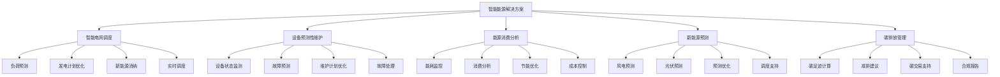

# 2. 总体架构

## 2.1 业务架构

### 角色定义

智能能源解决方案涉及多个角色，每个角色有不同的职责和权限：

- **电网调度员**：
  - 职责：使用智能调度系统进行电网调度，监控电网运行状态，处理异常情况
  - 权限：访问调度数据，使用调度工具，执行调度指令
  - 使用场景：日常调度，负荷预测，新能源消纳，应急处理

- **设备运维工程师**：
  - 职责：使用预测性维护系统监控设备状态，制定维护计划，处理设备故障
  - 权限：访问设备数据，使用维护工具，查看维护报告
  - 使用场景：设备监控，故障预测，维护计划，故障处理

- **能源管理专员**：
  - 职责：使用能源管理系统分析能源消费，制定节能方案，优化能源使用
  - 权限：访问能源数据，使用分析工具，生成分析报告
  - 使用场景：能源消费分析，节能优化，成本控制，碳排放管理

- **新能源预测工程师**：
  - 职责：使用新能源预测系统进行发电预测，优化预测模型，分析预测效果
  - 权限：访问预测数据，使用预测工具，配置预测模型
  - 使用场景：发电预测，模型优化，预测分析，调度支持

- **系统管理员**：
  - 职责：管理系统配置，监控系统运行，处理系统故障
  - 权限：系统配置，用户管理，监控告警
  - 使用场景：系统维护，用户管理，故障处理

### 用例分析

#### 用例1：智能电网调度

**参与者**：电网调度员、调度系统、AI调度引擎

**前置条件**：
- 调度员已登录系统
- 电网运行数据已接入
- 负荷预测模型已部署
- 调度规则已配置

**主流程**：
1. 调度系统实时采集电网运行数据（负荷、发电、新能源出力等）
2. AI模型预测未来24小时负荷和新能源出力
3. 优化算法计算最优调度方案（发电计划、线路潮流、电压控制等）
4. 调度员审核调度方案，确认调度指令
5. 系统下发调度指令到各发电厂和变电站
6. 实时监控调度执行情况，动态调整
7. 记录调度过程和结果，生成调度报告

**异常流程**：
- 如果预测误差较大，调度员可以手动调整
- 如果设备故障，系统自动调整调度方案
- 如果出现紧急情况，启用应急调度模式

**后置条件**：
- 调度方案已执行
- 电网运行稳定
- 调度报告已生成

#### 用例2：设备预测性维护

**参与者**：设备运维工程师、维护系统、AI预测引擎

**前置条件**：
- 运维工程师已登录系统
- 设备监测数据已接入
- 故障预测模型已部署
- 维护规则已配置

**主流程**：
1. 系统实时采集设备监测数据（温度、振动、电流、电压等）
2. AI模型分析设备状态，预测故障概率和剩余寿命
3. 根据预测结果和维护规则，生成维护建议
4. 运维工程师审核维护建议，制定维护计划
5. 系统安排维护任务，通知维护人员
6. 维护完成后，更新设备状态和维护记录
7. 分析维护效果，优化预测模型

**异常流程**：
- 如果预测到高风险故障，立即告警
- 如果设备故障，启动应急处理流程
- 如果维护资源不足，调整维护优先级

**后置条件**：
- 设备状态已更新
- 维护计划已执行
- 维护记录已保存

#### 用例3：能源消费分析

**参与者**：能源管理专员、能源管理系统、AI分析引擎

**前置条件**：
- 管理专员已登录系统
- 能源消费数据已接入
- 分析模型已部署

**主流程**：
1. 管理专员选择分析对象（企业、车间、设备等）和时间范围
2. 系统收集相关数据（用电量、用气量、用热量等）
3. AI模型分析能源消费模式，识别异常和优化机会
4. 生成分析报告（包括消费趋势、异常分析、节能建议等）
5. 管理专员审核报告，制定节能方案
6. 跟踪节能方案执行效果，评估节能成果
7. 更新分析模型，提升分析精度

**异常流程**：
- 如果发现异常能耗，立即告警
- 如果数据不完整，提示补充数据
- 如果分析结果不准确，管理专员可以手动调整

**后置条件**：
- 分析报告已生成
- 节能方案已制定
- 节能效果已评估

#### 用例4：新能源发电预测

**参与者**：新能源预测工程师、预测系统、AI预测引擎

**前置条件**：
- 预测工程师已登录系统
- 气象数据已接入
- 历史发电数据已收集
- 预测模型已部署

**主流程**：
1. 系统采集气象数据（风速、光照、温度等）和历史发电数据
2. AI模型预测未来24-72小时新能源发电量
3. 分析预测不确定性，生成预测区间
4. 预测工程师审核预测结果，确认预测精度
5. 将预测结果发送给调度系统，支持调度决策
6. 跟踪实际发电情况，评估预测误差
7. 根据预测误差，优化预测模型

**异常流程**：
- 如果气象数据异常，使用备用数据源
- 如果预测误差较大，调整预测模型参数
- 如果出现极端天气，启用应急预测模式

**后置条件**：
- 预测结果已生成
- 预测结果已发送给调度系统
- 预测误差已评估

### 故事地图

智能能源解决方案的用户故事地图如下：



## 2.2 技术架构

### AI-Native四层架构

智能能源解决方案采用AI-Native四层架构，从下到上包括基础设施层、模型层、编排层和应用层。

#### 应用层

应用层提供面向业务用户的应用界面和API接口：

**核心应用**：

- **智能调度平台**：
  - 电网运行监控界面
  - 负荷预测和发电计划界面
  - 调度方案优化界面
  - 调度指令下发和执行界面
  - 调度报告生成和导出

- **设备维护平台**：
  - 设备状态监控界面
  - 故障预测和预警界面
  - 维护计划制定界面
  - 维护任务管理界面
  - 维护报告生成工具

- **能源管理平台**：
  - 能源消费监控界面
  - 能耗分析界面
  - 节能方案制定界面
  - 成本分析界面
  - 碳排放管理界面

- **新能源预测平台**：
  - 气象数据监控界面
  - 发电预测界面
  - 预测结果分析界面
  - 预测模型优化界面
  - 预测报告生成工具

**技术栈**：
- 前端：Vue 3 + TypeScript + Vite + TailwindCSS
- 后端API：FastAPI + Python 3.11
- 状态管理：Pinia
- UI组件库：Element Plus
- 数据可视化：ECharts、D3.js

#### 编排层

编排层负责业务流程编排和智能体协调：

**核心组件**：

- **工作流引擎（n8n）**：
  - 业务流程编排（调度流程、维护流程等）
  - 任务调度和执行
  - 异常处理和重试
  - 工作流监控

- **智能体编排（Dify）**：
  - 多智能体协调（调度Agent、维护Agent等）
  - 工具调用管理
  - 上下文管理
  - 对话管理

- **MCP服务器**：
  - 工具注册中心
  - 工具调用接口（数据采集、设备控制等）
  - 数据源接入（SCADA、EMS等）
  - 外部系统集成（调度系统、维护系统等）

**编排示例**：

```yaml
# 智能调度工作流
workflow:
  name: 智能电网调度
  triggers:
    - type: schedule
      cron: "*/15 * * * *"  # 每15分钟执行一次
  nodes:
    - id: collect-data
      type: data-collector
      sources:
        - scada-system
        - weather-api
        - load-forecast-api
    - id: load-forecast
      type: ai-agent
      agent: load-forecast-agent
      model: lstm-load-forecast-v2
      inputs:
        - historical_load: ${collect-data.load_data}
        - weather: ${collect-data.weather_data}
    - id: renewable-forecast
      type: ai-agent
      agent: renewable-forecast-agent
      model: transformer-renewable-v2
      inputs:
        - weather: ${collect-data.weather_data}
        - historical_generation: ${collect-data.generation_data}
    - id: optimize-dispatch
      type: optimization-agent
      agent: dispatch-optimization-agent
      algorithm: genetic-algorithm
      inputs:
        - load_forecast: ${load-forecast.result}
        - renewable_forecast: ${renewable-forecast.result}
        - generation_capacity: ${collect-data.capacity_data}
    - id: validate-solution
      type: validation-agent
      agent: solution-validation-agent
      rules:
        - voltage_constraints
        - thermal_constraints
        - stability_constraints
    - id: execute-dispatch
      type: dispatch-executor
      system: scada-system
      commands: ${validate-solution.dispatch_commands}
    - id: monitor-execution
      type: monitor-agent
      interval: 300  # 每5分钟监控一次
    - id: generate-report
      type: report-generator
      template: dispatch-report-template
```

#### 模型层

模型层提供AI模型服务和推理能力：

**核心模型**：

- **时序预测模型**：
  - 负荷预测模型（LSTM、Transformer、Prophet）
  - 新能源发电预测模型（LSTM、GRU、Transformer）
  - 设备故障预测模型（LSTM、XGBoost、LightGBM）
  - 能源需求预测模型（ARIMA、LSTM、Prophet）

- **优化模型**：
  - 电网调度优化模型（遗传算法、粒子群算法、强化学习）
  - 设备维护优化模型（动态规划、启发式算法）
  - 能源消费优化模型（线性规划、非线性规划）

- **数字孪生模型**：
  - 电网数字孪生（物理模型 + 数据驱动模型）
  - 设备数字孪生（设备建模、状态仿真）
  - 能源系统数字孪生（系统建模、优化仿真）

- **异常检测模型**：
  - 设备异常检测（Isolation Forest、AutoEncoder）
  - 能耗异常检测（统计方法、机器学习）
  - 电网异常检测（时序异常检测、模式识别）

**模型服务**：

- **模型推理服务**：
  - 实时推理API（低延迟、高并发）
  - 批量推理服务（大规模数据处理）
  - 模型版本管理（A/B测试、灰度发布）
  - 模型性能监控（准确率、延迟、吞吐量）

- **模型训练服务**：
  - 数据预处理（数据清洗、特征工程）
  - 模型训练（分布式训练、超参数优化）
  - 模型评估（交叉验证、性能指标）
  - 模型部署（模型转换、服务化）

**技术栈**：
- 模型框架：PyTorch、TensorFlow、Scikit-learn
- 时序模型：Prophet、Statsmodels、Darts
- 优化库：Gurobi、CPLEX、OR-Tools
- 模型服务：TorchServe、TensorFlow Serving、Triton
- 数字孪生：Simulink、ANSYS、自定义仿真引擎

#### 基础设施层

基础设施层提供计算、存储、网络等基础能力：

**核心组件**：

- **计算资源**：
  - Kubernetes集群（GPU节点 + CPU节点）
  - 容器编排和管理
  - 自动扩缩容（根据负载自动调整）
  - 资源调度（GPU资源调度、任务优先级）

- **存储系统**：
  - 时序数据库（InfluxDB、TimescaleDB）：存储时序数据（负荷、发电、设备状态等）
  - 关系数据库（MySQL 8.0）：业务数据存储（用户、权限、配置等）
  - 对象存储（MinIO、阿里云OSS）：存储大文件（报告、日志等）
  - 缓存系统（Redis）：热点数据缓存（预测结果、配置等）
  - 消息队列（RabbitMQ、Kafka）：异步消息处理（数据采集、事件通知等）

- **数据采集**：
  - SCADA系统接入（Modbus、IEC61850等协议）
  - 气象数据接入（API、文件传输等）
  - IoT设备接入（MQTT、CoAP等协议）
  - 外部系统集成（EMS、DMS等）

- **网络和安全**：
  - 负载均衡（Nginx、HAProxy）
  - API网关（Kong、Traefik）
  - 防火墙和安全组
  - VPN和专线（内网隔离、安全通信）

- **监控和日志**：
  - 监控系统（Prometheus + Grafana）
  - 日志系统（ELK Stack）
  - 链路追踪（Jaeger）
  - 告警系统（AlertManager）

**技术栈**：
- 容器化：Docker、Kubernetes
- 数据库：MySQL 8.0、InfluxDB、TimescaleDB、Redis
- 消息队列：RabbitMQ、Kafka
- 监控：Prometheus、Grafana、ELK
- 数据采集：Modbus、IEC61850、MQTT

### 技术栈

#### 前端技术栈

- **Vue 3**：渐进式JavaScript框架，用于构建用户界面
- **TypeScript**：类型安全的JavaScript超集，提高代码质量
- **Vite**：快速的前端构建工具，提供极速的开发体验
- **TailwindCSS**：实用优先的CSS框架，快速构建美观界面
- **Pinia**：Vue的状态管理库，管理应用状态
- **Element Plus**：基于Vue 3的组件库，提供丰富的UI组件
- **Axios**：HTTP客户端，用于API调用
- **ECharts**：数据可视化库，用于图表展示（负荷曲线、发电曲线等）
- **D3.js**：数据驱动文档库，用于复杂数据可视化（电网拓扑图等）

#### 后端技术栈

- **FastAPI**：现代Python Web框架，高性能API开发
- **Python 3.11**：编程语言，用于业务逻辑和AI模型开发
- **SQLAlchemy**：ORM框架，数据库操作
- **Pydantic**：数据验证库，API数据验证
- **Celery**：分布式任务队列，异步任务处理
- **Redis**：缓存和消息队列
- **InfluxDB**：时序数据库，存储时序数据
- **MySQL 8.0**：关系数据库，业务数据存储

#### AI/ML技术栈

- **PyTorch**：深度学习框架，模型训练和推理
- **TensorFlow**：深度学习框架，模型训练和推理
- **Scikit-learn**：机器学习库，传统机器学习算法
- **Prophet**：时序预测库，负荷和发电预测
- **XGBoost/LightGBM**：梯度提升框架，故障预测和分类
- **Transformers**：预训练模型库，NLP任务
- **Gurobi/CPLEX**：优化求解器，调度优化
- **OR-Tools**：优化工具库，组合优化问题

#### 基础设施技术栈

- **Docker**：容器化技术，应用打包和部署
- **Kubernetes**：容器编排平台，集群管理
- **Prometheus**：监控系统，指标采集和存储
- **Grafana**：可视化工具，监控面板
- **ELK Stack**：日志系统，日志采集、存储和分析
- **Nginx**：Web服务器和负载均衡
- **Kafka**：消息队列，大规模数据流处理

### 部署架构

#### 部署模式

智能能源解决方案支持多种部署模式：

**1. 私有化部署**：
- 部署在客户内部机房或私有云
- 数据不出域，满足安全合规要求
- 适用于大型能源企业

**2. 混合云部署**：
- 核心系统私有化部署
- 非敏感数据可上云处理
- 平衡安全性和灵活性

**3. 公有云部署**：
- 部署在公有云平台
- 降低运维成本，快速扩展
- 适用于中小型能源企业

#### 高可用架构

- **多活部署**：关键系统多活部署，避免单点故障
- **数据备份**：定期数据备份，支持快速恢复
- **故障转移**：自动故障检测和转移，保证服务连续性
- **负载均衡**：多实例负载均衡，提升系统吞吐量

#### 安全架构

- **网络安全**：防火墙、VPN、专线隔离
- **数据安全**：数据加密、访问控制、审计日志
- **应用安全**：身份认证、权限控制、API安全
- **合规要求**：满足能源行业安全合规要求

