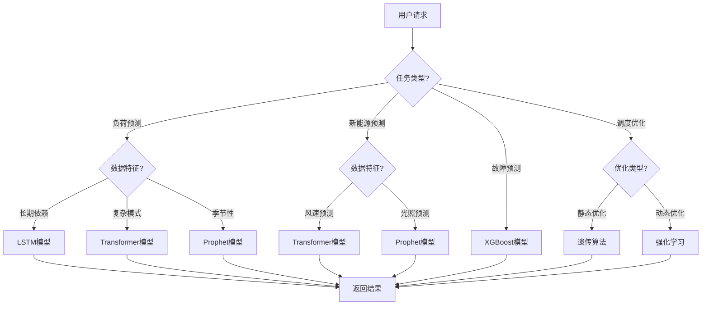

# 4. 模型与提示词管理

## 4.1 多模型路由

### 模型选择策略

智能能源解决方案使用多个AI模型，根据不同的业务场景和需求，智能选择最合适的模型：

#### 模型类型

- **时序预测模型**：
  - **LSTM**：适合长期依赖的时序预测
  - **Transformer**：适合复杂时序模式识别
  - **Prophet**：适合具有季节性和趋势的时序预测
  - **XGBoost/LightGBM**：适合特征丰富的时序预测

- **优化模型**：
  - **遗传算法**：适合复杂优化问题
  - **粒子群算法**：适合连续优化问题
  - **强化学习**：适合动态优化问题
  - **线性/非线性规划**：适合约束优化问题

- **异常检测模型**：
  - **Isolation Forest**：适合高维异常检测
  - **AutoEncoder**：适合时序异常检测
  - **统计方法**：适合简单异常检测

- **数字孪生模型**：
  - **物理模型**：基于物理定律的模型
  - **数据驱动模型**：基于数据的模型
  - **混合模型**：物理模型+数据驱动模型

#### 路由策略

- **基于任务类型路由**：
  - 负荷预测 → LSTM/Transformer模型
  - 新能源预测 → Transformer/Prophet模型
  - 设备故障预测 → XGBoost/LightGBM模型
  - 调度优化 → 遗传算法/强化学习模型

- **基于数据特征路由**：
  - 长期依赖数据 → LSTM/Transformer模型
  - 季节性数据 → Prophet模型
  - 高维数据 → XGBoost/LightGBM模型
  - 时序数据 → 时序模型

- **基于性能要求路由**：
  - 实时任务 → 轻量级模型或缓存
  - 批量任务 → 高性能模型
  - 高精度任务 → 复杂模型

- **基于成本考虑路由**：
  - 简单任务 → 低成本模型
  - 复杂任务 → 高性能模型

**路由决策流程图**：



### 路由规则

#### 规则配置

路由规则通过配置文件定义，支持灵活配置：

```yaml
# 模型路由规则配置
routing_rules:
  # 负荷预测
  - name: load_forecast
    condition:
      task_type: load_forecast
      data_seasonality: high
    model: prophet-load-forecast-v2
    fallback: lstm-load-forecast-v2
    
  # 新能源预测
  - name: renewable_forecast
    condition:
      task_type: renewable_forecast
      energy_type: wind
    model: transformer-wind-forecast-v2
    fallback: lstm-wind-forecast-v2
    
  # 设备故障预测
  - name: equipment_failure
    condition:
      task_type: failure_prediction
      equipment_type: transformer
    model: xgboost-transformer-failure-v2
    fallback: lightgbm-transformer-failure-v2
    
  # 调度优化
  - name: dispatch_optimization
    condition:
      task_type: dispatch_optimization
      optimization_type: static
    model: genetic-algorithm-v2
    fallback: particle-swarm-v2
```

## 4.2 模型版本管理

### 版本命名规则

模型版本采用语义化版本号：`主版本号.次版本号.修订号`

- **主版本号**：重大架构变更或功能变更
- **次版本号**：新功能添加或模型改进
- **修订号**：Bug修复或小幅优化

示例：`load-forecast-v2.3.1` 表示负荷预测模型第2主版本，第3次版本，第1修订版

### 版本管理流程

#### 模型开发

1. **数据准备**：收集和清洗训练数据
2. **特征工程**：提取和选择特征
3. **模型训练**：训练模型，调整超参数
4. **模型评估**：评估模型性能，对比基准模型
5. **模型验证**：在验证集上验证模型

#### 模型测试

1. **单元测试**：测试模型各个组件
2. **集成测试**：测试模型与系统的集成
3. **性能测试**：测试模型推理性能
4. **A/B测试**：对比新旧模型效果

#### 模型部署

1. **模型打包**：将模型打包成可部署格式
2. **模型注册**：在模型注册中心注册模型
3. **灰度发布**：先在小范围部署，观察效果
4. **全量发布**：逐步扩大部署范围
5. **监控告警**：监控模型运行状态

#### 模型回滚

如果新模型出现问题，可以快速回滚到旧版本：

1. **问题识别**：识别模型问题
2. **回滚决策**：决定是否回滚
3. **版本切换**：切换到旧版本
4. **问题分析**：分析问题原因
5. **模型修复**：修复问题后重新部署

## 4.3 模型训练与优化

### 训练数据管理

#### 数据收集

- **历史数据**：收集历史运行数据、历史预测数据
- **实时数据**：实时采集最新数据
- **标注数据**：人工标注的故障数据、异常数据

#### 数据划分

- **训练集**：70%，用于模型训练
- **验证集**：15%，用于模型调优
- **测试集**：15%，用于模型评估

#### 数据增强

- **时间窗口滑动**：生成多个时间窗口的训练样本
- **数据合成**：使用SMOTE等方法合成少数类样本
- **噪声添加**：添加噪声增强模型鲁棒性

### 模型训练

#### 训练流程

1. **数据加载**：加载训练数据
2. **数据预处理**：数据清洗、特征工程
3. **模型初始化**：初始化模型参数
4. **训练循环**：迭代训练，优化损失函数
5. **模型保存**：保存训练好的模型

#### 超参数优化

- **网格搜索**：遍历超参数组合
- **随机搜索**：随机采样超参数组合
- **贝叶斯优化**：基于历史结果优化超参数
- **自动调参**：使用AutoML工具自动调参

#### 训练监控

- **损失曲线**：监控训练损失和验证损失
- **准确率曲线**：监控训练准确率和验证准确率
- **学习率调整**：根据损失曲线调整学习率
- **早停机制**：验证损失不再下降时提前停止

### 模型优化

#### 模型压缩

- **模型剪枝**：移除不重要的神经元或连接
- **模型量化**：降低模型精度（FP32 → FP16 → INT8）
- **知识蒸馏**：用大模型训练小模型
- **模型分解**：将大模型分解为多个小模型

#### 推理优化

- **批量推理**：批量处理多个请求
- **模型缓存**：缓存常用预测结果
- **异步推理**：异步处理推理请求
- **边缘部署**：在边缘设备部署轻量级模型

## 4.4 Prompt工程

### Prompt设计原则

#### 明确性

- **明确任务**：清楚说明要完成的任务
- **明确输入**：明确输入数据的格式和含义
- **明确输出**：明确输出数据的格式和含义

#### 结构化

- **结构化格式**：使用结构化的Prompt格式
- **示例引导**：提供示例引导模型理解
- **步骤分解**：将复杂任务分解为多个步骤

#### 领域知识

- **领域术语**：使用领域专业术语
- **业务规则**：融入业务规则和约束
- **上下文信息**：提供相关上下文信息

### Prompt模板

#### 负荷预测Prompt

```
你是一个专业的电力负荷预测专家。请根据以下信息预测未来24小时的电力负荷：

历史负荷数据：
{historical_load_data}

气象数据：
{weather_data}

历史同期数据：
{historical_same_period_data}

请按照以下格式输出预测结果：
- 时间：YYYY-MM-DD HH:MM
- 预测负荷：XXX MW
- 置信区间：[下限, 上限]
- 预测依据：简要说明预测依据

注意：
1. 考虑工作日和节假日的差异
2. 考虑季节性和趋势性
3. 考虑气象因素的影响
4. 提供合理的置信区间
```

#### 设备故障预测Prompt

```
你是一个专业的设备故障预测专家。请根据以下设备监测数据预测设备故障概率：

设备基本信息：
- 设备类型：{equipment_type}
- 设备编号：{equipment_id}
- 投运时间：{commissioning_date}

监测数据：
{monitoring_data}

历史故障记录：
{historical_failure_records}

请按照以下格式输出预测结果：
- 故障概率：XX%
- 故障类型：可能的故障类型
- 故障时间预测：预计故障时间
- 风险等级：高/中/低
- 维护建议：具体的维护建议

注意：
1. 综合考虑多个监测指标
2. 参考历史故障模式
3. 考虑设备使用年限
4. 提供可操作的维护建议
```

#### 调度优化Prompt

```
你是一个专业的电网调度优化专家。请根据以下信息制定最优调度方案：

当前电网状态：
{current_grid_state}

负荷预测：
{load_forecast}

新能源预测：
{renewable_forecast}

发电机组信息：
{generator_info}

约束条件：
- 电压约束：{voltage_constraints}
- 热稳定约束：{thermal_constraints}
- 频率约束：{frequency_constraints}
- 环保约束：{environmental_constraints}

优化目标：
- 最小化发电成本
- 最大化新能源消纳
- 最小化弃电损失

请按照以下格式输出优化方案：
- 各机组发电计划：{generation_plan}
- 新能源消纳方案：{renewable_utilization}
- 预计成本：{estimated_cost}
- 预计弃电量：{estimated_curtailment}
- 方案可行性：{feasibility}

注意：
1. 满足所有约束条件
2. 优化多个目标
3. 考虑不确定性
4. 提供备选方案
```

### Prompt优化

#### 迭代优化

1. **初始Prompt**：设计初始Prompt
2. **测试评估**：测试Prompt效果
3. **问题分析**：分析Prompt存在的问题
4. **Prompt改进**：改进Prompt
5. **再次测试**：测试改进后的Prompt
6. **持续优化**：持续迭代优化

#### A/B测试

- **对比测试**：对比不同Prompt版本的效果
- **指标评估**：评估准确率、响应时间等指标
- **选择最优**：选择效果最好的Prompt版本

## 4.5 模型监控与评估

### 模型性能监控

#### 实时监控指标

- **预测准确率**：实时监控预测准确率
- **预测误差**：监控预测误差分布
- **响应时间**：监控模型推理响应时间
- **吞吐量**：监控模型处理吞吐量

#### 告警机制

- **准确率下降告警**：准确率低于阈值时告警
- **误差增大告警**：预测误差超过阈值时告警
- **响应延迟告警**：响应时间超过阈值时告警
- **系统故障告警**：模型服务故障时告警

### 模型评估

#### 评估指标

**回归任务**：
- **MAE（平均绝对误差）**：衡量预测误差的平均值
- **RMSE（均方根误差）**：衡量预测误差的标准差
- **MAPE（平均绝对百分比误差）**：衡量预测误差的百分比
- **R²（决定系数）**：衡量模型拟合程度

**分类任务**：
- **准确率**：正确预测的比例
- **精确率**：预测为正例中实际为正例的比例
- **召回率**：实际为正例中被预测为正例的比例
- **F1分数**：精确率和召回率的调和平均

**优化任务**：
- **目标函数值**：优化目标的值
- **约束满足率**：满足约束条件的比例
- **计算时间**：优化计算时间

#### 评估流程

1. **数据准备**：准备测试数据集
2. **模型推理**：使用模型进行推理
3. **结果评估**：计算评估指标
4. **对比分析**：与基准模型对比
5. **报告生成**：生成评估报告

### 模型更新策略

#### 定期更新

- **周度更新**：每周更新一次模型
- **月度更新**：每月更新一次模型
- **季度更新**：每季度更新一次模型

#### 触发更新

- **数据积累**：新数据积累到一定量时更新
- **性能下降**：模型性能下降到阈值时更新
- **业务变化**：业务需求变化时更新
- **新技术**：新技术出现时更新

