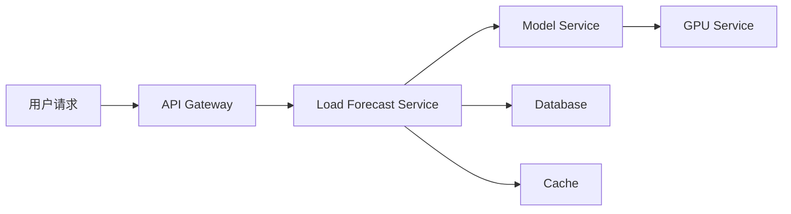

# 9. 监控与可观测

## 9.1 监控体系

### 监控层次

智能能源解决方案采用多层次监控体系：

- **基础设施监控**：服务器、网络、存储等基础设施监控
- **应用监控**：应用服务、API、数据库等应用监控
- **业务监控**：业务指标、业务流程、业务异常等业务监控
- **用户体验监控**：页面加载时间、API响应时间、错误率等用户体验监控

### 监控工具

#### Prometheus + Grafana

- **Prometheus**：指标采集和存储
- **Grafana**：指标可视化和告警
- **应用场景**：系统指标监控、业务指标监控

#### ELK Stack

- **Elasticsearch**：日志存储和检索
- **Logstash**：日志采集和处理
- **Kibana**：日志可视化和分析
- **应用场景**：日志分析、问题排查

#### Jaeger

- **分布式追踪**：追踪请求在分布式系统中的流转
- **性能分析**：分析系统性能瓶颈
- **应用场景**：性能分析、问题定位

## 9.2 指标监控

### 系统指标

#### CPU监控

- **CPU使用率**：监控CPU使用率，告警阈值70%
- **CPU负载**：监控CPU负载，告警阈值80%
- **CPU核心数**：监控CPU核心数，识别资源不足

#### 内存监控

- **内存使用率**：监控内存使用率，告警阈值80%
- **内存使用量**：监控内存使用量，识别内存泄漏
- **Swap使用率**：监控Swap使用率，告警阈值50%

#### 磁盘监控

- **磁盘使用率**：监控磁盘使用率，告警阈值80%
- **磁盘IO**：监控磁盘IO，识别IO瓶颈
- **磁盘读写速度**：监控磁盘读写速度，识别性能问题

#### 网络监控

- **网络带宽**：监控网络带宽使用率，告警阈值70%
- **网络延迟**：监控网络延迟，告警阈值100ms
- **网络错误率**：监控网络错误率，告警阈值1%

### 应用指标

#### API指标

- **请求量**：监控API请求量（QPS）
- **响应时间**：监控API响应时间（P50、P95、P99）
- **错误率**：监控API错误率，告警阈值1%
- **成功率**：监控API成功率，告警阈值99%

#### 数据库指标

- **连接数**：监控数据库连接数，告警阈值80%
- **查询时间**：监控数据库查询时间，告警阈值1s
- **慢查询**：监控慢查询数量，告警阈值10个/分钟
- **锁等待**：监控锁等待时间，告警阈值100ms

#### 消息队列指标

- **消息积压**：监控消息队列积压数量，告警阈值1000
- **消费速度**：监控消息消费速度
- **消息延迟**：监控消息处理延迟，告警阈值5s

### 业务指标

#### 预测指标

- **预测准确率**：监控负荷预测、新能源预测准确率
- **预测误差**：监控预测误差（MAE、RMSE、MAPE）
- **预测覆盖率**：监控预测覆盖率，告警阈值95%

#### 调度指标

- **调度成功率**：监控调度方案执行成功率，告警阈值95%
- **调度偏差**：监控调度执行偏差，告警阈值10%
- **新能源消纳率**：监控新能源消纳率，目标&gt;95%

#### 设备指标

- **设备可用率**：监控设备可用率，目标&gt;99%
- **故障预测准确率**：监控故障预测准确率，目标&gt;90%
- **维护及时率**：监控维护及时率，目标&gt;95%

## 9.3 日志管理

### 日志级别

- **DEBUG**：调试信息，用于开发调试
- **INFO**：一般信息，记录正常操作
- **WARN**：警告信息，需要关注但不影响运行
- **ERROR**：错误信息，影响功能但系统可继续运行
- **FATAL**：严重错误，系统无法继续运行

### 日志格式

#### 结构化日志

```json
{
  "timestamp": "2024-01-01T12:00:00Z",
  "level": "INFO",
  "service": "load-forecast-service",
  "trace_id": "abc123",
  "message": "Load forecast completed",
  "fields": {
    "forecast_id": "fc_20240101_001",
    "region": "华东地区",
    "forecast_hours": 24,
    "mae": 150.2,
    "duration_ms": 1250
  }
}
```

### 日志采集

#### 应用日志

- **文件日志**：应用写入日志文件，Logstash采集
- **标准输出**：应用输出到标准输出，容器日志采集
- **日志代理**：使用日志代理（Filebeat、Fluentd）采集日志

#### 系统日志

- **系统日志**：采集系统日志（syslog）
- **审计日志**：采集审计日志
- **安全日志**：采集安全日志

### 日志分析

#### 日志查询

- **时间范围查询**：按时间范围查询日志
- **关键词搜索**：搜索关键词
- **字段过滤**：按字段过滤日志
- **聚合分析**：聚合分析日志数据

#### 日志告警

- **错误日志告警**：ERROR级别日志超过阈值时告警
- **异常模式告警**：检测到异常日志模式时告警
- **日志量告警**：日志量异常时告警

## 9.4 分布式追踪

### 追踪架构

#### 追踪流程



#### 追踪数据

- **Trace ID**：追踪ID，标识整个请求链路
- **Span ID**：Span ID，标识单个操作
- **Parent Span ID**：父Span ID，标识调用关系
- **操作名称**：操作名称，标识操作类型
- **时间戳**：开始时间和结束时间
- **标签**：操作标签，记录额外信息

### 性能分析

#### 耗时分析

- **总耗时**：分析请求总耗时
- **各服务耗时**：分析各服务耗时，识别性能瓶颈
- **数据库耗时**：分析数据库操作耗时
- **外部调用耗时**：分析外部API调用耗时

#### 瓶颈识别

- **慢请求**：识别慢请求，分析慢请求原因
- **热点服务**：识别热点服务，优化热点服务
- **资源瓶颈**：识别资源瓶颈，扩容资源

## 9.5 告警机制

### 告警规则

#### 阈值告警

- **CPU使用率 > 70%**：CPU使用率超过70%时告警
- **内存使用率 > 80%**：内存使用率超过80%时告警
- **API错误率 > 1%**：API错误率超过1%时告警
- **预测准确率 < 90%**：预测准确率低于90%时告警

#### 异常告警

- **服务不可用**：服务不可用时告警
- **数据库连接失败**：数据库连接失败时告警
- **消息队列积压**：消息队列积压超过阈值时告警

#### 业务告警

- **调度失败**：调度方案执行失败时告警
- **设备故障**：设备故障时告警
- **预测异常**：预测结果异常时告警

### 告警通知

#### 通知渠道

- **邮件通知**：发送邮件通知
- **短信通知**：发送短信通知（紧急告警）
- **企业微信/钉钉**：发送企业微信/钉钉消息
- **电话通知**：电话通知（严重告警）

#### 告警聚合

- **相同告警聚合**：相同告警聚合，避免告警风暴
- **告警升级**：告警持续未处理时升级告警级别
- **告警抑制**：相关告警抑制，避免重复告警

### 告警处理

#### 告警响应

- **自动处理**：部分告警自动处理（如自动重启服务）
- **人工处理**：严重告警人工处理
- **告警跟踪**：跟踪告警处理进度

#### 告警分析

- **告警趋势**：分析告警趋势，识别系统问题
- **告警根因**：分析告警根因，解决根本问题
- **告警优化**：优化告警规则，减少误报

## 9.6 监控面板

### 系统监控面板

#### 基础设施监控

- **服务器状态**：服务器CPU、内存、磁盘使用情况
- **网络状态**：网络带宽、延迟、错误率
- **存储状态**：存储使用率、IO性能

#### 应用监控

- **服务状态**：各服务运行状态、健康检查
- **API性能**：API请求量、响应时间、错误率
- **数据库性能**：数据库连接数、查询时间、慢查询

### 业务监控面板

#### 预测监控

- **预测准确率**：负荷预测、新能源预测准确率
- **预测误差**：预测误差趋势
- **预测覆盖率**：预测覆盖率

#### 调度监控

- **调度成功率**：调度方案执行成功率
- **调度偏差**：调度执行偏差
- **新能源消纳率**：新能源消纳率

#### 设备监控

- **设备状态**：设备运行状态、故障情况
- **故障预测**：故障预测准确率、维护及时率
- **设备可用率**：设备可用率

### 实时监控大屏

#### 大屏展示

- **实时数据**：实时展示电网运行数据、设备状态
- **预测结果**：实时展示预测结果
- **告警信息**：实时展示告警信息
- **关键指标**：实时展示关键业务指标

#### 大屏更新

- **自动刷新**：大屏数据自动刷新（1-5秒）
- **实时推送**：重要数据实时推送更新
- **历史回放**：支持历史数据回放

## 9.7 监控最佳实践

### 监控指标选择

- **关键指标优先**：优先监控关键业务指标
- **指标精简**：避免监控过多指标，关注核心指标
- **指标关联**：监控相关指标，综合分析问题

### 告警规则设计

- **合理阈值**：设置合理的告警阈值，避免误报和漏报
- **告警分级**：根据严重程度分级告警
- **告警聚合**：聚合相同告警，避免告警风暴

### 监控数据保留

- **热数据**：保留最近7天的详细数据
- **温数据**：保留最近30天的聚合数据
- **冷数据**：保留最近1年的汇总数据
- **归档数据**：历史数据归档到低成本存储

