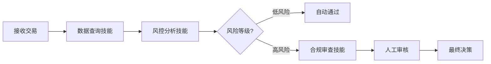
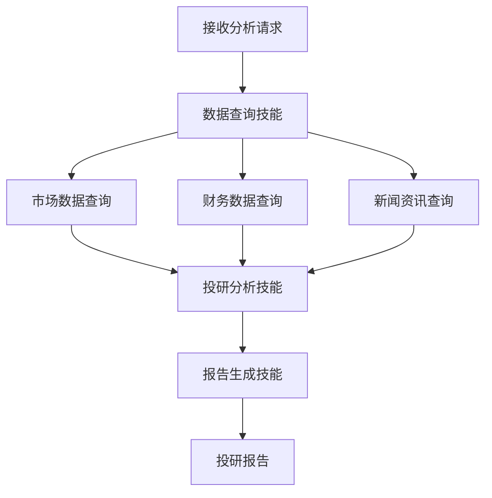
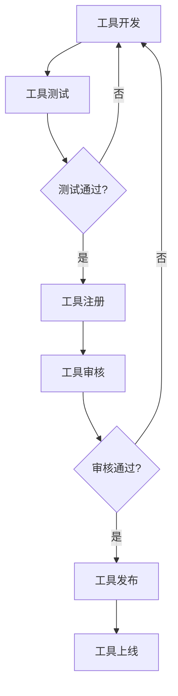
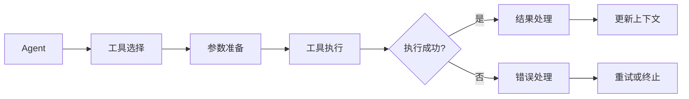

# 5. 智能体与业务编排

## 5.1 Agent技能链

### 技能定义

智能金融解决方案中的Agent具备多种技能，每个技能对应一个特定的业务能力：

#### 核心技能

- **风控分析技能（RiskAnalysisSkill）**：
  - 功能：分析交易风险，计算风险分数，识别风险因素
  - 输入：交易数据、客户信息、历史记录
  - 输出：风险等级、风险分数、风险因素、处理建议
  - 使用模型：风控专用模型 + 大语言模型

- **投研分析技能（ResearchAnalysisSkill）**：
  - 功能：分析公司财务状况、行业趋势、投资价值
  - 输入：公司信息、财务数据、市场数据
  - 输出：投资研究报告、投资建议、风险评估
  - 使用模型：大语言模型（GPT-4）+ RAG知识库

- **合规审查技能（ComplianceReviewSkill）**：
  - 功能：审查交易合规性，识别可疑交易，生成合规报告
  - 输入：交易数据、客户信息、监管规则
  - 输出：合规审查报告、风险等级、处理建议
  - 使用模型：大语言模型（Claude 3）+ 合规知识库

- **客户服务技能（CustomerServiceSkill）**：
  - 功能：回答客户咨询，提供投资建议，处理客户问题
  - 输入：客户问题、客户信息、产品信息
  - 输出：回答内容、推荐产品、操作建议
  - 使用模型：大语言模型（通义千问）+ 产品知识库

- **数据查询技能（DataQuerySkill）**：
  - 功能：查询各类金融数据，包括市场数据、财务数据、交易数据
  - 输入：查询条件、数据源标识
  - 输出：查询结果、数据统计
  - 使用工具：数据库查询工具、API调用工具

- **报告生成技能（ReportGenerationSkill）**：
  - 功能：生成各类报告，包括风控报告、投研报告、合规报告
  - 输入：分析结果、报告模板
  - 输出：格式化报告（Markdown、PDF、Word）
  - 使用工具：报告模板工具、格式化工具

### 技能链设计

技能链是将多个技能组合起来，完成复杂业务流程：

#### 风控检测技能链



**技能链配置**：

```yaml
skill_chain:
  name: risk_control_chain
  skills:
    - name: data_query
      skill: DataQuerySkill
      inputs:
        - transaction_id
      outputs:
        - transaction_data
        - customer_data
        - history_data
    
    - name: risk_analysis
      skill: RiskAnalysisSkill
      inputs:
        - transaction_data
        - customer_data
        - history_data
      outputs:
        - risk_level
        - risk_score
        - risk_factors
    
    - name: compliance_review
      skill: ComplianceReviewSkill
      condition: risk_level == "high"
      inputs:
        - transaction_data
        - risk_factors
      outputs:
        - compliance_report
        - final_decision
```

#### 投研分析技能链



**技能链配置**：

```yaml
skill_chain:
  name: research_analysis_chain
  skills:
    - name: market_data_query
      skill: DataQuerySkill
      inputs:
        - company_name
        - date_range
      outputs:
        - market_data
    
    - name: financial_data_query
      skill: DataQuerySkill
      inputs:
        - company_name
      outputs:
        - financial_data
    
    - name: news_query
      skill: DataQuerySkill
      inputs:
        - company_name
        - date_range
      outputs:
        - news_data
    
    - name: research_analysis
      skill: ResearchAnalysisSkill
      inputs:
        - market_data
        - financial_data
        - news_data
      outputs:
        - analysis_result
        - investment_recommendation
    
    - name: report_generation
      skill: ReportGenerationSkill
      inputs:
        - analysis_result
        - template: research_report_template
      outputs:
        - research_report
```

### 执行流程

#### 技能链执行引擎

技能链执行引擎负责协调各个技能的执行：

```python
class SkillChainExecutor:
    def __init__(self, skill_registry, tool_registry):
        self.skill_registry = skill_registry
        self.tool_registry = tool_registry
    
    def execute(self, chain_config, inputs):
        """
        执行技能链
        
        Args:
            chain_config: 技能链配置
            inputs: 输入数据
        
        Returns:
            最终输出结果
        """
        context = inputs.copy()
        
        for skill_config in chain_config['skills']:
            # 检查条件
            if 'condition' in skill_config:
                if not self._evaluate_condition(skill_config['condition'], context):
                    continue
            
            # 获取技能
            skill = self.skill_registry.get_skill(skill_config['skill'])
            
            # 准备输入
            skill_inputs = self._prepare_inputs(skill_config['inputs'], context)
            
            # 执行技能
            skill_outputs = skill.execute(skill_inputs, self.tool_registry)
            
            # 更新上下文
            context.update(skill_outputs)
        
        return context
```

#### 错误处理和重试

- **错误处理**：
  - 技能执行失败时，记录错误信息
  - 根据错误类型决定是否重试
  - 关键技能失败时，终止技能链执行

- **重试策略**：
  - 网络错误：自动重试3次，指数退避
  - 模型错误：重试1次，如果仍失败则使用备用模型
  - 数据错误：不重试，记录错误并终止

## 5.2 工具注册中心

### 工具类型

智能金融解决方案中的工具分为以下几类：

#### 数据查询工具

- **数据库查询工具（DatabaseQueryTool）**：
  - 功能：查询MySQL、PostgreSQL等关系数据库
  - 参数：SQL查询语句、数据库连接信息
  - 返回：查询结果（JSON格式）
  - 安全：SQL注入防护、权限控制

- **API调用工具（APICallTool）**：
  - 功能：调用外部API接口
  - 参数：API URL、请求方法、请求参数、认证信息
  - 返回：API响应（JSON格式）
  - 安全：API密钥管理、请求签名

- **向量数据库查询工具（VectorDBQueryTool）**：
  - 功能：查询向量数据库，进行相似度搜索
  - 参数：查询向量、Top-K、过滤条件
  - 返回：相似文档列表
  - 用途：RAG检索、知识库查询

#### 数据处理工具

- **数据清洗工具（DataCleaningTool）**：
  - 功能：清洗和预处理数据
  - 参数：原始数据、清洗规则
  - 返回：清洗后的数据

- **特征工程工具（FeatureEngineeringTool）**：
  - 功能：提取和构造特征
  - 参数：原始数据、特征定义
  - 返回：特征向量

- **数据统计工具（DataStatisticsTool）**：
  - 功能：计算数据统计指标
  - 参数：数据、统计指标类型
  - 返回：统计结果

#### 模型调用工具

- **LLM调用工具（LLMCallTool）**：
  - 功能：调用大语言模型API
  - 参数：Prompt、模型名称、温度参数
  - 返回：模型生成结果
  - 支持：OpenAI、Anthropic、本地模型

- **风控模型调用工具（RiskModelCallTool）**：
  - 功能：调用风控模型进行风险评分
  - 参数：交易特征、客户特征
  - 返回：风险分数、风险等级

- **NLP模型调用工具（NLPCallTool）**：
  - 功能：调用NLP模型进行文本处理
  - 参数：文本、任务类型（分类/NER/情感分析）
  - 返回：处理结果

#### 业务工具

- **报告生成工具（ReportGenerationTool）**：
  - 功能：生成格式化报告
  - 参数：报告内容、报告模板、输出格式
  - 返回：报告文件（PDF/Word/Markdown）

- **通知工具（NotificationTool）**：
  - 功能：发送通知（邮件、短信、企业微信）
  - 参数：通知内容、接收人、通知方式
  - 返回：发送结果

- **审批工具（ApprovalTool）**：
  - 功能：提交审批流程
  - 参数：审批内容、审批人、审批类型
  - 返回：审批结果

### 工具注册流程

#### 1. 工具开发

- **实现工具接口**：
  - 实现统一的工具接口
  - 定义输入输出格式
  - 实现工具逻辑

- **编写工具文档**：
  - 工具功能描述
  - 参数说明
  - 使用示例
  - 错误处理

#### 2. 工具测试

- **单元测试**：
  - 测试工具的基本功能
  - 测试错误处理
  - 测试边界情况

- **集成测试**：
  - 测试工具与其他组件的集成
  - 测试工具在技能链中的使用

#### 3. 工具注册

- **注册到工具中心**：
  - 提交工具代码
  - 填写工具元数据
  - 配置工具权限

- **工具审核**：
  - 代码审查
  - 安全审查
  - 性能测试

#### 4. 工具发布

- **版本管理**：
  - 创建工具版本
  - 记录版本变更

- **部署上线**：
  - 部署到生产环境
  - 更新工具注册表

**工具注册流程图**：



### 工具调用机制

#### MCP协议

工具调用基于MCP（Model Context Protocol）协议：

```python
# MCP工具调用示例
class MCPTool:
    def __init__(self, tool_name, tool_config):
        self.tool_name = tool_name
        self.tool_config = tool_config
    
    def call(self, inputs):
        """
        调用工具
        
        Args:
            inputs: 工具输入参数
        
        Returns:
            工具执行结果
        """
        # 验证输入参数
        self._validate_inputs(inputs)
        
        # 执行工具逻辑
        result = self._execute(inputs)
        
        # 返回结果
        return {
            "tool": self.tool_name,
            "result": result,
            "timestamp": datetime.now().isoformat()
        }
```

#### 工具调用流程

1. **工具选择**：
   - Agent根据任务需求选择合适工具
   - 可以调用多个工具
   - 工具可以串行或并行调用

2. **参数准备**：
   - 从上下文中提取工具所需参数
   - 验证参数格式和有效性

3. **工具执行**：
   - 调用工具执行逻辑
   - 处理工具执行错误
   - 记录工具执行日志

4. **结果处理**：
   - 解析工具返回结果
   - 将结果添加到上下文
   - 传递给下一个技能或工具

**工具调用流程图**：



## 5.3 长记忆与状态管理

### 记忆机制

#### 记忆类型

- **短期记忆（Short-term Memory）**：
  - 存储：当前对话的上下文
  - 容量：最近10-20轮对话
  - 用途：维护对话连贯性
  - 存储位置：内存（Redis）

- **长期记忆（Long-term Memory）**：
  - 存储：历史对话记录、用户偏好、业务数据
  - 容量：无限制
  - 用途：个性化服务、历史查询
  - 存储位置：数据库（MySQL）

- **工作记忆（Working Memory）**：
  - 存储：当前任务的状态和中间结果
  - 容量：当前任务相关数据
  - 用途：任务执行过程中的状态管理
  - 存储位置：内存（Redis）

#### 记忆存储结构

```python
class Memory:
    def __init__(self, user_id, session_id):
        self.user_id = user_id
        self.session_id = session_id
        self.short_term = []  # 短期记忆
        self.long_term = {}   # 长期记忆
        self.working = {}     # 工作记忆
    
    def add_short_term(self, message):
        """添加短期记忆"""
        self.short_term.append(message)
        # 保持最近20条
        if len(self.short_term) > 20:
            self.short_term.pop(0)
    
    def add_long_term(self, key, value):
        """添加长期记忆"""
        self.long_term[key] = value
    
    def get_context(self, max_turns=10):
        """获取对话上下文"""
        return self.short_term[-max_turns:]
```

### 状态管理

#### 状态类型

- **会话状态（Session State）**：
  - 存储：当前会话的状态信息
  - 内容：用户信息、当前任务、对话历史
  - 生命周期：会话期间

- **任务状态（Task State）**：
  - 存储：当前任务的状态信息
  - 内容：任务进度、中间结果、错误信息
  - 生命周期：任务执行期间

- **用户状态（User State）**：
  - 存储：用户的长期状态信息
  - 内容：用户偏好、历史记录、账户信息
  - 生命周期：用户账户生命周期

#### 状态管理实现

使用Redis存储会话状态和任务状态：

```python
class StateManager:
    def __init__(self, redis_client):
        self.redis = redis_client
    
    def set_session_state(self, session_id, state):
        """设置会话状态"""
        key = f"session:{session_id}"
        self.redis.setex(key, 3600, json.dumps(state))  # 1小时过期
    
    def get_session_state(self, session_id):
        """获取会话状态"""
        key = f"session:{session_id}"
        data = self.redis.get(key)
        if data:
            return json.loads(data)
        return None
    
    def set_task_state(self, task_id, state):
        """设置任务状态"""
        key = f"task:{task_id}"
        self.redis.setex(key, 86400, json.dumps(state))  # 24小时过期
    
    def get_task_state(self, task_id):
        """获取任务状态"""
        key = f"task:{task_id}"
        data = self.redis.get(key)
        if data:
            return json.loads(data)
        return None
```

### 上下文维护

#### 上下文管理策略

- **上下文窗口管理**：
  - 限制上下文长度，避免超出模型限制
  - 使用滑动窗口，保留最近N轮对话
  - 重要信息优先保留

- **上下文压缩**：
  - 对历史对话进行摘要
  - 提取关键信息
  - 减少上下文长度

- **上下文检索**：
  - 从长期记忆中检索相关信息
  - 动态添加到上下文
  - 提高上下文相关性

#### 上下文维护实现

```python
class ContextManager:
    def __init__(self, memory, max_length=4000):
        self.memory = memory
        self.max_length = max_length
    
    def build_context(self, current_message):
        """构建上下文"""
        # 获取短期记忆
        short_term = self.memory.get_context()
        
        # 检索相关长期记忆
        long_term = self.memory.search_relevant(current_message)
        
        # 构建上下文
        context = {
            "short_term": short_term,
            "long_term": long_term,
            "current": current_message
        }
        
        # 压缩上下文
        if self._get_length(context) > self.max_length:
            context = self._compress_context(context)
        
        return context
    
    def _compress_context(self, context):
        """压缩上下文"""
        # 对历史对话进行摘要
        summary = self._summarize(context["short_term"])
        
        # 保留最近几轮对话
        recent = context["short_term"][-5:]
        
        return {
            "summary": summary,
            "recent": recent,
            "long_term": context["long_term"],
            "current": context["current"]
        }
```
