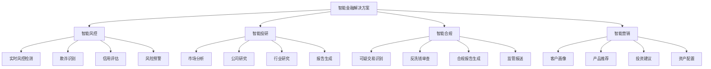
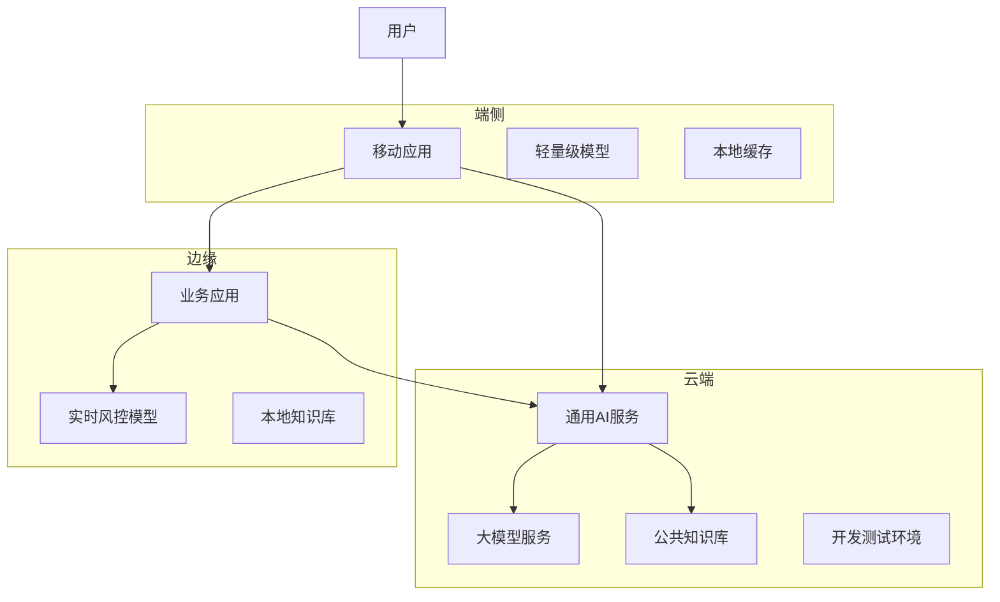
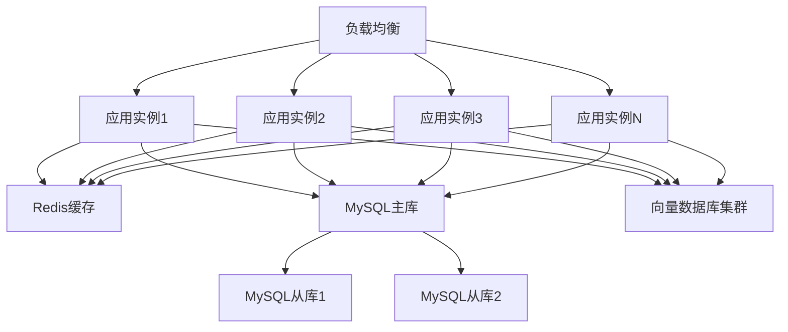

# 2. 总体架构

## 2.1 业务架构

### 角色定义

智能金融解决方案涉及多个角色，每个角色有不同的职责和权限：

- **风控分析师**：
  - 职责：配置风控规则，审核高风险交易，分析风控效果
  - 权限：查看风控数据，配置风控规则，审核交易
  - 使用场景：日常风控运营，风控规则优化，风险事件处理

- **投研分析师**：
  - 职责：使用智能投研工具进行市场分析，生成研究报告，提供投资建议
  - 权限：访问投研数据，使用AI分析工具，生成报告
  - 使用场景：市场研究，公司分析，行业研究，报告生成

- **合规专员**：
  - 职责：使用智能合规工具进行合规审查，识别可疑交易，生成合规报告
  - 权限：访问合规数据，使用合规审查工具，生成报告
  - 使用场景：可疑交易审查，合规报告生成，监管报送

- **投资顾问**：
  - 职责：为客户提供投资建议，配置投资组合，评估投资风险
  - 权限：访问客户数据，使用投资建议工具，配置投资组合
  - 使用场景：客户咨询，投资建议，资产配置

- **系统管理员**：
  - 职责：管理系统配置，监控系统运行，处理系统故障
  - 权限：系统配置，用户管理，监控告警
  - 使用场景：系统维护，用户管理，故障处理

### 用例分析

#### 用例1：实时风控检测

**参与者**：交易系统、风控系统、风控分析师

**前置条件**：
- 交易系统正常运行
- 风控模型已部署
- 风控规则已配置

**主流程**：
1. 交易系统发起交易请求
2. 风控系统接收交易数据
3. AI模型分析交易特征，计算风险分数
4. 根据风险分数和规则，判断交易风险等级
5. 低风险交易自动通过，高风险交易转人工审核
6. 风控分析师审核高风险交易
7. 返回审核结果给交易系统

**异常流程**：
- 如果AI模型不可用，使用规则引擎作为备用方案
- 如果系统故障，启用降级模式，仅使用基础规则

**后置条件**：
- 交易处理完成
- 风控结果已记录
- 高风险交易已审核

#### 用例2：智能投研分析

**参与者**：投研分析师、投研系统

**前置条件**：
- 投研分析师已登录系统
- 需要分析的公司或行业已确定

**主流程**：
1. 投研分析师输入分析需求（公司名称、行业、分析维度等）
2. 系统收集相关数据（财务数据、新闻、公告、研报等）
3. AI模型分析数据，提取关键信息
4. 生成分析报告（包括财务分析、行业分析、风险评估等）
5. 投研分析师审核报告，进行修改和完善
6. 生成最终报告

**异常流程**：
- 如果数据不足，提示用户补充数据
- 如果AI分析结果不准确，投研分析师可以手动修改

**后置条件**：
- 分析报告已生成
- 报告已保存到知识库

#### 用例3：智能合规审查

**参与者**：合规专员、合规系统

**前置条件**：
- 合规专员已登录系统
- 需要审查的交易或客户已确定

**主流程**：
1. 合规专员选择需要审查的交易或客户
2. 系统收集相关数据（交易记录、客户信息、关联方信息等）
3. AI模型分析数据，识别可疑模式
4. 生成合规审查报告（包括风险点、合规建议等）
5. 合规专员审核报告，确认风险等级
6. 如果需要，生成监管报送材料

**异常流程**：
- 如果发现高风险交易，立即告警
- 如果需要人工审查，转给高级合规专员

**后置条件**：
- 合规审查完成
- 审查报告已保存
- 如需报送，材料已生成

### 故事地图

智能金融解决方案的用户故事地图如下：



## 2.2 技术架构

### AI-Native四层架构

智能金融解决方案采用AI-Native四层架构，从下到上包括基础设施层、模型层、编排层和应用层。

#### 应用层

应用层提供面向业务用户的应用界面和API接口：

**核心应用**：

- **风控管理平台**：
  - 实时风控监控大屏
  - 风控规则配置界面
  - 风险事件处理界面
  - 风控效果分析报表

- **投研分析平台**：
  - 市场分析工具
  - 公司研究工具
  - 行业研究工具
  - 报告生成工具

- **合规管理平台**：
  - 合规审查界面
  - 可疑交易处理界面
  - 合规报告生成工具
  - 监管报送工具

- **客户服务平台**：
  - 智能客服界面
  - 投资建议界面
  - 资产配置工具
  - 客户画像展示

**技术栈**：
- 前端：Vue 3 + TypeScript + Vite + TailwindCSS
- 后端API：FastAPI + Python 3.11
- 状态管理：Pinia
- UI组件库：Element Plus

#### 编排层

编排层负责业务流程编排和智能体协调：

**核心组件**：

- **工作流引擎（n8n）**：
  - 业务流程编排
  - 任务调度和执行
  - 异常处理和重试
  - 工作流监控

- **智能体编排（Dify）**：
  - 多智能体协调
  - 工具调用管理
  - 上下文管理
  - 对话管理

- **MCP服务器**：
  - 工具注册中心
  - 工具调用接口
  - 数据源接入
  - 外部系统集成

**编排示例**：

```yaml
# 风控检测工作流
workflow:
  name: 实时风控检测
  triggers:
    - type: webhook
      path: /api/risk-check
  nodes:
    - id: receive-transaction
      type: webhook
    - id: fetch-customer-data
      type: http-request
      url: ${CUSTOMER_API}/customer/${transaction.customerId}
    - id: ai-risk-analysis
      type: ai-agent
      agent: risk-analysis-agent
      tools:
        - transaction-history-tool
        - customer-profile-tool
        - fraud-pattern-tool
    - id: rule-engine-check
      type: rule-engine
      rules: ${RISK_RULES}
    - id: decision
      type: switch
      conditions:
        - if: ${risk_score} < 0.3
          then: approve
        - if: ${risk_score} >= 0.3
          then: manual-review
    - id: approve
      type: response
      status: approved
    - id: manual-review
      type: notify
      channel: risk-analyst
```

#### 模型层

模型层提供AI模型服务和推理能力：

**核心模型**：

- **风控模型**：
  - 欺诈检测模型（XGBoost + 深度学习）
  - 信用评估模型（梯度提升树）
  - 异常检测模型（孤立森林 + LSTM）
  - 风险评分模型（集成学习）

- **NLP模型**：
  - 文本分类模型（BERT）
  - 命名实体识别模型（BERT + CRF）
  - 情感分析模型（RoBERTa）
  - 文本摘要模型（T5）

- **大语言模型**：
  - 通用大模型（GPT-4、Claude、通义千问）
  - 金融领域微调模型
  - RAG增强模型

**模型服务**：

- **模型推理服务**：
  - 实时推理API
  - 批量推理服务
  - 模型版本管理
  - A/B测试支持

- **模型训练服务**：
  - 数据预处理
  - 模型训练
  - 模型评估
  - 模型部署

**技术栈**：
- 模型框架：PyTorch、TensorFlow、XGBoost
- 模型服务：TorchServe、TensorFlow Serving、Triton
- 大模型：OpenAI API、Anthropic API、本地部署模型

#### 基础设施层

基础设施层提供计算、存储、网络等基础能力：

**核心组件**：

- **计算资源**：
  - Kubernetes集群（GPU节点 + CPU节点）
  - 容器编排和管理
  - 自动扩缩容
  - 资源调度

- **存储系统**：
  - 关系数据库（MySQL 8.0）：业务数据存储
  - 向量数据库（Milvus、Qdrant）：知识库和相似度搜索
  - 对象存储（MinIO、阿里云OSS）：文件存储
  - 缓存系统（Redis）：热点数据缓存
  - 消息队列（RabbitMQ、Kafka）：异步消息处理

- **网络和安全**：
  - 负载均衡（Nginx、HAProxy）
  - API网关（Kong、Traefik）
  - 防火墙和安全组
  - VPN和专线

- **监控和日志**：
  - 监控系统（Prometheus + Grafana）
  - 日志系统（ELK Stack）
  - 链路追踪（Jaeger）
  - 告警系统（AlertManager）

**技术栈**：
- 容器化：Docker、Kubernetes
- 数据库：MySQL 8.0、Redis、Milvus
- 消息队列：RabbitMQ、Kafka
- 监控：Prometheus、Grafana、ELK

### 技术栈

#### 前端技术栈

- **Vue 3**：渐进式JavaScript框架，用于构建用户界面
- **TypeScript**：类型安全的JavaScript超集，提高代码质量
- **Vite**：快速的前端构建工具，提供极速的开发体验
- **TailwindCSS**：实用优先的CSS框架，快速构建美观界面
- **Pinia**：Vue的状态管理库，管理应用状态
- **Element Plus**：基于Vue 3的组件库，提供丰富的UI组件
- **Axios**：HTTP客户端，用于API调用
- **ECharts**：数据可视化库，用于图表展示

#### 后端技术栈

- **FastAPI**：现代、快速的Python Web框架，用于构建API
- **Python 3.11**：编程语言，提供丰富的AI库支持
- **SQLAlchemy**：Python ORM框架，用于数据库操作
- **Pydantic**：数据验证库，用于API数据验证
- **Celery**：分布式任务队列，用于异步任务处理
- **Redis**：内存数据库，用于缓存和消息队列
- **MySQL 8.0**：关系数据库，用于业务数据存储

#### AI技术栈

- **PyTorch**：深度学习框架，用于模型训练和推理
- **Transformers**：Hugging Face的Transformer模型库
- **LangChain**：LLM应用开发框架，用于构建AI应用
- **RAG技术**：检索增强生成，提升AI回答准确性
- **向量数据库**：Milvus、Qdrant，用于知识库存储和检索
- **模型服务**：TorchServe、Triton，用于模型部署和推理

#### 基础设施技术栈

- **Docker**：容器化技术，用于应用打包和部署
- **Kubernetes**：容器编排平台，用于容器管理和调度
- **Nginx**：Web服务器和反向代理
- **Prometheus**：监控系统，用于指标收集
- **Grafana**：可视化平台，用于监控数据展示
- **ELK Stack**：日志系统，用于日志收集和分析

## 2.3 部署架构

### 云/边/端混合部署

智能金融解决方案采用云/边/端混合部署架构，根据业务需求和数据敏感性，灵活选择部署位置：

**云端部署**：

- **适用场景**：
  - 非敏感数据的处理和分析
  - 大规模模型训练和推理
  - 公共知识库和通用服务

- **部署内容**：
  - 大语言模型服务
  - 通用AI模型服务
  - 公共知识库
  - 开发测试环境

- **优势**：
  - 弹性扩展，按需付费
  - 无需维护基础设施
  - 全球部署，低延迟

**边缘部署**：

- **适用场景**：
  - 实时风控检测
  - 低延迟要求的业务
  - 数据不出域的合规要求

- **部署内容**：
  - 实时风控模型
  - 本地知识库
  - 业务应用服务

- **优势**：
  - 低延迟，快速响应
  - 数据不出域，满足合规要求
  - 降低网络带宽成本

**端侧部署**：

- **适用场景**：
  - 移动端应用
  - 离线场景
  - 隐私保护要求高的场景

- **部署内容**：
  - 轻量级模型
  - 本地缓存
  - 离线功能

- **优势**：
  - 完全离线，保护隐私
  - 快速响应，无需网络
  - 降低服务器负载

**部署架构图**：



### 高可用设计

**多机房部署**：

- **主备机房**：
  - 主机房：承担主要业务流量
  - 备机房：实时同步数据，主备切换时间&lt;5分钟

- **异地容灾**：
  - 同城双活：两个机房同时提供服务，负载均衡
  - 异地灾备：异地机房作为灾备，定期同步数据

**服务高可用**：

- **多实例部署**：
  - 每个服务至少部署3个实例
  - 使用负载均衡分发请求
  - 自动故障检测和切换

- **数据库高可用**：
  - MySQL主从复制
  - Redis Sentinel集群
  - 向量数据库多副本

**故障恢复**：

- **自动故障检测**：
  - 健康检查：每30秒检查一次服务健康状态
  - 故障告警：故障时立即告警
  - 自动切换：检测到故障后自动切换到备用实例

- **数据备份**：
  - 数据库每日全量备份
  - 增量备份每6小时一次
  - 备份保留30天

### 扩展性设计

**水平扩展**：

- **无状态服务**：
  - 应用服务设计为无状态，可以水平扩展
  - 使用负载均衡分发请求
  - 支持动态扩缩容

- **数据库扩展**：
  - 读写分离：读请求分发到从库
  - 分库分表：按业务维度分库分表
  - 缓存层：热点数据缓存到Redis

**垂直扩展**：

- **资源升级**：
  - CPU和内存可以根据负载动态调整
  - GPU资源可以根据模型推理需求调整
  - 存储容量可以动态扩容

**弹性伸缩**：

- **自动扩缩容**：
  - 基于CPU、内存、请求量等指标自动扩缩容
  - 扩容阈值：CPU使用率&gt;70%或请求量&gt;80%
  - 缩容阈值：CPU使用率&lt;30%且请求量&lt;40%

- **预测性扩缩容**：
  - 基于历史数据预测未来负载
  - 提前扩容，避免突发流量导致服务不可用

**扩展性架构图**：


