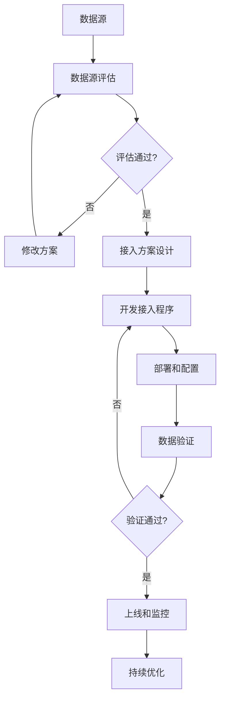
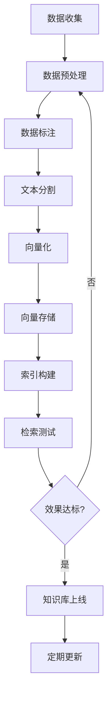
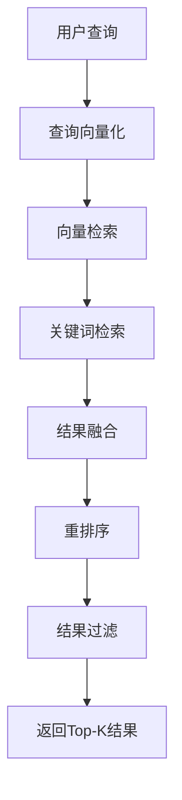
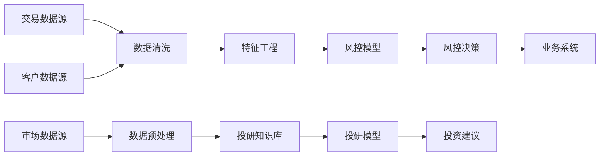

# 3. 数据与知识治理

## 3.1 私有数据接入

### 数据源类型

智能金融解决方案需要接入多种数据源，包括：

#### 内部数据源

- **交易数据**：
  - 数据描述：客户的交易记录，包括交易时间、金额、类型、对手方等
  - 数据格式：JSON、CSV、数据库表
  - 数据量：日均1000万+笔交易
  - 更新频率：实时
  - 接入方式：数据库直连、消息队列、API接口

- **客户数据**：
  - 数据描述：客户基本信息、身份信息、联系方式、风险等级等
  - 数据格式：数据库表、JSON
  - 数据量：千万级客户
  - 更新频率：准实时（延迟&lt;1分钟）
  - 接入方式：数据库直连、API接口

- **财务数据**：
  - 数据描述：财务报表、财务指标、现金流等
  - 数据格式：Excel、PDF、数据库表
  - 数据量：百万级公司财务数据
  - 更新频率：季度/年度
  - 接入方式：文件上传、API接口、爬虫

- **风控数据**：
  - 数据描述：历史风控记录、风险事件、规则执行结果等
  - 数据格式：数据库表、日志文件
  - 数据量：亿级记录
  - 更新频率：实时
  - 接入方式：数据库直连、日志采集

#### 外部数据源

- **市场数据**：
  - 数据描述：股票价格、指数、汇率、利率等市场数据
  - 数据来源：Wind、同花顺、Bloomberg等数据提供商
  - 数据格式：API接口、CSV文件
  - 更新频率：实时/分钟级
  - 接入方式：API接口、数据文件下载

- **新闻资讯**：
  - 数据描述：财经新闻、公司公告、行业资讯等
  - 数据来源：新浪财经、东方财富、证券时报等
  - 数据格式：HTML、JSON、RSS
  - 更新频率：实时
  - 接入方式：爬虫、RSS订阅、API接口

- **研报数据**：
  - 数据描述：券商研报、行业报告、公司研究报告等
  - 数据来源：券商官网、第三方研报平台
  - 数据格式：PDF、Word、HTML
  - 更新频率：每日
  - 接入方式：文件下载、API接口

- **监管数据**：
  - 数据描述：监管公告、政策文件、处罚信息等
  - 数据来源：银保监会、证监会、央行等监管机构
  - 数据格式：PDF、HTML
  - 更新频率：每日
  - 接入方式：网站爬虫、API接口

#### 第三方数据源

- **征信数据**：
  - 数据描述：个人征信报告、企业征信报告
  - 数据来源：央行征信中心、百行征信、第三方征信机构
  - 数据格式：API接口、JSON
  - 更新频率：按需查询
  - 接入方式：API接口

- **黑名单数据**：
  - 数据描述：失信人员名单、欺诈人员名单等
  - 数据来源：法院、公安、第三方风控机构
  - 数据格式：API接口、数据库
  - 更新频率：每日
  - 接入方式：API接口、数据库同步

### 数据接入流程

数据接入采用标准化的流程，确保数据质量和安全：

#### 1. 数据源评估

- **数据质量评估**：
  - 数据完整性：检查数据是否完整，缺失值比例
  - 数据准确性：抽样验证数据准确性
  - 数据一致性：检查数据格式和标准是否一致
  - 数据时效性：评估数据更新频率和延迟

- **数据安全评估**：
  - 数据敏感性：评估数据敏感级别
  - 数据合规性：检查是否符合数据保护法规
  - 数据来源可靠性：评估数据来源的可信度

#### 2. 接入方案设计

- **技术方案**：
  - 选择接入方式（API、数据库、文件等）
  - 设计数据同步机制（实时、准实时、批量）
  - 设计数据转换和清洗规则
  - 设计错误处理和重试机制

- **安全方案**：
  - 数据传输加密（TLS 1.3）
  - 数据存储加密（AES-256）
  - 访问控制（RBAC、IP白名单）
  - 数据脱敏规则

#### 3. 接入实施

- **开发接入程序**：
  - 编写数据接入脚本或服务
  - 实现数据转换和清洗逻辑
  - 实现错误处理和日志记录
  - 编写单元测试和集成测试

- **部署和配置**：
  - 部署接入服务到生产环境
  - 配置数据源连接信息
  - 配置数据同步规则
  - 配置监控和告警

#### 4. 验证和上线

- **数据验证**：
  - 验证数据完整性
  - 验证数据准确性
  - 验证数据时效性
  - 验证数据格式

- **性能测试**：
  - 测试数据接入性能
  - 测试系统负载能力
  - 测试错误处理能力

- **上线和监控**：
  - 正式上线数据接入
  - 持续监控数据质量
  - 持续监控系统性能

**数据接入流程图**：

### 数据质量保证

#### 数据质量监控

- **实时监控**：
  - 数据接入量监控：监控每日/每小时数据接入量
  - 数据延迟监控：监控数据更新延迟
  - 数据错误监控：监控数据接入错误率
  - 数据质量监控：监控数据质量指标

- **质量指标**：
  - **完整性**：数据完整率 ≥ 99%
  - **准确性**：数据准确率 ≥ 95%
  - **一致性**：数据一致性 ≥ 98%
  - **时效性**：数据延迟 ≤ 5分钟

#### 数据清洗规则

- **缺失值处理**：
  - 关键字段缺失：标记为异常，不进入后续处理
  - 非关键字段缺失：使用默认值或插值填充

- **异常值处理**：
  - 数值异常：超出合理范围的值标记为异常
  - 格式异常：不符合格式要求的值进行格式转换或标记为异常
  - 逻辑异常：不符合业务逻辑的值标记为异常

- **重复数据处理**：
  - 基于主键去重：保留最新记录
  - 基于业务规则去重：根据业务规则判断是否重复

#### 数据质量报告

- **日报**：
  - 数据接入量统计
  - 数据质量指标统计
  - 数据异常情况统计
  - 数据质量趋势分析

- **周报**：
  - 数据质量趋势分析
  - 数据质量问题分析
  - 数据质量改进建议

## 3.2 向量知识库

### 知识库构建

智能金融解决方案构建多个专业向量知识库，支持不同业务场景：

#### 知识库分类

- **金融法规知识库**：
  - 内容：银行法、证券法、保险法等金融法规
  - 用途：合规审查、法律咨询
  - 数据量：10万+条法规条文
  - 更新频率：月度

- **市场知识库**：
  - 内容：市场数据、行业报告、公司研报
  - 用途：投研分析、市场分析
  - 数据量：100万+条记录
  - 更新频率：每日

- **风控知识库**：
  - 内容：风控规则、风险案例、欺诈模式
  - 用途：风控决策、风险识别
  - 数据量：50万+条记录
  - 更新频率：实时

- **产品知识库**：
  - 内容：金融产品信息、产品说明书、FAQ
  - 用途：客户服务、产品推荐
  - 数据量：10万+条记录
  - 更新频率：按需

#### 知识库构建流程

1. **数据收集**：
   - 从内部系统收集数据
   - 从外部数据源获取数据
   - 人工整理和标注数据

2. **数据预处理**：
   - 数据清洗：去除噪声、格式化
   - 数据标注：标注关键信息、分类标签
   - 数据分割：将长文档分割为合适的chunk

3. **向量化**：
   - 选择embedding模型（如text-embedding-ada-002、BGE-large等）
   - 将文本转换为向量
   - 存储向量到向量数据库

4. **索引构建**：
   - 构建向量索引（如HNSW、IVF等）
   - 优化检索性能
   - 测试检索效果

5. **知识库更新**：
   - 定期更新知识库内容
   - 增量更新向量索引
   - 验证更新效果

**知识库构建流程图**：

### 向量化策略

#### Embedding模型选择

- **通用模型**：
  - **text-embedding-ada-002**（OpenAI）：
    - 优势：通用性强，效果稳定
    - 适用场景：通用文本检索
    - 向量维度：1536

  - **BGE-large-zh**（BAAI）：
    - 优势：中文优化，效果优秀
    - 适用场景：中文文本检索
    - 向量维度：1024

- **领域模型**：
  - **金融领域微调模型**：
    - 基于通用模型在金融数据上微调
    - 优势：金融领域效果更好
    - 适用场景：金融专业文本检索

#### 文本分割策略

- **固定长度分割**：
  - 策略：按固定字符数（如500字符）分割
  - 优点：简单易实现
  - 缺点：可能截断句子，丢失语义

- **句子分割**：
  - 策略：按句子分割，每个chunk包含多个句子
  - 优点：保持句子完整性
  - 缺点：chunk长度不一致

- **语义分割**：
  - 策略：基于语义相似度分割，保持语义完整性
  - 优点：语义完整，检索效果好
  - 缺点：实现复杂，计算成本高

**推荐策略**：
- 金融法规：按条款分割，每个chunk包含一个完整条款
- 市场数据：按时间窗口分割，每个chunk包含一段时间的数据
- 研报：按章节分割，每个chunk包含一个章节

#### 向量存储

- **向量数据库选择**：
  - **Milvus**：
    - 优势：性能优秀，功能丰富
    - 适用场景：大规模向量检索
    - 支持索引：HNSW、IVF、FLAT

  - **Qdrant**：
    - 优势：易用性好，性能优秀
    - 适用场景：中小规模向量检索
    - 支持索引：HNSW、IVF

- **存储配置**：
  - 向量维度：根据embedding模型确定
  - 索引类型：HNSW（推荐，平衡性能和准确率）
  - 索引参数：M=16（连接数），ef_construction=200（构建参数）

### 检索优化

#### 检索策略

- **相似度检索**：
  - 方法：计算查询向量与知识库向量的余弦相似度
  - 返回Top-K个最相似的文档
  - 适用场景：通用检索

- **混合检索（Hybrid Search）**：
  - 方法：结合向量检索和关键词检索
  - 向量检索：语义相似度
  - 关键词检索：BM25算法
  - 结果融合：加权合并两种检索结果
  - 适用场景：需要精确匹配的场景

- **重排序（Rerank）**：
  - 方法：使用重排序模型对检索结果重新排序
  - 重排序模型：cross-encoder模型（如bge-reranker-large）
  - 适用场景：需要高准确率的场景

#### 检索优化技巧

- **查询增强**：
  - 查询扩展：基于同义词扩展查询
  - 查询重写：将用户查询重写为更合适的查询
  - 多查询融合：生成多个查询，融合检索结果

- **结果过滤**：
  - 元数据过滤：基于文档的元数据（如时间、来源）过滤
  - 相似度阈值：过滤相似度低于阈值的文档
  - 去重：去除重复或高度相似的文档

- **性能优化**：
  - 缓存：缓存常见查询的结果
  - 批量检索：批量处理多个查询
  - 索引优化：优化向量索引参数

**检索流程图**：

#### 检索效果评估

- **评估指标**：
  - **准确率（Precision）**：检索结果中相关文档的比例
  - **召回率（Recall）**：检索到的相关文档占所有相关文档的比例
  - **F1分数**：准确率和召回率的调和平均
  - **MRR（Mean Reciprocal Rank）**：平均倒数排名
  - **NDCG（Normalized Discounted Cumulative Gain）**：归一化折损累积增益

- **评估方法**：
  - 人工标注测试集
  - 计算各项指标
  - 分析检索错误原因
  - 优化检索策略

## 3.3 数据版本与血缘

### 版本管理

#### 数据版本管理策略

- **版本标识**：
  - 使用语义化版本号（如v1.0.0）
  - 版本号格式：主版本号.次版本号.修订号
  - 主版本号：重大变更
  - 次版本号：功能新增
  - 修订号：bug修复

- **版本控制**：
  - 使用Git管理数据版本
  - 数据变更记录在版本控制系统中
  - 支持版本回滚和对比

- **版本标签**：
  - 生产版本：标记为production
  - 测试版本：标记为testing
  - 开发版本：标记为development

#### 数据版本管理流程

1. **数据变更**：
   - 数据更新、新增、删除
   - 记录变更原因和变更内容

2. **版本创建**：
   - 创建新版本
   - 记录版本信息和变更日志

3. **版本测试**：
   - 在测试环境验证新版本
   - 验证数据质量和完整性

4. **版本发布**：
   - 发布到生产环境
   - 更新版本标签

5. **版本回滚**：
   - 如果发现问题，回滚到上一版本
   - 记录回滚原因

### 血缘追踪

#### 数据血缘定义

数据血缘追踪数据的来源、流转和去向，包括：

- **数据来源**：数据来自哪个数据源
- **数据流转**：数据经过哪些处理和转换
- **数据去向**：数据被哪些应用或模型使用

#### 血缘追踪方法

- **自动追踪**：
  - 在数据处理过程中自动记录血缘关系
  - 使用数据血缘工具（如DataHub、Apache Atlas）自动发现血缘

- **手动标注**：
  - 人工标注数据血缘关系
  - 在数据字典中记录血缘信息

- **代码分析**：
  - 分析数据处理代码，提取血缘关系
  - 使用静态代码分析工具

#### 血缘关系图

数据血缘关系可以用图表示：

### 数据治理流程

#### 数据治理组织

- **数据治理委员会**：
  - 负责数据治理策略制定
  - 审批数据治理方案
  - 监督数据治理执行

- **数据管理员**：
  - 负责数据质量监控
  - 处理数据质量问题
  - 维护数据字典

- **数据工程师**：
  - 负责数据接入和清洗
  - 维护数据处理流程
  - 优化数据处理性能

#### 数据治理流程

1. **数据规划**：
   - 制定数据治理策略
   - 定义数据标准
   - 规划数据架构

2. **数据接入**：
   - 评估数据源
   - 设计接入方案
   - 实施数据接入

3. **数据质量监控**：
   - 监控数据质量指标
   - 发现数据质量问题
   - 处理数据质量问题

4. **数据优化**：
   - 优化数据处理流程
   - 优化数据存储结构
   - 优化数据检索性能

5. **数据归档**：
   - 归档历史数据
   - 清理过期数据
   - 优化存储成本

#### 数据治理工具

- **数据目录（Data Catalog）**：
  - 管理数据资产目录
  - 记录数据元数据
  - 提供数据搜索功能

- **数据质量工具**：
  - 监控数据质量指标
  - 发现数据质量问题
  - 生成数据质量报告

- **数据血缘工具**：
  - 追踪数据血缘关系
  - 可视化数据血缘图
  - 分析数据影响范围
