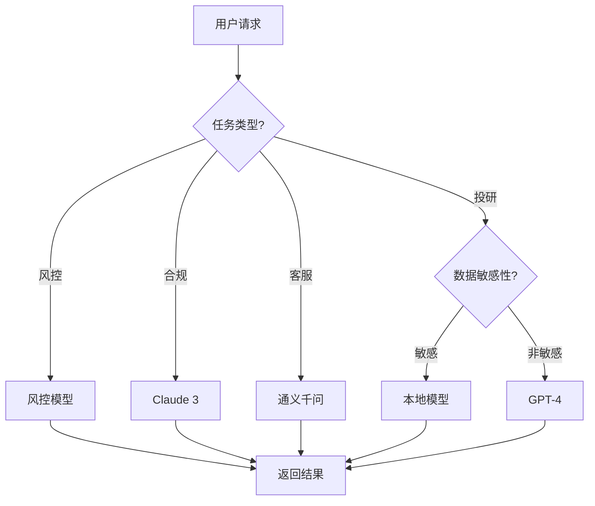

# 4. 模型与提示词管理

## 4.1 多模型路由

### 模型选择策略

智能金融解决方案使用多个AI模型，根据不同的业务场景和需求，智能选择最合适的模型：

#### 模型类型

- **大语言模型（LLM）**：
  - **GPT-4**：通用能力强，适合复杂推理任务
  - **Claude 3**：安全性高，适合合规审查
  - **通义千问**：中文优化，适合中文场景
  - **本地部署模型**：数据不出域，适合敏感场景

- **专用模型**：
  - **风控模型**：XGBoost、LightGBM，用于风险评分
  - **NLP模型**：BERT、RoBERTa，用于文本分类和NER
  - **时序模型**：LSTM、Transformer，用于时序预测

#### 路由策略

- **基于任务类型路由**：
  - 风控任务 → 风控专用模型
  - 投研分析 → 大语言模型（GPT-4）
  - 合规审查 → 大语言模型（Claude 3）
  - 客户服务 → 大语言模型（通义千问）

- **基于数据敏感性路由**：
  - 敏感数据 → 本地部署模型
  - 非敏感数据 → 云端大模型

- **基于性能要求路由**：
  - 实时任务 → 轻量级模型或缓存
  - 批量任务 → 高性能模型

- **基于成本考虑路由**：
  - 简单任务 → 低成本模型
  - 复杂任务 → 高性能模型

**路由决策流程图**：



### 路由规则

#### 规则配置

路由规则通过配置文件定义，支持灵活配置：

```yaml
# 模型路由规则配置
routing_rules:
  # 风控任务
  - name: risk_control
    condition:
      task_type: risk_control
      data_sensitivity: low
    model: risk_model_v2
    fallback: risk_model_v1
    
  # 投研分析
  - name: research_analysis
    condition:
      task_type: research
      data_sensitivity: low
      complexity: high
    model: gpt-4
    fallback: gpt-3.5-turbo
    
  # 合规审查
  - name: compliance_review
    condition:
      task_type: compliance
    model: claude-3-opus
    fallback: claude-3-sonnet
    
  # 客户服务
  - name: customer_service
    condition:
      task_type: customer_service
      language: zh
    model: qwen-plus
    fallback: qwen-turbo
    
  # 敏感数据
  - name: sensitive_data
    condition:
      data_sensitivity: high
    model: local_model
    fallback: reject
```

#### 动态路由

- **基于负载路由**：
  - 监控各模型的负载情况
  - 自动将请求路由到负载较低的模型
  - 避免单个模型过载

- **基于性能路由**：
  - 监控各模型的响应时间和准确率
  - 自动路由到性能更好的模型
  - 持续优化路由策略

- **基于成本路由**：
  - 监控各模型的调用成本
  - 在满足性能要求的前提下，优先使用低成本模型
  - 平衡性能和成本

### 负载均衡

#### 负载均衡策略

- **轮询（Round Robin）**：
  - 依次将请求分配给各个模型实例
  - 简单易实现
  - 适用于实例性能相近的场景

- **加权轮询（Weighted Round Robin）**：
  - 根据模型实例的性能分配权重
  - 性能好的实例分配更多请求
  - 适用于实例性能差异较大的场景

- **最少连接（Least Connections）**：
  - 将请求分配给连接数最少的实例
  - 适用于长连接场景

- **响应时间（Response Time）**：
  - 将请求分配给响应时间最短的实例
  - 适用于对响应时间敏感的场景

#### 负载均衡实现

使用Nginx或HAProxy实现负载均衡：

```nginx
# Nginx负载均衡配置
upstream llm_backend {
    least_conn;  # 最少连接策略
    server llm1.example.com:8000 weight=3;
    server llm2.example.com:8000 weight=2;
    server llm3.example.com:8000 backup;  # 备用服务器
}

server {
    listen 80;
    location /api/llm {
        proxy_pass http://llm_backend;
        proxy_set_header Host $host;
        proxy_set_header X-Real-IP $remote_addr;
    }
}
```

## 4.2 Prompt工程化

### Prompt模板设计

#### Prompt模板结构

Prompt模板采用结构化设计，包含以下部分：

- **系统角色（System Role）**：定义AI的角色和职责
- **上下文（Context）**：提供相关背景信息
- **任务描述（Task Description）**：明确任务要求
- **输出格式（Output Format）**：定义输出格式要求
- **示例（Examples）**：提供few-shot示例

#### 模板示例

**风控分析Prompt模板**：

```python
RISK_ANALYSIS_PROMPT = """
你是一位资深的金融风控专家，擅长分析交易风险。

## 任务
分析以下交易的风险等级，并给出详细的风险评估报告。

## 交易信息
- 交易时间：{transaction_time}
- 交易金额：{transaction_amount}
- 交易类型：{transaction_type}
- 客户信息：{customer_info}
- 交易对手方：{counterparty}

## 分析维度
1. 交易金额异常性：分析交易金额是否异常
2. 交易时间异常性：分析交易时间是否异常
3. 交易模式异常性：分析交易模式是否符合客户历史行为
4. 对手方风险：分析对手方的风险等级
5. 综合风险评估：综合以上维度给出风险等级（低/中/高）

## 输出格式
请按照以下JSON格式输出：
{{
    "risk_level": "低/中/高",
    "risk_score": 0.0-1.0,
    "risk_factors": [
        {{
            "factor": "因素名称",
            "description": "因素描述",
            "impact": "影响程度"
        }}
    ],
    "recommendation": "处理建议"
}}

## 示例
{examples}
"""
```

**投研分析Prompt模板**：

```python
RESEARCH_ANALYSIS_PROMPT = """
你是一位资深的投资研究分析师，擅长分析上市公司和行业。

## 任务
分析以下公司的投资价值，并生成投资研究报告。

## 公司信息
- 公司名称：{company_name}
- 股票代码：{stock_code}
- 所属行业：{industry}
- 财务数据：{financial_data}

## 分析维度
1. 财务状况分析：分析公司的盈利能力、偿债能力、运营能力
2. 行业地位分析：分析公司在行业中的地位和竞争优势
3. 发展前景分析：分析公司的发展前景和成长性
4. 风险评估：识别公司面临的主要风险
5. 投资建议：给出投资建议（买入/持有/卖出）和目标价位

## 输出格式
请按照以下Markdown格式输出：
# {company_name}投资研究报告

## 1. 财务状况分析
[分析内容]

## 2. 行业地位分析
[分析内容]

## 3. 发展前景分析
[分析内容]

## 4. 风险评估
[分析内容]

## 5. 投资建议
[投资建议和目标价位]
"""
```

### 版本管理

#### Prompt版本控制

- **版本标识**：
  - 使用语义化版本号（如v1.0.0）
  - 版本号格式：主版本号.次版本号.修订号

- **版本存储**：
  - Prompt模板存储在版本控制系统中（Git）
  - 每个版本都有完整的变更记录
  - 支持版本对比和回滚

- **版本标签**：
  - 生产版本：标记为production
  - 测试版本：标记为testing
  - 开发版本：标记为development

#### Prompt版本管理流程

1. **Prompt设计**：
   - 设计Prompt模板
   - 编写测试用例
   - 进行初步测试

2. **版本创建**：
   - 创建新版本
   - 记录版本信息和变更日志

3. **A/B测试**：
   - 在测试环境进行A/B测试
   - 对比新旧版本的效果

4. **版本发布**：
   - 发布到生产环境
   - 更新版本标签

5. **版本回滚**：
   - 如果发现问题，回滚到上一版本
   - 记录回滚原因

### A/B测试

#### A/B测试流程

1. **测试设计**：
   - 确定测试目标（如准确率、响应时间）
   - 设计测试方案
   - 确定测试样本量

2. **流量分配**：
   - 将流量按比例分配给A/B版本
   - 通常A版本50%，B版本50%
   - 可以根据需要调整比例

3. **数据收集**：
   - 收集测试数据
   - 记录关键指标
   - 收集用户反馈

4. **结果分析**：
   - 统计分析测试结果
   - 对比A/B版本的效果
   - 确定最优版本

5. **版本切换**：
   - 将最优版本切换为生产版本
   - 逐步扩大流量比例
   - 监控切换效果

#### A/B测试工具

使用专业的A/B测试工具或自建测试框架：

```python
# A/B测试框架示例
class ABTest:
    def __init__(self, version_a, version_b, traffic_split=0.5):
        self.version_a = version_a
        self.version_b = version_b
        self.traffic_split = traffic_split
        self.results_a = []
        self.results_b = []
    
    def route(self, request):
        import random
        if random.random() < self.traffic_split:
            return self.version_a.process(request)
        else:
            return self.version_b.process(request)
    
    def record_result(self, version, result):
        if version == 'A':
            self.results_a.append(result)
        else:
            self.results_b.append(result)
    
    def analyze(self):
        # 统计分析A/B版本的效果
        pass
```

## 4.3 微调与持续学习

### 微调策略

#### 微调方法

- **全量微调（Full Fine-tuning）**：
  - 更新模型的所有参数
  - 效果最好，但成本高
  - 适用于有大量标注数据的场景

- **LoRA微调（Low-Rank Adaptation）**：
  - 只更新少量参数
  - 成本低，效果接近全量微调
  - 适用于资源有限的场景

- **Prompt Tuning**：
  - 只优化Prompt，不更新模型参数
  - 成本最低，但效果有限
  - 适用于快速迭代的场景

#### 微调数据准备

- **数据收集**：
  - 收集业务场景的真实数据
  - 确保数据质量和多样性
  - 数据量建议：至少1000条，理想10000+条

- **数据标注**：
  - 人工标注高质量数据
  - 标注要准确、一致
  - 建立标注规范和质检流程

- **数据清洗**：
  - 去除噪声数据
  - 处理缺失值
  - 数据格式统一

#### 微调流程

1. **数据准备**：
   - 收集和标注数据
   - 数据清洗和预处理
   - 划分训练集、验证集、测试集

2. **模型选择**：
   - 选择基础模型
   - 确定微调方法（全量/LoRA/Prompt Tuning）

3. **模型训练**：
   - 设置训练超参数
   - 开始训练
   - 监控训练过程

4. **模型评估**：
   - 在验证集上评估模型
   - 在测试集上评估模型
   - 对比基线模型

5. **模型部署**：
   - 部署到生产环境
   - 进行A/B测试
   - 监控生产效果

### 持续学习流程

#### 持续学习策略

- **在线学习（Online Learning）**：
  - 实时从新数据中学习
  - 快速适应数据分布变化
  - 适用于数据分布快速变化的场景

- **增量学习（Incremental Learning）**：
  - 定期使用新数据更新模型
  - 平衡新旧数据的影响
  - 适用于数据分布缓慢变化的场景

- **主动学习（Active Learning）**：
  - 主动选择最有价值的数据进行标注
  - 提高标注效率
  - 适用于标注成本高的场景

#### 持续学习流程

1. **数据监控**：
   - 监控模型性能指标
   - 发现性能下降
   - 收集新数据

2. **数据标注**：
   - 标注新数据
   - 重点关注错误案例

3. **模型更新**：
   - 使用新数据更新模型
   - 避免灾难性遗忘

4. **模型验证**：
   - 验证更新后的模型
   - 确保性能提升

5. **模型部署**：
   - 部署更新后的模型
   - 监控生产效果

### 模型评估

#### 评估指标

- **分类任务**：
  - 准确率（Accuracy）
  - 精确率（Precision）
  - 召回率（Recall）
  - F1分数
  - AUC-ROC

- **回归任务**：
  - 均方误差（MSE）
  - 平均绝对误差（MAE）
  - R²分数

- **生成任务**：
  - BLEU分数
  - ROUGE分数
  - 人工评估

#### 评估方法

- **离线评估**：
  - 在测试集上评估模型
  - 计算各项指标
  - 对比基线模型

- **在线评估**：
  - 在生产环境进行A/B测试
  - 收集真实用户反馈
  - 监控业务指标

- **人工评估**：
  - 人工评估模型输出
  - 评估模型的可解释性
  - 评估模型的公平性

#### 模型评估报告

定期生成模型评估报告，包括：

- 模型性能指标
- 与基线模型的对比
- 错误案例分析
- 改进建议
