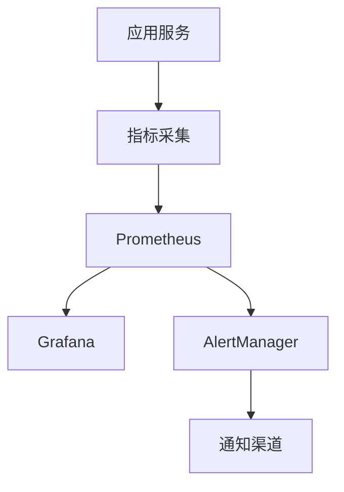
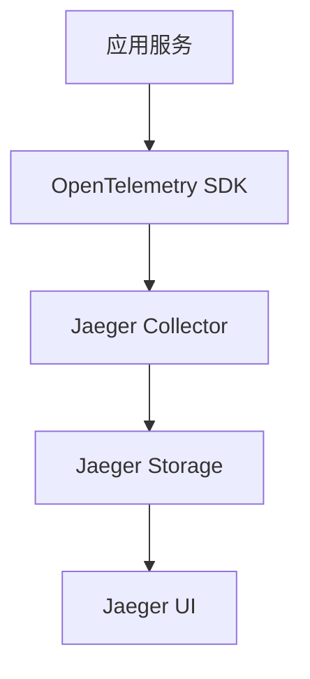
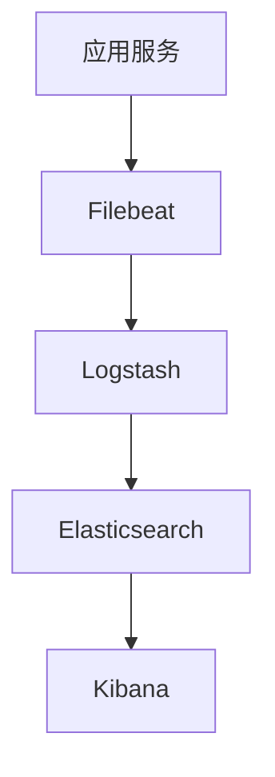

# 9. 监控与可观测

## 9.1 业务指标

### 核心业务指标

智能金融解决方案的核心业务指标包括：

#### 风控业务指标

- **风控检测量**：
  - 定义：每日/每小时风控检测的交易数量
  - 计算方法：统计风控API调用次数
  - 目标值：日均1000万+笔
  - 监控频率：实时

- **风险事件数**：
  - 定义：被识别为高风险或中风险的交易数量
  - 计算方法：统计风险等级为high或medium的交易数
  - 目标值：风险事件率 < 5%
  - 监控频率：实时

- **误报率**：
  - 定义：被误判为高风险但实际为正常交易的比率
  - 计算方法：误报数 / 高风险交易总数
  - 目标值：< 5%
  - 监控频率：每日

- **风控准确率**：
  - 定义：风控判断正确的比率
  - 计算方法：正确判断数 / 总判断数
  - 目标值：≥ 95%
  - 监控频率：每日

#### 投研业务指标

- **投研任务数**：
  - 定义：每日创建的投研分析任务数量
  - 计算方法：统计投研API调用次数
  - 目标值：日均100+个任务
  - 监控频率：实时

- **报告生成时间**：
  - 定义：从任务创建到报告生成的平均时间
  - 计算方法：平均（报告生成时间 - 任务创建时间）
  - 目标值：< 1小时
  - 监控频率：实时

- **投资建议准确率**：
  - 定义：投资建议与实际市场表现的一致性
  - 计算方法：需要人工评估或回测验证
  - 目标值：≥ 70%
  - 监控频率：每月

#### 合规业务指标

- **合规审查任务数**：
  - 定义：每日创建的合规审查任务数量
  - 计算方法：统计合规API调用次数
  - 目标值：日均1000+个任务
  - 监控频率：实时

- **可疑交易识别率**：
  - 定义：识别出的可疑交易占所有交易的比率
  - 计算方法：可疑交易数 / 总交易数
  - 目标值：0.1% - 1%
  - 监控频率：每日

- **合规审查准确率**：
  - 定义：合规审查判断正确的比率
  - 计算方法：正确判断数 / 总判断数
  - 目标值：≥ 95%
  - 监控频率：每日

### 指标监控

#### 监控系统架构



#### Prometheus配置

```yaml
# prometheus.yml
global:
  scrape_interval: 15s
  evaluation_interval: 15s

scrape_configs:
  - job_name: 'finance-ai-api'
    static_configs:
      - targets: ['api:8000']
    metrics_path: '/metrics'
    
  - job_name: 'finance-ai-models'
    static_configs:
      - targets: ['model-service:8001']
    metrics_path: '/metrics'
```

#### 指标采集实现

```python
from prometheus_client import Counter, Histogram, Gauge

# 定义指标
risk_check_total = Counter(
    'risk_check_total',
    'Total number of risk checks',
    ['risk_level']
)

risk_check_duration = Histogram(
    'risk_check_duration_seconds',
    'Risk check duration in seconds'
)

risk_events = Gauge(
    'risk_events_total',
    'Total number of risk events',
    ['risk_level']
)

# 使用指标
@risk_check_duration.time()
def check_risk(transaction):
    result = perform_risk_check(transaction)
    risk_check_total.labels(risk_level=result.risk_level).inc()
    risk_events.labels(risk_level=result.risk_level).set(
        get_risk_events_count(result.risk_level)
    )
    return result
```

### 告警机制

#### 告警规则

```yaml
# alert_rules.yml
groups:
  - name: finance_ai_alerts
    rules:
      # 风控误报率告警
      - alert: HighFalsePositiveRate
        expr: |
          rate(risk_false_positive_total[5m]) / 
          rate(risk_check_total[5m]) > 0.05
        for: 10m
        labels:
          severity: warning
        annotations:
          summary: "风控误报率过高"
          description: "风控误报率超过5%，当前值: {{ $value }}"
      
      # 投研任务失败率告警
      - alert: HighResearchTaskFailureRate
        expr: |
          rate(research_task_failed_total[5m]) / 
          rate(research_task_total[5m]) > 0.1
        for: 5m
        labels:
          severity: critical
        annotations:
          summary: "投研任务失败率过高"
          description: "投研任务失败率超过10%，当前值: {{ $value }}"
      
      # API响应时间告警
      - alert: HighAPIResponseTime
        expr: |
          histogram_quantile(0.95, 
            rate(api_request_duration_seconds_bucket[5m])
          ) > 2
        for: 5m
        labels:
          severity: warning
        annotations:
          summary: "API响应时间过长"
          description: "P95响应时间超过2秒，当前值: {{ $value }}秒"
```

#### 告警通知

```yaml
# alertmanager.yml
route:
  group_by: ['alertname', 'severity']
  group_wait: 10s
  group_interval: 10s
  repeat_interval: 12h
  receiver: 'default'
  routes:
    - match:
        severity: critical
      receiver: 'critical-alerts'
    - match:
        severity: warning
      receiver: 'warning-alerts'

receivers:
  - name: 'default'
    webhook_configs:
      - url: 'http://notification-service:8000/webhook'
  
  - name: 'critical-alerts'
    webhook_configs:
      - url: 'http://notification-service:8000/webhook/critical'
    email_configs:
      - to: 'ops-team@example.com'
        subject: 'Critical Alert: {{ .GroupLabels.alertname }}'
  
  - name: 'warning-alerts'
    webhook_configs:
      - url: 'http://notification-service:8000/webhook/warning'
```

## 9.2 模型指标

### 模型性能指标

#### 分类模型指标

- **准确率（Accuracy）**：
  - 定义：正确预测的样本数占总样本数的比例
  - 计算方法：TP + TN / (TP + TN + FP + FN)
  - 目标值：≥ 95%

- **精确率（Precision）**：
  - 定义：预测为正类的样本中实际为正类的比例
  - 计算方法：TP / (TP + FP)
  - 目标值：≥ 90%

- **召回率（Recall）**：
  - 定义：实际为正类的样本中被正确预测的比例
  - 计算方法：TP / (TP + FN)
  - 目标值：≥ 90%

- **F1分数**：
  - 定义：精确率和召回率的调和平均
  - 计算方法：2 * Precision * Recall / (Precision + Recall)
  - 目标值：≥ 90%

- **AUC-ROC**：
  - 定义：ROC曲线下的面积
  - 计算方法：使用sklearn.metrics.roc_auc_score
  - 目标值：≥ 0.95

#### 回归模型指标

- **均方误差（MSE）**：
  - 定义：预测值与真实值差的平方的平均值
  - 计算方法：mean((y_pred - y_true)^2)
  - 目标值：越小越好

- **平均绝对误差（MAE）**：
  - 定义：预测值与真实值差的绝对值的平均值
  - 计算方法：mean(|y_pred - y_true|)
  - 目标值：越小越好

- **R²分数**：
  - 定义：决定系数，表示模型解释的方差比例
  - 计算方法：1 - (SS_res / SS_tot)
  - 目标值：≥ 0.8

#### 生成模型指标

- **BLEU分数**：
  - 定义：评估生成文本与参考文本的相似度
  - 计算方法：使用nltk.translate.bleu_score
  - 目标值：≥ 0.5

- **ROUGE分数**：
  - 定义：评估生成文本的召回率
  - 计算方法：使用rouge-score库
  - 目标值：≥ 0.6

### 模型监控

#### 模型性能监控

```python
class ModelMonitor:
    def __init__(self, model_name):
        self.model_name = model_name
        self.metrics = {
            "predictions": [],
            "ground_truth": [],
            "predictions_proba": []
        }
    
    def record_prediction(self, prediction, ground_truth=None, proba=None):
        """记录预测结果"""
        self.metrics["predictions"].append(prediction)
        if ground_truth is not None:
            self.metrics["ground_truth"].append(ground_truth)
        if proba is not None:
            self.metrics["predictions_proba"].append(proba)
    
    def calculate_metrics(self):
        """计算模型指标"""
        if len(self.metrics["ground_truth"]) == 0:
            return None
        
        y_true = self.metrics["ground_truth"]
        y_pred = self.metrics["predictions"]
        
        metrics = {
            "accuracy": accuracy_score(y_true, y_pred),
            "precision": precision_score(y_true, y_pred, average='weighted'),
            "recall": recall_score(y_true, y_pred, average='weighted'),
            "f1": f1_score(y_true, y_pred, average='weighted')
        }
        
        if len(self.metrics["predictions_proba"]) > 0:
            y_proba = np.array(self.metrics["predictions_proba"])
            if y_proba.ndim > 1 and y_proba.shape[1] > 1:
                metrics["auc_roc"] = roc_auc_score(
                    y_true, y_proba, multi_class='ovr'
                )
        
        return metrics
    
    def export_metrics(self):
        """导出指标到Prometheus"""
        metrics = self.calculate_metrics()
        if metrics:
            for metric_name, metric_value in metrics.items():
                prometheus_metric = Gauge(
                    f'model_{self.model_name}_{metric_name}',
                    f'Model {metric_name} for {self.model_name}'
                )
                prometheus_metric.set(metric_value)
```

#### 模型性能仪表盘

使用Grafana展示模型性能指标：

```json
{
  "dashboard": {
    "title": "模型性能监控",
    "panels": [
      {
        "title": "模型准确率",
        "type": "graph",
        "targets": [
          {
            "expr": "model_risk_model_accuracy"
          }
        ]
      },
      {
        "title": "模型F1分数",
        "type": "graph",
        "targets": [
          {
            "expr": "model_risk_model_f1"
          }
        ]
      },
      {
        "title": "模型AUC-ROC",
        "type": "graph",
        "targets": [
          {
            "expr": "model_risk_model_auc_roc"
          }
        ]
      }
    ]
  }
}
```

### 模型退化检测

#### 退化检测方法

- **性能指标下降**：
  - 监控模型准确率、F1分数等指标
  - 如果指标持续下降，触发告警
  - 阈值：指标下降超过5%

- **数据分布变化**：
  - 监控输入数据的分布
  - 使用统计检验（如KS检验）检测分布变化
  - 如果分布显著变化，触发告警

- **预测置信度下降**：
  - 监控模型预测的置信度
  - 如果置信度持续下降，可能表示模型退化
  - 阈值：平均置信度下降超过10%

#### 退化检测实现

```python
class ModelDriftDetector:
    def __init__(self, baseline_distribution):
        self.baseline_distribution = baseline_distribution
        self.recent_predictions = []
        self.recent_performance = []
    
    def check_drift(self, current_data, current_performance):
        """检测模型退化"""
        drift_detected = False
        drift_reasons = []
        
        # 检测数据分布变化
        if self.check_distribution_drift(current_data):
            drift_detected = True
            drift_reasons.append("数据分布变化")
        
        # 检测性能下降
        if self.check_performance_drift(current_performance):
            drift_detected = True
            drift_reasons.append("性能下降")
        
        # 检测预测置信度下降
        if self.check_confidence_drift(current_data):
            drift_detected = True
            drift_reasons.append("预测置信度下降")
        
        return {
            "drift_detected": drift_detected,
            "reasons": drift_reasons
        }
    
    def check_distribution_drift(self, current_data):
        """检测数据分布变化"""
        from scipy import stats
        
        # 计算KS统计量
        ks_statistic, p_value = stats.ks_2samp(
            self.baseline_distribution,
            current_data
        )
        
        # p值 < 0.05 表示分布显著不同
        return p_value < 0.05
    
    def check_performance_drift(self, current_performance):
        """检测性能下降"""
        if len(self.recent_performance) < 10:
            self.recent_performance.append(current_performance)
            return False
        
        # 计算最近10次的平均性能
        recent_avg = np.mean(self.recent_performance[-10:])
        baseline_avg = np.mean(self.recent_performance[:10])
        
        # 性能下降超过5%
        return (baseline_avg - recent_avg) / baseline_avg > 0.05
```

## 9.3 链路追踪

### 追踪系统

#### 分布式追踪架构



#### OpenTelemetry配置

```python
from opentelemetry import trace
from opentelemetry.exporter.jaeger import JaegerExporter
from opentelemetry.sdk.trace import TracerProvider
from opentelemetry.sdk.trace.export import BatchSpanProcessor

# 配置Tracer
trace.set_tracer_provider(TracerProvider())
tracer = trace.get_tracer(__name__)

# 配置Jaeger Exporter
jaeger_exporter = JaegerExporter(
    agent_host_name="jaeger",
    agent_port=6831,
)

# 添加Span Processor
span_processor = BatchSpanProcessor(jaeger_exporter)
trace.get_tracer_provider().add_span_processor(span_processor)

# 使用Tracer
def risk_check(transaction):
    with tracer.start_as_current_span("risk_check") as span:
        span.set_attribute("transaction_id", transaction.id)
        span.set_attribute("amount", transaction.amount)
        
        # 执行风控检测
        result = perform_risk_check(transaction)
        
        span.set_attribute("risk_level", result.risk_level)
        span.set_attribute("risk_score", result.risk_score)
        
        return result
```

### 日志管理

#### 日志架构



#### 日志格式

使用结构化日志格式（JSON）：

```python
import logging
import json
from datetime import datetime

class StructuredLogger:
    def __init__(self, name):
        self.logger = logging.getLogger(name)
        handler = logging.StreamHandler()
        formatter = logging.Formatter(
            '%(message)s'
        )
        handler.setFormatter(formatter)
        self.logger.addHandler(handler)
        self.logger.setLevel(logging.INFO)
    
    def log(self, level, message, **kwargs):
        """记录结构化日志"""
        log_entry = {
            "timestamp": datetime.now().isoformat(),
            "level": level,
            "message": message,
            **kwargs
        }
        self.logger.log(
            getattr(logging, level.upper()),
            json.dumps(log_entry)
        )
    
    def info(self, message, **kwargs):
        self.log("info", message, **kwargs)
    
    def error(self, message, **kwargs):
        self.log("error", message, **kwargs)

# 使用示例
logger = StructuredLogger("finance_ai")

logger.info("风险检测完成", 
    transaction_id="TXN123456",
    risk_level="low",
    risk_score=0.15,
    duration_ms=120
)
```

#### ELK Stack配置

```yaml
# filebeat.yml
filebeat.inputs:
  - type: container
    paths:
      - '/var/log/containers/*.log'
    processors:
      - add_kubernetes_metadata:
          host: ${NODE_NAME}
          matchers:
            - logs_path:
                logs_path: "/var/log/containers/"

output.logstash:
  hosts: ["logstash:5044"]

# logstash.conf
input {
  beats {
    port => 5044
  }
}

filter {
  json {
    source => "message"
  }
  
  date {
    match => [ "timestamp", "ISO8601" ]
  }
}

output {
  elasticsearch {
    hosts => ["elasticsearch:9200"]
    index => "finance-ai-logs-%{+YYYY.MM.dd}"
  }
}
```

### 问题定位

#### 问题定位流程

1. **告警触发**：
   - 监控系统检测到异常
   - 触发告警通知

2. **日志查询**：
   - 在Kibana中查询相关日志
   - 过滤时间范围和关键词

3. **链路追踪**：
   - 在Jaeger中查看相关Trace
   - 分析请求链路和耗时

4. **指标分析**：
   - 在Grafana中查看相关指标
   - 分析指标趋势和异常

5. **根因分析**：
   - 综合分析日志、Trace、指标
   - 定位问题根因

#### 问题定位工具

- **Kibana日志查询**：
  - 使用KQL（Kibana Query Language）查询日志
  - 支持时间范围、关键词、字段过滤
  - 支持日志聚合和统计

- **Jaeger链路追踪**：
  - 查看请求的完整调用链
  - 分析每个Span的耗时和状态
  - 识别性能瓶颈

- **Grafana指标分析**：
  - 查看指标趋势图
  - 对比不同时间段的指标
  - 识别异常指标
