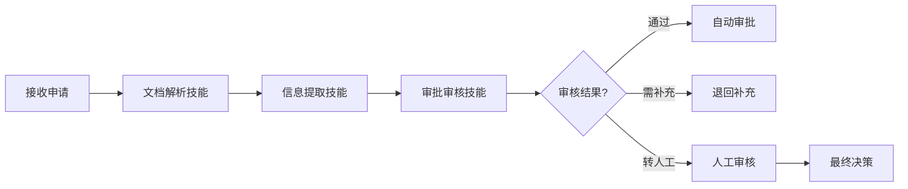
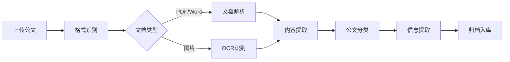

# 5. 智能体与业务编排

## 5.1 Agent技能链

### 技能定义

智能政务解决方案中的Agent具备多种技能，每个技能对应一个特定的业务能力：

#### 核心技能

- **审批审核技能（ApprovalReviewSkill）**：
  - 功能：审核审批申请，判断是否符合条件，生成审核意见
  - 输入：申请信息、申请材料、审批规则
  - 输出：审核结果、审核意见、需要补充的材料
  - 使用模型：审批专用模型 + 大语言模型

- **公文处理技能（DocumentProcessingSkill）**：
  - 功能：解析公文内容，分类公文，提取关键信息
  - 输入：公文文件、公文类型
  - 输出：公文类别、公文内容、关键信息
  - 使用模型：公文处理模型 + OCR模型

- **政务服务技能（GovernmentServiceSkill）**：
  - 功能：回答公众咨询，提供办事指南，处理服务请求
  - 输入：用户问题、用户信息
  - 输出：回答内容、办事指南、操作建议
  - 使用模型：大语言模型（通义千问）+ RAG知识库

- **政策分析技能（PolicyAnalysisSkill）**：
  - 功能：分析政策内容，评估政策效果，生成分析报告
  - 输入：政策文件、执行数据、分析维度
  - 输出：政策分析报告、效果评估、建议
  - 使用模型：大语言模型（GPT-4）+ RAG知识库

- **数据查询技能（DataQuerySkill）**：
  - 功能：查询各类政务数据，包括审批数据、公文数据、服务数据
  - 输入：查询条件、数据源标识
  - 输出：查询结果、数据统计
  - 使用工具：数据库查询工具、API调用工具

- **报告生成技能（ReportGenerationSkill）**：
  - 功能：生成各类报告，包括审批报告、分析报告、统计报告
  - 输入：分析结果、报告模板
  - 输出：格式化报告（Markdown、PDF、Word）
  - 使用工具：报告模板工具、格式化工具

### 技能链设计

技能链是将多个技能组合起来，完成复杂业务流程：

#### 审批流程技能链



**技能链配置**：

```yaml
skill_chain:
  name: approval_process_chain
  skills:
    - name: document_parsing
      skill: DocumentParsingSkill
      inputs:
        - application_file
      outputs:
        - parsed_content
    
    - name: information_extraction
      skill: InformationExtractionSkill
      inputs:
        - parsed_content
      outputs:
        - applicant_info
        - application_content
        - materials
    
    - name: approval_review
      skill: ApprovalReviewSkill
      inputs:
        - applicant_info
        - application_content
        - materials
        - approval_rules
      outputs:
        - review_result
        - review_opinion
        - missing_materials
    
    - name: decision
      skill: DecisionSkill
      condition: review_result == "pass"
      inputs:
        - review_result
        - review_opinion
      outputs:
        - final_decision
```

#### 公文处理技能链



**技能链配置**：

```yaml
skill_chain:
  name: document_processing_chain
  skills:
    - name: format_recognition
      skill: FormatRecognitionSkill
      inputs:
        - document_file
      outputs:
        - file_format
    
    - name: document_parsing
      skill: DocumentParsingSkill
      condition: file_format in ["pdf", "word"]
      inputs:
        - document_file
      outputs:
        - parsed_content
    
    - name: ocr_recognition
      skill: OCRRecognitionSkill
      condition: file_format == "image"
      inputs:
        - document_file
      outputs:
        - ocr_content
    
    - name: content_extraction
      skill: ContentExtractionSkill
      inputs:
        - parsed_content or ocr_content
      outputs:
        - document_title
        - document_content
        - metadata
    
    - name: document_classification
      skill: DocumentClassificationSkill
      inputs:
        - document_title
        - document_content
      outputs:
        - document_category
        - confidence
    
    - name: information_extraction
      skill: InformationExtractionSkill
      inputs:
        - document_content
        - document_category
      outputs:
        - key_information
    
    - name: archive
      skill: ArchiveSkill
      inputs:
        - document_file
        - document_category
        - key_information
      outputs:
        - archive_result
```

## 5.2 工作流编排

### n8n工作流设计

#### 审批工作流

```yaml
# 审批工作流配置
workflow:
  name: 智能审批流程
  nodes:
    - id: webhook-receive
      type: n8n-nodes-base.webhook
      parameters:
        path: approval-submit
        httpMethod: POST
    
    - id: validate-input
      type: n8n-nodes-base.function
      parameters:
        functionCode: |
          const data = $input.item.json;
          if (!data.applicant_name || !data.application_type) {
            throw new Error('缺少必要字段');
          }
          return data;
    
    - id: parse-documents
      type: n8n-nodes-base.httpRequest
      parameters:
        url: http://ai-service/api/document-parsing
        method: POST
        bodyParameters:
          file: {{ $json.file }}
    
    - id: extract-information
      type: n8n-nodes-base.httpRequest
      parameters:
        url: http://ai-service/api/information-extraction
        method: POST
        bodyParameters:
          content: {{ $json.parsed_content }}
    
    - id: rule-check
      type: n8n-nodes-base.function
      parameters:
        functionCode: |
          const rules = $('validate-input').item.json.approval_rules;
          const info = $('extract-information').item.json;
          // 规则检查逻辑
          return { passed: true, reason: '' };
    
    - id: ai-review
      type: n8n-nodes-base.httpRequest
      condition: {{ $json.passed }} == true
      parameters:
        url: http://ai-service/api/approval-review
        method: POST
    
    - id: decision
      type: n8n-nodes-base.switch
      parameters:
        rules:
          - value1: {{ $json.confidence }}
            operation: largerEqual
            value2: 0.9
            output: auto-approve
          - value1: {{ $json.confidence }}
            operation: smaller
            value2: 0.9
            output: manual-review
    
    - id: auto-approve
      type: n8n-nodes-base.respondToWebhook
      parameters:
        responseCode: 200
        responseBody: { status: 'approved' }
    
    - id: manual-review
      type: n8n-nodes-base.notify
      parameters:
        channel: approval-officer
        message: 需要人工审核
```

#### 公文处理工作流

```yaml
# 公文处理工作流配置
workflow:
  name: 智能公文处理流程
  nodes:
    - id: file-upload
      type: n8n-nodes-base.webhook
      parameters:
        path: document-upload
        httpMethod: POST
    
    - id: format-recognition
      type: n8n-nodes-base.function
      parameters:
        functionCode: |
          const file = $input.item.json.file;
          const ext = file.name.split('.').pop().toLowerCase();
          return { format: ext };
    
    - id: document-parsing
      type: n8n-nodes-base.httpRequest
      condition: {{ $json.format }} in ['pdf', 'doc', 'docx']
      parameters:
        url: http://ai-service/api/document-parsing
        method: POST
    
    - id: ocr-recognition
      type: n8n-nodes-base.httpRequest
      condition: {{ $json.format }} in ['jpg', 'png', 'tiff']
      parameters:
        url: http://ai-service/api/ocr
        method: POST
    
    - id: content-extraction
      type: n8n-nodes-base.httpRequest
      parameters:
        url: http://ai-service/api/content-extraction
        method: POST
    
    - id: document-classification
      type: n8n-nodes-base.httpRequest
      parameters:
        url: http://ai-service/api/document-classification
        method: POST
    
    - id: archive
      type: n8n-nodes-base.httpRequest
      parameters:
        url: http://knowledge-base/api/archive
        method: POST
```

## 5.3 智能体协调

### 多Agent协作

#### 审批Agent协作

```python
from langchain.agents import AgentExecutor, create_react_agent
from langchain.tools import Tool

# 定义工具
tools = [
    Tool(
        name="document_parsing",
        func=document_parsing_tool,
        description="解析申请文档，提取文本内容"
    ),
    Tool(
        name="information_extraction",
        func=information_extraction_tool,
        description="从文档中提取关键信息"
    ),
    Tool(
        name="rule_check",
        func=rule_check_tool,
        description="检查申请是否符合审批规则"
    ),
    Tool(
        name="knowledge_retrieval",
        func=knowledge_retrieval_tool,
        description="从知识库检索相关政策信息"
    )
]

# 创建Agent
agent = create_react_agent(
    llm=llm,
    tools=tools,
    prompt=approval_agent_prompt
)

# 执行Agent
executor = AgentExecutor(agent=agent, tools=tools, verbose=True)
result = executor.invoke({
    "input": "审核这份审批申请",
    "application_file": "path/to/application.pdf"
})
```

### 上下文管理

#### 对话上下文

- **会话管理**：维护用户会话上下文
- **历史记录**：保存对话历史
- **上下文窗口**：管理上下文窗口大小

#### 任务上下文

- **任务状态**：跟踪任务执行状态
- **中间结果**：保存中间处理结果
- **错误处理**：处理任务执行错误

## 5.4 异常处理与重试

### 异常处理策略

#### 错误分类

- **可重试错误**：网络错误、临时服务不可用
- **不可重试错误**：参数错误、权限错误
- **业务错误**：审批不通过、数据不存在

#### 重试策略

- **指数退避**：重试间隔指数增长
- **最大重试次数**：限制最大重试次数
- **超时控制**：设置重试超时时间

### 降级方案

#### 服务降级

- **AI服务不可用**：使用规则引擎作为备用
- **知识库不可用**：使用缓存数据
- **模型响应慢**：使用轻量级模型

#### 功能降级

- **自动审批不可用**：全部转人工审核
- **智能问答不可用**：显示常见问题列表
- **公文处理不可用**：提示人工处理

