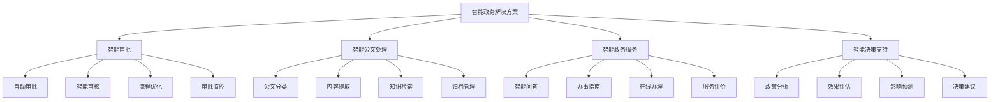
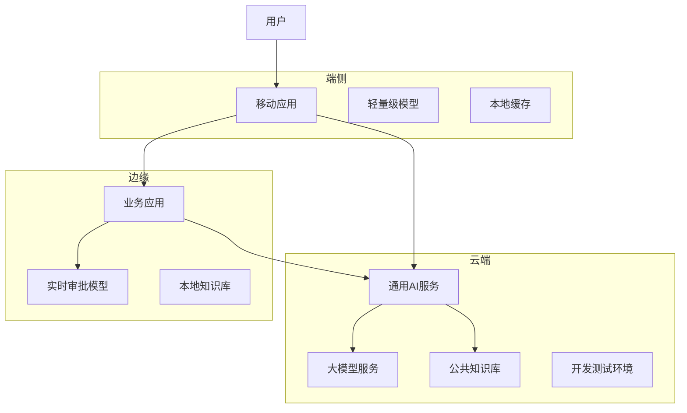
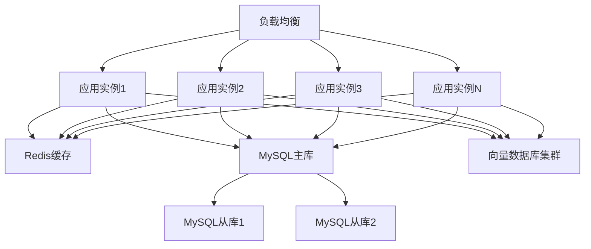

# 2. 总体架构

## 2.1 业务架构

### 角色定义

智能政务解决方案涉及多个角色，每个角色有不同的职责和权限：

- **审批人员**：
  - 职责：审核审批事项，处理审批流程，做出审批决策
  - 权限：查看审批数据，处理审批事项，配置审批规则
  - 使用场景：日常审批运营，审批规则优化，复杂事项处理

- **公文管理员**：
  - 职责：管理公文处理流程，分类归档公文，维护公文知识库
  - 权限：访问公文数据，使用公文处理工具，管理知识库
  - 使用场景：公文分类归档，公文检索，知识库维护

- **政务服务人员**：
  - 职责：提供政务服务，处理公众咨询，维护办事指南
  - 权限：访问服务数据，使用智能问答工具，更新办事指南
  - 使用场景：公众咨询处理，办事指南维护，服务质量监控

- **政策分析师**：
  - 职责：使用智能决策支持工具进行政策分析，生成分析报告，提供决策建议
  - 权限：访问政策数据，使用AI分析工具，生成报告
  - 使用场景：政策分析，效果评估，决策支持

- **系统管理员**：
  - 职责：管理系统配置，监控系统运行，处理系统故障
  - 权限：系统配置，用户管理，监控告警
  - 使用场景：系统维护，用户管理，故障处理

### 用例分析

#### 用例1：智能审批流程

**参与者**：申请人、审批系统、审批人员

**前置条件**：
- 审批系统正常运行
- 审批模型已部署
- 审批规则已配置

**主流程**：
1. 申请人提交审批申请和材料
2. 审批系统接收申请数据
3. AI模型分析申请材料，提取关键信息
4. 根据审批规则，判断申请是否符合条件
5. 符合条件且简单的申请自动通过，复杂申请转人工审核
6. 审批人员审核复杂申请
7. 返回审批结果给申请人

**异常流程**：
- 如果AI模型不可用，使用规则引擎作为备用方案
- 如果系统故障，启用降级模式，仅使用基础规则
- 如果材料不完整，自动退回并提示补充材料

**后置条件**：
- 审批处理完成
- 审批结果已记录
- 复杂申请已审核

#### 用例2：智能公文处理

**参与者**：公文管理员、公文处理系统

**前置条件**：
- 公文管理员已登录系统
- 需要处理的公文已上传

**主流程**：
1. 公文管理员上传公文文件
2. 系统自动识别公文格式（PDF、Word、图片等）
3. AI模型解析公文内容，提取关键信息
4. 自动分类公文（通知、报告、请示、批复等）
5. 提取公文标题、发文单位、发文时间、正文内容等
6. 自动归档到知识库
7. 生成公文摘要和标签

**异常流程**：
- 如果公文格式不支持，提示管理员手动处理
- 如果OCR识别错误，提示管理员人工校对
- 如果分类不确定，转人工分类

**后置条件**：
- 公文已处理完成
- 公文已归档到知识库
- 公文信息已提取

#### 用例3：智能政务服务

**参与者**：公众、政务服务系统、政务服务人员

**前置条件**：
- 公众已访问政务服务系统
- 智能问答系统已部署

**主流程**：
1. 公众输入咨询问题（办事流程、材料要求、办理时间等）
2. 系统理解问题意图，检索相关知识库
3. AI模型生成回答，提供办事指南和操作建议
4. 如果问题复杂，转人工服务
5. 政务服务人员处理复杂问题
6. 返回回答给公众

**异常流程**：
- 如果问题不明确，提示公众补充信息
- 如果知识库中没有相关信息，转人工服务
- 如果AI回答不准确，政务服务人员可以修正

**后置条件**：
- 公众咨询已处理
- 回答已记录
- 复杂问题已转人工处理

#### 用例4：智能决策支持

**参与者**：政策分析师、决策支持系统

**前置条件**：
- 政策分析师已登录系统
- 需要分析的政策或问题已确定

**主流程**：
1. 政策分析师输入分析需求（政策内容、分析维度等）
2. 系统收集相关数据（政策文件、执行数据、社会反馈等）
3. AI模型分析数据，提取关键信息
4. 生成分析报告（包括政策效果、社会影响、建议等）
5. 政策分析师审核报告，进行修改和完善
6. 生成最终报告

**异常流程**：
- 如果数据不足，提示用户补充数据
- 如果AI分析结果不准确，政策分析师可以手动修改

**后置条件**：
- 分析报告已生成
- 报告已保存到知识库

### 故事地图

智能政务解决方案的用户故事地图如下：



## 2.2 技术架构

### AI-Native四层架构

智能政务解决方案采用AI-Native四层架构，从下到上包括基础设施层、模型层、编排层和应用层。

#### 应用层

应用层提供面向业务用户的应用界面和API接口：

**核心应用**：

- **审批管理平台**：
  - 审批事项管理界面
  - 审批流程配置界面
  - 审批监控大屏
  - 审批统计分析报表

- **公文处理平台**：
  - 公文上传和处理界面
  - 公文分类和归档工具
  - 公文检索和知识库管理
  - 公文统计分析报表

- **政务服务平台**：
  - 智能问答界面
  - 办事指南管理工具
  - 在线办理界面
  - 服务评价和监控

- **决策支持平台**：
  - 政策分析工具
  - 效果评估工具
  - 影响预测工具
  - 决策建议生成工具

**技术栈**：
- 前端：Vue 3 + TypeScript + Vite + TailwindCSS
- 后端API：FastAPI + Python 3.11
- 状态管理：Pinia
- UI组件库：Element Plus

#### 编排层

编排层负责业务流程编排和智能体协调：

**核心组件**：

- **工作流引擎（n8n）**：
  - 审批流程编排
  - 公文处理流程编排
  - 任务调度和执行
  - 异常处理和重试
  - 工作流监控

- **智能体编排（Dify）**：
  - 多智能体协调
  - 工具调用管理
  - 上下文管理
  - 对话管理

- **MCP服务器**：
  - 工具注册中心
  - 工具调用接口
  - 数据源接入
  - 外部系统集成

**编排示例**：

```yaml
# 智能审批工作流
workflow:
  name: 智能审批流程
  triggers:
    - type: webhook
      path: /api/approval/submit
  nodes:
    - id: receive-application
      type: webhook
    - id: parse-documents
      type: ai-agent
      agent: document-parsing-agent
      tools:
        - pdf-parser-tool
        - ocr-tool
        - information-extraction-tool
    - id: extract-information
      type: ai-agent
      agent: information-extraction-agent
      inputs:
        - documents: ${parse-documents.output}
      outputs:
        - applicant_info
        - application_content
        - materials
    - id: rule-check
      type: rule-engine
      rules: ${APPROVAL_RULES}
      inputs:
        - applicant_info
        - application_content
        - materials
    - id: ai-review
      type: ai-agent
      agent: approval-review-agent
      condition: ${rule-check.passed} == true
      tools:
        - knowledge-retrieval-tool
        - policy-check-tool
    - id: decision
      type: switch
      conditions:
        - if: ${rule-check.passed} == true && ${ai-review.confidence} > 0.9
          then: auto-approve
        - if: ${rule-check.passed} == true && ${ai-review.confidence} <= 0.9
          then: manual-review
        - if: ${rule-check.passed} == false
          then: reject
    - id: auto-approve
      type: response
      status: approved
    - id: manual-review
      type: notify
      channel: approval-officer
    - id: reject
      type: response
      status: rejected
      reason: ${rule-check.reason}
```

#### 模型层

模型层提供AI模型服务和推理能力：

**核心模型**：

- **审批模型**：
  - 材料识别模型（OCR + 图像分类）
  - 信息提取模型（BERT + NER）
  - 审批决策模型（规则引擎 + 大语言模型）
  - 风险评估模型（集成学习）

- **公文处理模型**：
  - 公文分类模型（BERT）
  - 命名实体识别模型（BERT + CRF）
  - 文本摘要模型（T5）
  - 文档解析模型（OCR + 版面分析）

- **NLP模型**：
  - 文本分类模型（BERT）
  - 命名实体识别模型（BERT + CRF）
  - 情感分析模型（RoBERTa）
  - 文本摘要模型（T5）

- **大语言模型**：
  - 通用大模型（GPT-4、Claude、通义千问）
  - 政务领域微调模型
  - RAG增强模型

**模型服务**：

- **模型推理服务**：
  - 实时推理API
  - 批量推理服务
  - 模型版本管理
  - A/B测试支持

- **模型训练服务**：
  - 数据预处理
  - 模型训练
  - 模型评估
  - 模型部署

**技术栈**：
- 模型框架：PyTorch、TensorFlow、XGBoost
- 模型服务：TorchServe、TensorFlow Serving、Triton
- 大模型：OpenAI API、Anthropic API、本地部署模型

#### 基础设施层

基础设施层提供计算、存储、网络等基础能力：

**核心组件**：

- **计算资源**：
  - Kubernetes集群（GPU节点 + CPU节点）
  - 容器编排和管理
  - 自动扩缩容
  - 资源调度

- **存储系统**：
  - 关系数据库（MySQL 8.0）：业务数据存储
  - 向量数据库（Milvus、Qdrant）：知识库和相似度搜索
  - 对象存储（MinIO、阿里云OSS）：文件存储
  - 缓存系统（Redis）：热点数据缓存
  - 消息队列（RabbitMQ、Kafka）：异步消息处理

- **网络和安全**：
  - 负载均衡（Nginx、HAProxy）
  - API网关（Kong、Traefik）
  - 防火墙和安全组
  - VPN和专线

- **监控和日志**：
  - 监控系统（Prometheus + Grafana）
  - 日志系统（ELK Stack）
  - 链路追踪（Jaeger）
  - 告警系统（AlertManager）

**技术栈**：
- 容器化：Docker、Kubernetes
- 数据库：MySQL 8.0、Redis、Milvus
- 消息队列：RabbitMQ、Kafka
- 监控：Prometheus、Grafana、ELK

### 技术栈

#### 前端技术栈

- **Vue 3**：渐进式JavaScript框架，用于构建用户界面
- **TypeScript**：类型安全的JavaScript超集，提高代码质量
- **Vite**：快速的前端构建工具，提供极速的开发体验
- **TailwindCSS**：实用优先的CSS框架，快速构建美观界面
- **Pinia**：Vue的状态管理库，管理应用状态
- **Element Plus**：基于Vue 3的组件库，提供丰富的UI组件
- **Axios**：HTTP客户端，用于API调用
- **ECharts**：数据可视化库，用于图表展示

#### 后端技术栈

- **FastAPI**：现代、快速的Python Web框架，用于构建API
- **Python 3.11**：编程语言，提供丰富的AI库支持
- **SQLAlchemy**：Python ORM框架，用于数据库操作
- **Pydantic**：数据验证库，用于API数据验证
- **Celery**：分布式任务队列，用于异步任务处理
- **Redis**：内存数据库，用于缓存和消息队列
- **MySQL 8.0**：关系数据库，用于业务数据存储

#### AI技术栈

- **PyTorch**：深度学习框架，用于模型训练和推理
- **Transformers**：Hugging Face的Transformer模型库
- **LangChain**：LLM应用开发框架，用于构建AI应用
- **RAG技术**：检索增强生成，提升AI回答准确性
- **向量数据库**：Milvus、Qdrant，用于知识库存储和检索
- **模型服务**：TorchServe、Triton，用于模型部署和推理

#### 基础设施技术栈

- **Docker**：容器化技术，用于应用打包和部署
- **Kubernetes**：容器编排平台，用于容器管理和调度
- **Nginx**：Web服务器和反向代理
- **Prometheus**：监控系统，用于指标收集
- **Grafana**：可视化平台，用于监控数据展示
- **ELK Stack**：日志系统，用于日志收集和分析

## 2.3 部署架构

### 云/边/端混合部署

智能政务解决方案采用云/边/端混合部署架构，根据业务需求和数据敏感性，灵活选择部署位置：

**云端部署**：

- **适用场景**：
  - 非敏感数据的处理和分析
  - 大规模模型训练和推理
  - 公共知识库和通用服务

- **部署内容**：
  - 大语言模型服务
  - 通用AI模型服务
  - 公共知识库
  - 开发测试环境

- **优势**：
  - 弹性扩展，按需付费
  - 无需维护基础设施
  - 全球部署，低延迟

**边缘部署**：

- **适用场景**：
  - 实时审批处理
  - 低延迟要求的业务
  - 数据不出域的合规要求

- **部署内容**：
  - 实时审批模型
  - 本地知识库
  - 业务应用服务

- **优势**：
  - 低延迟，快速响应
  - 数据不出域，满足合规要求
  - 降低网络带宽成本

**端侧部署**：

- **适用场景**：
  - 移动端应用
  - 离线场景
  - 隐私保护要求高的场景

- **部署内容**：
  - 轻量级模型
  - 本地缓存
  - 离线功能

- **优势**：
  - 完全离线，保护隐私
  - 快速响应，无需网络
  - 降低服务器负载

**部署架构图**：



### 高可用设计

**多机房部署**：

- **主备机房**：
  - 主机房：承担主要业务流量
  - 备机房：实时同步数据，主备切换时间&lt;5分钟

- **异地容灾**：
  - 同城双活：两个机房同时提供服务，负载均衡
  - 异地灾备：异地机房作为灾备，定期同步数据

**服务高可用**：

- **多实例部署**：
  - 每个服务至少部署3个实例
  - 使用负载均衡分发请求
  - 自动故障检测和切换

- **数据库高可用**：
  - MySQL主从复制
  - Redis Sentinel集群
  - 向量数据库多副本

**故障恢复**：

- **自动故障检测**：
  - 健康检查：每30秒检查一次服务健康状态
  - 故障告警：故障时立即告警
  - 自动切换：检测到故障后自动切换到备用实例

- **数据备份**：
  - 数据库每日全量备份
  - 增量备份每6小时一次
  - 备份保留30天

### 扩展性设计

**水平扩展**：

- **无状态服务**：
  - 应用服务设计为无状态，可以水平扩展
  - 使用负载均衡分发请求
  - 支持动态扩缩容

- **数据库扩展**：
  - 读写分离：读请求分发到从库
  - 分库分表：按业务维度分库分表
  - 缓存层：热点数据缓存到Redis

**垂直扩展**：

- **资源升级**：
  - CPU和内存可以根据负载动态调整
  - GPU资源可以根据模型推理需求调整
  - 存储容量可以动态扩容

**弹性伸缩**：

- **自动扩缩容**：
  - 基于CPU、内存、请求量等指标自动扩缩容
  - 扩容阈值：CPU使用率&gt;70%或请求量&gt;80%
  - 缩容阈值：CPU使用率&lt;30%且请求量&lt;40%

- **预测性扩缩容**：
  - 基于历史数据预测未来负载
  - 提前扩容，避免突发流量导致服务不可用

**扩展性架构图**：



