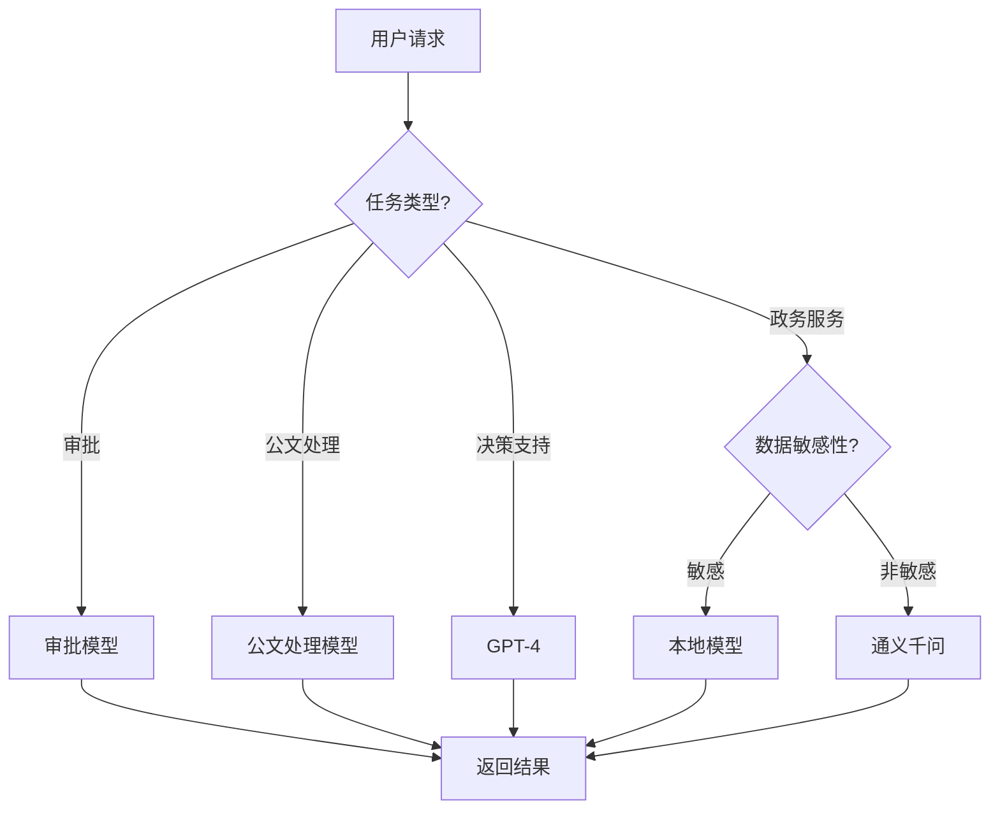

# 4. 模型与提示词管理

## 4.1 多模型路由

### 模型选择策略

智能政务解决方案使用多个AI模型，根据不同的业务场景和需求，智能选择最合适的模型：

#### 模型类型

- **大语言模型（LLM）**：
  - **GPT-4**：通用能力强，适合复杂推理任务
  - **Claude 3**：安全性高，适合合规审查
  - **通义千问**：中文优化，适合中文场景
  - **本地部署模型**：数据不出域，适合敏感场景

- **专用模型**：
  - **审批模型**：XGBoost、BERT，用于审批决策
  - **公文处理模型**：BERT、RoBERTa，用于公文分类和NER
  - **OCR模型**：PaddleOCR、Tesseract，用于文档识别
  - **文档解析模型**：版面分析模型，用于文档结构解析

#### 路由策略

- **基于任务类型路由**：
  - 审批任务 → 审批专用模型
  - 公文处理 → 公文处理模型 + OCR模型
  - 政务服务 → 大语言模型（通义千问）
  - 决策支持 → 大语言模型（GPT-4）

- **基于数据敏感性路由**：
  - 敏感数据 → 本地部署模型
  - 非敏感数据 → 云端大模型

- **基于性能要求路由**：
  - 实时任务 → 轻量级模型或缓存
  - 批量任务 → 高性能模型

- **基于成本考虑路由**：
  - 简单任务 → 低成本模型
  - 复杂任务 → 高性能模型

**路由决策流程图**：



### 路由规则

#### 规则配置

路由规则通过配置文件定义，支持灵活配置：

```yaml
# 模型路由规则配置
routing_rules:
  # 审批任务
  - name: approval
    condition:
      task_type: approval
      data_sensitivity: low
    model: approval_model_v2
    fallback: approval_model_v1
    
  # 公文处理
  - name: document_processing
    condition:
      task_type: document
      document_type: official
    model: document_model_v2
    ocr_model: paddleocr
    fallback: document_model_v1
    
  # 政务服务
  - name: government_service
    condition:
      task_type: service
      language: zh
    model: qwen-plus
    fallback: qwen-turbo
    
  # 决策支持
  - name: decision_support
    condition:
      task_type: decision
      complexity: high
    model: gpt-4
    fallback: gpt-3.5-turbo
    
  # 敏感数据
  - name: sensitive_data
    condition:
      data_sensitivity: high
    model: local_model
    fallback: reject
```

## 4.2 模型版本管理

### 版本控制策略

#### 版本命名规则

- **主版本号**：重大功能变更或架构调整
- **次版本号**：新功能添加或重要改进
- **修订版本号**：Bug修复或小幅改进

示例：v2.1.3

#### 版本发布流程

1. **开发阶段**：
   - 在开发环境开发和测试
   - 代码提交到Git仓库
   - 自动触发CI/CD流程

2. **测试阶段**：
   - 部署到测试环境
   - 执行自动化测试
   - 人工测试验证

3. **预发布阶段**：
   - 部署到预发布环境
   - 灰度发布测试
   - A/B测试验证

4. **生产发布**：
   - 部署到生产环境
   - 监控模型性能
   - 逐步切换流量

### 模型回滚

#### 回滚策略

- **自动回滚**：
  - 模型性能下降超过阈值
  - 错误率超过阈值
  - 响应时间超过阈值

- **手动回滚**：
  - 管理员手动触发回滚
  - 回滚到上一个稳定版本

#### 回滚流程

1. 停止新版本流量
2. 切换到旧版本
3. 验证旧版本性能
4. 记录回滚原因

## 4.3 提示词管理

### 提示词设计原则

#### 清晰明确

- 使用清晰的语言描述任务
- 明确输入输出格式
- 提供示例说明

#### 结构化设计

- 使用模板化提示词
- 分离系统提示词和用户提示词
- 支持动态参数替换

#### 领域适配

- 针对政务领域优化
- 使用政务专业术语
- 考虑政务业务特点

### 提示词模板

#### 审批审核提示词

```yaml
# 审批审核提示词模板
approval_review_prompt:
  system: |
    你是一位专业的审批审核专家，负责审核政务审批事项。
    你需要根据审批规则和政策要求，判断申请是否符合条件。
    
    审批规则：
    {{approval_rules}}
    
    政策要求：
    {{policy_requirements}}
    
    请仔细分析申请材料，给出审核意见。
    
  user: |
    申请信息：
    申请人：{{applicant_name}}
    申请事项：{{application_type}}
    申请内容：{{application_content}}
    
    申请材料：
    {{materials}}
    
    请给出审核意见：
    1. 是否符合审批条件
    2. 不符合的原因（如有）
    3. 需要补充的材料（如有）
```

#### 公文分类提示词

```yaml
# 公文分类提示词模板
document_classification_prompt:
  system: |
    你是一位专业的公文分类专家，负责对政务公文进行分类。
    
    公文类别包括：
    - 通知：用于发布通知、公告等
    - 报告：用于向上级报告工作、情况等
    - 请示：用于向上级请示事项
    - 批复：用于答复下级请示
    - 函：用于平行机关之间商洽工作
    - 其他：其他类型的公文
    
    请根据公文内容，判断公文类别。
    
  user: |
    公文标题：{{document_title}}
    公文内容：{{document_content}}
    
    请判断公文类别，并给出置信度。
```

#### 政务服务问答提示词

```yaml
# 政务服务问答提示词模板
service_qa_prompt:
  system: |
    你是一位专业的政务服务助手，负责回答公众的政务服务咨询。
    
    你的回答需要：
    1. 准确、清晰、友好
    2. 提供办事流程和材料要求
    3. 提供办理时间和地点信息
    4. 如果问题超出范围，礼貌地引导用户
    
    知识库：
    {{knowledge_base}}
    
  user: |
    用户问题：{{user_question}}
    
    请根据知识库内容，回答用户问题。
```

### 提示词优化

#### A/B测试

- 测试不同版本的提示词
- 比较回答质量和准确性
- 选择最优版本

#### 持续优化

- 收集用户反馈
- 分析回答质量
- 迭代优化提示词

## 4.4 模型评估与监控

### 评估指标

#### 准确率指标

- **审批准确率**：审批决策正确的比例
- **分类准确率**：公文分类正确的比例
- **问答准确率**：问答回答正确的比例

#### 性能指标

- **响应时间**：模型推理时间
- **吞吐量**：每秒处理的请求数
- **资源使用率**：CPU、GPU、内存使用率

#### 业务指标

- **用户满意度**：用户对回答的满意度评分
- **任务完成率**：任务成功完成的比例
- **错误率**：回答错误的比例

### 监控告警

#### 性能监控

- 实时监控模型性能指标
- 设置性能阈值告警
- 自动触发性能优化

#### 质量监控

- 监控回答质量
- 检测异常回答
- 触发人工审核

#### 成本监控

- 监控API调用成本
- 监控资源使用成本
- 优化成本控制

