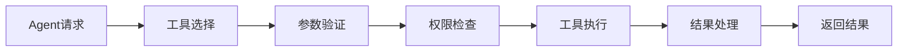

# 5. 智能体与业务编排

## 5.1 Agent技能链

### 技能定义

智能医疗Agent需要具备多种医疗专业技能，通过技能链组合完成复杂医疗任务：

#### 核心技能

**1. 影像预处理技能（Image Preprocessing）**
- **功能**：对医疗影像进行预处理，包括去噪、增强、标准化等
- **输入**：原始DICOM影像
- **输出**：预处理后的影像
- **实现**：基于OpenCV、SimpleITK的图像处理算法

**2. 病灶检测技能（Lesion Detection）**
- **功能**：检测影像中的异常病灶
- **输入**：预处理后的影像
- **输出**：病灶位置、大小、类型
- **实现**：基于YOLO、Faster R-CNN的目标检测模型

**3. 病灶分割技能（Lesion Segmentation）**
- **功能**：精确分割病灶区域
- **输入**：包含病灶的影像
- **输出**：病灶分割掩码
- **实现**：基于U-Net、DeepLab的分割模型

**4. 影像分类技能（Image Classification）**
- **功能**：对影像进行分类诊断
- **输入**：影像数据
- **输出**：疾病类别、置信度
- **实现**：基于ResNet、Vision Transformer的分类模型

**5. 病历理解技能（Medical Record Understanding）**
- **功能**：理解病历文本，提取关键信息
- **输入**：病历文本
- **输出**：结构化病历信息
- **实现**：基于BioBERT、ClinicalBERT的NLP模型

**6. 知识检索技能（Knowledge Retrieval）**
- **功能**：从医疗知识库检索相关信息
- **输入**：查询文本、患者信息
- **输出**：相关医学文献、指南、案例
- **实现**：基于RAG的检索系统

**7. 诊断推理技能（Diagnostic Reasoning）**
- **功能**：基于患者信息和知识库进行诊断推理
- **输入**：患者信息、检索结果
- **输出**：诊断建议、鉴别诊断
- **实现**：基于大语言模型的推理系统

**8. 用药建议技能（Medication Recommendation）**
- **功能**：基于诊断结果提供用药建议
- **输入**：诊断结果、患者信息
- **输出**：用药方案、注意事项
- **实现**：基于知识图谱和规则的推荐系统

### 技能链设计

技能链按照医疗业务流程组织，形成完整的诊断流程：


#### 标准技能链

**影像诊断链**：
1. 影像预处理 → 2. 病灶检测 → 3. 病灶分割 → 4. 影像分类 → 5. 生成诊断报告

**综合诊断链**：
1. 病历理解 → 2. 知识检索 → 3. 诊断推理 → 4. 用药建议 → 5. 生成诊疗方案

**紧急诊断链**：
1. 快速影像分类 → 2. 关键信息提取 → 3. 紧急诊断建议 → 4. 告警通知

**实现示例**：
```python
from langchain.agents import AgentExecutor, create_react_agent
from langchain.tools import Tool
from langchain.llms import OpenAI

# 定义医疗工具
medical_tools = [
    Tool(
        name="image_preprocessing",
        func=image_preprocessing_skill,
        description="对医疗影像进行预处理，包括去噪、增强、标准化"
    ),
    Tool(
        name="lesion_detection",
        func=lesion_detection_skill,
        description="检测影像中的异常病灶"
    ),
    Tool(
        name="lesion_segmentation",
        func=lesion_segmentation_skill,
        description="精确分割病灶区域"
    ),
    Tool(
        name="image_classification",
        func=image_classification_skill,
        description="对影像进行分类诊断"
    ),
    Tool(
        name="medical_record_understanding",
        func=medical_record_understanding_skill,
        description="理解病历文本，提取关键信息"
    ),
    Tool(
        name="knowledge_retrieval",
        func=knowledge_retrieval_skill,
        description="从医疗知识库检索相关信息"
    ),
    Tool(
        name="diagnostic_reasoning",
        func=diagnostic_reasoning_skill,
        description="基于患者信息和知识库进行诊断推理"
    ),
    Tool(
        name="medication_recommendation",
        func=medication_recommendation_skill,
        description="基于诊断结果提供用药建议"
    ),
]

# 创建医疗诊断Agent
llm = OpenAI(temperature=0)
medical_agent = create_react_agent(llm, medical_tools, medical_prompt)
agent_executor = AgentExecutor(agent=medical_agent, tools=medical_tools, verbose=True)
```

### 执行流程

#### 流程控制

**顺序执行**：
- 技能按顺序执行，前一个技能的输出作为下一个技能的输入
- 适用于有依赖关系的技能链（如影像预处理必须在病灶检测之前）

**并行执行**：
- 多个独立技能并行执行，提升处理速度
- 适用于无依赖关系的技能（如病历理解和影像分析可并行）

**条件分支**：
- 根据中间结果选择不同的执行路径
- 适用于需要动态调整的场景（如发现紧急情况时走紧急流程）

**实现示例**：
```python
from typing import List, Callable, Optional
import asyncio

class MedicalSkillChain:
    """医疗技能链"""
    
    def __init__(self):
        self.skills = []
    
    def add_skill(self, skill: Callable, condition: Optional[Callable] = None, 
                  parallel: bool = False):
        """添加技能到链中"""
        self.skills.append({
            'skill': skill,
            'condition': condition,
            'parallel': parallel
        })
    
    async def execute(self, input_data: dict):
        """执行技能链"""
        result = input_data
        parallel_skills = []
        
        for item in self.skills:
            skill = item['skill']
            condition = item['condition']
            parallel = item['parallel']
            
            # 检查条件
            if condition and not condition(result):
                continue
            
            # 并行执行
            if parallel:
                parallel_skills.append(skill)
            else:
                # 等待并行技能完成
                if parallel_skills:
                    results = await asyncio.gather(*[s(result) for s in parallel_skills])
                    # 合并结果
                    for r in results:
                        result.update(r)
                    parallel_skills = []
                
                # 执行当前技能
                result = await skill(result) if asyncio.iscoroutinefunction(skill) else skill(result)
        
        # 执行剩余的并行技能
        if parallel_skills:
            results = await asyncio.gather(*[s(result) for s in parallel_skills])
            for r in results:
                result.update(r)
        
        return result

# 使用示例
async def image_diagnosis_chain(image_path: str):
    """影像诊断技能链"""
    chain = MedicalSkillChain()
    
    # 添加技能
    chain.add_skill(image_preprocessing_skill)
    chain.add_skill(lesion_detection_skill)
    chain.add_skill(lesion_segmentation_skill)
    chain.add_skill(image_classification_skill)
    
    # 执行链
    result = await chain.execute({'image_path': image_path})
    return result
```

## 5.2 工具注册中心

### 工具类型

智能医疗系统需要集成多种医疗工具，扩展Agent能力：

#### 医疗业务工具

**1. PACS系统集成工具**
- **功能**：从PACS系统获取影像数据，上传诊断报告
- **接口**：DICOM协议（C-STORE、C-FIND、C-MOVE）
- **用途**：影像数据获取和报告上传

**2. HIS系统集成工具**
- **功能**：获取患者基本信息、病历数据，更新诊断信息
- **接口**：HL7 FHIR API
- **用途**：患者信息查询和病历管理

**3. LIS系统集成工具**
- **功能**：获取检验检查结果
- **接口**：HL7接口或数据库接口
- **用途**：检验数据获取

**4. 药物知识库工具**
- **功能**：查询药物信息、用药指南、药物相互作用
- **接口**：REST API
- **用途**：用药建议和药物查询

**5. 医学文献检索工具**
- **功能**：检索PubMed、知网等医学文献
- **接口**：API接口
- **用途**：文献检索和知识查询

**6. 临床指南查询工具**
- **功能**：查询各类疾病的诊疗指南
- **接口**：知识库API
- **用途**：诊疗规范查询

#### 工具注册流程

**1. 工具定义**：
```python
from typing import Dict, Any, Optional
from pydantic import BaseModel

class MedicalTool(BaseModel):
    """医疗工具定义"""
    tool_id: str
    tool_name: str
    tool_type: str  # PACS, HIS, LIS, Knowledge, etc.
    description: str
    endpoint: str
    authentication: Dict[str, Any]
    parameters: Dict[str, Any]
    return_type: str
    
class ToolRegistry:
    """工具注册中心"""
    
    def __init__(self):
        self.tools = {}  # {tool_id: MedicalTool}
    
    def register_tool(self, tool: MedicalTool):
        """注册工具"""
        # 验证工具配置
        self._validate_tool(tool)
        
        # 测试工具连接
        if not self._test_tool_connection(tool):
            raise ValueError(f"Tool {tool.tool_id} connection test failed")
        
        # 注册工具
        self.tools[tool.tool_id] = tool
        
        return tool.tool_id
    
    def _validate_tool(self, tool: MedicalTool):
        """验证工具配置"""
        required_fields = ['tool_id', 'tool_name', 'tool_type', 'endpoint']
        for field in required_fields:
            if not getattr(tool, field):
                raise ValueError(f"Tool {tool.tool_id} missing required field: {field}")
    
    def _test_tool_connection(self, tool: MedicalTool) -> bool:
        """测试工具连接"""
        try:
            # 根据工具类型测试连接
            if tool.tool_type == 'PACS':
                return self._test_pacs_connection(tool)
            elif tool.tool_type == 'HIS':
                return self._test_his_connection(tool)
            # ... 其他工具类型
            return True
        except Exception as e:
            print(f"Tool connection test failed: {e}")
            return False
    
    def get_tool(self, tool_id: str) -> Optional[MedicalTool]:
        """获取工具"""
        return self.tools.get(tool_id)
    
    def list_tools(self, tool_type: Optional[str] = None) -> List[MedicalTool]:
        """列出工具"""
        if tool_type:
            return [tool for tool in self.tools.values() if tool.tool_type == tool_type]
        return list(self.tools.values())
```

**2. 工具调用**：
```python
class ToolExecutor:
    """工具执行器"""
    
    def __init__(self, registry: ToolRegistry):
        self.registry = registry
    
    async def execute_tool(self, tool_id: str, parameters: Dict[str, Any]) -> Any:
        """执行工具"""
        tool = self.registry.get_tool(tool_id)
        if not tool:
            raise ValueError(f"Tool {tool_id} not found")
        
        # 根据工具类型执行
        if tool.tool_type == 'PACS':
            return await self._execute_pacs_tool(tool, parameters)
        elif tool.tool_type == 'HIS':
            return await self._execute_his_tool(tool, parameters)
        # ... 其他工具类型
    
    async def _execute_pacs_tool(self, tool: MedicalTool, parameters: Dict[str, Any]):
        """执行PACS工具"""
        import pynetdicom
        
        # 创建DICOM连接
        ae = pynetdicom.AE()
        ae.add_requested_context('1.2.840.10008.5.1.4.1.1.2')  # CT Image Storage
        
        # 连接到PACS
        assoc = ae.associate(tool.endpoint, 11112)
        
        if assoc.is_established:
            # 执行查询
            # ... DICOM操作
            assoc.release()
            return result
        else:
            raise ConnectionError("Failed to connect to PACS")
```

### 工具调用机制

#### 工具调用流程



#### 工具调用示例

```python
from langchain.tools import StructuredTool
from pydantic import BaseModel, Field

class PACSQueryInput(BaseModel):
    """PACS查询输入"""
    patient_id: str = Field(description="患者ID")
    study_date: Optional[str] = Field(description="检查日期")
    modality: Optional[str] = Field(description="影像类型")

def pacs_query_tool(patient_id: str, study_date: Optional[str] = None, 
                    modality: Optional[str] = None) -> str:
    """PACS查询工具"""
    executor = ToolExecutor(tool_registry)
    result = executor.execute_tool('pacs_query', {
        'patient_id': patient_id,
        'study_date': study_date,
        'modality': modality
    })
    return json.dumps(result, ensure_ascii=False)

# 注册为LangChain工具
pacs_tool = StructuredTool.from_function(
    func=pacs_query_tool,
    name="PACS查询",
    description="从PACS系统查询患者影像数据",
    args_schema=PACSQueryInput
)
```

## 5.3 长记忆与状态管理

### 记忆机制

#### 患者记忆管理

**短期记忆**：
- 存储当前会话的对话历史
- 存储当前诊断流程的中间状态
- 使用Redis缓存，TTL设置为会话超时时间

**长期记忆**：
- 存储患者历史诊断记录
- 存储患者偏好和特殊需求
- 存储到数据库，永久保存

**实现示例**：
```python
from typing import Dict, List, Optional
import redis
import json
from datetime import datetime, timedelta

class PatientMemoryManager:
    """患者记忆管理器"""
    
    def __init__(self, redis_client: redis.Redis, db_client):
        self.redis = redis_client
        self.db = db_client
    
    def save_short_term_memory(self, patient_id: str, session_id: str, 
                               memory: Dict[str, Any], ttl: int = 3600):
        """保存短期记忆"""
        key = f"patient_memory:{patient_id}:{session_id}"
        self.redis.setex(
            key,
            ttl,
            json.dumps(memory, ensure_ascii=False, default=str)
        )
    
    def get_short_term_memory(self, patient_id: str, session_id: str) -> Optional[Dict]:
        """获取短期记忆"""
        key = f"patient_memory:{patient_id}:{session_id}"
        data = self.redis.get(key)
        if data:
            return json.loads(data)
        return None
    
    def save_long_term_memory(self, patient_id: str, memory: Dict[str, Any]):
        """保存长期记忆"""
        memory['patient_id'] = patient_id
        memory['created_at'] = datetime.now().isoformat()
        self.db.patient_memories.insert_one(memory)
    
    def get_long_term_memory(self, patient_id: str, limit: int = 10) -> List[Dict]:
        """获取长期记忆"""
        memories = self.db.patient_memories.find(
            {'patient_id': patient_id}
        ).sort('created_at', -1).limit(limit)
        return list(memories)
```

### 状态管理

#### 诊断流程状态管理

**状态定义**：
- **初始化**：流程开始
- **影像分析中**：正在进行影像分析
- **病历分析中**：正在进行病历分析
- **知识检索中**：正在检索相关知识
- **诊断推理中**：正在进行诊断推理
- **报告生成中**：正在生成诊断报告
- **已完成**：流程完成
- **异常**：流程异常

**状态机实现**：
```python
from enum import Enum
from typing import Optional

class DiagnosisState(Enum):
    """诊断状态"""
    INITIALIZED = "initialized"
    IMAGE_ANALYZING = "image_analyzing"
    RECORD_ANALYZING = "record_analyzing"
    KNOWLEDGE_RETRIEVING = "knowledge_retrieving"
    REASONING = "reasoning"
    REPORT_GENERATING = "report_generating"
    COMPLETED = "completed"
    ERROR = "error"

class DiagnosisStateManager:
    """诊断状态管理器"""
    
    def __init__(self):
        self.states = {}  # {diagnosis_id: state}
        self.state_history = {}  # {diagnosis_id: [states]}
    
    def set_state(self, diagnosis_id: str, state: DiagnosisState, 
                  metadata: Optional[Dict] = None):
        """设置状态"""
        self.states[diagnosis_id] = {
            'state': state,
            'timestamp': datetime.now().isoformat(),
            'metadata': metadata or {}
        }
        
        # 记录状态历史
        if diagnosis_id not in self.state_history:
            self.state_history[diagnosis_id] = []
        self.state_history[diagnosis_id].append(self.states[diagnosis_id])
    
    def get_state(self, diagnosis_id: str) -> Optional[Dict]:
        """获取当前状态"""
        return self.states.get(diagnosis_id)
    
    def can_transition(self, diagnosis_id: str, target_state: DiagnosisState) -> bool:
        """检查状态转换是否合法"""
        current_state = self.states.get(diagnosis_id)
        if not current_state:
            return target_state == DiagnosisState.INITIALIZED
        
        # 定义状态转换规则
        transitions = {
            DiagnosisState.INITIALIZED: [
                DiagnosisState.IMAGE_ANALYZING,
                DiagnosisState.RECORD_ANALYZING
            ],
            DiagnosisState.IMAGE_ANALYZING: [
                DiagnosisState.KNOWLEDGE_RETRIEVING,
                DiagnosisState.REASONING
            ],
            DiagnosisState.RECORD_ANALYZING: [
                DiagnosisState.KNOWLEDGE_RETRIEVING
            ],
            DiagnosisState.KNOWLEDGE_RETRIEVING: [
                DiagnosisState.REASONING
            ],
            DiagnosisState.REASONING: [
                DiagnosisState.REPORT_GENERATING
            ],
            DiagnosisState.REPORT_GENERATING: [
                DiagnosisState.COMPLETED
            ],
        }
        
        allowed = transitions.get(current_state['state'], [])
        return target_state in allowed or target_state == DiagnosisState.ERROR
```

### 上下文维护

#### 多轮对话上下文管理

**上下文结构**：
- 患者基本信息
- 当前诊断任务
- 对话历史
- 中间结果
- 诊断建议

**实现示例**：
```python
class ConversationContext:
    """对话上下文"""
    
    def __init__(self, patient_id: str, diagnosis_id: str):
        self.patient_id = patient_id
        self.diagnosis_id = diagnosis_id
        self.patient_info = {}
        self.dialogue_history = []
        self.intermediate_results = {}
        self.diagnosis_suggestions = []
    
    def add_dialogue(self, role: str, content: str):
        """添加对话"""
        self.dialogue_history.append({
            'role': role,
            'content': content,
            'timestamp': datetime.now().isoformat()
        })
    
    def save_intermediate_result(self, key: str, value: Any):
        """保存中间结果"""
        self.intermediate_results[key] = value
    
    def get_context_summary(self) -> str:
        """获取上下文摘要"""
        summary = f"患者ID: {self.patient_id}\n"
        summary += f"诊断ID: {self.diagnosis_id}\n"
        
        if self.patient_info:
            summary += f"患者信息: {json.dumps(self.patient_info, ensure_ascii=False)}\n"
        
        if self.dialogue_history:
            summary += "对话历史:\n"
            for dialogue in self.dialogue_history[-5:]:  # 最近5轮对话
                summary += f"{dialogue['role']}: {dialogue['content']}\n"
        
        if self.intermediate_results:
            summary += f"中间结果: {json.dumps(self.intermediate_results, ensure_ascii=False)}\n"
        
        return summary

class ContextManager:
    """上下文管理器"""
    
    def __init__(self):
        self.contexts = {}  # {diagnosis_id: ConversationContext}
    
    def get_or_create_context(self, patient_id: str, diagnosis_id: str) -> ConversationContext:
        """获取或创建上下文"""
        if diagnosis_id not in self.contexts:
            self.contexts[diagnosis_id] = ConversationContext(patient_id, diagnosis_id)
        return self.contexts[diagnosis_id]
    
    def save_context(self, diagnosis_id: str):
        """保存上下文"""
        context = self.contexts.get(diagnosis_id)
        if context:
            # 保存到数据库
            # ... 保存逻辑
            pass
```
