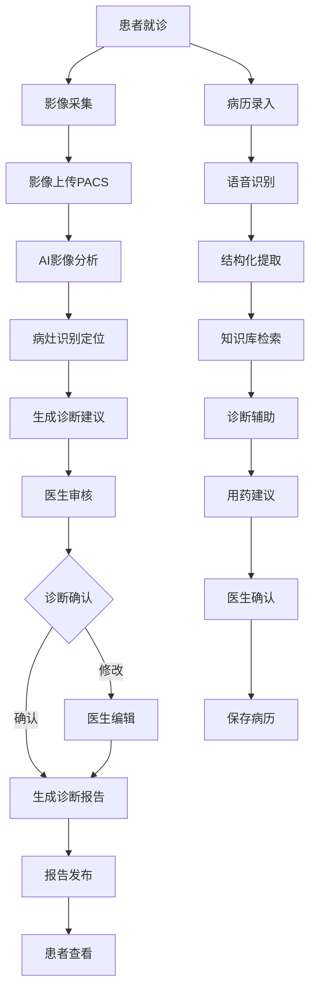
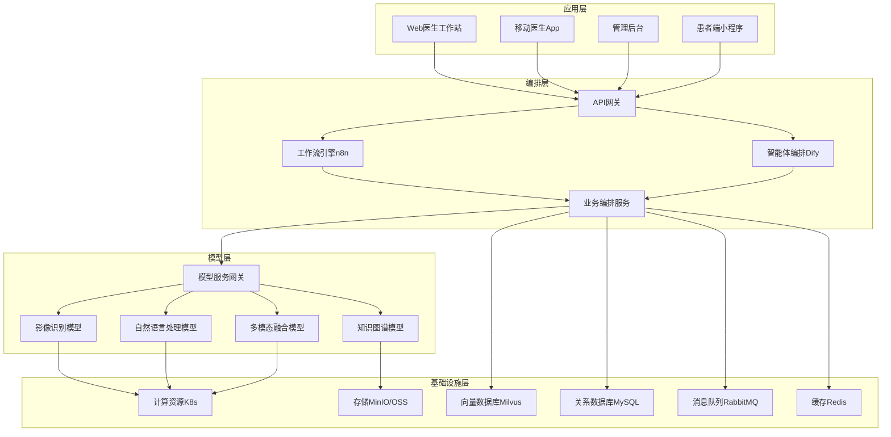
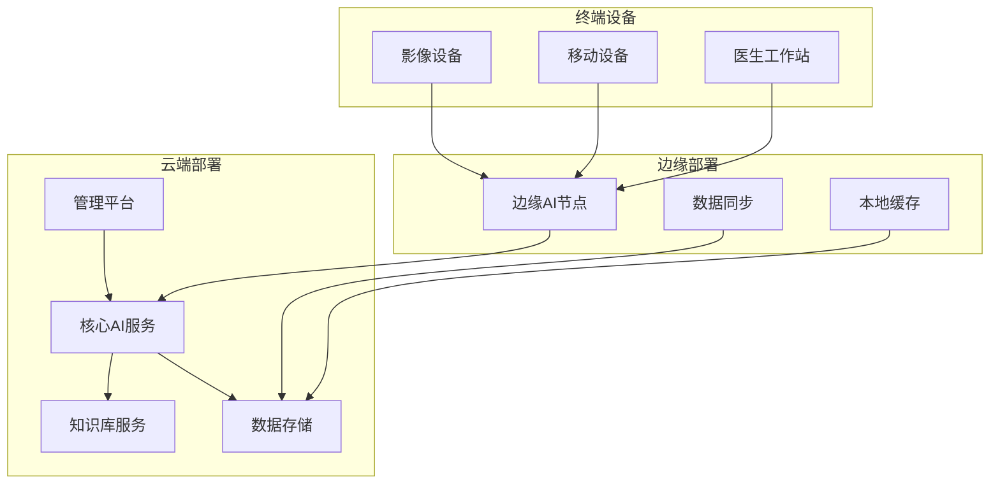

# 2. 总体架构

## 2.1 业务架构

### 角色定义

#### 放射科医生（Radiologist）
- **职责**：使用AI辅助诊断系统进行影像诊断，审核AI诊断结果，出具诊断报告
- **权限**：影像查看、AI诊断调用、报告编辑和审核、历史记录查询
- **典型场景**：CT/MRI/X光片阅片、AI辅助诊断、报告撰写和审核、疑难病例会诊

#### 临床医生（Clinician）
- **职责**：使用智能病历系统进行病历录入，获得AI辅助诊断建议，制定治疗方案
- **权限**：病历录入和编辑、AI辅助诊断、用药建议查询、患者信息查看
- **典型场景**：门诊病历录入、住院病历管理、诊断辅助、用药指导

#### 系统管理员（System Admin）
- **职责**：系统运维、性能监控、安全管理、数据备份、用户权限管理
- **权限**：系统配置、用户管理、安全审计、数据管理、模型管理
- **典型场景**：系统部署、性能优化、安全加固、故障处理、数据备份

#### 医学影像技师（Technician）
- **职责**：操作影像设备，上传影像数据，管理影像质量
- **权限**：影像上传、影像质量检查、设备管理
- **典型场景**：影像采集、影像上传、质量检查、设备维护

#### 医院信息科管理员（IT Admin）
- **职责**：管理医院信息系统集成，配置系统参数，监控系统运行
- **权限**：系统集成配置、参数设置、运行监控、日志查看
- **典型场景**：HIS/PACS系统集成、系统配置、运行监控、问题处理

### 用例分析

#### 用例1：AI辅助影像诊断
- **参与者**：放射科医生、AI诊断系统、PACS系统
- **前置条件**：医生已登录系统，影像已上传到PACS，AI模型已部署
- **主流程**：
  1. 医生在PACS系统中选择待诊断影像
  2. 系统调用AI诊断接口，进行影像分析和病灶识别
  3. AI返回诊断结果（病灶位置、类型、严重程度、诊断建议）
  4. 医生审核AI诊断结果，结合临床信息进行综合判断
  5. 医生编辑和确认诊断报告
  6. 系统保存诊断报告，同步到HIS系统
- **后置条件**：诊断报告已生成并保存，患者可查看报告
- **扩展流程**：如果AI诊断置信度低，系统提示医生重点关注；如果发现紧急情况，系统自动告警

#### 用例2：智能病历录入与辅助诊断
- **参与者**：临床医生、语音识别系统、NLP系统、知识库系统
- **前置条件**：医生已登录系统，患者已挂号，知识库已构建
- **主流程**：
  1. 医生通过语音或文字录入患者主诉、现病史等信息
  2. 系统进行语音识别和自然语言处理，提取关键信息
  3. 系统将非结构化文本转换为结构化病历数据
  4. 系统基于病历信息，从知识库检索相关疾病信息
  5. 系统提供诊断建议、鉴别诊断、检查建议、用药建议
  6. 医生审核建议，确认或修改诊断
  7. 系统保存结构化病历，生成病历摘要
- **后置条件**：病历已保存，诊断建议已记录，可用于后续诊疗
- **扩展流程**：如果诊断不明确，系统建议进一步检查；如果发现罕见病，系统提示专家会诊

#### 用例3：药物研发辅助
- **参与者**：药物研发人员、文献检索系统、数据分析系统
- **前置条件**：研发人员已登录系统，研究目标已确定
- **主流程**：
  1. 研发人员输入研究主题或药物靶点
  2. 系统检索相关医学文献、临床试验数据、专利信息
  3. 系统进行数据挖掘和分析，提取关键信息
  4. 系统提供药物设计建议、临床试验方案建议
  5. 研发人员审核建议，制定研究计划
  6. 系统保存研究记录，生成研究报告
- **后置条件**：研究方案已制定，可用于后续研发工作
- **扩展流程**：如果发现已有类似研究，系统提示避免重复；如果发现潜在风险，系统提示注意

### 故事地图

## 2.2 技术架构

### AI-Native四层架构

智能医疗系统采用AI-Native四层架构，从下到上依次为基础设施层、模型层、编排层和应用层。

#### 应用层

应用层提供面向不同用户角色的交互界面：

- **Web医生工作站**：基于Vue 3 + TypeScript开发，提供影像查看、AI诊断、报告编辑等功能，支持多屏显示、快捷键操作，提升医生工作效率
- **移动医生App**：基于React Native开发，支持iOS和Android，提供移动查房、紧急会诊、消息通知等功能
- **管理后台**：提供系统管理、用户管理、模型管理、数据统计等功能，支持多租户管理
- **患者端小程序**：基于微信小程序开发，提供报告查询、预约挂号、健康咨询等功能

#### 编排层

编排层负责业务流程编排和智能体协调：

- **API网关**：基于Kong或Nginx开发，提供统一API入口、认证授权、限流熔断、请求路由等功能
- **工作流引擎n8n**：用于复杂业务流程编排，如影像诊断流程、病历审核流程、报告发布流程等
- **智能体编排Dify**：用于AI智能体编排，如诊断智能体、用药建议智能体、文献检索智能体等
- **业务编排服务**：基于Python FastAPI开发，提供核心业务逻辑编排，协调各个子系统

#### 模型层

模型层提供各种AI模型服务：

- **影像识别模型**：基于深度学习（CNN、Transformer）的医疗影像识别模型，支持CT、MRI、X光、超声等多种影像类型，支持病灶检测、分割、分类等任务
- **自然语言处理模型**：基于大语言模型（LLM）的病历理解、报告生成、知识问答等NLP任务
- **知识图谱模型**：基于医疗知识图谱的疾病诊断、用药推荐、检查建议等知识推理任务
- **多模态融合模型**：融合影像、文本、结构化数据等多模态信息的综合诊断模型
- **模型服务网关**：提供统一的模型调用接口，支持模型路由、负载均衡、A/B测试等功能

#### 基础设施层

基础设施层提供计算、存储、网络等基础能力：

- **计算资源K8s**：基于Kubernetes的容器编排平台，提供弹性伸缩、自动恢复、资源调度等功能
- **存储MinIO/OSS**：对象存储服务，用于存储医疗影像、文档等非结构化数据，支持多副本、生命周期管理
- **向量数据库Milvus**：用于存储医疗知识库的向量数据，支持相似度检索、批量查询等功能
- **关系数据库MySQL**：用于存储结构化数据，如患者信息、诊断记录、系统配置等
- **消息队列RabbitMQ**：用于异步任务处理，如影像分析任务、报告生成任务等
- **缓存Redis**：用于缓存热点数据，如患者信息、诊断结果、系统配置等，提升系统响应速度

### 技术栈

#### 前端技术
- **Vue 3 + TypeScript**：医生工作站前端框架，提供响应式UI和类型安全
- **React Native**：移动App开发框架，支持iOS和Android双平台
- **微信小程序**：患者端小程序开发框架
- **TailwindCSS**：CSS框架，提供快速UI开发
- **ECharts**：数据可视化库，用于影像展示、数据统计等

#### 后端技术
- **Python 3.11 + FastAPI**：核心业务服务开发框架，提供高性能API服务
- **Node.js + Express**：部分微服务开发框架
- **n8n**：工作流编排引擎，用于业务流程自动化
- **Dify**：AI应用开发平台，用于智能体编排

#### AI/ML技术
- **PyTorch/TensorFlow**：深度学习框架，用于模型训练和推理
- **Transformers**：预训练模型库，用于NLP任务
- **OpenCV/SimpleITK**：医学影像处理库
- **LangChain**：LLM应用开发框架，用于RAG应用开发

#### 数据存储
- **MySQL 8.0**：关系数据库，存储结构化数据
- **Milvus**：向量数据库，存储知识库向量数据
- **MinIO/Aliyun OSS**：对象存储，存储影像和文档
- **Redis**：缓存数据库，提升性能
- **Elasticsearch**：搜索引擎，用于全文检索

#### DevOps技术
- **Docker + Docker Compose**：容器化部署
- **Kubernetes**：容器编排平台
- **GitHub Actions**：CI/CD自动化
- **Prometheus + Grafana**：监控和可视化
- **ELK Stack**：日志收集和分析

## 2.3 部署架构

### 云/边/端混合部署

智能医疗系统采用云边端混合部署架构，满足不同场景需求：

#### 云端部署
- **核心AI服务**：部署在公有云或私有云，提供强大的计算能力，支持大规模并发请求
- **知识库服务**：部署在云端，集中管理医疗知识库，支持多医院共享
- **数据存储**：云端存储，提供高可靠性和可扩展性
- **管理平台**：云端管理平台，统一管理所有医院和用户

#### 边缘部署
- **边缘AI节点**：部署在医院内网，提供低延迟的AI推理服务，保护数据隐私
- **本地缓存**：缓存常用数据和模型，减少网络传输
- **数据同步**：与云端数据同步，确保数据一致性

#### 终端设备
- **医生工作站**：部署在医院内网，直接访问边缘AI节点
- **移动设备**：通过VPN或专线访问系统
- **影像设备**：通过DICOM协议直接上传影像到PACS系统

### 高可用设计

#### 多机房部署
- **主备机房**：主机房和备机房异地部署，主备切换时间≤5分钟
- **负载均衡**：使用F5或Nginx进行负载均衡，支持健康检查和自动故障转移
- **数据同步**：主备机房数据实时同步，RPO≤1分钟

#### 服务高可用
- **服务冗余**：关键服务至少部署2个实例，支持自动故障转移
- **数据库主从**：MySQL主从复制，支持读写分离和自动切换
- **缓存集群**：Redis集群模式，支持数据分片和故障自动恢复

#### 监控告警
- **实时监控**：7×24小时监控系统运行状态，关键指标1分钟采集一次
- **自动告警**：异常情况自动告警，通过短信、邮件、钉钉等方式通知运维人员
- **故障自愈**：支持自动重启、自动扩容等自愈机制

### 扩展性设计

#### 水平扩展
- **无状态服务**：应用服务设计为无状态，支持水平扩展
- **数据库分库分表**：支持按医院、按时间等维度分库分表
- **缓存分片**：Redis支持分片，支持大规模数据缓存

#### 弹性伸缩
- **自动扩容**：基于CPU、内存、请求量等指标自动扩容
- **定时扩容**：支持定时扩容，应对业务高峰期
- **成本优化**：支持按需扩容，降低资源成本

#### 性能优化
- **CDN加速**：静态资源通过CDN加速，提升访问速度
- **数据库优化**：索引优化、查询优化、连接池优化
- **缓存策略**：多级缓存策略，提升响应速度
