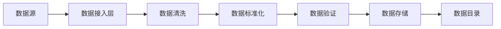
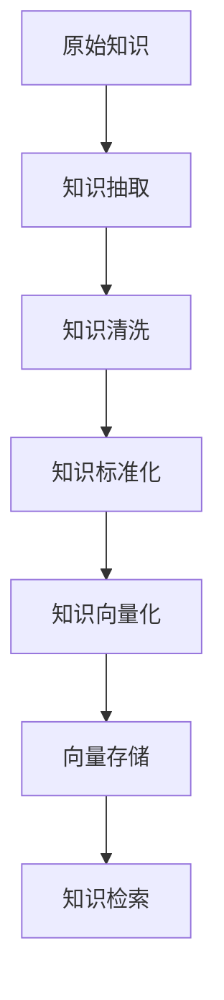
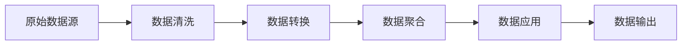
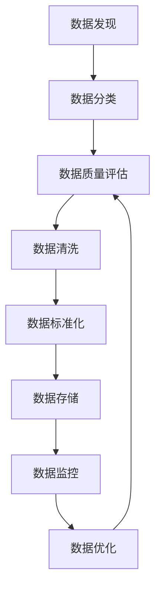

# 3. 数据与知识治理

## 3.1 私有数据接入

### 数据源类型

智能医疗系统需要接入多种类型的医疗数据，主要包括：

#### 医疗影像数据
- **DICOM影像**：CT、MRI、X光、超声等DICOM格式影像数据，通常存储在PACS系统中
- **数据特点**：数据量大（单张影像几MB到几百MB），格式标准（DICOM），包含丰富的元数据信息
- **接入方式**：通过DICOM协议（DICOM C-STORE、C-FIND、C-MOVE）从PACS系统获取，或通过DICOM文件导入
- **数据量**：大型三甲医院年产生影像数据可达10-50TB

#### 电子病历数据
- **结构化病历**：从HIS系统获取的结构化病历数据，包括患者基本信息、诊断信息、用药信息等
- **非结构化病历**：医生录入的自由文本病历，包括主诉、现病史、体格检查、诊断意见等
- **数据特点**：数据格式多样（结构化、半结构化、非结构化），包含敏感信息，需要脱敏处理
- **接入方式**：通过HL7 FHIR接口从HIS系统获取，或通过数据库直连方式获取
- **数据量**：大型三甲医院年产生病历数据可达100-500GB

#### 检验检查数据
- **检验数据**：血常规、生化、免疫等检验结果数据
- **检查数据**：心电图、内镜、病理等检查结果数据
- **数据特点**：数据格式相对标准，多为结构化数据
- **接入方式**：通过HL7接口从LIS系统获取，或通过数据库接口获取
- **数据量**：大型三甲医院年产生检验检查数据可达50-200GB

#### 医学文献和知识库
- **医学文献**：PubMed、知网等医学文献数据库
- **临床指南**：各类疾病的临床诊疗指南
- **药物知识库**：药物说明书、用药指南、药物相互作用等
- **数据特点**：数据来源多样，格式不统一，需要清洗和标准化
- **接入方式**：通过API接口获取，或通过文件导入方式
- **数据量**：知识库数据可达几TB

### 数据接入流程

#### 数据接入架构



#### 详细流程

1. **数据源发现和注册**
   - 识别和注册各类数据源，建立数据源目录
   - 配置数据源连接信息（地址、端口、认证信息等）
   - 设置数据接入策略（全量/增量、频率、优先级等）

2. **数据抽取**
   - **批量抽取**：定时批量抽取数据，适用于历史数据导入
   - **实时抽取**：实时抽取数据，适用于实时性要求高的场景
   - **增量抽取**：只抽取变更数据，减少数据传输量

3. **数据清洗**
   - **格式转换**：将不同格式的数据转换为统一格式
   - **数据去重**：识别和去除重复数据
   - **异常值处理**：识别和处理异常值、缺失值
   - **数据补全**：对缺失数据进行补全或标记

4. **数据标准化**
   - **术语标准化**：将非标准术语转换为标准术语（如ICD-10疾病编码）
   - **单位标准化**：统一数据单位（如长度单位、重量单位等）
   - **格式标准化**：统一数据格式（如日期格式、数值格式等）

5. **数据验证**
   - **完整性验证**：验证数据是否完整
   - **准确性验证**：验证数据是否准确
   - **一致性验证**：验证数据是否一致
   - **合规性验证**：验证数据是否符合合规要求

6. **数据存储**
   - **分类存储**：根据数据类型存储到不同的存储系统
   - **索引建立**：建立索引，提升查询性能
   - **元数据管理**：记录数据元数据信息

#### 数据接入示例代码

```python
# 数据接入服务示例
from fastapi import FastAPI, BackgroundTasks
from pydantic import BaseModel
import pydicom
from typing import List, Optional

app = FastAPI()

class DataSourceConfig(BaseModel):
    """数据源配置"""
    source_type: str  # DICOM, HL7, Database, File
    connection_info: dict
    schedule: Optional[str] = None  # cron表达式

class DataIngestionService:
    """数据接入服务"""
    
    def ingest_dicom_images(self, source_path: str, target_path: str):
        """接入DICOM影像数据"""
        # 读取DICOM文件
        dicom_file = pydicom.dcmread(source_path)
        
        # 提取元数据
        metadata = {
            'patient_id': dicom_file.PatientID,
            'study_date': dicom_file.StudyDate,
            'modality': dicom_file.Modality,
            'series_description': dicom_file.SeriesDescription,
        }
        
        # 数据清洗和验证
        cleaned_metadata = self._clean_metadata(metadata)
        
        # 存储到对象存储
        self._store_to_object_storage(source_path, target_path)
        
        # 存储元数据到数据库
        self._store_metadata_to_db(cleaned_metadata)
        
        return cleaned_metadata
    
    def ingest_hl7_data(self, hl7_message: str):
        """接入HL7数据"""
        # 解析HL7消息
        parsed_data = self._parse_hl7(hl7_message)
        
        # 数据标准化
        standardized_data = self._standardize_data(parsed_data)
        
        # 数据验证
        validated_data = self._validate_data(standardized_data)
        
        # 存储到数据库
        self._store_to_database(validated_data)
        
        return validated_data

@app.post("/api/v1/data/ingest")
async def ingest_data(
    source_config: DataSourceConfig,
    background_tasks: BackgroundTasks
):
    """数据接入接口"""
    service = DataIngestionService()
    
    # 异步执行数据接入任务
    background_tasks.add_task(
        service.ingest_data,
        source_config
    )
    
    return {"status": "accepted", "message": "数据接入任务已提交"}
```

### 数据质量保证

#### 数据质量维度

1. **完整性（Completeness）**
   - 检查必填字段是否完整
   - 检查数据记录是否完整
   - 设置完整性阈值，低于阈值的数据需要人工审核

2. **准确性（Accuracy）**
   - 检查数据是否符合业务规则
   - 检查数据范围是否合理（如年龄、血压值等）
   - 与权威数据源对比验证

3. **一致性（Consistency）**
   - 检查同一患者在不同系统中的数据是否一致
   - 检查数据之间的关联关系是否正确
   - 检查数据格式是否一致

4. **及时性（Timeliness）**
   - 检查数据是否及时更新
   - 设置数据时效性要求
   - 监控数据延迟情况

5. **有效性（Validity）**
   - 检查数据是否符合标准格式
   - 检查数据是否符合业务规则
   - 检查数据编码是否正确

#### 数据质量监控

```python
# 数据质量监控示例
class DataQualityMonitor:
    """数据质量监控"""
    
    def check_completeness(self, data: dict, required_fields: List[str]) -> dict:
        """检查数据完整性"""
        missing_fields = []
        for field in required_fields:
            if field not in data or data[field] is None:
                missing_fields.append(field)
        
        completeness_rate = (len(required_fields) - len(missing_fields)) / len(required_fields)
        
        return {
            'completeness_rate': completeness_rate,
            'missing_fields': missing_fields,
            'status': 'pass' if completeness_rate >= 0.95 else 'fail'
        }
    
    def check_accuracy(self, data: dict, rules: dict) -> dict:
        """检查数据准确性"""
        errors = []
        for field, rule in rules.items():
            if field in data:
                if not self._validate_rule(data[field], rule):
                    errors.append(f"{field}不符合规则: {rule}")
        
        accuracy_rate = 1 - len(errors) / len(rules) if rules else 1
        
        return {
            'accuracy_rate': accuracy_rate,
            'errors': errors,
            'status': 'pass' if accuracy_rate >= 0.98 else 'fail'
        }
    
    def _validate_rule(self, value, rule: dict) -> bool:
        """验证规则"""
        if 'min' in rule and value < rule['min']:
            return False
        if 'max' in rule and value > rule['max']:
            return False
        if 'pattern' in rule:
            import re
            if not re.match(rule['pattern'], str(value)):
                return False
        return True
```

## 3.2 向量知识库

### 知识库构建

#### 知识库架构



#### 知识来源

1. **医学文献**
   - PubMed、知网、万方等医学文献数据库
   - 临床研究论文、病例报告、综述文章
   - 通过API接口或爬虫方式获取

2. **临床指南**
   - 各类疾病的诊疗指南（如NCCN指南、中国临床指南等）
   - 诊疗规范和标准
   - 从权威机构网站获取

3. **药物知识库**
   - 药物说明书、用药指南
   - 药物相互作用、不良反应
   - 从药监局、药企等获取

4. **疾病知识库**
   - 疾病定义、病因、病理、临床表现
   - 诊断标准、治疗方案、预后
   - 从医学教科书、专业网站获取

5. **医院内部知识**
   - 医院内部诊疗规范
   - 专家经验和案例
   - 从医院内部系统获取

#### 知识抽取和构建流程

1. **知识抽取**
   - **实体抽取**：从文本中抽取疾病、药物、症状、检查等实体
   - **关系抽取**：抽取实体之间的关系（如疾病-症状、药物-适应症等）
   - **事件抽取**：抽取诊疗事件、用药事件等

2. **知识清洗**
   - 去除重复知识
   - 纠正错误知识
   - 补充缺失知识

3. **知识标准化**
   - 统一术语（使用ICD-10、ATC等标准编码）
   - 统一格式
   - 建立知识图谱

4. **知识存储**
   - 结构化知识存储到图数据库（Neo4j）
   - 非结构化知识存储到向量数据库（Milvus）

#### 知识库构建示例

```python
# 知识库构建服务示例
from langchain.text_splitter import RecursiveCharacterTextSplitter
from langchain.embeddings import HuggingFaceEmbeddings
from pymilvus import Collection, connections, FieldSchema, CollectionSchema, DataType
import json

class MedicalKnowledgeBase:
    """医疗知识库构建服务"""
    
    def __init__(self):
        # 初始化向量数据库连接
        connections.connect("default", host="localhost", port="19530")
        
        # 初始化嵌入模型
        self.embeddings = HuggingFaceEmbeddings(
            model_name="sentence-transformers/paraphrase-multilingual-MiniLM-L12-v2"
        )
        
        # 文本分割器
        self.text_splitter = RecursiveCharacterTextSplitter(
            chunk_size=500,
            chunk_overlap=50
        )
    
    def build_knowledge_base(self, documents: List[str]):
        """构建知识库"""
        # 文本分割
        chunks = []
        for doc in documents:
            chunks.extend(self.text_splitter.split_text(doc))
        
        # 向量化
        vectors = self.embeddings.embed_documents(chunks)
        
        # 存储到Milvus
        collection = self._get_or_create_collection()
        
        # 准备数据
        data = [
            [i for i in range(len(chunks))],  # ids
            vectors,  # embeddings
            chunks,  # texts
        ]
        
        # 插入数据
        collection.insert(data)
        collection.flush()
        
        return len(chunks)
    
    def _get_or_create_collection(self):
        """获取或创建集合"""
        collection_name = "medical_knowledge"
        
        # 定义字段
        fields = [
            FieldSchema(name="id", dtype=DataType.INT64, is_primary=True),
            FieldSchema(name="embedding", dtype=DataType.FLOAT_VECTOR, dim=384),
            FieldSchema(name="text", dtype=DataType.VARCHAR, max_length=1000),
        ]
        
        schema = CollectionSchema(fields, "医疗知识库")
        
        # 创建集合
        try:
            collection = Collection(collection_name, schema=schema)
        except:
            collection = Collection(collection_name)
        
        # 创建索引
        index_params = {
            "metric_type": "L2",
            "index_type": "IVF_FLAT",
            "params": {"nlist": 1024}
        }
        collection.create_index("embedding", index_params)
        
        return collection
```

### 向量化策略

#### 向量化模型选择

1. **通用文本向量化模型**
   - **sentence-transformers/paraphrase-multilingual-MiniLM-L12-v2**：多语言模型，适合中英文混合文本
   - **BAAI/bge-large-zh-v1.5**：中文优化模型，适合中文医疗文本
   - **特点**：通用性强，适合多种文本类型

2. **医疗领域专用模型**
   - **BioBERT**：生物医学领域预训练模型
   - **ClinicalBERT**：临床文本预训练模型
   - **特点**：针对医疗领域优化，准确率更高

3. **多模态向量化**
   - **CLIP**：图像和文本联合向量化
   - **特点**：支持影像和文本的联合检索

#### 向量化策略

1. **文档级向量化**
   - 将整个文档作为一个向量
   - **优点**：简单快速，适合短文档
   - **缺点**：信息丢失，不适合长文档

2. **段落级向量化**
   - 将文档分割成段落，每个段落一个向量
   - **优点**：保留更多细节信息
   - **缺点**：向量数量多，存储和检索成本高

3. **句子级向量化**
   - 将文档分割成句子，每个句子一个向量
   - **优点**：粒度细，检索精度高
   - **缺点**：向量数量多，需要后处理

4. **混合向量化**
   - 结合文档级、段落级、句子级向量化
   - **优点**：兼顾效率和精度
   - **缺点**：实现复杂

#### 向量化参数配置

```python
# 向量化配置示例
VECTORIZATION_CONFIG = {
    'chunk_size': 500,  # 文本块大小
    'chunk_overlap': 50,  # 文本块重叠大小
    'embedding_model': 'BAAI/bge-large-zh-v1.5',  # 嵌入模型
    'vector_dim': 1024,  # 向量维度
    'normalize': True,  # 是否归一化
    'batch_size': 32,  # 批处理大小
}
```

### 检索优化

#### 检索策略

1. **相似度检索**
   - 使用余弦相似度或欧氏距离计算向量相似度
   - 返回Top-K最相似的文档
   - **优点**：简单快速
   - **缺点**：可能遗漏相关信息

2. **混合检索（Hybrid Search）**
   - 结合向量检索和关键词检索
   - 使用BM25进行关键词检索，向量检索进行语义检索
   - 融合两种检索结果
   - **优点**：兼顾精确匹配和语义匹配
   - **缺点**：计算成本高

3. **重排序（Reranking）**
   - 使用更强大的模型对检索结果重新排序
   - 提升检索精度
   - **优点**：检索精度高
   - **缺点**：计算成本高

#### 检索优化示例

```python
# 混合检索示例
from pymilvus import Collection
from rank_bm25 import BM25Okapi
import jieba

class HybridRetrieval:
    """混合检索服务"""
    
    def __init__(self, collection: Collection):
        self.collection = collection
        self.bm25 = None
    
    def build_bm25_index(self, documents: List[str]):
        """构建BM25索引"""
        # 中文分词
        tokenized_docs = [list(jieba.cut(doc)) for doc in documents]
        self.bm25 = BM25Okapi(tokenized_docs)
    
    def hybrid_search(self, query: str, top_k: int = 10):
        """混合检索"""
        # 向量检索
        query_vector = self.embeddings.embed_query(query)
        vector_results = self.collection.search(
            data=[query_vector],
            anns_field="embedding",
            param={"metric_type": "L2", "params": {"nprobe": 10}},
            limit=top_k * 2
        )
        
        # 关键词检索
        tokenized_query = list(jieba.cut(query))
        bm25_scores = self.bm25.get_scores(tokenized_query)
        keyword_results = sorted(
            enumerate(bm25_scores),
            key=lambda x: x[1],
            reverse=True
        )[:top_k * 2]
        
        # 融合结果
        fused_results = self._fuse_results(
            vector_results[0],
            keyword_results,
            top_k
        )
        
        return fused_results
    
    def _fuse_results(self, vector_results, keyword_results, top_k):
        """融合检索结果"""
        # 使用RRF（Reciprocal Rank Fusion）融合
        scores = {}
        
        for rank, result in enumerate(vector_results, 1):
            doc_id = result.id
            scores[doc_id] = scores.get(doc_id, 0) + 1 / (60 + rank)
        
        for rank, (doc_id, score) in enumerate(keyword_results, 1):
            scores[doc_id] = scores.get(doc_id, 0) + 1 / (60 + rank)
        
        # 排序并返回Top-K
        sorted_results = sorted(
            scores.items(),
            key=lambda x: x[1],
            reverse=True
        )[:top_k]
        
        return sorted_results
```

## 3.3 数据版本与血缘

### 版本管理

#### 数据版本管理策略

1. **快照版本管理**
   - 定期创建数据快照，保存历史版本
   - 支持按时间点恢复数据
   - **适用场景**：重要数据、需要审计的数据

2. **增量版本管理**
   - 只保存变更数据，减少存储空间
   - 通过增量数据重建历史版本
   - **适用场景**：大数据量、变更频繁的数据

3. **语义版本管理**
   - 使用语义版本号（如v1.0.0）管理数据版本
   - 支持版本标签和描述
   - **适用场景**：需要明确版本含义的数据

#### 数据版本管理实现

```python
# 数据版本管理示例
from datetime import datetime
import hashlib
import json

class DataVersionManager:
    """数据版本管理器"""
    
    def __init__(self, storage_backend):
        self.storage = storage_backend
        self.versions = {}  # {data_id: [version_info]}
    
    def create_version(self, data_id: str, data: dict, metadata: dict = None):
        """创建数据版本"""
        # 计算数据哈希
        data_hash = self._calculate_hash(data)
        
        # 创建版本信息
        version_info = {
            'version_id': f"{data_id}_{datetime.now().strftime('%Y%m%d%H%M%S')}",
            'data_id': data_id,
            'timestamp': datetime.now().isoformat(),
            'data_hash': data_hash,
            'metadata': metadata or {},
            'snapshot': data  # 保存快照
        }
        
        # 保存版本
        if data_id not in self.versions:
            self.versions[data_id] = []
        self.versions[data_id].append(version_info)
        
        # 存储到后端
        self.storage.save_version(version_info)
        
        return version_info['version_id']
    
    def get_version(self, data_id: str, version_id: str = None):
        """获取数据版本"""
        if version_id:
            # 获取指定版本
            for version in self.versions.get(data_id, []):
                if version['version_id'] == version_id:
                    return version
        else:
            # 获取最新版本
            versions = self.versions.get(data_id, [])
            if versions:
                return versions[-1]
        return None
    
    def list_versions(self, data_id: str):
        """列出所有版本"""
        return self.versions.get(data_id, [])
    
    def _calculate_hash(self, data: dict) -> str:
        """计算数据哈希"""
        data_str = json.dumps(data, sort_keys=True)
        return hashlib.sha256(data_str.encode()).hexdigest()
```

### 血缘追踪

#### 数据血缘关系

数据血缘关系描述了数据的来源、转换和去向：



#### 血缘追踪实现

```python
# 数据血缘追踪示例
class DataLineageTracker:
    """数据血缘追踪器"""
    
    def __init__(self):
        self.lineage_graph = {}  # {data_id: {parents: [], children: []}}
    
    def track_transformation(self, input_data_ids: List[str], output_data_id: str, transformation: dict):
        """追踪数据转换"""
        # 记录输出数据的父数据
        if output_data_id not in self.lineage_graph:
            self.lineage_graph[output_data_id] = {
                'parents': [],
                'children': [],
                'transformations': []
            }
        
        self.lineage_graph[output_data_id]['parents'].extend(input_data_ids)
        self.lineage_graph[output_data_id]['transformations'].append(transformation)
        
        # 记录输入数据的子数据
        for input_id in input_data_ids:
            if input_id not in self.lineage_graph:
                self.lineage_graph[input_id] = {
                    'parents': [],
                    'children': [],
                    'transformations': []
                }
            self.lineage_graph[input_id]['children'].append(output_data_id)
    
    def get_upstream(self, data_id: str, depth: int = None):
        """获取上游数据"""
        upstream = set()
        queue = [(data_id, 0)]
        visited = set()
        
        while queue:
            current_id, current_depth = queue.pop(0)
            
            if current_id in visited:
                continue
            visited.add(current_id)
            
            if current_id in self.lineage_graph:
                parents = self.lineage_graph[current_id]['parents']
                for parent in parents:
                    if depth is None or current_depth < depth:
                        upstream.add(parent)
                        queue.append((parent, current_depth + 1))
        
        return list(upstream)
    
    def get_downstream(self, data_id: str, depth: int = None):
        """获取下游数据"""
        downstream = set()
        queue = [(data_id, 0)]
        visited = set()
        
        while queue:
            current_id, current_depth = queue.pop(0)
            
            if current_id in visited:
                continue
            visited.add(current_id)
            
            if current_id in self.lineage_graph:
                children = self.lineage_graph[current_id]['children']
                for child in children:
                    if depth is None or current_depth < depth:
                        downstream.add(child)
                        queue.append((child, current_depth + 1))
        
        return list(downstream)
```

### 数据治理流程

#### 数据治理框架



#### 数据治理流程

1. **数据发现和分类**
   - 自动发现数据源
   - 识别数据类型和敏感级别
   - 建立数据目录

2. **数据质量评估**
   - 评估数据质量
   - 识别数据问题
   - 生成质量报告

3. **数据清洗和标准化**
   - 清洗脏数据
   - 标准化数据格式
   - 统一数据编码

4. **数据存储和管理**
   - 选择合适的存储方案
   - 建立数据索引
   - 设置访问权限

5. **数据监控和优化**
   - 监控数据使用情况
   - 优化数据存储和检索
   - 持续改进数据质量

#### 数据治理工具

- **Apache Atlas**：数据治理和元数据管理平台
- **Great Expectations**：数据质量验证框架
- **DataHub**：现代数据目录平台
- **自定义工具**：基于项目需求定制开发
