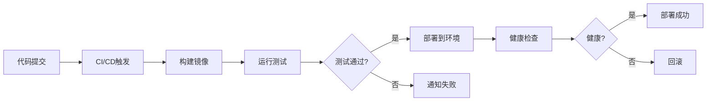

# 11. 交付与运维

## 11.1 一键部署

### 部署方案

智能医疗系统采用容器化部署，支持一键部署到各种环境：

#### Docker Compose部署

**docker-compose.yml配置**：
```yaml
version: '3.8'

services:
  medical-ai-service:
    image: medical-ai-service:latest
    ports:
      - "8000:8000"
    environment:
      - DATABASE_URL=postgresql://user:pass@db:5432/medical_ai
      - REDIS_URL=redis://redis:6379
      - MILVUS_HOST=milvus
      - MILVUS_PORT=19530
      - OPENAI_API_KEY=${OPENAI_API_KEY}
    depends_on:
      - db
      - redis
      - milvus
    volumes:
      - ./logs:/app/logs
      - ./models:/app/models
    restart: unless-stopped
    deploy:
      resources:
        reservations:
          devices:
            - driver: nvidia
              count: 1
              capabilities: [gpu]

  db:
    image: postgres:14
    environment:
      - POSTGRES_USER=medical_ai
      - POSTGRES_PASSWORD=${DB_PASSWORD}
      - POSTGRES_DB=medical_ai
    volumes:
      - postgres_data:/var/lib/postgresql/data
    restart: unless-stopped

  redis:
    image: redis:7-alpine
    volumes:
      - redis_data:/data
    restart: unless-stopped

  milvus:
    image: milvusdb/milvus:latest
    ports:
      - "19530:19530"
    volumes:
      - milvus_data:/var/lib/milvus
    environment:
      - ETCD_ENDPOINTS=etcd:2379
    depends_on:
      - etcd
    restart: unless-stopped

  etcd:
    image: quay.io/coreos/etcd:v3.5.0
    environment:
      - ETCD_AUTO_COMPACTION_MODE=revision
      - ETCD_AUTO_COMPACTION_RETENTION=1000
    volumes:
      - etcd_data:/etcd
    restart: unless-stopped

volumes:
  postgres_data:
  redis_data:
  milvus_data:
  etcd_data:
```

#### Kubernetes部署

**deployment.yaml配置**：
```yaml
apiVersion: apps/v1
kind: Deployment
metadata:
  name: medical-ai-service
spec:
  replicas: 3
  selector:
    matchLabels:
      app: medical-ai-service
  template:
    metadata:
      labels:
        app: medical-ai-service
    spec:
      containers:
      - name: medical-ai-service
        image: medical-ai-service:latest
        ports:
        - containerPort: 8000
        env:
        - name: DATABASE_URL
          valueFrom:
            secretKeyRef:
              name: db-secret
              key: url
        - name: REDIS_URL
          valueFrom:
            secretKeyRef:
              name: redis-secret
              key: url
        resources:
          requests:
            cpu: 2
            memory: 8Gi
            nvidia.com/gpu: 1
          limits:
            cpu: 8
            memory: 32Gi
            nvidia.com/gpu: 1
        livenessProbe:
          httpGet:
            path: /health
            port: 8000
          initialDelaySeconds: 30
          periodSeconds: 10
        readinessProbe:
          httpGet:
            path: /ready
            port: 8000
          initialDelaySeconds: 10
          periodSeconds: 5
---
apiVersion: v1
kind: Service
metadata:
  name: medical-ai-service
spec:
  selector:
    app: medical-ai-service
  ports:
  - port: 80
    targetPort: 8000
  type: LoadBalancer
```

#### 部署脚本

**一键部署脚本**：
```bash
#!/bin/bash

# 一键部署脚本
set -e

echo "开始部署智能医疗系统..."

# 1. 检查环境
echo "检查环境..."
if ! command -v docker &> /dev/null; then
    echo "错误: 未安装Docker"
    exit 1
fi

if ! command -v docker-compose &> /dev/null; then
    echo "错误: 未安装Docker Compose"
    exit 1
fi

# 2. 加载环境变量
echo "加载环境变量..."
if [ -f .env ]; then
    source .env
else
    echo "警告: 未找到.env文件，使用默认配置"
fi

# 3. 构建镜像
echo "构建镜像..."
docker-compose build

# 4. 启动服务
echo "启动服务..."
docker-compose up -d

# 5. 等待服务就绪
echo "等待服务就绪..."
sleep 30

# 6. 健康检查
echo "健康检查..."
if curl -f http://localhost:8000/health > /dev/null 2>&1; then
    echo "部署成功！"
else
    echo "部署失败：服务未就绪"
    exit 1
fi

# 7. 显示服务状态
echo "服务状态："
docker-compose ps
```

### 部署脚本

#### 自动化部署流程



### 环境配置

#### 环境变量配置

**.env文件示例**：
```bash
# 数据库配置
DATABASE_URL=postgresql://user:password@db:5432/medical_ai
DB_POOL_SIZE=20
DB_MAX_OVERFLOW=10

# Redis配置
REDIS_URL=redis://redis:6379
REDIS_PASSWORD=

# Milvus配置
MILVUS_HOST=milvus
MILVUS_PORT=19530

# API密钥
OPENAI_API_KEY=sk-xxx
ANTHROPIC_API_KEY=sk-xxx

# 日志配置
LOG_LEVEL=INFO
LOG_FILE=/app/logs/medical-ai.log

# 安全配置
SECRET_KEY=your-secret-key
JWT_SECRET=your-jwt-secret

# 性能配置
WORKER_THREADS=4
MAX_CONCURRENT_REQUESTS=100
```

## 11.2 灾备与回滚

### 灾备方案

#### 多机房部署

**主备机房架构**：
- **主机房**：承担主要业务流量
- **备机房**：实时同步数据，随时接管业务
- **切换时间**：RTO≤5分钟，RPO≤1分钟

**数据同步**：
- 数据库主从复制
- 对象存储跨区域复制
- 配置文件同步

#### 数据备份

**备份策略**：
- **全量备份**：每天凌晨2点执行
- **增量备份**：每小时执行
- **备份保留**：全量备份保留30天，增量备份保留7天

**备份实现**：
```bash
#!/bin/bash

# 数据库备份脚本
BACKUP_DIR="/backup/database"
DATE=$(date +%Y%m%d_%H%M%S)

# 全量备份
pg_dump -h db -U medical_ai medical_ai > "$BACKUP_DIR/full_$DATE.sql"

# 压缩备份
gzip "$BACKUP_DIR/full_$DATE.sql"

# 删除30天前的备份
find "$BACKUP_DIR" -name "full_*.sql.gz" -mtime +30 -delete
```

### 回滚机制

#### 版本回滚

**回滚策略**：
- **快速回滚**：回滚到上一个稳定版本
- **数据回滚**：回滚数据库到备份点
- **配置回滚**：回滚配置文件到上一个版本

**回滚脚本**：
```bash
#!/bin/bash

# 回滚脚本
set -e

VERSION=$1

if [ -z "$VERSION" ]; then
    echo "用法: $0 <版本号>"
    exit 1
fi

echo "回滚到版本 $VERSION..."

# 1. 停止服务
echo "停止服务..."
docker-compose down

# 2. 回滚代码
echo "回滚代码..."
git checkout $VERSION

# 3. 回滚数据库（如果需要）
if [ "$2" == "--with-db" ]; then
    echo "回滚数据库..."
    # 恢复数据库备份
    # ...
fi

# 4. 重新构建和启动
echo "重新构建和启动..."
docker-compose build
docker-compose up -d

# 5. 健康检查
echo "健康检查..."
sleep 30
if curl -f http://localhost:8000/health > /dev/null 2>&1; then
    echo "回滚成功！"
else
    echo "回滚失败：服务未就绪"
    exit 1
fi
```

### 数据备份

#### 备份策略

**1. 数据库备份**
- 全量备份：每天
- 增量备份：每小时
- 备份存储：本地+云存储

**2. 模型备份**
- 模型文件备份：每次模型更新时
- 模型配置备份：每次配置变更时

**3. 配置文件备份**
- 配置文件版本控制：Git
- 配置文件备份：每次部署前

## 11.3 知识移交

### 文档体系

#### 文档结构

**1. 技术文档**
- 系统架构文档
- API文档
- 数据库设计文档
- 部署文档

**2. 运维文档**
- 运维手册
- 故障处理手册
- 监控告警手册
- 备份恢复手册

**3. 用户文档**
- 用户使用手册
- 操作指南
- 常见问题

#### 文档管理

**文档版本控制**：
- 使用Git管理文档
- 文档版本号管理
- 文档更新日志

**文档访问**：
- 内部Wiki系统
- 文档管理系统
- 在线文档平台

### 培训计划

#### 培训内容

**1. 系统培训**
- 系统架构介绍
- 功能使用培训
- 操作流程培训

**2. 技术培训**
- 技术栈介绍
- 开发规范培训
- 代码审查培训

**3. 运维培训**
- 运维流程培训
- 故障处理培训
- 监控告警培训

#### 培训计划

**培训时间表**：
- **第1周**：系统架构和功能培训
- **第2周**：技术开发和代码规范培训
- **第3周**：运维和故障处理培训
- **第4周**：实操演练和考核

### 技术支持

#### 支持方式

**1. 在线支持**
- 技术支持群
- 在线文档
- 视频教程

**2. 远程支持**
- 远程协助
- 视频会议
- 屏幕共享

**3. 现场支持**
- 现场培训
- 现场部署
- 现场故障处理

#### 支持流程

**1. 问题上报**
- 问题描述
- 问题截图
- 问题日志

**2. 问题处理**
- 问题分析
- 解决方案
- 问题修复

**3. 问题跟踪**
- 问题状态跟踪
- 问题解决确认
- 问题总结
