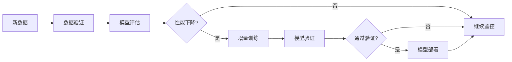

# 4. 模型与提示词管理

## 4.1 多模型路由

### 模型选择策略

智能医疗系统需要支持多个AI模型，根据不同医疗场景选择最优模型：

#### 模型池配置

**医疗影像识别模型**：
- **ResNet-50/101**：通用影像分类模型，适合X光片、CT等常见影像
- **U-Net**：医学影像分割模型，适合病灶分割任务
- **3D CNN**：三维影像分析模型，适合CT、MRI三维影像
- **Vision Transformer**：基于Transformer的影像模型，准确率高但计算成本高

**自然语言处理模型**：
- **GPT-4**：通用大语言模型，理解能力强，适合复杂病历分析
- **BioBERT**：生物医学领域预训练模型，适合医疗文本理解
- **ClinicalBERT**：临床文本预训练模型，适合病历分析
- **中文医疗大模型**：如ChatGLM3-6B医疗版、Qwen-7B医疗版

**多模态融合模型**：
- **CLIP**：图像和文本联合理解模型
- **多模态Transformer**：融合影像、文本、结构化数据的综合模型

**模型选择矩阵**：

| 场景 | 推荐模型 | 原因 |
|------|---------|------|
| X光片诊断 | ResNet-50 | 准确率高，速度快，成本低 |
| CT/MRI分割 | U-Net | 分割精度高，适合病灶定位 |
| 复杂影像诊断 | Vision Transformer | 准确率最高，适合疑难病例 |
| 病历理解 | BioBERT/ClinicalBERT | 医疗领域优化，准确率高 |
| 诊断建议生成 | GPT-4 | 理解能力强，回答质量高 |
| 用药建议 | 中文医疗大模型 | 中文优化，符合国内用药习惯 |

#### 选择策略实现

**基于任务类型**：
```python
def select_model_by_task(task_type: str, modality: str):
    """根据任务类型选择模型"""
    model_map = {
        ('classification', 'xray'): 'resnet50-xray',
        ('segmentation', 'ct'): 'unet-ct',
        ('classification', 'mri'): 'vit-mri',
        ('nlp', 'medical_record'): 'biobert',
        ('generation', 'diagnosis'): 'gpt-4',
        ('multimodal', 'fusion'): 'clip-medical',
    }
    
    key = (task_type, modality)
    return model_map.get(key, 'default-model')
```

**基于准确率要求**：
```python
def select_model_by_accuracy_requirement(required_accuracy: float):
    """根据准确率要求选择模型"""
    if required_accuracy >= 0.95:
        return 'vit-high-accuracy'  # 高准确率模型
    elif required_accuracy >= 0.90:
        return 'resnet50-standard'  # 标准模型
    else:
        return 'resnet50-fast'  # 快速模型
```

**基于成本优化**：
```python
def select_model_by_cost_budget(budget: float, task_complexity: float):
    """根据成本预算选择模型"""
    if budget > 1.0 and task_complexity > 0.8:
        return 'vit-premium'  # 高预算复杂任务
    elif budget > 0.5:
        return 'resnet50-standard'  # 中等预算
    else:
        return 'resnet50-fast'  # 低预算
```

### 路由规则

#### 路由规则配置

**规则1：按影像类型路由**
- X光片 → ResNet-50（速度快，准确率足够）
- CT影像 → U-Net（分割精度高）
- MRI影像 → Vision Transformer（复杂影像，需要高准确率）
- 超声影像 → ResNet-50（标准模型）

**规则2：按紧急程度路由**
- 急诊 → 快速模型（优先速度）
- 普通门诊 → 标准模型（平衡速度和准确率）
- 疑难病例 → 高准确率模型（优先准确率）

**规则3：按医生等级路由**
- 主任医师 → 高准确率模型（辅助决策）
- 主治医师 → 标准模型（日常诊断）
- 住院医师 → 标准模型（学习辅助）

**实现示例**：
```python
class MedicalModelRouter:
    def __init__(self):
        self.rules = [
            {
                "condition": lambda req: req.modality == "xray",
                "model": "resnet50-xray"
            },
            {
                "condition": lambda req: req.modality == "ct" and req.task == "segmentation",
                "model": "unet-ct"
            },
            {
                "condition": lambda req: req.urgency == "emergency",
                "model": "resnet50-fast"
            },
            {
                "condition": lambda req: req.doctor_level == "chief",
                "model": "vit-high-accuracy"
            },
        ]
    
    def route(self, request):
        """路由请求到合适的模型"""
        for rule in self.rules:
            if rule["condition"](request):
                return rule["model"]
        return "resnet50-standard"  # 默认模型
```

### 负载均衡

#### 负载均衡策略

**健康检查**：
- 定期检查模型服务健康状态
- 自动剔除不健康的实例
- 支持手动上下线

**请求分发**：
- **轮询（Round Robin）**：均匀分配请求
- **加权轮询**：根据GPU性能分配权重
- **最少连接**：选择当前连接数最少的实例
- **响应时间**：选择响应时间最短的实例

**实现示例**：
```python
from collections import defaultdict
import time

class ModelLoadBalancer:
    def __init__(self):
        self.models = {
            "resnet50-xray": {
                "instances": [
                    {"id": "resnet50-1", "gpu": "A100", "weight": 2, "healthy": True},
                    {"id": "resnet50-2", "gpu": "V100", "weight": 1, "healthy": True},
                ]
            },
            "unet-ct": {
                "instances": [
                    {"id": "unet-1", "gpu": "A100", "weight": 1, "healthy": True},
                ]
            }
        }
        self.connections = defaultdict(int)
        self.response_times = defaultdict(list)
    
    def select_instance(self, model_name: str):
        """选择模型实例"""
        if model_name not in self.models:
            raise ValueError(f"Model {model_name} not found")
        
        instances = [inst for inst in self.models[model_name]["instances"] 
                     if inst["healthy"]]
        
        if not instances:
            raise RuntimeError(f"No healthy instances for {model_name}")
        
        # 加权轮询选择
        total_weight = sum(inst["weight"] for inst in instances)
        selected = None
        max_score = -1
        
        for inst in instances:
            # 计算得分：权重 / (连接数 + 1)
            score = inst["weight"] / (self.connections[inst["id"]] + 1)
            if score > max_score:
                max_score = score
                selected = inst
        
        self.connections[selected["id"]] += 1
        return selected["id"]
    
    def update_health(self, instance_id: str, healthy: bool):
        """更新实例健康状态"""
        for model_name, model_info in self.models.items():
            for inst in model_info["instances"]:
                if inst["id"] == instance_id:
                    inst["healthy"] = healthy
                    break
```

## 4.2 Prompt工程化

### Prompt模板设计

#### 医疗影像诊断Prompt模板

**基础模板**：
```
你是一位经验丰富的放射科医生。请分析以下医疗影像：

影像类型：{modality}
患者信息：{patient_info}
临床病史：{clinical_history}

请提供：
1. 影像描述
2. 异常发现
3. 诊断建议
4. 鉴别诊断
5. 进一步检查建议

请确保回答专业、准确、符合医疗规范。
```

**结构化模板**：
```python
MEDICAL_IMAGE_DIAGNOSIS_PROMPT = """
作为放射科医生，请分析以下{modality}影像：

## 患者信息
- 年龄：{age}
- 性别：{gender}
- 主诉：{chief_complaint}

## 临床病史
{clinical_history}

## 影像分析要求
1. **影像质量评估**：评估影像质量是否满足诊断要求
2. **正常结构描述**：描述正常解剖结构
3. **异常发现**：详细描述异常发现，包括：
   - 位置（精确描述）
   - 大小（测量值）
   - 形态特征
   - 密度/信号特征
4. **诊断意见**：基于影像表现，给出诊断意见
5. **鉴别诊断**：列出可能的鉴别诊断
6. **建议**：进一步检查或随访建议

## 输出格式
请按照以下JSON格式输出：
{{
    "image_quality": "良好/一般/较差",
    "normal_findings": ["正常结构1", "正常结构2"],
    "abnormal_findings": [
        {{
            "location": "位置",
            "size": "大小",
            "characteristics": "特征",
            "diagnosis": "诊断"
        }}
    ],
    "diagnosis": "主要诊断",
    "differential_diagnosis": ["鉴别诊断1", "鉴别诊断2"],
    "recommendations": ["建议1", "建议2"]
}}
"""
```

#### 病历分析Prompt模板

**病历结构化提取模板**：
```python
MEDICAL_RECORD_EXTRACTION_PROMPT = """
请从以下病历文本中提取结构化信息：

## 病历文本
{medical_record_text}

## 提取要求
请提取以下信息：
1. **患者基本信息**：姓名、年龄、性别、ID号
2. **主诉**：患者主要症状
3. **现病史**：疾病发生发展过程
4. **既往史**：既往疾病史
5. **体格检查**：阳性体征
6. **辅助检查**：检验检查结果
7. **诊断**：初步诊断
8. **治疗方案**：用药、手术等

## 输出格式
请按照以下JSON格式输出：
{{
    "patient_info": {{
        "name": "姓名",
        "age": 年龄,
        "gender": "性别",
        "id": "ID号"
    }},
    "chief_complaint": "主诉",
    "present_illness": "现病史",
    "past_history": "既往史",
    "physical_examination": "体格检查",
    "auxiliary_examination": "辅助检查",
    "diagnosis": ["诊断1", "诊断2"],
    "treatment": "治疗方案"
}}
"""
```

**诊断辅助Prompt模板**：
```python
DIAGNOSIS_ASSISTANT_PROMPT = """
作为临床医生助手，请基于以下患者信息提供诊断建议：

## 患者信息
- 年龄：{age}
- 性别：{gender}
- 主诉：{chief_complaint}

## 现病史
{present_illness}

## 体格检查
{physical_examination}

## 辅助检查结果
{auxiliary_examination}

## 知识库检索结果
{knowledge_base_results}

## 任务
请基于以上信息：
1. 分析可能的疾病
2. 列出需要鉴别的疾病
3. 建议进一步检查
4. 提供初步治疗方案

## 注意事项
- 请基于循证医学证据
- 考虑患者年龄、性别等因素
- 注意药物禁忌症和相互作用
- 提供保守和积极两种方案
```

### 版本管理

#### Prompt版本管理策略

**语义版本号**：
- 主版本号：重大变更（如模板结构变化）
- 次版本号：功能增强（如新增字段）
- 修订号：bug修复或小幅优化

**版本管理实现**：
```python
from datetime import datetime
import hashlib
import json

class PromptVersionManager:
    """Prompt版本管理器"""
    
    def __init__(self):
        self.prompts = {}  # {prompt_id: [versions]}
    
    def create_version(self, prompt_id: str, template: str, metadata: dict = None):
        """创建Prompt版本"""
        # 计算模板哈希
        template_hash = hashlib.sha256(template.encode()).hexdigest()[:8]
        
        # 获取当前版本号
        versions = self.prompts.get(prompt_id, [])
        if versions:
            last_version = versions[-1]['version']
            # 解析版本号
            major, minor, patch = map(int, last_version.split('.'))
            # 判断版本类型
            if metadata and metadata.get('breaking_change'):
                major += 1
                minor = 0
                patch = 0
            elif metadata and metadata.get('new_feature'):
                minor += 1
                patch = 0
            else:
                patch += 1
            version = f"{major}.{minor}.{patch}"
        else:
            version = "1.0.0"
        
        # 创建版本信息
        version_info = {
            'version': version,
            'template': template,
            'template_hash': template_hash,
            'created_at': datetime.now().isoformat(),
            'metadata': metadata or {},
            'is_active': False
        }
        
        # 保存版本
        if prompt_id not in self.prompts:
            self.prompts[prompt_id] = []
        self.prompts[prompt_id].append(version_info)
        
        return version
    
    def activate_version(self, prompt_id: str, version: str):
        """激活Prompt版本"""
        versions = self.prompts.get(prompt_id, [])
        for v in versions:
            v['is_active'] = (v['version'] == version)
    
    def get_active_version(self, prompt_id: str):
        """获取激活的Prompt版本"""
        versions = self.prompts.get(prompt_id, [])
        for v in versions:
            if v['is_active']:
                return v
        return None
```

### A/B测试

#### A/B测试框架

**测试设计**：
- 随机分配用户到不同组
- 控制组使用原Prompt，实验组使用新Prompt
- 收集关键指标（准确率、响应时间、用户满意度等）

**实现示例**：
```python
import random
from collections import defaultdict

class PromptABTest:
    """Prompt A/B测试框架"""
    
    def __init__(self):
        self.experiments = {}  # {experiment_id: experiment_config}
        self.results = defaultdict(list)  # {experiment_id: [results]}
    
    def create_experiment(self, experiment_id: str, prompt_a: str, prompt_b: str, 
                         traffic_split: float = 0.5):
        """创建A/B测试实验"""
        self.experiments[experiment_id] = {
            'prompt_a': prompt_a,
            'prompt_b': prompt_b,
            'traffic_split': traffic_split,
            'status': 'running',
            'created_at': datetime.now().isoformat()
        }
    
    def select_prompt(self, experiment_id: str, user_id: str):
        """选择Prompt版本"""
        if experiment_id not in self.experiments:
            return None
        
        experiment = self.experiments[experiment_id]
        
        # 基于用户ID的哈希值分配，确保同一用户始终使用同一版本
        user_hash = hash(user_id) % 100
        threshold = experiment['traffic_split'] * 100
        
        if user_hash < threshold:
            return 'prompt_a', experiment['prompt_a']
        else:
            return 'prompt_b', experiment['prompt_b']
    
    def record_result(self, experiment_id: str, version: str, metrics: dict):
        """记录测试结果"""
        self.results[experiment_id].append({
            'version': version,
            'metrics': metrics,
            'timestamp': datetime.now().isoformat()
        })
    
    def analyze_results(self, experiment_id: str):
        """分析测试结果"""
        results = self.results[experiment_id]
        
        # 按版本分组
        version_a_results = [r for r in results if r['version'] == 'prompt_a']
        version_b_results = [r for r in results if r['version'] == 'prompt_b']
        
        # 计算平均指标
        def calc_avg_metrics(results):
            if not results:
                return {}
            metrics_sum = defaultdict(float)
            for r in results:
                for key, value in r['metrics'].items():
                    metrics_sum[key] += value
            return {k: v / len(results) for k, v in metrics_sum.items()}
        
        avg_a = calc_avg_metrics(version_a_results)
        avg_b = calc_avg_metrics(version_b_results)
        
        # 计算提升率
        improvements = {}
        for key in avg_a:
            if avg_a[key] > 0:
                improvements[key] = (avg_b[key] - avg_a[key]) / avg_a[key] * 100
        
        return {
            'version_a': avg_a,
            'version_b': avg_b,
            'improvements': improvements,
            'sample_size': {
                'version_a': len(version_a_results),
                'version_b': len(version_b_results)
            }
        }
```

## 4.3 微调与持续学习

### 微调策略

#### 医疗领域微调

**数据准备**：
- 收集医疗影像数据（DICOM格式）
- 收集标注数据（诊断报告、病灶标注）
- 数据清洗和标准化
- 数据增强（旋转、翻转、噪声等）

**微调方法**：
- **全量微调**：更新所有参数，适合数据充足场景
- **LoRA微调**：低秩适应，参数效率高，适合资源有限场景
- **Adapter微调**：插入适配器层，保持原模型参数不变

**实现示例**：
```python
import torch
import torch.nn as nn
from transformers import AutoModel, AutoTokenizer

class MedicalModelFineTuner:
    """医疗模型微调器"""
    
    def __init__(self, base_model_name: str, num_labels: int):
        self.base_model = AutoModel.from_pretrained(base_model_name)
        self.classifier = nn.Linear(self.base_model.config.hidden_size, num_labels)
    
    def fine_tune(self, train_dataset, val_dataset, epochs: int = 10):
        """微调模型"""
        optimizer = torch.optim.AdamW(self.base_model.parameters(), lr=2e-5)
        criterion = nn.CrossEntropyLoss()
        
        for epoch in range(epochs):
            # 训练阶段
            self.base_model.train()
            for batch in train_dataset:
                outputs = self.base_model(**batch)
                logits = self.classifier(outputs.last_hidden_state[:, 0])
                loss = criterion(logits, batch['labels'])
                
                loss.backward()
                optimizer.step()
                optimizer.zero_grad()
            
            # 验证阶段
            self.base_model.eval()
            val_loss = 0
            with torch.no_grad():
                for batch in val_dataset:
                    outputs = self.base_model(**batch)
                    logits = self.classifier(outputs.last_hidden_state[:, 0])
                    val_loss += criterion(logits, batch['labels']).item()
            
            print(f"Epoch {epoch+1}, Val Loss: {val_loss/len(val_dataset)}")
```

### 持续学习流程

#### 在线学习流程



**实现示例**：
```python
class ContinuousLearning:
    """持续学习系统"""
    
    def __init__(self, model, threshold: float = 0.05):
        self.model = model
        self.performance_threshold = threshold
        self.performance_history = []
    
    def monitor_performance(self, test_data):
        """监控模型性能"""
        accuracy = self.evaluate_model(test_data)
        self.performance_history.append(accuracy)
        
        # 检测性能下降
        if len(self.performance_history) >= 10:
            recent_avg = sum(self.performance_history[-10:]) / 10
            baseline_avg = sum(self.performance_history[:10]) / 10
            
            if recent_avg < baseline_avg * (1 - self.performance_threshold):
                return True  # 需要重新训练
        
        return False
    
    def incremental_train(self, new_data):
        """增量训练"""
        # 使用新数据对模型进行增量训练
        self.model.train()
        # ... 训练逻辑
        pass
    
    def evaluate_model(self, test_data):
        """评估模型"""
        # ... 评估逻辑
        return 0.95  # 示例返回值
```

### 模型评估

#### 评估指标

**分类任务指标**：
- **准确率（Accuracy）**：整体分类正确率
- **精确率（Precision）**：预测为正例中真正例的比例
- **召回率（Recall）**：真正例中被正确预测的比例
- **F1分数**：精确率和召回率的调和平均
- **AUC-ROC**：ROC曲线下面积

**分割任务指标**：
- **Dice系数**：分割重叠度
- **IoU（Intersection over Union）**：交并比
- **Hausdorff距离**：边界距离

**实现示例**：
```python
from sklearn.metrics import accuracy_score, precision_score, recall_score, f1_score, roc_auc_score
import numpy as np

class ModelEvaluator:
    """模型评估器"""
    
    def evaluate_classification(self, y_true, y_pred, y_proba=None):
        """评估分类模型"""
        metrics = {
            'accuracy': accuracy_score(y_true, y_pred),
            'precision': precision_score(y_true, y_pred, average='weighted'),
            'recall': recall_score(y_true, y_pred, average='weighted'),
            'f1': f1_score(y_true, y_pred, average='weighted'),
        }
        
        if y_proba is not None:
            metrics['auc_roc'] = roc_auc_score(y_true, y_proba, multi_class='ovr')
        
        return metrics
    
    def evaluate_segmentation(self, y_true, y_pred):
        """评估分割模型"""
        # 计算Dice系数
        intersection = np.logical_and(y_true, y_pred).sum()
        union = y_true.sum() + y_pred.sum()
        dice = 2 * intersection / union if union > 0 else 0
        
        # 计算IoU
        intersection = np.logical_and(y_true, y_pred).sum()
        union = np.logical_or(y_true, y_pred).sum()
        iou = intersection / union if union > 0 else 0
        
        return {
            'dice': dice,
            'iou': iou
        }
```
